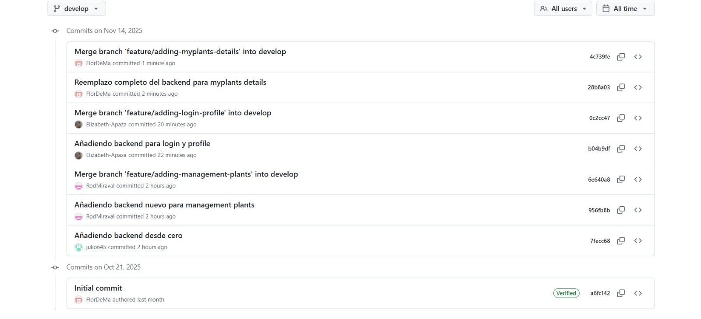

<h2 align="center">
  
</h2>

<h1 align="center">Universidad Peruana de Ciencias Aplicadas</h1>

<h3 align="center">
  Ingeniería de Software
    
  Curso: Desarrollo de Aplicaciones Open Source
    
  Sección: 7380
    
  Profesor: Hugo Allan Mori Paiva
    
  Semestre: 2025-20
    
  Informe del Trabajo Final
    
  Startup: EcoTech
    
  Producto: PlantaE
</h3>

| `
`Alumno`
` | `
`Código`
` |
| :-------------------------------------------: | :--------------------------------------------: |
|       Apaza Bocanegra, Elizabeth Noelia       |                   u20231c197                   |
|        Contreras Leon, Flor De María        |                   u202323243                   |
|         Guillen Galindo, Julio Adolfo         |                   u20241a352                   |
|        Miraval Pomalaya, Rodrigo Jesus        |                   u202311082                   |
|         Navarro Chinga, Antonio Jhair         |                   u202314101                   |

 Septiembre 2025 

# Tabla de contenidos

## [Capítulo I: Introducción](cap1-introduction.md)

- [1.1 Startup Profile](cap1-introduction.md)
  - [1.1.1 Descripción de la Startup](cap1-introduction.md)
  - [1.1.2 Perfiles de integrantes del equipo](cap1-introduction.md)
- [1.2 Solution Profile](cap1-introduction.md)
  - [1.2.1 Antecedentes y problemática](cap1-introduction.md)
  - [1.2.2 Lean UX](cap1-introduction.md)
    - [1.2.2.1 Problem Statement](cap1-introduction.md)
    - [1.2.2.2 Assumptions](cap1-introduction.md)
    - [1.2.2.3 Hypothesis](cap1-introduction.md)
    - [1.2.2.4 Lean UX Canvas](cap1-introduction.md)
- [1.3 Segmentos Objetivos](cap1-introduction.md)

## [Capítulo II: Requirements Elicitation &amp; Analysis](cap2-requirements-elicitation-and-analysis.md)

- [2.1 Competidores](cap2-requirements-elicitation-and-analysis.md)
  - [2.1.1 Análisis competitivo](cap2-requirements-elicitation-and-analysis.md)
  - [2.1.2 Estrategias y tácticas frente a competidores](cap2-requirements-elicitation-and-analysis.md)
- [2.2 Entrevistas](cap2-requirements-elicitation-and-analysis.md)
  - [2.2.1 Diseño de entrevistas](cap2-requirements-elicitation-and-analysis.md)
  - [2.2.2 Registro de entrevistas](cap2-requirements-elicitation-and-analysis.md)
  - [2.2.3 Análisis de entrevistas](cap2-requirements-elicitation-and-analysis.md)
- [2.3 Needfinding](cap2-requirements-elicitation-and-analysis.md)
  - [2.3.1 User Personas](cap2-requirements-elicitation-and-analysis.md)
  - [2.3.2 User Task Matrix](cap2-requirements-elicitation-and-analysis.md)
  - [2.3.3 User Journey Mapping](cap2-requirements-elicitation-and-analysis.md)
  - [2.3.4 Empathy Mapping](cap2-requirements-elicitation-and-analysis.md)
- [2.4 Big Picture Event Storming](cap2-requirements-elicitation-and-analysis.md)
- [2.5 Ubiquitous Language](cap2-requirements-elicitation-and-analysis.md)

## [Capítulo III: Requirements Specification](cap3-requirements-specification.md)

- [3.1 To-Be Scenario Mapping](cap3-requirements-specification.md)
- [3.2 User Stories](cap3-requirements-specification.md)
- [3.3 Impact Mapping](cap3-requirements-specification.md)
- [3.4 Product Backlog](cap3-requirements-specification.md)

## [Capítulo IV: Product Design](cap4-product-design.md)

- [4.1 Style Guidelines](cap4-product-design.md)
  - [4.1.1 General Style Guidelines](cap4-product-design.md)
  - [4.1.2 Web Style Guidelines](cap4-product-design.md)
- [4.2 Information Architecture](cap4-product-design.md)
  - [4.2.1 Organization Systems](cap4-product-design.md)
  - [4.2.2 Labeling Systems](cap4-product-design.md)
  - [4.2.3 SEO Tags and Meta Tags](cap4-product-design.md)
  - [4.2.4 Searching Systems](cap4-product-design.md)
  - [4.2.5 Navigation Systems](cap4-product-design.md)
- [4.3 Landing Page UI Design](cap4-product-design.md)
  - [4.3.1 Landing Page Wireframe](cap4-product-design.md)
  - [4.3.2 Landing Page Mock-up](cap4-product-design.md)
- [4.4 Web Applications UX/UI Design](cap4-product-design.md)
  - [4.4.1 Web Applications Wireframes](cap4-product-design.md)
  - [4.4.2 Web Applications Wireflow Diagrams](cap4-product-design.md)
  - [4.4.3 Web Applications Mock-ups](cap4-product-design.md)
  - [4.4.4 Web Applications User Flow Diagrams](cap4-product-design.md)
- [4.5 Web Applications Prototyping](cap4-product-design.md)
- [4.6 Domain-Driven Software Architecture](cap4-product-design.md)
  - [4.6.1 Design-Level Event Storming](cap4-product-design.md)
  - [4.6.2 Software Architecture Context Diagram](cap4-product-design.md)
  - [4.6.3 Software Architecture Container Diagrams](cap4-product-design.md)
  - [4.6.4 Software Architecture Components Diagrams](cap4-product-design.md)
- [4.7 Software Object-Oriented Design](cap4-product-design.md)
  - [4.7.1 Class Diagrams](cap4-product-design.md)
- [4.8 Database Design](cap4-product-design.md)
  - [4.8.1 Database Diagram](cap4-product-design.md)

## [Capítulo V: Product Implementation, Validation &amp; Deployment](cap5-prod-implementation-validation-deployment.md)

- [5.1 Software Configuration Management](cap5-prod-implementation-validation-deployment.md)
  - [5.1.1 Software Development Environment Configuration](cap5-prod-implementation-validation-deployment.md)
  - [5.1.2 Source Code Management](cap5-prod-implementation-validation-deployment.md)
  - [5.1.3 Source Code Style Guide & Conventions](cap5-prod-implementation-validation-deployment.md)
  - [5.1.4 Software Deployment Configuration](cap5-prod-implementation-validation-deployment.md)
- [5.2 Landing Page, Services & Applications Implementation](cap5-prod-implementation-validation-deployment.md)
  - [5.2.X Sprint n](cap5-prod-implementation-validation-deployment.md)
    - [5.2.X.1 Sprint Planning n](cap5-prod-implementation-validation-deployment.md)
    - [5.2.X.2 Aspect Leaders and Collaborators](cap5-prod-implementation-validation-deployment.md)
    - [5.2.X.3 Sprint Backlog n](cap5-prod-implementation-validation-deployment.md)
    - [5.2.X.4 Development Evidence for Sprint Review](cap5-prod-implementation-validation-deployment.md)
    - [5.2.X.5 Execution Evidence for Sprint Review](cap5-prod-implementation-validation-deployment.md)
    - [5.2.X.6 Services Documentation Evidence for Sprint Review](cap5-prod-implementation-validation-deployment.md)
    - [5.2.X.7 Software Deployment Evidence for Sprint Review](cap5-prod-implementation-validation-deployment.md)
    - [5.2.X.8 Team Collaboration Insights during Sprint](cap5-prod-implementation-validation-deployment.md)
- [5.3 Validation Interviews](cap5-prod-implementation-validation-deployment.md)
    - [5.3.1 Diseño de Entrevistas](cap5-prod-implementation-validation-deployment.md)
    - [5.3.2 Registro de Entrevistas](cap5-prod-implementation-validation-deployment.md)
    - [5.3.3 Evaluaciones según heurísticas](cap5-prod-implementation-validation-deployment.md)
- [5.4 Video About-the-Product](cap5-prod-implementation-validation-deployment.md)

## [Conclusiones](conclusiones.md)

- [Conclusiones y recomendaciones](conclusiones.md#conclusiones-y-recomendaciones)
- [Video About-the-Team](conclusiones.md#video-about-the-team)

## [Bibliografía](bibliography.md)

## [Anexos](anexos.md)

# Registro de Versiones del Informe

| Versión | Fecha       | Autor(es)                                                                 | Descripción de modificación |
|---------|-------------|---------------------------------------------------------------------------|------------------------------|
|   TB1   | 16/09/2025  | Contreras Leon Flor De Maria                                            | Realicé la Descripción de la Startup, User Stories, Product Backlog, Organization Systems, Labeling Systems, Landing Page Wireframe, Landing Page Mock-up, Web Applications Wireframes, Web Applications Wireflow Diagrams, Web Applications Mock-ups, Web Applications User Flow Diagrams, Web Applications Prototyping|
|   TB1   | 16/09/2025  | Miraval Poma, Rodrigo Jesus                                          | Realicé el Ubiquitous Language, Web Applications UX/UI Design, Domain-Driven Software Architecture.Class Diagrams. Primera versión de la Landing Page, Services & Applications Implementation. |
|   TB1   | 16/09/2025  | Apaza Bocanegra, Elizabeth Noelia Torres                                          | Realicé los Antecedentes y problemática, Lean UX Canvas, Análisis competitivo, las Estrategias y tacticas frente a competidores, entrevistas, User Journey Mapping, Empathy Mapping, User Stories, Source Code Style Guide & Conventiones y Software Deployment & Conventions|
|   TB1   | 16/09/2025  | Apaza Bocanegra, Elizabeth                                                | Realicé artefactos de Lean UX como lean ux problem statements, lean ux hyphotesis, lean ux assumptios. También desarrollé secciones del Needfinding como los user personas, impact mapping y user task matriz. Además del software development environment configuration y source code management. |
|   TB1   | 16/09/2025  | Guillen Galindo, Julio Adolfo                                           | Realicé la secciones de User Stories, evaluando cada escenario posible de cada funcionalidad.Tambien el Diagrama de Clase en una versión temprana. Además de hacer los segmentos objetivos del proyecto. Evaluando los posibles usuarios a los que va dirijido el trabajo.  |
|   TP1   | 07/10/2025  | Guillen Galindo, Julio Adolfo                       | Realicé las correcciones pertinentes y desarrollé el Bounded Context de Payment Service, donde me encargué de codificar todas las capas de dicho BC.  |
|   TP1   | 07/10/2025  | Navarro Chinga, Antonio Jhair                         | Realicé la parte del Sprint 2, especifícamente el bounded context de IAM y Maintenance Status Tracking, donde realicé todo el código de dichas secciones |
|  TP1   | 07/10/2025  |Navarro Chinga, Antonio Jhair                     | Realicé el desarrollo del Bounded Context  Coordiné efectivamente con los demás integrantes para asegurar la coherencia en la implementación y comuniqué los avances técnicos durante las reuniones de equipo. |
|  TP1   | 07/10/2025  | Contreras Leon, Flor de Maria                 | Realicé el desarrollo del Bounded Context implementando las funcionalidades relacionadas con la gestión Mantuve comunicación constante con el equipo para alinear los requerimientos funcionales y técnicos del sistema. |
|  TP1   | 07/10/2025  | Contreras Leon, Flor de Maria                   | En esta entrega desarrollé el Bounded Context de Data Collection, donde implementé las funcionalidades para la recolección y gestión de datos del sistema. Coordiné con el equipo para asegurar la integración correcta con otros bounded contexts y comuniqué efectivamente los requisitos técnicos y las decisiones de diseño tomadas. |
|  TP1   | 07/10/2025  | Contreras Leon, Flor de Maria             | Realicé el desarrollo del Bounded Context , implementando las funcionalidades para el diagnóstico y evaluación  Mantuve comunicación efectiva con el equipo técnico para asegurar la integración correcta con los demás componentes del sistema. |
|  TB2   | 12/11/2025  | Contreras Leon, Flor de Maria | Realicé una entrevista de validación, el desarrollo del backend del Bounded Context a partir del diagrama presentado. Me comuniqué constantemente con el grupo para asegurar la integración correcta con los demás componentes del sistema. Finalmente, registré las entrevistas y su contenido. |
|  TB2   | 12/11/2025  | Guillen Galindo, Julio Adolfo | Realicé mi aporte en el backend del Bounded Context . También realicé 2 entrevistas de validación del segmentos 2. |
  TB2   | 12/11/2025 | Guillen Galindo, Julio Adolfo | Realice las entrevistas de validaciones al segmento 1 y el avance del backend del Bounded Context Data Collection. Además de realizar validaciones con los demás integrantes del grupo sobre los distintos cambios en torno al diagrama de clases y su estructura. |

# Project Report Collaboration Insights

| URL del repositorio de la landing page                |
| :---------------------------------------------------- |
| https://github.com/PlantaE-open-sorce/PlantaE-landing | 

| URL del repositorio del frontend                         |
| :------------------------------------------------------- |
| https://github.com/PlantaE-open-sorce/frontedNew-PlantaE | 

| URL del repositorio del backend                              |
| :----------------------------------------------------------- |
| https://github.com/PlantaE-open-sorce/backendNew-PlantaE.git | 

TB2:

| Integrante                        | Tarea Asignada                                              |
| :-------------------------------: | :---------------------------------------------------------: |
| Apaza Bocanegra, Elizabeth Noelia |	Conexión de los Bounded Context IAM del FrontEnd al BackEnd |
| Guillen Galindo, Julio Adolfo     | Conexión del Bounded Context Gestion Plantas al BackEnd     |
| Navarro Chinga, Antonio Jhair     |	Conexión de los Bounded Context Login y Perfil al BackEnd   |
| Contreras Leon, Flor de Maria     |	Conexión del Bounded Context Home                           |
| Miraval Pomalaya, Rodrigo Jesus   |	Conexión del Bounded Context Plants                         |

Pull requests evidence:

     

# Student Outcome

El curso contribuye al cumplimiento del Student Outcome ABET:
_ABET – EAC - Student Outcome 3_

**Criterio:**  Capacidad de comunicarse efectivamente con un rango de audiencias.
En el siguiente cuadro se describe las acciones realizadas y enunciados de conclusiones por parte del grupo, que permiten sustentar el haber alcanzado el logro del ABET – EAC - Student Outcome 3.

|             
Criterio específico
             |          
Acciones Realizadas
            |          
Conclusiones
            |
|:---------------------------------------------------------------------:|-------------------------------------------------------------------|------------------------------------------------------------|
| Comunica oralmente con efectividad a diferentes rangos de audiencia.  | <ul><li>**Apaza Bocanegra, Elizabeth Noelia:**   **TB1:** En esta entrega se realizo entrevistas para conocer las necesidades del proyecto, aportando retroalimentación a los compañeros.   **TP1:** Durante esta entrega, colaboré en la estructuración del repositorio del frontend y en la comprobación del correcto desempeño de los elementos visuales. Aseguré que la interfaz cumpliera con las guías acordadas por el equipo.   **TB2:** Expuse durante las sesiones técnicas las validaciones y lógica implementada en los endpoints, facilitando que frontend y backend pudieran integrarse correctamente. </li><li>**Contreras Leon, Flor De María:**   **TB1:** Trabajé en equipo para proporcionar liderazgo al desarrollar secciones clave de la documentación del proyecto, incluyendo Lean UX Problem Statements, Assumptions e Hypothesis Statements. Estas actividades permitieron guiar al equipo en la definición clara de problemas, supuestos e hipótesis, estableciendo una base conceptual sólida para estructurar el producto y asegurando que todos los integrantes tuvieran un marco común de referencia para continuar con el desarrollo.   **TP1:**  Apoyé en la implementación de las vistas principales del frontend, verificando la integración de las rutas del sitio web y su coherencia con el diseño establecido.   **TB2:** Participé activamente en reuniones de revisión del backend, explicando las funcionalidades desarrolladas y aclarando dudas sobre la arquitectura y el funcionamiento interno. </li><li>**Guillen Galindo, Julio Adolfo:**   **TB1:** Me encargué de informar a mi equipo sobre los porgremos que seguiríamos. Además, participé de forma activa en la revisión de los avances realizados por mis compañeros y colaboré en la preparación del projecto para las presentaciones.   **TP1:** Participé activamente en las reuniones iniciales del proyecto, compartiendo ideas y coordinando con los compañeros las tareas que cada uno asumiría. Durante las sesiones de avance expliqué claramente mis aportes y sugerencias, lo que permitió que el equipo mantuviera una comprensión común de los objetivos y las actividades por realizar.   **TB2:** Participé en las sesiones técnicas describiendo mi avance en el backend, sobre todo en la implementación de rutas y middleware, manteniendo comunicación clara con el equipo. </li><li>**Navarro Chinga, Antonio Jhair**   **TB1:** Estuvo atento en información del equipo de las actividades a seguir, colaborando en la preparación y exposición del proyecto.   **TP1:** Durante esta etapa, me encargué de coordinar las reuniones de seguimiento del frontend, promoviendo la comunicación entre los miembros del equipo para resolver incidencias de despliegue. También presenté el avance del sprint al grupo, explicando los ajustes aplicados en la interfaz y garantizando la comprensión técnica de todos.   **TB2:** Colaboré en la coordinación oral para la integración del backend, explicando los requerimientos y ajustes necesarios en los servicios para su correcta conexión con el frontend. </li><li>**Miraval Pomalaya, Rodrigo Jesus:**   **TB1:** En esta entrega colabore con la revision retroactiva de los avances de mis compañeros indicándoles que puntos de la documentación se podrían mejorar. Adicionalmente, realice entrevistas para dos segmentos objetivos.   **TP1:** Participé en la revisión funcional del frontend antes del despliegue, asegurando que las secciones principales respondieran a las necesidades detectadas en las entrevistas con usuarios.   **TB2** Participé activamente en las reuniones de avance del backend, comunicando de forma clara el estado de mis tareas y coordinando con el equipo para asegurar que la integración entre los módulos funcionara correctamente. Además, expuse las soluciones aplicadas a problemas técnicos encontrados durante el desarrollo, lo que permitió al resto del equipo comprender mejor la arquitectura y proponer mejoras. </li><li>**Navarro Chinga, Antonio Jhair:**   **TB1:** Estuvo atento en información del equipo de las actividades a seguir, colaborando en la preparación y exposición del proyecto.   **TP1:** Me ocupé de preparar el entorno de desarrollo del frontend y de realizar el despliegue inicial en la plataforma seleccionada. Además, resolví incidencias relacionadas con la carga de componentes.   **TB2:** Participé en reuniones de coordinación del backend explicando el estado de mis tareas y los requerimientos técnicos necesarios, asegurando que el equipo comprendiera el flujo de datos y las dependencias. </ul> | <ul><li> **TB1:** Cada persona asumió sus tareas asignadas y se comunicó de forma directa, creando un ambiente de trabajo que impulsó la colaboración y mejoró el trabajo conjunto, aspecto fundamental en proyectos de equipo. </li><li> **TP1:** Durante esta entrega, el equipo demostró una comunicación fluida y efectiva, tanto en la coordinación técnica como en la revisión de avances. Cada integrante asumió un papel activo para garantizar el correcto despliegue del frontend, intercambiando observaciones claras y soluciones rápidas ante los desafíos del sprint. Esta interacción constante fortaleció la cohesión del grupo y mejoró la capacidad colectiva para presentar y argumentar resultados técnicos de manera profesional.   **TB2:** La comunicación oral durante el desarrollo del backend permitió coordinar de manera eficaz las tareas técnicas, aclarar dudas en tiempo real y asegurar que todos los integrantes comprendieran la arquitectura y el funcionamiento de los servicios implementados. Esto fortaleció la colaboración y facilitó la integración entre los diferentes componentes del sistema. </li></ul> |
| Comunica por escrito con efectividad a diferentes rangos de audiencia | <ul><li>**Apaza Bocanegra, Elizabeth Noelia:**   **TB1:** Redacto el documento del avance, así como mensajes y graficos para que el equipo pudiera seguir los lineamientos establecidos.   **TP1:** Redacté el apartado del Sprint 2, detallando las tareas priorizadas y los objetivos del equipo. También contribuí en las secciones grupales de documentación, donde se mostró la evidencia del desarrollo, despliegue y colaboración durante el sprint.   **TB2** Elaboré documentación escrita sobre los endpoints del backend, detallando parámetros, respuestas y ejemplos para facilitar su uso por parte del equipo. </li><li>**Contreras Leon, Flor De María:**   **TB1:** Elaboré y lideré la redacción de secciones clave de la documentación del proyecto, incluyendo Lean UX Problem Statements, Assumptions e Hypothesis Statements, asegurando que la información estuviera clara y organizada. Esta labor permitió que el equipo comprendiera los problemas, supuestos e hipótesis del proyecto de manera consistente, facilitando la comunicación escrita efectiva entre todos los integrantes y asegurando un marco común de referencia.   **TP1:** Elaboré el Sprint Review, presentando la evidencia de los servicios implementados. Además, participé en la documentación conjunta sobre desarrollo, ejecución y despliegue del software.   **TB2** Documenté las especificaciones técnicas de la API y registré los cambios realizados en el backend, lo que ayudó a mantener una comunicación clara y ordenada. </li><li>**Guillen Galindo, Julio Adolfo:**   **TB1:** Contribuí en la definición de las pautas y lineamientos que nuestro equipo seguia durante el proceso. Además, estuve a cargo de la elaboración de los capítulos 3 y 4.   **TP1:** Redacté la planificación del Sprint 2, donde detallé los criterios de priorización y la distribución de tareas del equipo.   **TB2** Redacté descripciones funcionales y técnicas de los servicios implementados en el backend, permitiendo al equipo comprender el funcionamiento detallado de la API. </li><li>**Miraval Pomalaya, Rodrigo Jesus:**   **TB1:** Mantuve una comunicación activa y eficaz que fortaleció la confianza mutua. Esto mejoró el trabajo en equipo, un valor crucial para proyectos colaborativos.   **TP1:** Fui responsable de los tiempos estimados. Además, participé en la documentación compartida sobre desarrollo, ejecución y despliegue del software, resaltando el trabajo colaborativo del equipo.   **TB2** Mantengo registros escritos sobre ajustes y mejoras en el backend, facilitando la comunicación asíncrona del avance técnico. </li><li>**Navarro Chinga, Antonio Jhair:**   **TB1:** Participo en la definición de las pautas de nuestro equipo durante el desarrollo, aportando ideas para mejorar la metodología de trabajo con las metricas establecida.   **TP1:** Desarrollé la evidencia técnica de los servicios implementados y su funcionalidad. También intervine en la redacción grupal sobre el proceso de desarrollo, pruebas y despliegue del proyecto.   **TB2** Elaboré documentación detallada sobre las funciones y endpoints que implementé en el backend, incluyendo descripciones de rutas, métodos HTTP, parámetros y posibles respuestas. También dejé registros escritos de los cambios realizados en el repositorio y mantuve mensajes claros dentro del equipo para asegurar que todos contaran con la información técnica actualizada. </ul> | <ul><li>**TB1:** Cada integrante asumió las tareas que le fueron asignadas, manteniendo una comunicación constante y efectiva que fomentó la confianza entre todos. Esto contribuyó a fortalecer el trabajo en equipo, un aspecto esencial para el éxito de los proyectos colaborativos. </li><li> **TP1:** En esta fase, todos los miembros mantuvieron un nivel alto de compromiso con la documentación técnica, La colaboración en los apartados grupales permitió que el producto final reflejara en la organización del equipo. Gracias a ello, se logró una documentación completa, coherente y alineada con los objetivos del proyecto.   **TB2:** La comunicación escrita fue fundamental para mantener organizada la información técnica del backend, ya que la documentación de endpoints, cambios y especificaciones permitió que todos los integrantes trabajaran con claridad y coherencia. Esto contribuyó a una integración más fluida y redujo errores durante el desarrollo. </li></ul> |

