# Capítulo IV: Product Design

## 4.1. Style Guidelines

Overview: El diseño web es un componente esencial de PlantaE. Debe reflejar la esencia de la sostenibilidad urbana, transmitiendo cercanía, confianza y armonía con la naturaleza. La interfaz debe ser clara, ligera y fácil de procesar para todo tipo de usuarios, desde hogares hasta viveros, priorizando siempre la accesibilidad y la experiencia intuitiva.

Brand Name: PlantaE simboliza el vínculo entre las personas y el cuidado de la naturaleza en entornos urbanos. El nombre evoca vida, crecimiento y sostenibilidad, reforzando la idea de que cada acción, por pequeña que sea, contribuye al bienestar colectivo y a la conservación de las áreas verdes. Representa una comunidad comprometida con el equilibrio ecológico, la innovación y la colaboración.

### 4.1.1. General Style Guidelines

En el diseño de PlantaE, se tomaron decisiones rigurosas para garantizar una experiencia de ususario coherente y efectiva.

**Colores**

PlantaE eligió su paleta de colores centrándose en la armonía visual y la accesibilidad. Cada tono fue seleccionado para cumplir una función específica y así optimizar la experiencia del usuario:

- Verde Cítrico – #2EAG29: Este color transmite energía, acción y máximo dinamismo. En PlantaE, lo utilizamos para incentivar la acción primaria (CTA) en botones importantes como "Añadir Planta" o "Guardar Perfil". Representa la proactividad y el éxito.
- Verde Hoja – #51A64E: Este color simboliza crecimiento y salud. Por ello, lo empleamos estratégicamente en indicadores de estado "saludable" y botones de confirmación importantes. Su intensidad refuerza la identidad de la marca y la sensación de seguridad en la gestión de tus cultivos.
- Verde Musgo – #6AA668: Este color está asociado con la serenidad, estabilidad y equilibrio. Se utiliza en fondos de contenedores y tarjetas para agrupar información de manera visualmente agradable, fomentando una sensación de tranquilidad mientras interactúas con los datos.
- Verde Oliva Oscuro – #50734F: Este color representa profundidad, seriedad y elegancia. Por ello, se usa en los fondos principales de la interfaz para crear un alto contraste con el texto claro y dar un soporte visual robusto y profesional al diseño general.
- Menta Pálido – #AFD9AD: Este color evoca frescura, ligereza y un ambiente abierto. Se utiliza en fondos de página muy claros o como un tono de acento sutil para secciones que requieren máxima claridad y un toque de luminosidad, sin distraer del contenido.

**Tipografía**

Se seleccionó la tipografía "Open Sans" como fuente principal para los títulos (H1 y H2) en estilo Bold para resaltar jerarquía, subtítulos y descripciones en Semi-bold, textos de párrafos en regular para asegurar la legibilidad y notas o captions en ligth para diferenciar información secundaria. Además esta fuente es visualmente agradable y de fácil lectura gracias a sus formas neutrales y abiertas, lo que garantiza una experiencia cómoda y comprensible para el usuario en toda la plataforma.

Para dirigir la atención del usuario de manera efectiva, implementamos una jerarquía tipográfica basada en el tamaño. Esta jerarquía resalta elementos críticos (títulos, botones) con fuentes más grandes y asigna tamaños menores a la información de soporte, lo que resulta en una interacción más intuitiva y una mayor eficiencia en la navegación del producto.

**Branding**

El branding de PlantaE está diseñado para reflejar la innovación, el crecimiento y la sostenibilidad. El logotipo y los íconos adoptan un enfoque que fusiona lo orgánico con lo tecnológico, utilizando una simbología clara que comunica el propósito de la plataforma. El diseño central es una planta que integra circuitos y tecnología en sus hojas y tallo. Este concepto visual representa la gestión inteligente y el monitoreo digital de los cultivos, con una apariencia limpia, moderna y fácilmente reconocible en cualquier entorno digital.

    

**Espaciado**

El diseño de PlantaE implementa una estrategia deliberada de uso del espacio en blanco (whitespace), tanto a nivel macro como micro. Este enfoque es crucial para ofrecer una experiencia de usuario clara y sin fricciones. El espacio negativo no solo aporta valor estético, sino que mejora la comprensión del contenido y dirige la atención del usuario hacia elementos clave, como llamadas a la acción y secciones prioritarias. La interfaz también define un ancho máximo para el contenido, previniendo la fatiga visual. Finalmente, la gestión cuidadosa de los márgenes y los rellenos laterales garantiza una estructura visual armoniosa y una interfaz adaptable a cualquier tamaño de pantalla.

**Dimensiones para el tono de comunicación y lenguaje aplicado**

En PlantaE, definimos cuidadosamente el tono de nuestra comunicación para alinearlo con la misión de nuestra plataforma: digitalizar y optimizar el cuidado de cultivos urbanos y promover la sostenibilidad. Buscamos establecer una conexión cercana y de confianza con nuestro público, que valora la tecnología y el medio ambiente. Nuestro tono de voz busca ser educativo, alentador y profesional, combinando una comunicación clara, accesible y empática.

Optamos por un tono casual, pero experto, que permita a los usuarios (desde el jardinero amateur hasta el vivero) sentirse cómodos al interactuar con funcionalidades clave para el monitoreo y cuidado de sus plantas. Queremos que cada interacción refleje entusiasmo por el crecimiento y confianza en la tecnología. Este equilibrio nos permite inspirar acción y un cuidado responsable, al tiempo que proyectamos confianza y experiencia en el sector de la tecnología ambiental y el IoT. 

Aspectos Clave en el Diseño de PlantaE:
- Consistencia: La coherencia en el diseño es esencial para brindar una experiencia uniforme e intuitiva. Todos los elementos visuales e interactivos de PlantaE (iconografía, paleta de verdes, jerarquía tipográfica) mantienen una línea funcional clara, lo que permite a los usuarios familiarizarse rápidamente con la lectura de datos y operar la plataforma en su día a día.
- Navegación: La estructura de navegación ha sido pensada para ser intuitiva, verde (natural) y ordenada. Los usuarios pueden acceder fácilmente a funciones como monitoreo en tiempo real, historial de datos, configuración de sensores y recomendaciones personalizadas. Los menús son claros y las opciones están organizadas para ahorrar tiempo y facilitar la toma de decisiones sobre riego y fertilización.
- Accesibilidad: La plataforma fue diseñada para adaptarse a todo tipo de usuarios y dispositivos. Desde computadoras hasta tablets o celulares, PlantaE ofrece botones de acción claros, opciones de idioma, y una navegación simplificada, permitiendo a cualquier usuario monitorear sus plantas en ambientes dinámicos o mientras está en movimiento.

**Elementos de Diseño**

Uno de los elementos clave es la línea, utilizada para dividir secciones, delimitar los campos de los formularios o separar las tarjetas de las plantas. Su uso sutil en los bordes y como separador organiza visualmente la interfaz, guiando la lectura de datos y evitando la saturación. El color también cumple un rol fundamental, no solo en la identidad visual de la naturaleza sino en la comunicación funcional. La paleta de verdes (oscuro, medio y brillante) se selecciona por su asociación emocional con el crecimiento, la salud y la tecnología, y su capacidad para transmitir estados como éxito (verde brillante), alerta (rojo) o datos activos.

En cuanto al tamaño, se utiliza jerárquicamente para resaltar títulos, botones de acción y texto de soporte. Los tamaños más grandes, como los títulos de bienvenida o las secciones ("Mis plantas," "Gestión de plantas"), captan la atención en puntos clave de la navegación, mientras que los más pequeños se emplean para detalles secundarios (fechas, tooltips), lo que mejora tanto la comprensión como la eficiencia en la interacción. Por su parte, la textura es sutil, gracias al uso de fondos suaves y planos y los degradados en los botones, los cuales aportan modernidad y enfoque sin distraer de la funcionalidad principal de monitoreo.

El espacio es uno de los elementos más destacados del diseño de PlantaE. Se han implementado márgenes amplios y rellenos generosos dentro y alrededor de las tarjetas (que contienen la información de cada planta), lo que permite una interfaz despejada, fácil de recorrer y cómoda para los usuarios. Esto es esencial para reducir la carga cognitiva al revisar datos en tiempo real. A nivel de valor o brillo (value), se aplican contrastes notables que dan lugar a jerarquías visuales claras: el texto blanco sobre fondos verdes oscuros y los botones verdes brillantes sobre el fondo oscuro se diferencian claramente para guiar al usuario a las acciones de monitoreo y configuración.

Respecto a las formas, se ha optado por geometrías amigables y redondeadas. Los botones y las tarjetas con bordes suaves (border-radius) y los íconos estilizados (como la planta en el header) no solo mejoran la estética, sino que también transmiten accesibilidad, orden y modernidad. Estas formas se alinean con la imagen de una herramienta tecnológica funcional pero cercana a la naturaleza.

**Principios de Diseño**

En cuanto a los principios de diseño, el contraste se emplea para asegurar que los elementos más importantes, como el botón de "Ingresar" o los indicadores de alerta de los sensores, sean claramente visibles sobre el fondo. Este principio es clave en la accesibilidad visual y para la rápida toma de decisiones. La repetición de colores, las formas redondeadas y la iconografía refuerza la familiaridad y la consistencia del sistema visual, haciendo que los usuarios comprendan rápidamente la función de cada componente.

La alineación contribuye a la profesionalidad y al orden del diseño: los formularios, encabezados y listas de gestión (como la tabla de sensores) mantienen una disposición coherente y clara, lo que facilita la navegación intuitiva. Por último, el principio de proximidad agrupa de manera lógica los elementos relacionados (como el nombre de la planta y su tipo, o los sensores y sus alertas), mejorando la lectura, la interacción y la comprensión de cada bloque de información en la plataforma.

Estos elementos y principios no se aplican de forma aislada, sino como parte integral de un sistema visual que busca ser funcional, estético y coherente con la misión de PlantaE: facilitar la gestión inteligente de cultivos a través de una experiencia clara, empática y eficiente.

### 4.1.2. Web Style Guidelines

***PlantaE*** se compromete a ofrecer una interfaz digital que no solo sea visualmente atractiva, sino también funcional y adaptable a distintos dispositivos. La prioridad está en la usabilidad, la accesibilidad y la coherencia visual, garantizando que cada usuario pueda interactuar con la aplicación de manera intuitiva y sin barreras. Estos lineamientos buscan asegurar una experiencia unificada, fresca y eficiente, en armonía con los valores de sostenibilidad y conexión con la naturaleza que inspiran al proyecto.

## 4.2. Information Architecture

### 4.2.1. Organization Systems

En **PlantaE**, el sistema de organización de la información combina enfoques jerárquicos, secuenciales y categóricos para optimizar la experiencia de los distintos tipos de usuarios: hogares urbanos y viveros comerciales. Su propósito es facilitar la navegación, reducir la carga cognitiva y priorizar los contenidos más relevantes según el contexto de uso.

A nivel de la **landing page**, se emplea una organización **jerárquica** que guía al usuario desde la propuesta de valor hasta la acción final. Los elementos se disponen visualmente de forma progresiva: encabezado con logotipo y menú principal, sección hero con mensaje clave y llamada a la acción, beneficios principales, funcionamiento del sistema IoT, testimonios y registro. Esta estructura responde a un patrón de lectura en “Z”, que favorece la comprensión inmediata y conduce naturalmente a los botones de conversión.

En los flujos internos de la **web application**, se aplica una organización **secuencial**, orientada a tareas. Los procesos siguen una lógica paso a paso, desde el registro de plantas y sensores IoT hasta la consulta de métricas, generación de reportes y descarga de resultados. Este enfoque asegura que el usuario pueda realizar acciones sin ambigüedades ni interrupciones, manteniendo una progresión cognitiva clara.

Asimismo, se utiliza una organización **categórica por tipo de usuario**, diferenciando el acceso y contenido según el perfil. Los usuarios domésticos visualizan información simplificada sobre sus plantas (estado, humedad, alertas), mientras que los viveros comerciales acceden a paneles especializados con métricas históricas, variables críticas y reportes de rendimiento. Esta categorización garantiza que cada grupo reciba información relevante a su nivel de gestión.

Finalmente, la organización **visual y cromática** mantiene coherencia con los principios de sostenibilidad del proyecto. Los tonos verdes, beige y tierra segmentan visualmente las secciones, reforzando la conexión con la naturaleza y facilitando la orientación del usuario. Esta integración entre jerarquía visual y arquitectura de información permite que PlantaE comunique de manera efectiva su identidad ecológica, tecnológica y accesible.

### 4.2.2. Labeling Systems

A continuación, se presenta el sistema de etiquetado (labeling system) diseñado para la plataforma **PlantaE**.  
Este sistema busca garantizar una comunicación clara, coherente y accesible en todos los puntos de interacción, tanto en la **Landing Page** como en la **Aplicación Web**.  
Las etiquetas fueron definidas bajo principios de **claridad semántica, consistencia visual y tono cercano**, manteniendo coherencia con la identidad ecológica y tecnológica del producto.

El objetivo principal es minimizar la carga cognitiva de los usuarios —ya sean hogares o viveros comerciales— facilitando la comprensión de las funciones, la navegación entre secciones y el acceso a información relevante.

---

#### **Landing Page**

- **Home:** Sección principal de bienvenida que introduce la propuesta de valor de PlantaE. Incluye un mensaje destacado sobre el monitoreo inteligente de plantas con tecnología IoT, acompañado de un call to action (“Descubre más”), el logotipo y la barra de navegación.  
- **Nosotros:** Presenta una breve descripción de EcoTech como startup universitaria enfocada en sostenibilidad urbana. Se explica el propósito del proyecto y cuál es el compromiso con el cuidado inteligente de plantas y cultivos urbanos.  
- **Servicios:** Muestra los servicios principales que ofrece PlantaE mediante tarjetas informativas con iconos y descripciones. Incluye: Monitoreo en Tiempo Real, Alertas de Riego, Recomendaciones IA, etc.    
- **Video – About the Product:** Sección demostrativa donde se incluye un video que permite conocer cómo funciona PlantaE en acción. Presenta la interfaz del sistema y explica visualmente el flujo del producto.  
- **Testimonios:** Tarjetas con opiniones reales de usuarios que validan la efectividad del sistema. Incluyen nombre, rol del usuario y valoración, destacando beneficios como reducción de pérdidas, aumento de productividad y facilidad de monitoreo.
- **Contacto:** Pie de página con información institucional y enlaces directos. Incluye: Descripción breve de PlantaE, Enlaces a servicios, Información de la empresa, etc.

---

#### **Aplicación Web – Usuarios Domésticos**

- **Inicio:** Vista inicial del vivero después de iniciar sesión.
- **Dashboard:** Panel con la visión general del vivero y métricas principales.
- **Plantas:** Listado completo de plantas registradas en el vivero.
- **Sensores:** Panel para visualizar sensores IoT asociados.
- **Dispositivos:** Gestión de dispositivos IoT instalados en el vivero.
- **Vivero:** Módulo exclusivo del rol vivero (gestión de áreas, espacios o administración específica del vivero).
- **Gestión:** Herramientas para organizar, editar y administrar plantas o configuraciones operativas avanzadas.
- **Alertas:** Panel de notificaciones ambientales y advertencias importantes.
- **Reportes:** Análisis gráficos, estadísticas y reportes del vivero.
- **Perfil:** Área de información personal y configuración de la cuenta del vivero.

---

#### **Aplicación Web – Viveros Comerciales**

- **Inicio:** Pantalla inicial del usuario doméstico.
- **Dashboard:** Vista resumida del estado general de sus plantas.
- **Plantas:** Listado de plantas registradas.
- **Sensores:** Visualización de sensores IoT asociados.
- **Dispositivos:** Gestión de dispositivos IoT conectados.
- **Gestión:** Herramientas para organizar o editar plantas del usuario.
- **Alertas:** Panel de notificaciones y advertencias ambientales.
- **Reportes:** Vista con estadísticas e historial del estado de sus plantas.
- **Perfil:** Datos personales y ajustes básicos del usuario.

### 4.2.3. SEO Tags and Meta Tags

**1. Landing Page**

**Charset**

    `<meta charset="utf-8">`
 
Indica al navegador cómo interpretar los caracteres del texto. UTF-8 garantiza la correcta visualización de letras con tildes, la “ñ” y otros símbolos, evitando errores de lectura.

**Viewport (responsive)**

    `<meta name="viewport" content="width=device-width, initial-scale=1">`

Permite que la página se adapte al tamaño de cualquier pantalla, asegurando una experiencia responsiva en móviles, tablets y equipos de escritorio.

**Title (SEO)**

    `<title>PlantaE | Monitorea tus cultivos urbanos con IoT</title>`

Define el título que se muestra en la pestaña del navegador y en los resultados de búsqueda, destacando el propósito principal de la plataforma.

**Meta Description (SEO)**

    `<meta name="description" content="Supervisa tus cultivos urbanos en tiempo real con sensores IoT. Recibe alertas y recomendaciones personalizadas para reducir el uso de agua y mantener tus plantas saludables.">`

Proporciona un resumen breve y atractivo del contenido del sitio, ayudando a captar la atención de los usuarios en buscadores.

**Meta Author**

    `<meta name="author" content="Equipo PlantaE">`

Esta línea de código identifica a los autores o responsables del desarrollo del sitio web.

**Meta Robots**

    `<meta name="robots" content="index, follow">`
    
Permite que los motores de búsqueda indexen el contenido y sigan los enlaces del sitio, favoreciendo su posicionamiento.

**Meta Language**

    `<meta name="language" content="es">`
    
Especifica el idioma principal del contenido, ayudando a su correcta interpretación por navegadores y buscadores.

**Meta Copyright**

    `<meta name="copyright" content="PlantaE 2025">`
    
Declara los derechos de autor sobre el contenido y establece el año de publicación.

**2. Web Application (Frontend)**

**Charset**

    `<meta charset="utf-8">`
    
Garantiza que los textos y símbolos del panel interno se muestren correctamente en todos los navegadores.

**Viewport (responsive)**

    `<meta name="viewport" content="width=device-width, initial-scale=1">`

Permite que la interfaz del dashboard sea responsiva, manteniendo la legibilidad en diferentes dispositivos.

**Title (identificación de módulo)**

    `<title>PlantaE App | Panel de monitoreo</title>`

Define el título visible en la pestaña del navegador, identificando claramente el entorno de gestión de la aplicación.

**Meta Description**

    `<meta name="description" content="Panel interno de PlantaE para monitorear métricas, alertas y sensores IoT. Acceso solo para usuarios autorizados.">`

Resume la finalidad de la aplicación, facilitando su identificación en herramientas de desarrollo o enlaces compartidos.

**Meta Author**

    `<meta name="author" content="Equipo PlantaE">`

Reconoce al equipo de desarrollo responsable de la aplicación web.

**Meta Robots (privacidad)**

    `<meta name="robots" content="noindex, nofollow">`

Evita que los buscadores indexen o sigan los enlaces del panel interno, protegiendo la información privada de los usuarios.

**Meta Language**

    `<meta name="language" content="es">`

Declara el idioma principal de la aplicación, contribuyendo a la accesibilidad y coherencia lingüística.

**Meta Copyright**

    `<meta name="copyright" content="PlantaE 2025">`
    
Establece los derechos de autor sobre el software y su año de creación.

### 4.2.4. Searching Systems

El sistema de búsqueda de PlantaE está diseñado para ser claro, ligero y de fácil procesamiento, priorizando la eficiencia en la localización de datos para ambos segmentos de usuarios.

- **Vista para los Usuarios Domésticos**

El sistema de búsqueda para Usuarios Domésticos permite encontrar plantas, sensores, dispositivos y alertas de manera simple, orientado a un volumen reducido de información. Los filtros están diseñados para que el usuario pueda localizar rápidamente elementos dentro de su entorno doméstico.

| **Filtros** | **Descripción** |
|------------|------------------|
| Nombre de Planta | Permite buscar plantas por su nombre o alias asignado por el usuario. |
| Tipo de Planta | Filtra por categorías como aromáticas, ornamentales o suculentas. |
| Estado de la Planta | Permite seleccionar plantas saludables, en riesgo o críticas. |
| Tipo de Sensor | Filtra sensores según la medición que realizan (humedad, temperatura, luz). |
| Estado del Dispositivo | Permite visualizar solo dispositivos conectados, desconectados o con fallas. |
| Fecha de Alerta | Filtra alertas por rangos como: hoy, últimos 7 días o último mes. |
| Periodo de Reporte | Permite seleccionar el intervalo de tiempo para ver reportes históricos. |

- **Vista de Vivero Forestal**

En el caso de Viveros, el sistema de búsqueda es más robusto debido al mayor volumen de plantas, sensores, alertas y áreas de cultivo. Los filtros se centran en variables técnicas, zonas del vivero y estados operativos.

| **Filtros** | **Descripción** |
|------------|------------------|
| Nombre / Código de Planta | Busca plantas por nombre, código interno o especie. |
| Lote / Área del Vivero | Filtra plantas según el módulo, zona o sección del vivero. |
| Estado de la Planta | Permite identificar plantas saludables, en riesgo o en estado crítico. |
| Especie | Filtra por tipos específicos como frutales, ornamentales, forestales, etc. |
| Tipo de Sensor | Selecciona sensores según su función (humedad, luminosidad, pH, temperatura). |
| Estado del Sensor | Permite mostrar sensores activos, inactivos o con fallas técnicas. |
| Tipo de Alerta | Filtro para alertas ambientales, de riego, temperatura o fallas de sensor. |
| Nivel de Prioridad | Permite filtrar alertas entre baja, media o alta prioridad. |
| Estado del Dispositivo IoT | Muestra dispositivos activos, desconectados o con error. |
| Periodo de Reporte | Selecciona rangos de fechas avanzados (semanal, mensual, trimestral). |

### 4.2.5. Navigation Systems

La navegación de la Aplicación Web de PlantaE utiliza una barra lateral fija que brinda acceso directo a las secciones principales del sistema, tanto para Usuarios Domésticos como para Viveros. Ambos perfiles acceden a vistas como Dashboard, Plantas, Sensores, Dispositivos, Gestión, Alertas, Reportes y Perfil; sin embargo, el Usuario Vivero cuenta con un módulo adicional llamado “Vivero” para gestionar áreas y operaciones más avanzadas. Esta estructura permite que cualquier usuario navegue rápidamente entre funciones sin perder el contexto de su actividad.

En la Landing Page, la navegación se desarrolla mediante un flujo vertical que presenta de forma progresiva las secciones informativas: Home, Nosotros, Servicios, Video, Testimonios y Contacto. La barra de navegación superior permanece fija y utiliza enlaces ancla que permiten moverse entre secciones de manera inmediata, guiando al usuario a través de un recorrido narrativo orientado hacia los llamados a la acción como “Descubre más” o “Contáctanos”.

La navegación del sistema se adapta de forma consciente al tipo de usuario. El Usuario Doméstico experimenta un recorrido simplificado enfocado en el monitoreo de sus plantas, sus sensores y las alertas básicas. En contraste, el Usuario Vivero accede a módulos avanzados y a una estructura más robusta que le permite gestionar grandes volúmenes de plantas, áreas y dispositivos IoT. Esta separación garantiza que cada perfil recorra el sistema de manera eficiente y acorde a sus necesidades operativas.

## 4.3. Landing Page UI Design

### 4.3.1. Landing Page Wireframe
A continuación, se presentan los wireframes de las principales secciones de la landing page. Cada imagen ilustra el diseño propuesto para las diferentes funcionalidades, flujos de navegación y elementos de interacción de la plataforma.

Wireframe:

En esta primera sección se presenta la pantalla Home de la landing page.

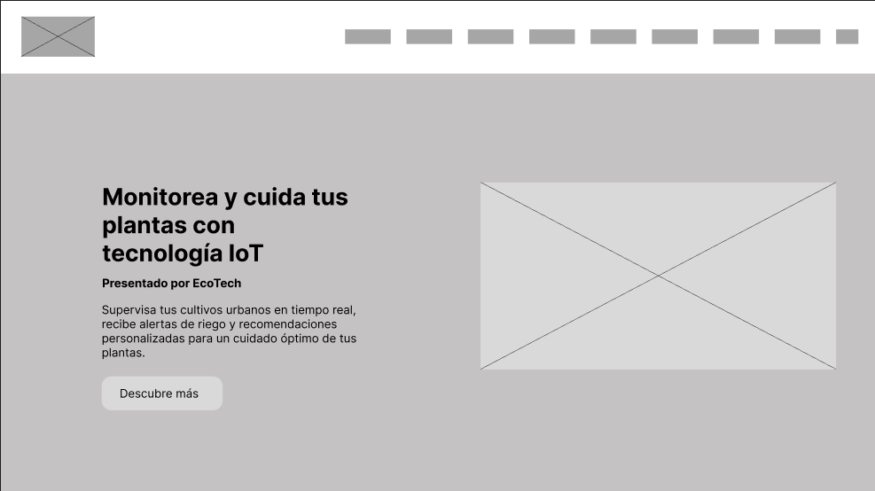

Se presenta la sección de quienes somos:

Se presenta la sección de propuesta de Services:

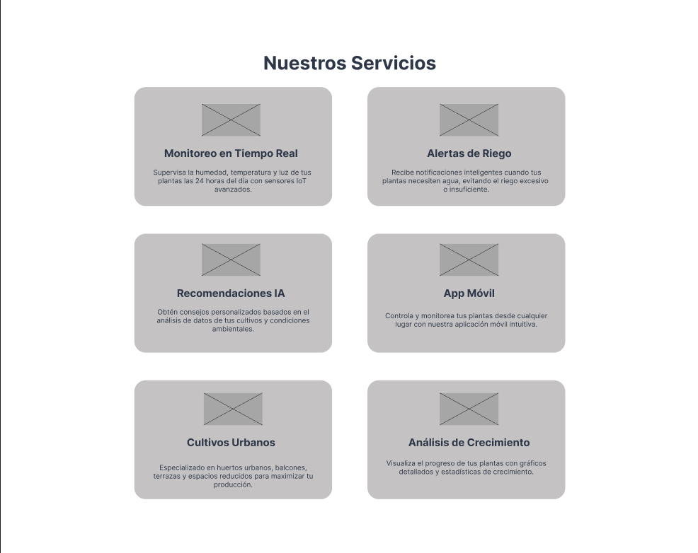

Se presenta la sección de propuesta de About the product:

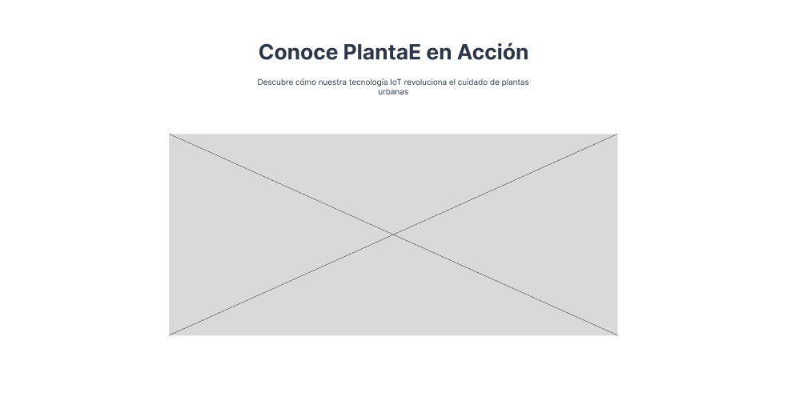

Se presenta la sección de propuesta de Testimonials:

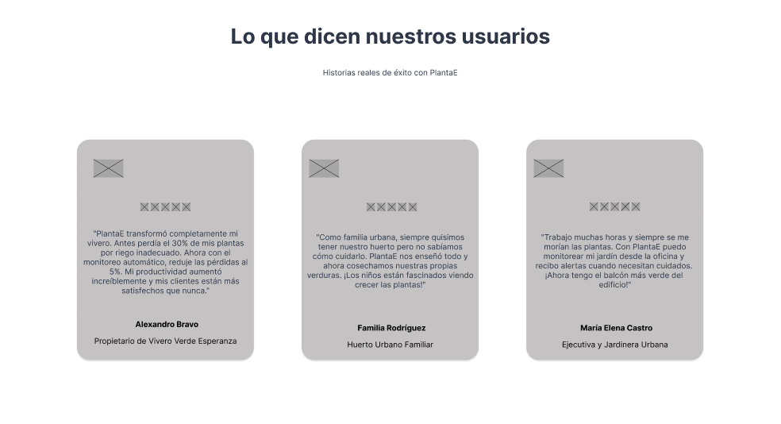

Se presenta la sección de propuesta de Contact:

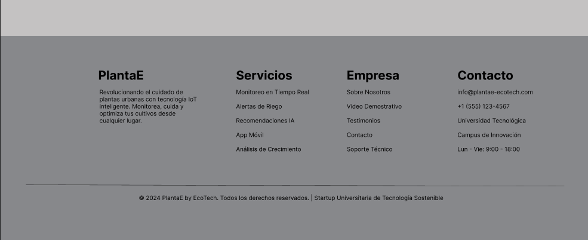

### 4.3.2. Landing Page Mock-up

Wireflow:

En esta primera sección se presenta la pantalla Home de la landing page.

Se presenta la sección de quienes somos:

Se presenta la sección de propuesta de Services:

Se presenta la sección de propuesta de About the product:

Se presenta la sección de propuesta de Testimonials:

Se presenta la sección de propuesta de Contact:

## 4.4. Web Applications UX/UI Design

### 4.4.1. Web Applications Wireframes

Los siguientes wireframes corresponden a la aplicación web de PlantaE.
- Principios aplicados
  - Jerarquía funcional clara

      Se definieron rutas principales diferenciadas para hogares y viveros:
      - Hogares → supervisión de plantas individuales, métricas y alertas.
      - Viveros → administración masiva mediante lotes, tareas programadas e insumos.
     
      El menú lateral resalta las acciones más utilizadas (Dashboard, Mis plantas/Lotes, Sensores, Métricas, Tareas, Perfil).

- Consistencia visual y patrones de diseño:
  
  Los wireframes mantienen componentes homogéneos en botones, tarjetas, formularios, tablas y gráficos.
Esto garantiza coherencia entre módulos como Plantas, Sensores, Métricas, Alertas, Historial y Tareas programadas.

- Accesibilidad en interfaces:

  La interfaz fue diseñada con criterios de accesibilidad, empleando contrastes adecuados para distintas condiciones de luz, tipografías legibles y componentes compatibles con modo claro/oscuro. Toda la estructura admite navegación mediante teclado, y los elementos clave incluyen etiquetas semánticas y descripciones comprensibles para garantizar compatibilidad con lectores de pantalla y tecnologías asistivas.

- Flujo de tareas optimizado

  Los módulos fueron estructurados para reducir pasos y agilizar la interacción del usuario: registrar una nueva planta requiere solo dos clics, vincular un sensor se realiza en una única pantalla, las métricas están accesibles directamente desde el dashboard o la planta correspondiente, y las alertas críticas se visualizan de inmediato en un panel prioritario. En el caso de viveros, la creación de lotes utiliza un formulario compacto con asignación automática de rutinas.

Versión Desktop Wireframes - Hogares  

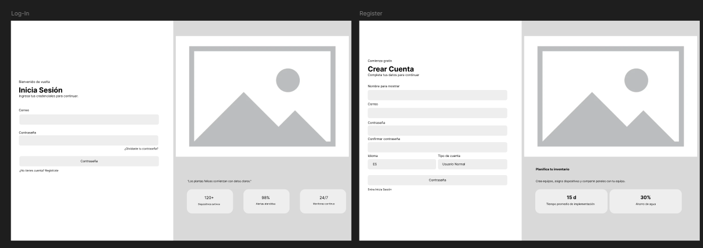

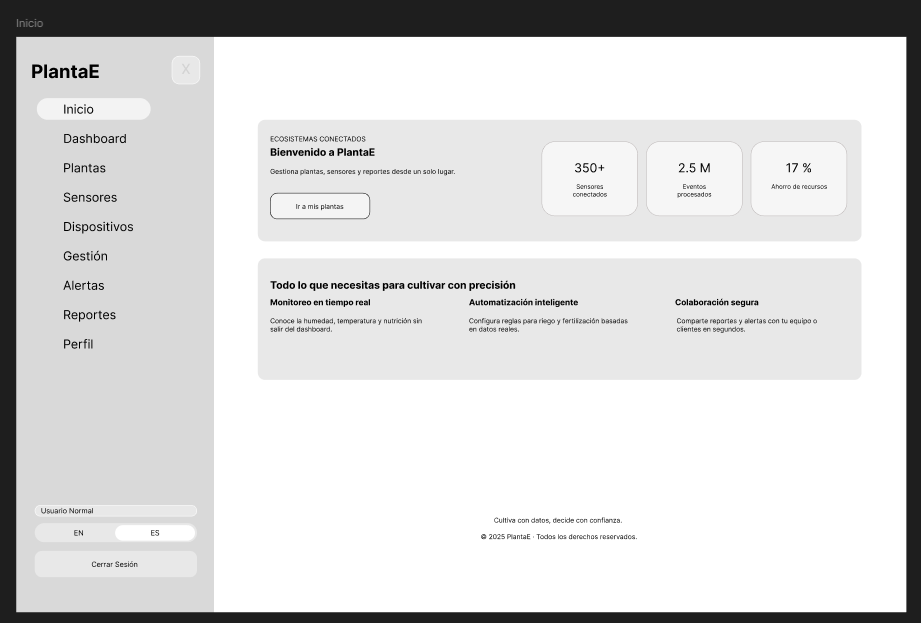

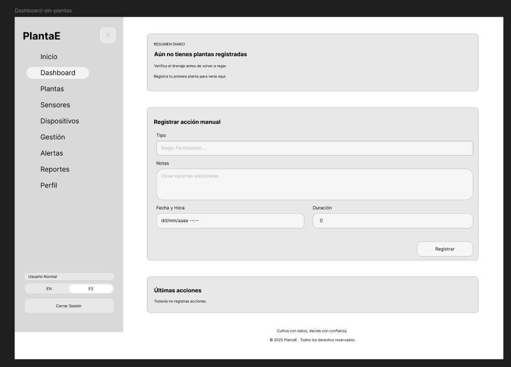

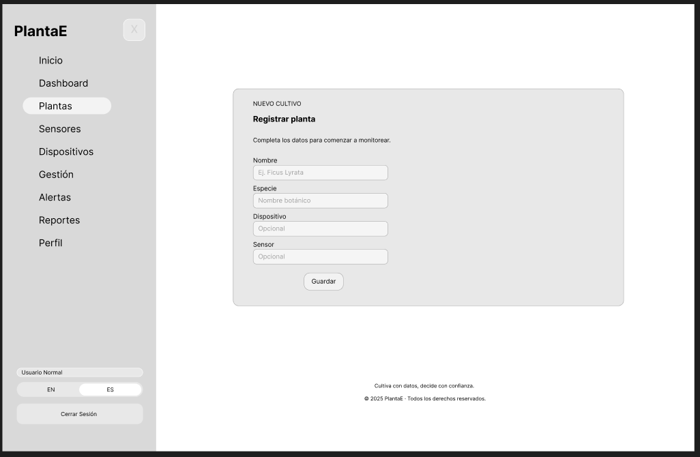

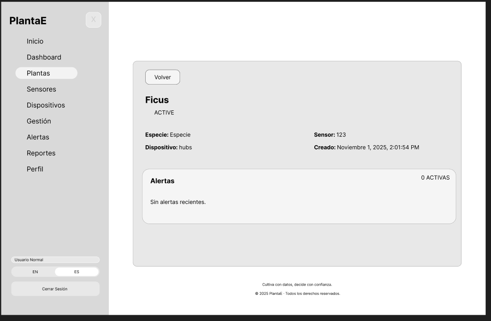

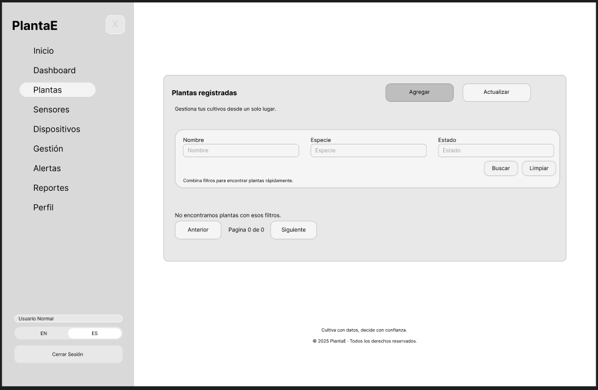

Para viveros, guardan la misma relación de las anteriores wireframes presentadas pero hay un punto en específico que lo destaca de el anterior segemento el cual es la vista viveros, la cual se le presenta ahora:

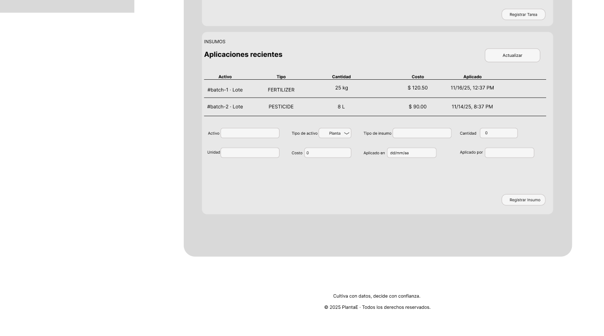

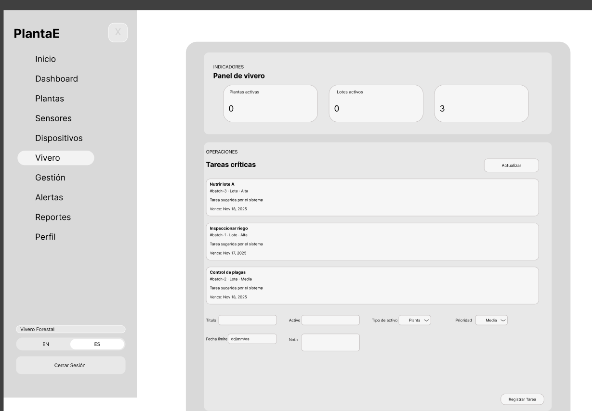

### 4.4.2. Web Applications Wireflow Diagrams

Esta sección se presenta la propuesta de Wireflows para cada user goal, teniedno en cuenta los user persona definidos para las aplicaciones que estructuran parte de nuestro alcance.

Para la vista de Home

**Task flow 1:** Acceder a la plataforma PlantaE

**Objetivo del usuario:** Ingresar o crear una cuenta para acceder a la aplicación de PlantaE.

**Pasos del Task Flow:** 

1. Seleccionar “Inicia sesión” o “Crear cuenta” desde la pantalla principal.
2. Inicia sesión si ya tiene credenciales.
3. Registrarse completando nombre, correo, contraseña e idioma si no tiene cuenta.
4. Acceder al dashboard tras completar el proceso.

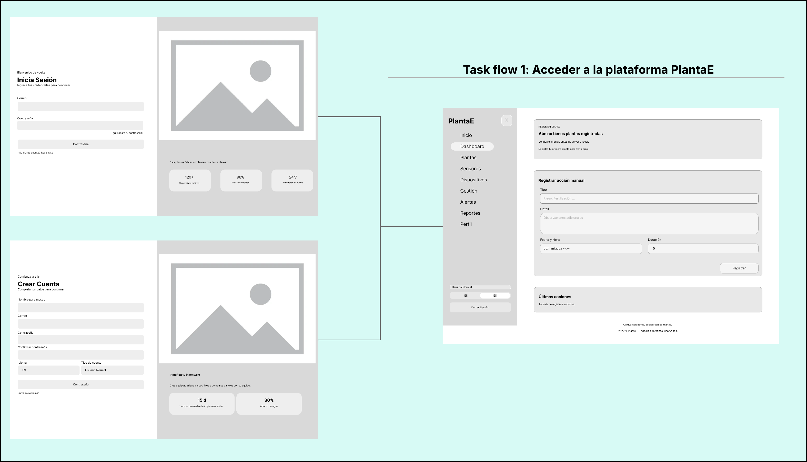

**Task flow 2:** Supervisar el dashboard

**Objetivo del usuario:** Ver el estado general de sus plantas y acciones recientes.

**Pasos del Task Flow:** 

1. Ingresar al dashboard luego de iniciar sesión.
2. Ver si tiene plantas activas o el mensaje de “Aún no tienes plantas registradas”.
3. Revisar la sección “Registrar acción manual”.
4. Consultar el bloque “Últimas acciones”.

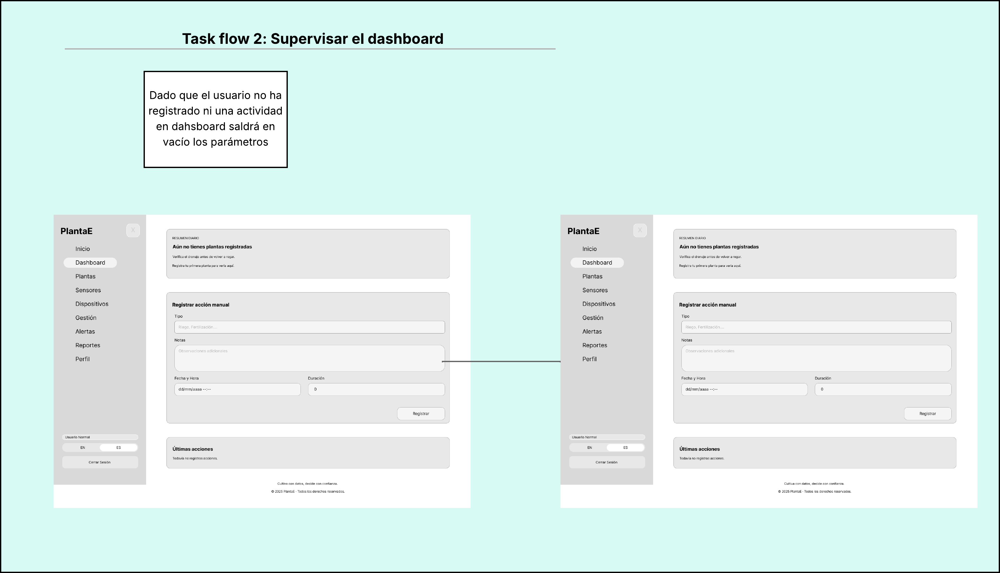

**Task flow 3:** Registrar una planta

**Objetivo del usuario:** Añadir una planta para iniciar su monitoreo.

**Pasos del Task Flow:** 

1. Ir a Plantas o Gestión y seleccionar “Añadir planta”.
2. Completar nombre, especie, dispositivo y sensor (opcionales).
3. Guardar la planta.
4. Visualizarla en la lista de plantas registradas.

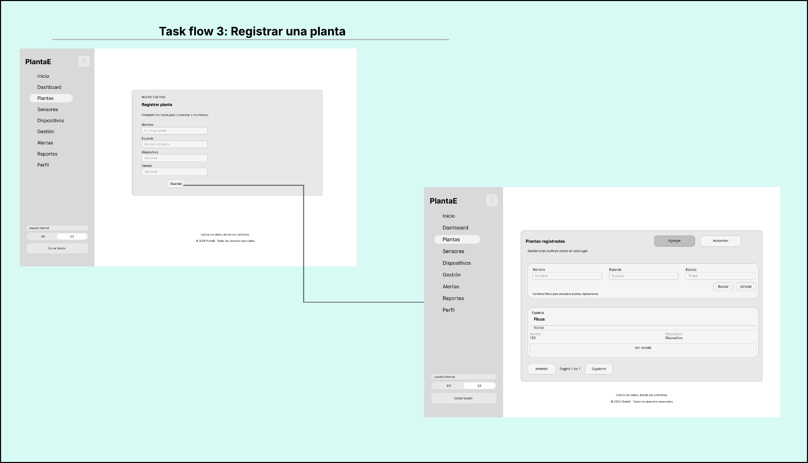

**Task flow 4:** Gestionar plantas registradas

**Objetivo del usuario:** Ver, buscar o filtrar plantas existentes.

**Pasos del Task Flow:** 

1. Acceder a la sección Plantas.
2. Usar filtros por nombre, especie o estado.
3. Seleccionar “Buscar” para mostrar coincidencias.
4. Hacer clic en “Ver detalle” para abrir información de una planta.

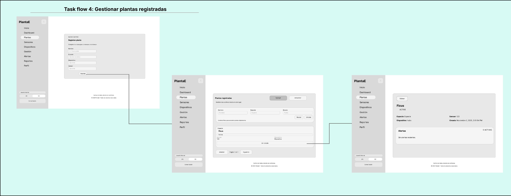

**Task flow 5:** Ver detalle de una planta

**Objetivo del usuario:** Consultar información específica de una planta.

**Pasos del Task Flow:**

1. Seleccionar la planta desde la lista.
2. Ver datos como especie, estado, sensor vinculado y dispositivo.
3. Revisar la tarjeta de alertas de esa planta.
4. Volver al listado si desea navegar entre más plantas.

**Task flow 6:** Revisar alertas recientes

**Objetivo del usuario:** Consultar alertas generadas por sensores.

**Pasos del Task Flow:** 

1. Acceder a la sección Alertas.
2. Filtrar por planta, sensor o tipo.
3. Ver la lista de alertas recientes.
4. Seleccionar una alerta para revisarla.

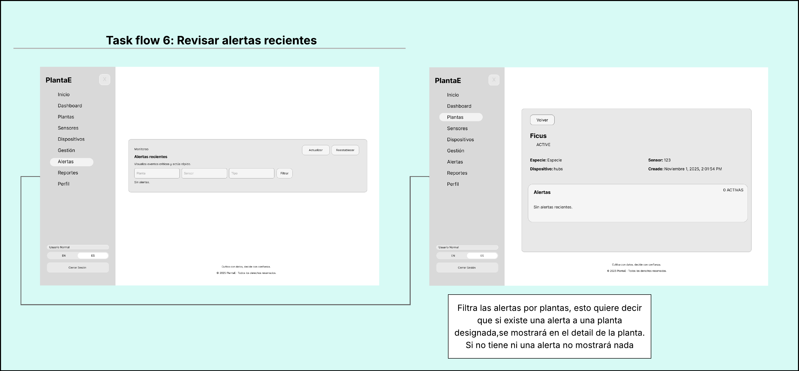

**Task flow 7:** Registrar y gestionar dispositivos

**Objetivo del usuario:** Registrar hubs/dispositivos y asignarlos a plantas.

**Pasos del Task Flow:** 

1. Acceder a Dispositivos.
2. Ingresar ID, modelo y secreto (opcional).
3. Guardar para registrar el dispositivo.
4. Buscar un dispositivo mediante el ID.
5. Revisar detalles: estado, modelo, notas.
6. Añadir nota o editarla.
7. Seleccionar planta para vincular el dispositivo.
8. Desactivar dispositivo si es necesario.

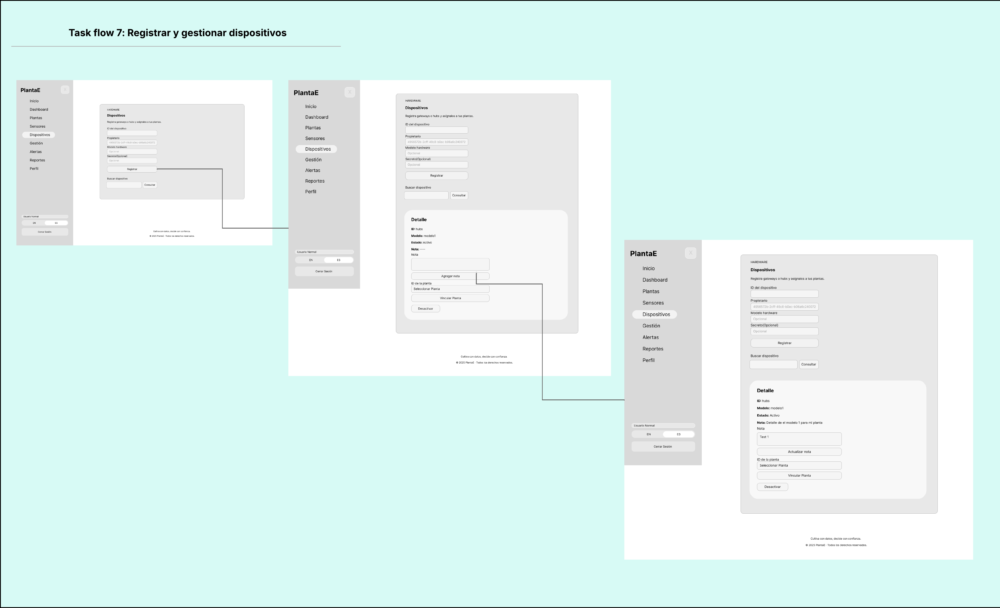

**Task flow 8:** Registrar y gestionar sensores

**Objetivo del usuario:** Crear, vincular o desactivar sensores.

**Pasos del Task Flow:** 

1. Acceder a Sensores.
2. Registrar un sensor seleccionando tipo, propietario y planta opcional.
3. Vincular un sensor seleccionando un sensor y una planta.
4. Desactivar un sensor desde la tarjeta correspondiente.
5. Registrar lectura manual si es necesario (test).
6. Ver tabla de sensores registrados.

**Task flow 9:** Descargar reportes

**Objetivo del usuario:** Generar reportes en PDF o CSV sobre métricas.

**Pasos del Task Flow:**

1. Acceder a Reportes.
2. Seleccionar planta.
3. Seleccionar rango de fechas.
4. Elegir las métricas (temperatura, humedad, pH…).
5. Descargar PDF o CSV.

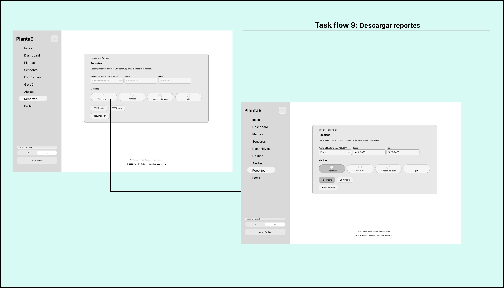

**Task flow 10:** Editar perfil personal

**Objetivo del usuario:** Actualizar información personal o preferencias.

**Pasos del Task Flow:**

1. Acceder a Perfil.
2. Editar nombre, zona horaria e idioma.
3. Guardar cambios.

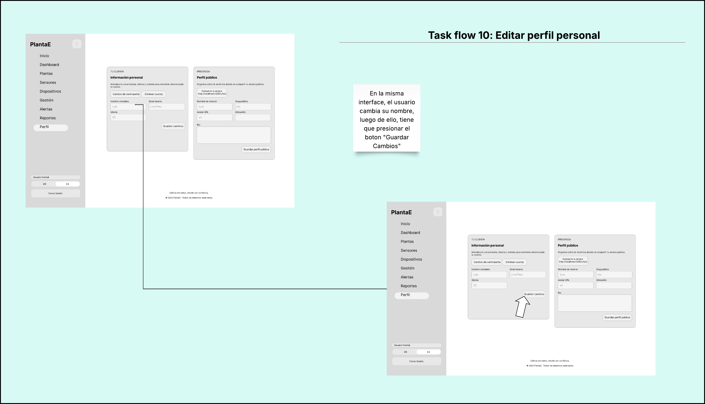

**Task flow 11:** Cambiar contraseña

**Objetivo del usuario:** Actualizar su contraseña desde el perfil.

**Pasos del Task Flow:** 

1. Acceder a Perfil > Cambiar contraseña.
2. Ingresar contraseña actual y nueva.
3. Guardar la actualización.

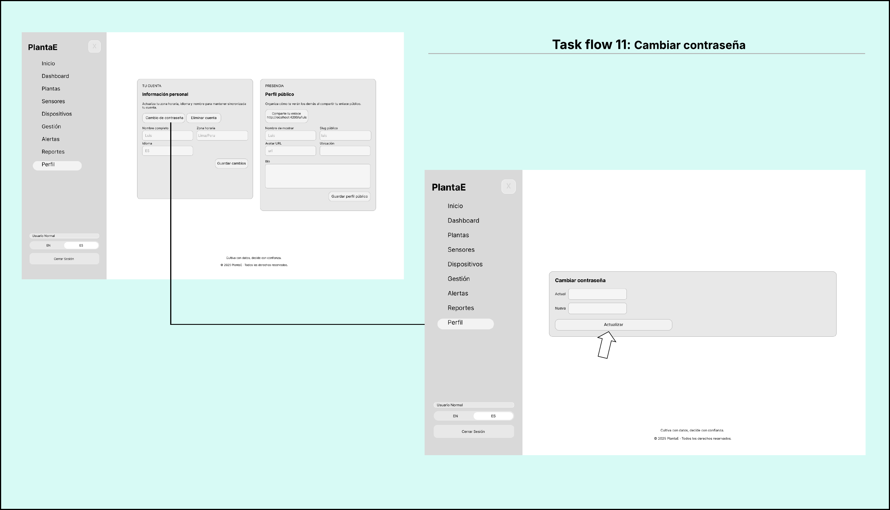

----------------------------------------------------
Para la vista de Viveros
----------------------------------------------------

**Task flow 1:** Acceder a la plataforma PlantaE

**Objetivo del usuario:** Iniciar sesión o registrarse para acceder al panel principal del vivero.

**Pasos del Task Flow:** 

1. Seleccionar “Iniciar sesión” o “Crear cuenta”.
2. Ingresar credenciales válidas o completar el registro.
3. Acceder al inicio de la aplicación.

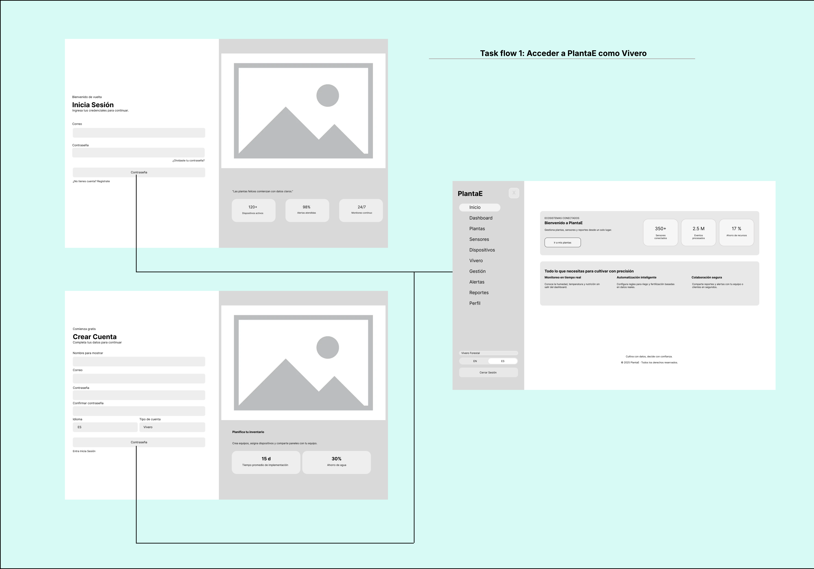

**Task flow 2:** Supervisar el panel de viveros

**Objetivo del usuario:** Visualizar indicadores clave y revisar tareas críticas del vivero.

**Pasos del Task Flow:** 

1. Ingresar al módulo Vivero desde el menú lateral.
2. Ingresar credenciales válidas o completar el registro.
3. Revisar lista de tareas críticas ordenadas por urgencia.
4. Visualizar insumos recientes aplicados a plantas o lotes.

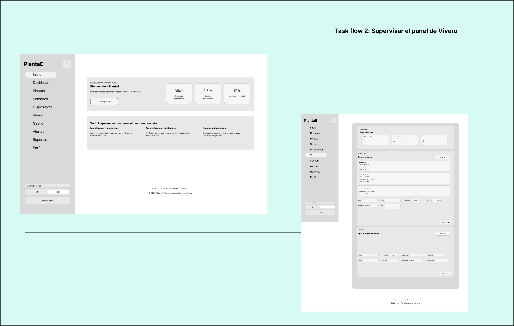

**Task flow 3:** Registrar plantas

**Objetivo del usuario:** Registrar una nueva planta para monitoreo.

**Pasos del Task Flow:** 

1. Ir al módulo Plantas.
2. Seleccionar “Agregar” o “Añadir planta”.
3. Completar nombre, especie, dispositivo y sensor opcionales.
4. Guardar la planta y visualizarla en lista.

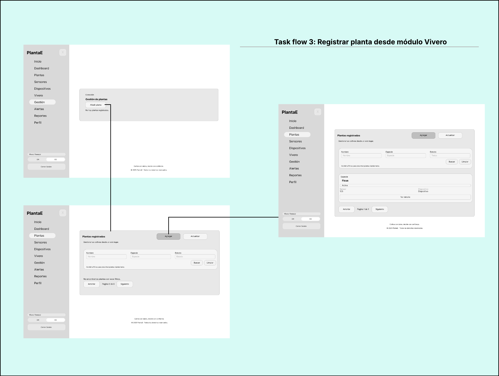

**Task flow 4:** Gestionar listado de plantas del vivero

**Objetivo del usuario:** Consultar plantas, aplicar filtros y acceder a su detalle.

**Pasos del Task Flow:** 

1. Acceder a Plantas desde el menú.
2. Filtrar por nombre, especie o estado.
3. Pulsar Buscar para actualizar la lista.
4. Seleccionar Ver detalle para abrir la ficha de una planta.

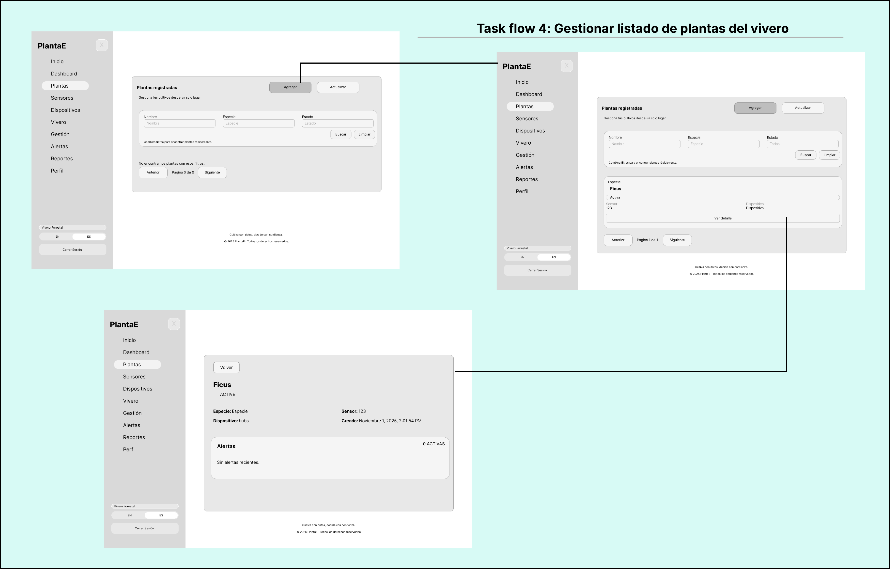

**Task flow 5:** Ver detalle de una planta del vivero

**Objetivo del usuario:** Consultar estado, sensor, dispositivo y alertas de la planta.

**Pasos del Task Flow:** 

1. En el listado de plantas, seleccionar Ver detalle.
2. Revisar nombre, especie, estado, sensor asociado y dispositivo.
3. Consultar sección de Alertas activas.
4. Regresar a la lista usando “Volver”.

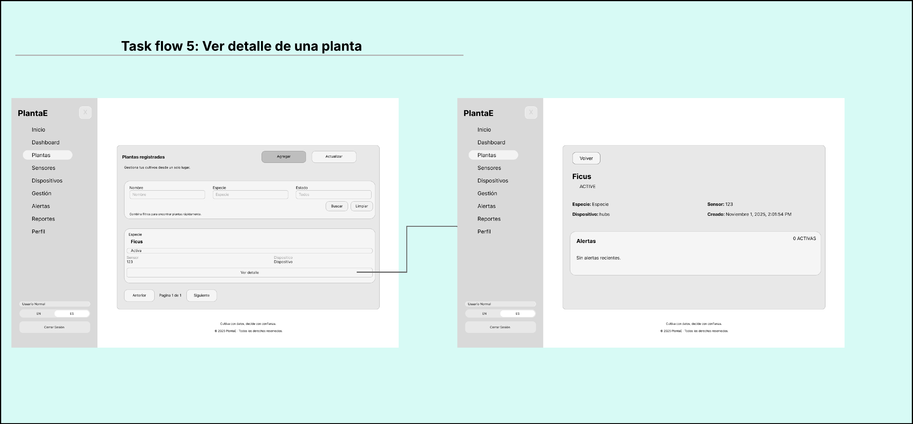

**Task flow 6:** Gestionar dispositivos del vivero

**Objetivo del usuario:** Registrar, buscar y vincular dispositivos a plantas.

**Pasos del Task Flow:** 

1. Acceder al módulo Dispositivos.
2. Registrar un nuevo dispositivo ingresando ID, modelo y secreto opcional.
3. Buscar un dispositivo mediante su ID.
4. Ver sección Detalle del dispositivo encontrado.
5. Agregar o actualizar una nota si es necesario.
6. Seleccionar una planta para vincular dispositivo.
7. Confirmar vinculación o desactivar dispositivo.

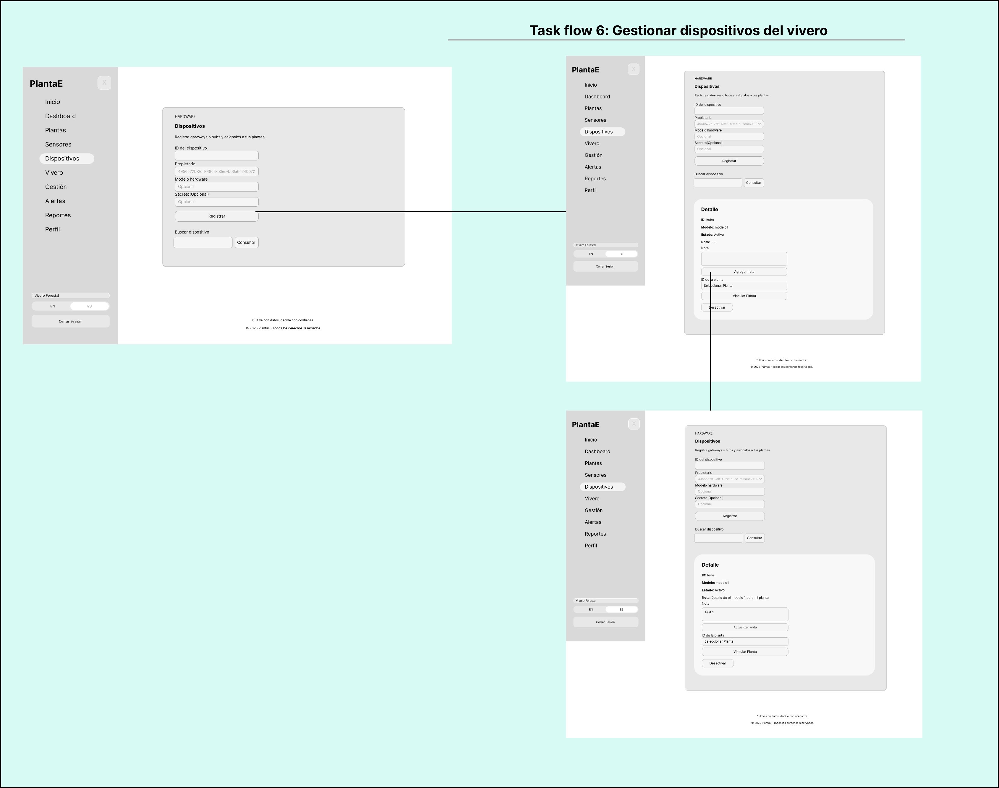

**Task flow 7:** Registrar, vincular y gestionar sensores del vivero

**Objetivo del usuario:** Administrar sensores disponibles en el vivero.

**Pasos del Task Flow:** 

1. Acceder al módulo Sensores.
2. Registrar sensor eligiendo tipo, propietario y planta opcional.
3. Vincular sensor seleccionando ID y planta correspondiente.
4. Desactivar sensor si ya no se usa.
5. Registrar lectura manual para pruebas.
6. Ver tabla de sensores registrados.

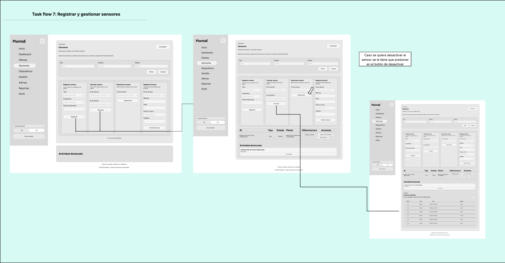

**Task flow 8:** Revisar alertas del vivero

**Objetivo del usuario:** Visualizar alertas activas y filtrarlas según necesidad.

**Pasos del Task Flow:** 

1. Acceder al módulo Alertas.
2. Filtrar por planta, sensor o tipo.
3. Visualizar lista de alertas activas.
4. Actualizar o restablecer filtros con los botones correspondientes.

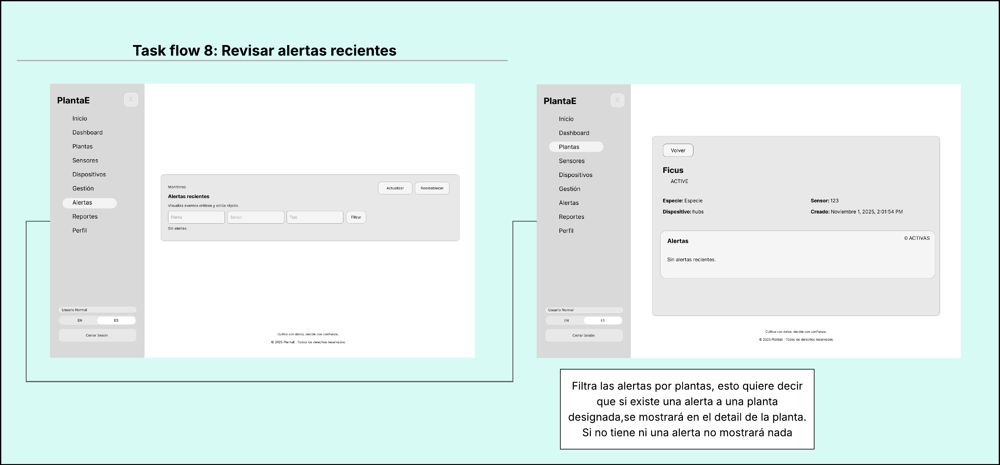

**Task flow 9:** Generar reportes del vivero

**Objetivo del usuario:** Descargar reportes de métricas en PDF o CSV.

**Pasos del Task Flow:** 

1. Acceder al módulo Reportes.
2. Seleccionar la planta (obligatorio para exportación).
3. Indicar fechas Desde y Hasta.
4. Activar métricas deseadas (temperatura, humedad, pH…).
5. Descargar PDF Planta, CSV Planta o Resumen PDF.

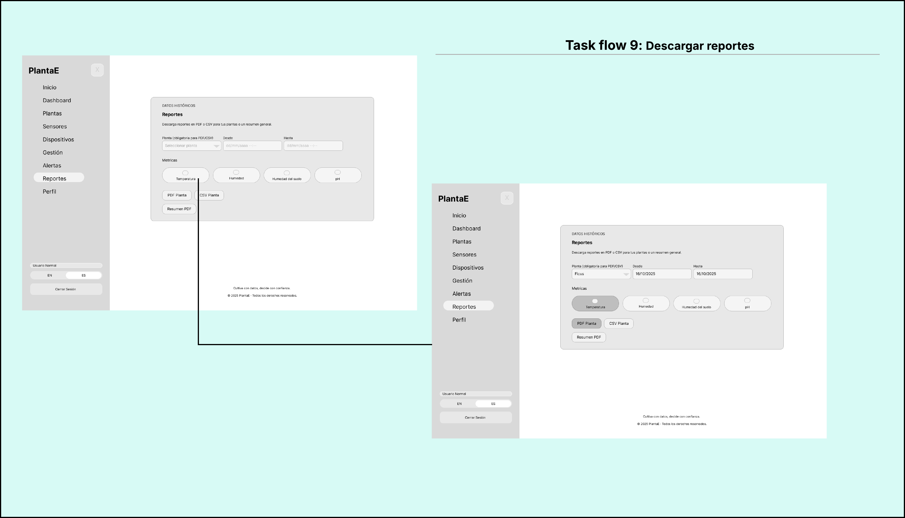

**Task flow 10:** Actualizar información personal del vivero

**Objetivo del usuario:** Editar datos básicos de la cuenta y preferencias.

**Pasos del Task Flow:** 

1. Acceder al módulo Perfil.
2. Editar nombre, zona horaria e idioma.
3. Guardar cambios.

**Task flow 11:** Cambiar contraseña

**Objetivo del usuario:** Actualizar credenciales para mantener seguridad.

**Pasos del Task Flow:** 

1. Acceder a Perfil > Cambiar contraseña.
2. Ingresar contraseña actual.
3. Ingresar nueva contraseña.
4. Guardar actualizado.

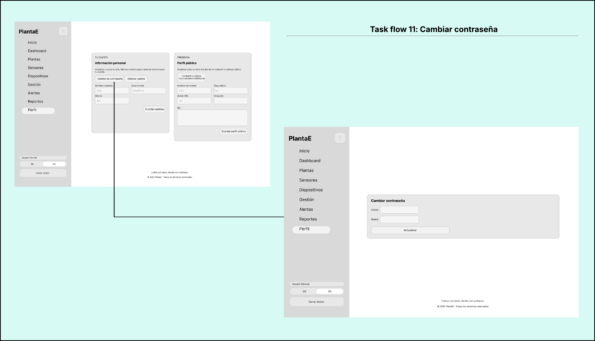

URL de los Wireflows Diagrams: https://lucid.app/lucidchart/ac20990f-cb36-4acd-8fa9-58a8fd6c10e4/edit?viewport_loc=-2424%2C-1728%2C20766%2C9296%2C0_0&invitationId=inv_f4247083-cea2-4f91-910c-253827ba05f0

### 4.4.3. Web Applications Mock-ups

Se le presenta las capturas de nuestros mock-ups, losa más imortantes de nuestra aplicación.

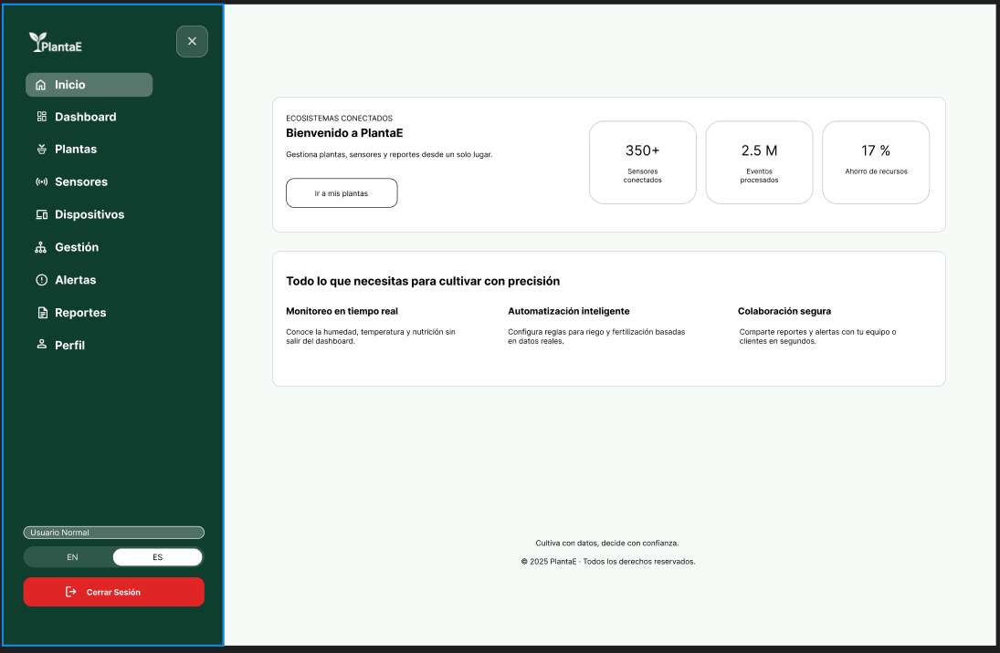

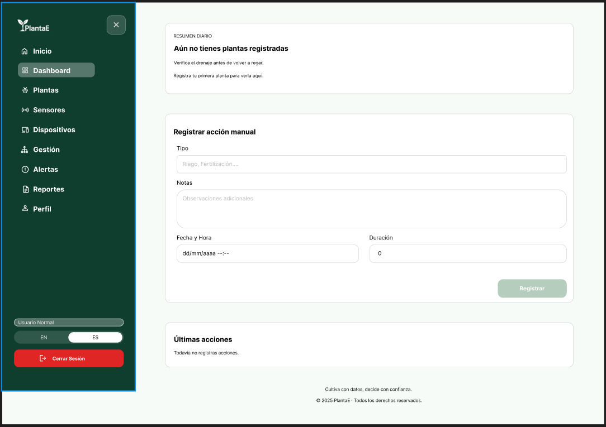

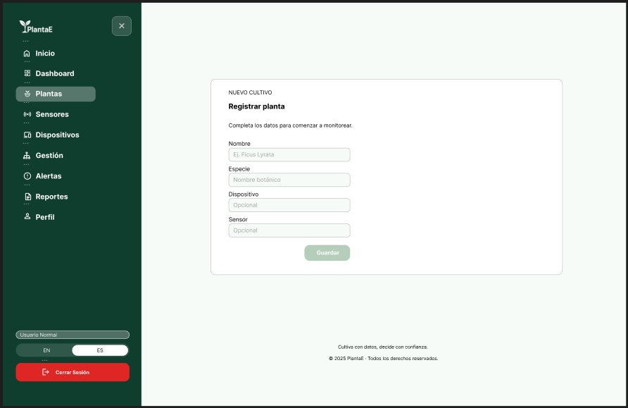

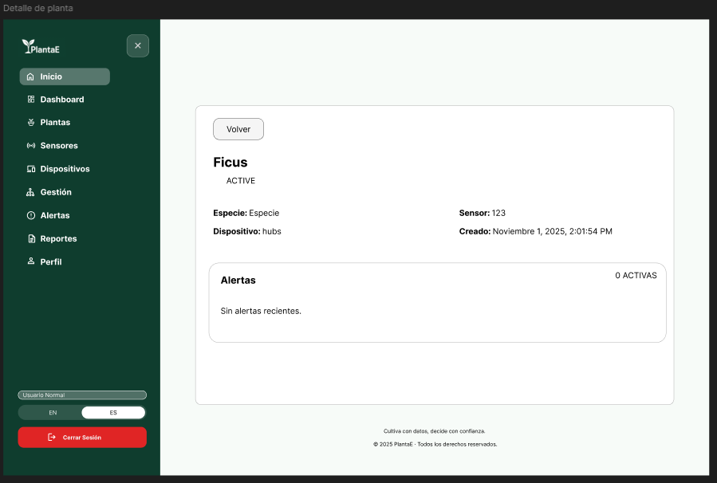

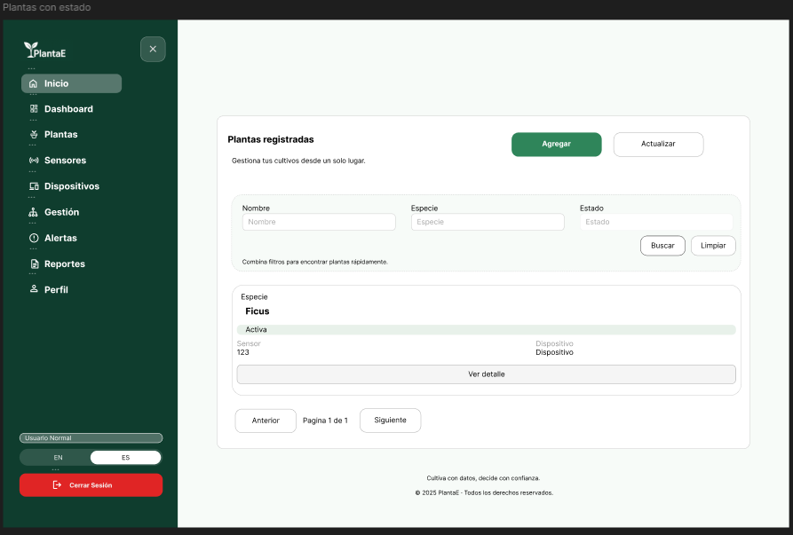

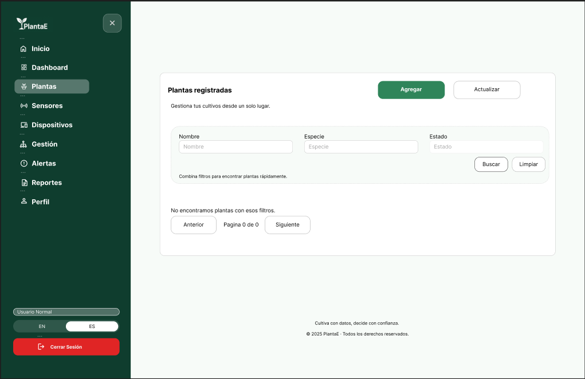

### 4.4.4. Web Applications User Flow Diagrams

**Desktop User Flow 1: Acceder a PlantaE**

Relacionado con User Goal 1: Como usuario, quiero registrarme, iniciar sesión o recuperar mi contraseña, para acceder a PlantaE de forma segura.

En este flujo, el usuario llega a la pantalla de Inicia Sesión / Crear Cuenta y decide si necesita autenticarse o registrarse. En el flujo principal ingresa sus credenciales correctas o completa el formulario de registro y, tras la validación, es redirigido al dashboard de PlantaE. En escenarios alternativos, si las credenciales son inválidas o falta información, el sistema muestra mensajes de error y ofrece la opción de recuperar contraseña antes de volver a intentar.

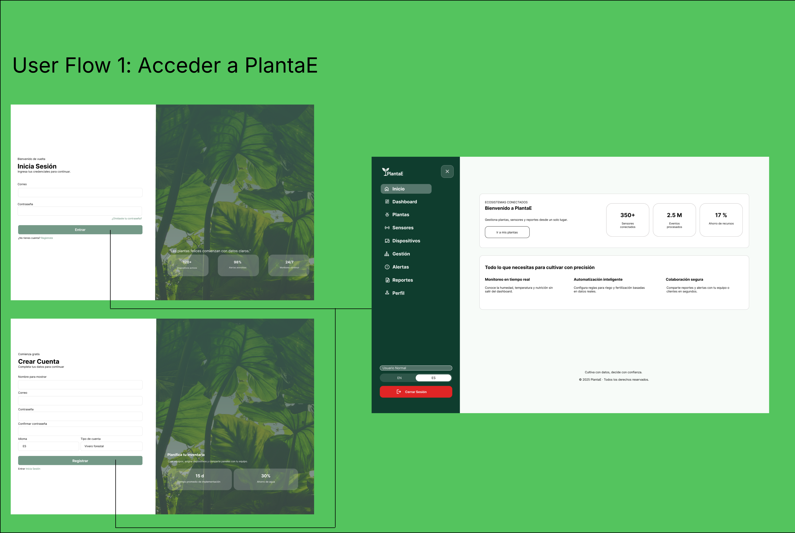

**Desktop User Flow 2: Registrar y gestionar plantas**

Relacionado con User Goal 2: Como usuario, quiero registrar nuevas plantas y gestionarlas desde una vista centralizada.

En este flujo, el usuario accede a la sección Plantas o Gestión, donde puede ver el listado de plantas o un estado “sin plantas registradas”. En el flujo principal, selecciona “Añadir planta”, completa el formulario (nombre, especie, dispositivo y sensor opcionales) y guarda los datos. La planta aparece en el listado y puede filtrarse por nombre, especie o estado. En escenarios alternativos, si la búsqueda no encuentra resultados, se muestra un mensaje de “no se encontraron plantas con esos filtros” sin romper la navegación.

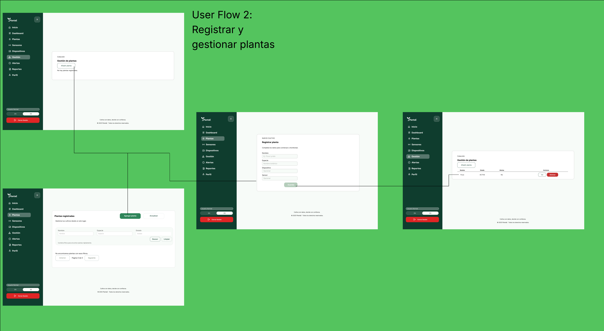

**Desktop User Flow 3: Consultar detalle de una planta**

Relacionado con User Goal: Como usuario, quiero ver la información detallada de una planta específica, para conocer su estado actual.

En este flujo, el usuario parte desde el listado de Plantas registradas y selecciona “Ver detalle”. La aplicación lo lleva a una pantalla donde se muestran nombre, especie, estado, sensor asignado, dispositivo y un panel de alertas asociadas a esa planta. Desde aquí puede revisar si hay alertas activas o si todo está en orden. Finalmente, dispone de un botón de “Volver” para regresar al listado sin perder el contexto.

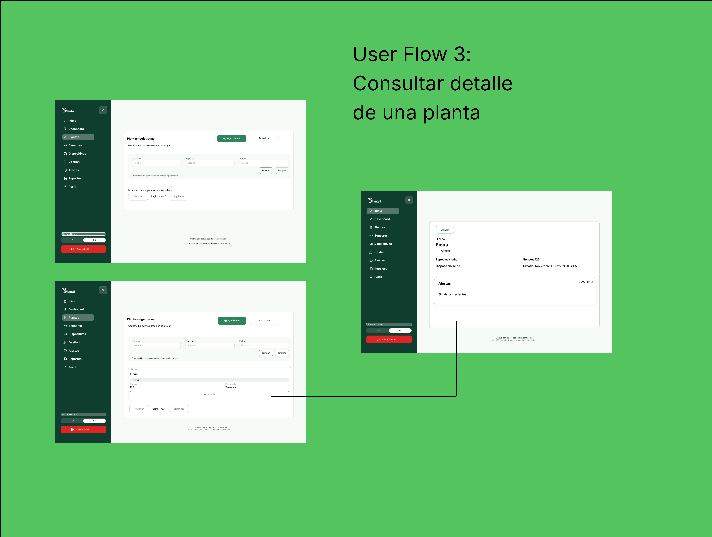

**Desktop User Flow 4: Visualizar alertas recientes**

Relacionado con User Goal: Como usuario, quiero revisar rápidamente las alertas generadas, para priorizar qué plantas atender.

En este flujo, el usuario entra a la sección Alertas. En el flujo principal, utiliza los filtros por planta, sensor o tipo de alerta y pulsa Filtrar para ver los eventos críticos más recientes. En caso de no existir alertas, la vista muestra el mensaje “Sin alertas”, manteniendo una experiencia clara. El usuario puede actualizar o restablecer los filtros usando los botones de acción, sin necesidad de salir de la pantalla.

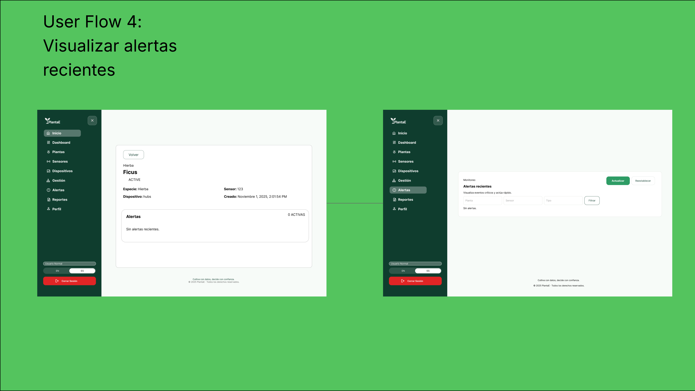

**Desktop User Flow 5: Gestionar dispositivos del hogar**

Relacionado con User Goal: Como usuario, quiero registrar dispositivos (hubs/gateways) y vincularlos a mis plantas.

Aquí, el usuario navega al módulo Dispositivos, donde puede registrar un dispositivo ingresando su ID, modelo y un secreto opcional. Tras el registro, utiliza el cuadro de Buscar dispositivo para consultarlo y visualizar su detalle. Desde la sección de Detalle, agrega notas, vincula el dispositivo a una planta seleccionada o lo desactiva si deja de usarse. En un flujo alternativo, si se busca un ID inexistente, el usuario no verá detalle y puede intentar con otro identificador.

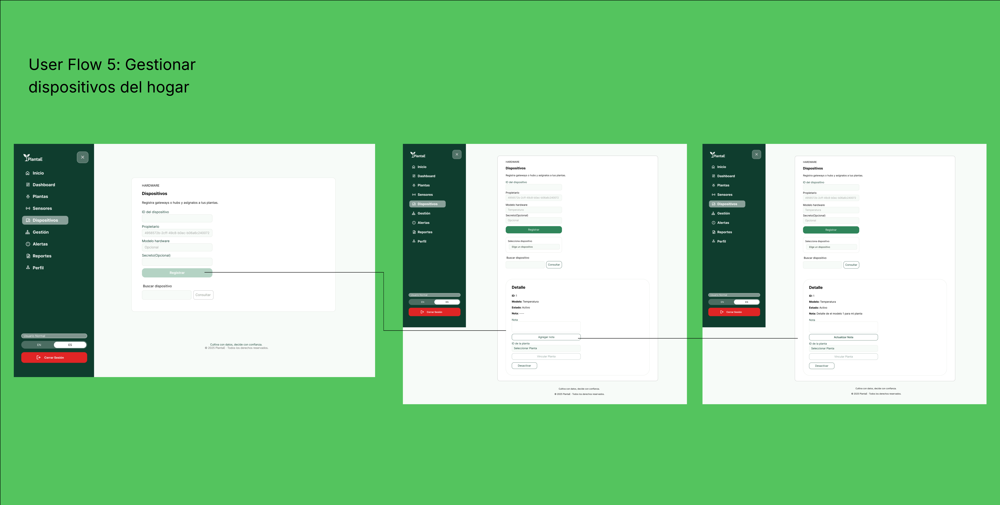

**Desktop User Flow 6: Gestionar sensores y ver lecturas**

Relacionado con User Goal: Como usuario, quiero administrar sensores y consultar sus lecturas para entender el comportamiento de mis cultivos.

En este flujo, el usuario accede a Sensores. En el flujo principal, registra un sensor nuevo, luego lo vincula a una planta y lo visualiza en la tabla de sensores. Desde esa tabla, puede elegir “Ver lecturas” para abrir el histórico de valores (métrica, valor, fecha, calidad), o “Usar en formularios” si la interfaz lo permite. Un escenario alternativo ocurre cuando aún no hay sensores: la tabla aparece vacía y se muestra un mensaje informativo indicando que debe registrar el primero.

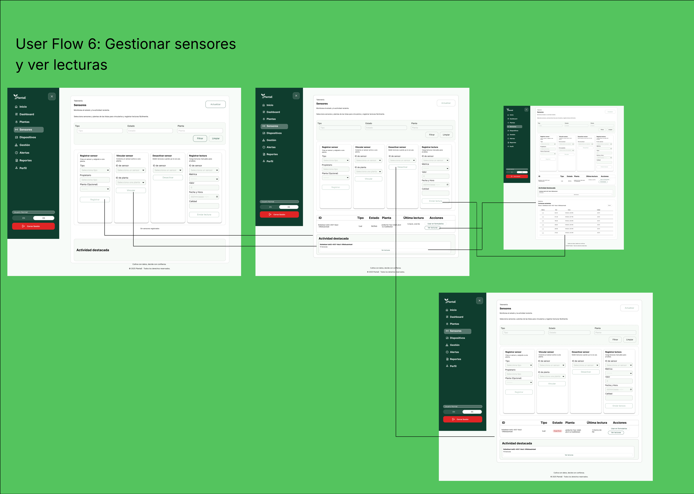

**Desktop User Flow 7: Generar reportes de plantas**

Relacionado con User Goal: Como usuario, quiero descargar reportes en PDF o CSV de mis plantas, para analizarlos fuera de la plataforma.

En este flujo, el usuario entra a Reportes, selecciona una planta, define un rango de fechas y decide qué métricas quiere incluir (temperatura, humedad, humedad del suelo o pH). En el happy path, pulsa PDF Planta o CSV Planta, y el sistema genera el archivo para descarga. Si no se ha seleccionado una planta o fechas válidas, el sistema impide generar el reporte y mantiene los controles visibles para que el usuario complete la información faltante.

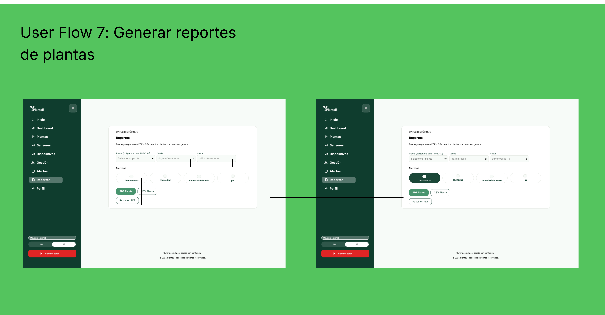

**Desktop User Flow 8: Configurar perfil e información pública**

Relacionado con User Goal: Como usuario, quiero actualizar mis datos personales, idioma y perfil público, para controlar cómo se muestra mi cuenta.

En este flujo, el usuario accede al módulo Perfil. En la sección de información personal, ajusta nombre, zona horaria, idioma y guarda cambios. Desde la misma vista puede lanzar el flujo de Cambio de contraseña, ingresando contraseña actual y nueva. En la columna de Perfil público, configura nombre de mostrar, slug, avatar, ubicación y biografía, y guarda su perfil compartible. Si algún dato obligatorio no cumple las reglas, el sistema muestra el error sin romper el flujo, permitiendo corregir y volver a guardar.

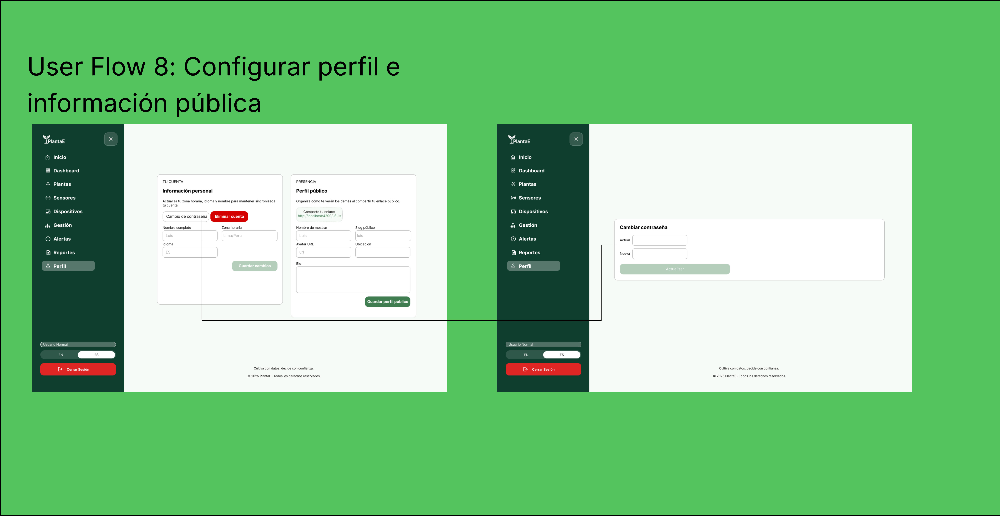

**Desktop User Flow 9: Acceder al panel del vivero**

Relacionado con User Goal: Como vivero, quiero iniciar sesión y acceder a un panel especializado para mi operación.

En este flujo, el usuario accede con sus credenciales (o se registra) y, tras la autenticación, en lugar del dashboard de hogar se le dirige al Panel de Vivero. Desde allí ve indicadores agregados (plantas activas, lotes activos) y las secciones específicas para tareas e insumos, manteniendo la navegación similar pero con contenido adaptado a la gestión masiva.

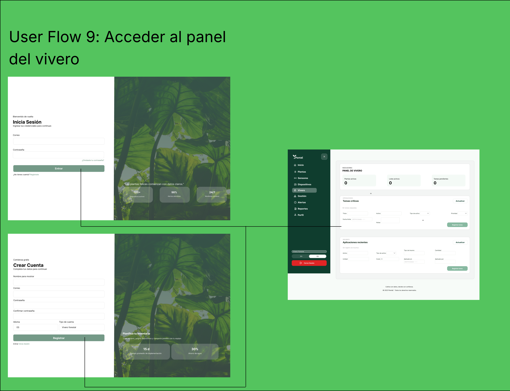

**Desktop User Flow 10: Revisar tareas críticas y registrar nuevas tareas**

Relacionado con User Goal: Como vivero, quiero ver mis tareas críticas y registrar nuevas tareas de cuidado para plantas o lotes.

En este flujo, el usuario entra al módulo Vivero. El happy path muestra una lista de tareas críticas con fecha de vencimiento y prioridad, permitiendo entender qué debe hacerse primero. Debajo, un formulario permite registrar nuevas tareas indicando título, tipo de activo (planta o lote), prioridad, fecha límite y nota. Tras guardar, la tarea se incorpora al listado. En rutas alternativas, si el usuario no completa la información obligatoria, el sistema no crea la tarea y mantiene el formulario para que pueda corregirlo.

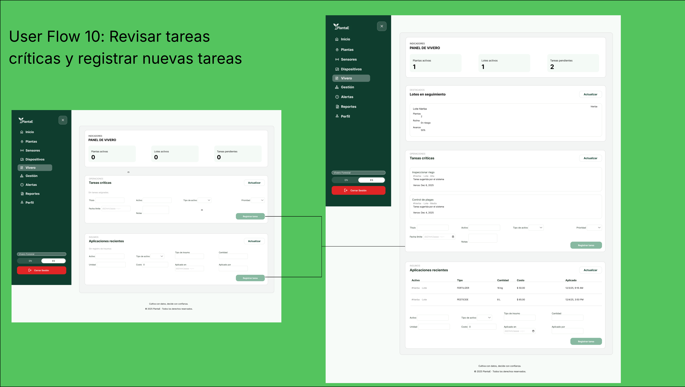

**Desktop User Flow 11: Registrar aplicaciones de insumos**

Relacionado con User Goal: Como vivero, quiero registrar la aplicación de fertilizantes u otros insumos para mantener trazabilidad.

En este flujo, el usuario utiliza la sección de Aplicaciones recientes dentro del módulo Vivero. En el flujo principal, selecciona el activo (planta o lote), el tipo de insumo, la cantidad, unidad, costo, fecha y quién aplica. Al confirmar, el registro se añade al historial de insumos recientes. este flujo permite centralizar el control de aplicaciones, y se integra luego con los módulos de métricas o costos. Si falta información clave (por ejemplo, activo o tipo de insumo), el sistema impide guardar y mantiene los datos en pantalla.

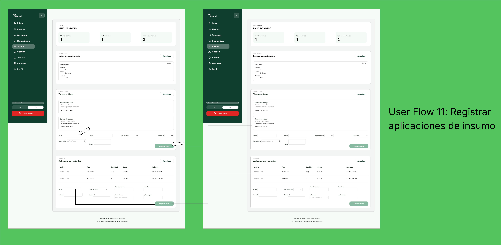

URL de los Users Flows Diagrams: https://lucid.app/lucidchart/ac20990f-cb36-4acd-8fa9-58a8fd6c10e4/edit?viewport_loc=-2424%2C-1728%2C20766%2C9296%2C0_0&invitationId=inv_f4247083-cea2-4f91-910c-253827ba05f0

## 4.5. Web Applications Prototyping

Las decisiones de interacción en PlantaE se fundamentaron en principios clave de diseño, empleando contraste para destacar información crítica como alertas y estados del cultivo; repetición para mantener coherencia visual entre módulos; alineación para favorecer una navegación clara y ordenada; y proximidad para agrupar de manera lógica los elementos relacionados. Estos criterios se aplicaron de forma consistente en toda la plataforma, priorizando una experiencia accesible y orientada al monitoreo eficiente de plantas y sensores.

Desde la perspectiva de arquitectura de información, PlantaE organiza sus funciones mediante un sistema de navegación jerárquica que distribuye los módulos principales (Dashboard, Plantas, Sensores, Dispositivos, Alertas, Reportes y Perfil), complementado con un módulo especializado para Viveros. Los flujos de acciones más relevantes—como registrar una planta, vincular un sensor, aplicar insumos o generar reportes—siguen estructuras secuenciales que reducen la complejidad y guían al usuario paso a paso. Además, se definieron sistemas de etiquetado claros, filtros precisos y herramientas de búsqueda que permiten localizar información rápidamente incluso con múltiples cultivos o sensores activos.

Asimismo, se implementaron interacciones responsivas (hover, active), validaciones visuales en formularios, retroalimentación inmediata tras cada acción y patrones de navegación adaptados al tipo de usuario (hogar o vivero). Esto asegura que tanto la consulta de datos como la ejecución de tareas se desarrollen de manera fluida, comprensible y alineada a los objetivos de la plataforma.

A continuación, se incluirán capturas representativas donde se ilustran los principales flujos de interacción del prototipo web, evidenciando cómo se aplican estos lineamientos dentro de la interfaz de PlantaE.

Web Application Desktop prototype:

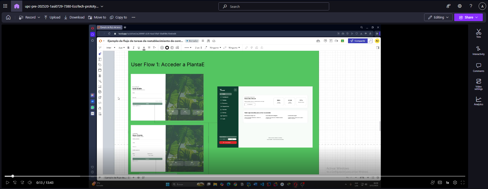

https://upcedupe-my.sharepoint.com/:v:/g/personal/u202314101_upc_edu_pe/IQCX8fzGayseTqDvBCQNciImASENPzNLePMg1qmpHazutoA?e=rBkyi6&nav=eyJyZWZlcnJhbEluZm8iOnsicmVmZXJyYWxBcHAiOiJTdHJlYW1XZWJBcHAiLCJyZWZlcnJhbFZpZXciOiJTaGFyZURpYWxvZy1MaW5rIiwicmVmZXJyYWxBcHBQbGF0Zm9ybSI6IldlYiIsInJlZmVycmFsTW9kZSI6InZpZXcifX0%3D

En el presente link se le hace la entrega del prototipo del figma:

https://www.figma.com/design/1rNP3WUqWPkGLod2D4h9PF/Web-application-PlantaE?node-id=0-1&t=sP1evBJbQUxpCgNy-1

## 4.6. Domain-Driven Software Architecture

### 4.6.1. Design-Level Event Storming

Para la elaboración del EventStorming, el equipo organizó una primera aproximación al modelo del dominmio de nuestro proyecto. Durante este proceso se realizaron una serie de 8 pasos.

**Paso 1: Collect Domain Events**
En este primer paso, se identificó todos los eventos relevantes para el dominio para nuestro sistema. Estos eventos representan hechos importantes que suceden en el proceso de negocio y los recopilamos con pos-its de color naranja.

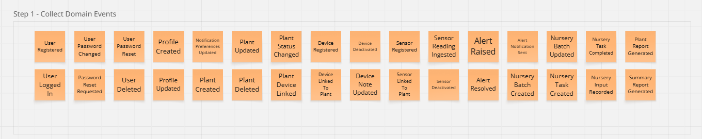

**Paso 2: Timeline**
En este paso organizamos los eventos identificados en una línea temporal, colocándolos en orden cronológico para visualizar mejor el flujo del proceso y entender la secuencia natural de acciones en el sistema.

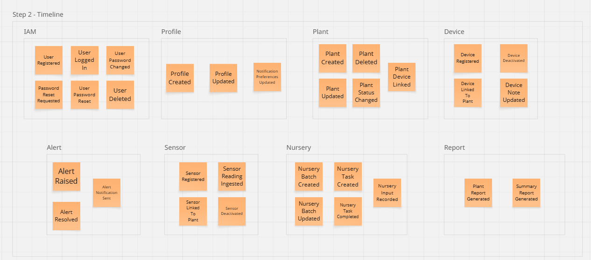

**Paso 3: Pain and Pivotal points**
En este paso se identificaron los pain points y los pivotal points del proceso. Esto significa que se encontraron las partes que necesitan mayor atención o que son cruciales para que el sistema funcione correctamente.

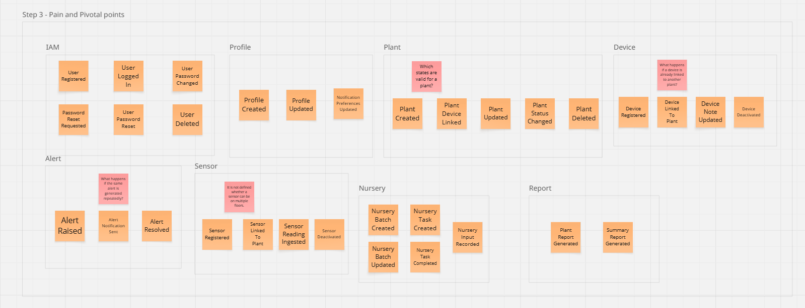

**Paso 4: Commands**
En este paso se agregaron comandos (los post-its azules) para representar las acciones de los usuarios o sistemas que inician un cambio en el sistema.

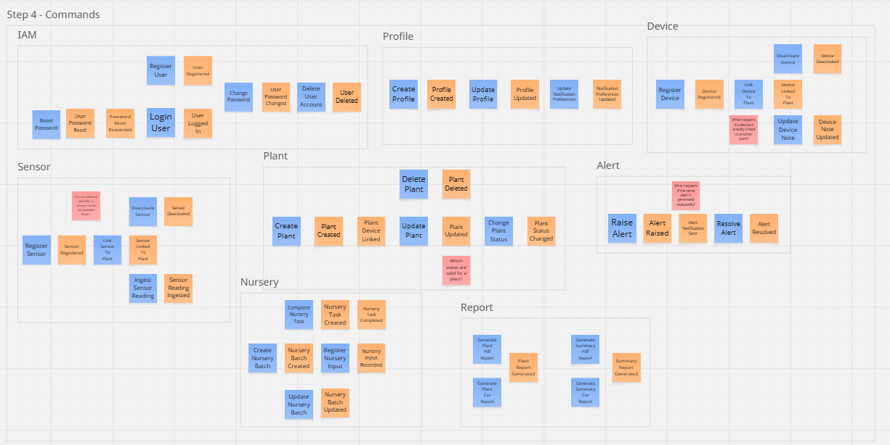

**Paso 5: Policies**
En este paso se definieron reglas de negocio (los post-its morados) que responden a ciertos eventos y generan nuevos eventos. Básicamente, estas reglas automatizan decisiones basadas en lo que sucedió antes.

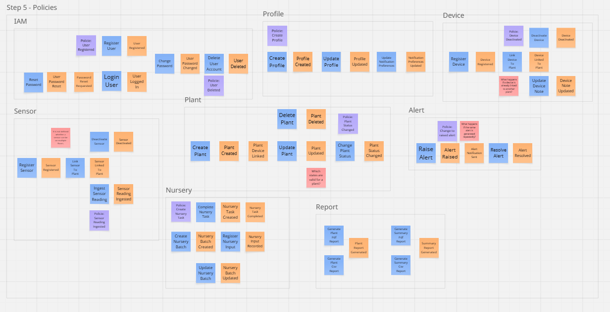

**Paso 6: Read models**
En este paso se identificaron las vistas o modelos de lectura que los usuarios necesitan. Esto se refiere a la información específica que debe estar accesible en ciertos momentos para que los usuarios puedan tomar decisiones.

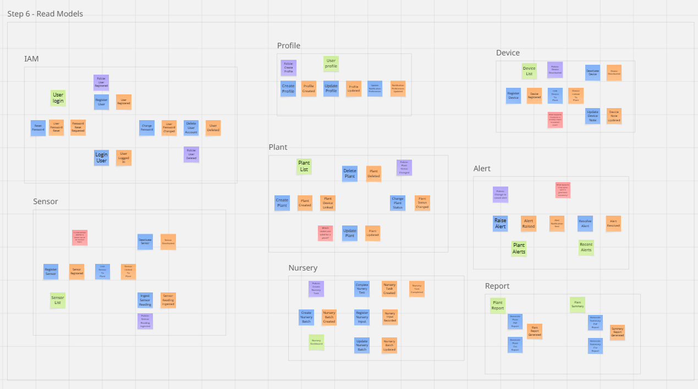

**Paso 7: Aggregates**
En este paso se organizaron los comandos y eventos relacionados en grupos lógicos llamados agregados (los post-its amarillos). Cada grupo reúne un conjunto de funciones que trabajan juntas de manera coherente.

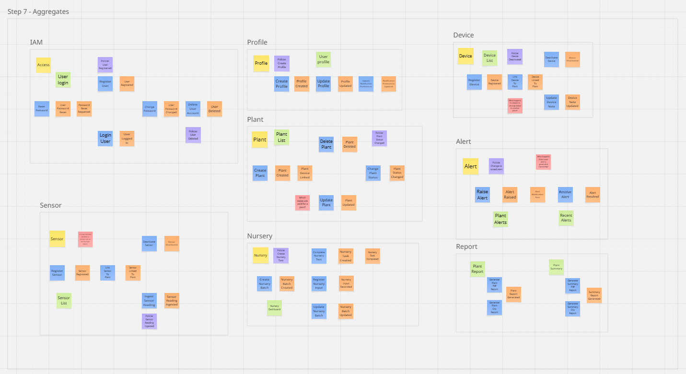

**Paso 8: Bounded Context**
Al final, definimos las áreas de responsabilidad del sistema, también conocidas como bounded contexts.

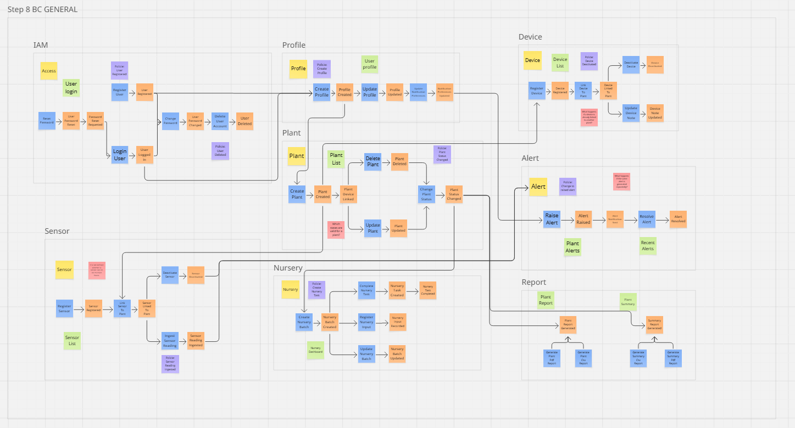

### 4.6.2. Software Architecture Context Diagram

Context Diagram

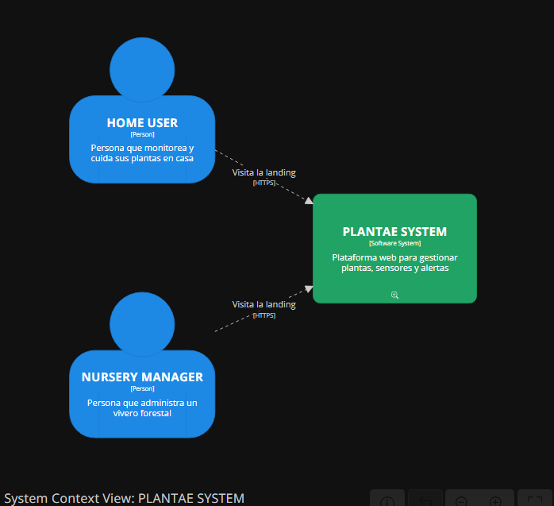

### 4.6.3. Software Architecture Container Diagrams

Conatiner Diagram 

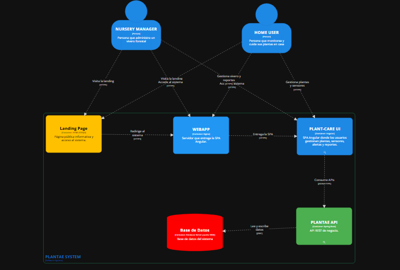

### 4.6.4. Software Architecture Components Diagrams

Component Diagram: Web Service

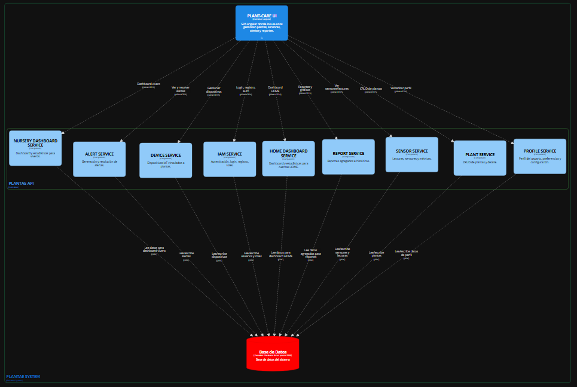

Component Diagram: UI-PlantaE

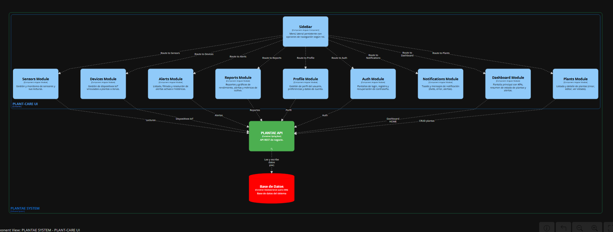

## 4.7. Software Object-Oriented Design

### 4.7.1. Class Diagrams

## 4.8. Database Design

### 4.8.1. Database Diagrams

