# Capítulo IV: Product Design

## 4.1. Style Guidelines

Overview: El diseño web es un componente esencial de PlantaE. Debe reflejar la esencia de la sostenibilidad urbana, transmitiendo cercanía, confianza y armonía con la naturaleza. La interfaz debe ser clara, ligera y fácil de procesar para todo tipo de usuarios, desde hogares hasta viveros, priorizando siempre la accesibilidad y la experiencia intuitiva.

Brand Name: PlantaE simboliza el vínculo entre las personas y el cuidado de la naturaleza en entornos urbanos. El nombre evoca vida, crecimiento y sostenibilidad, reforzando la idea de que cada acción, por pequeña que sea, contribuye al bienestar colectivo y a la conservación de las áreas verdes. Representa una comunidad comprometida con el equilibrio ecológico, la innovación y la colaboración.

### 4.1.1. General Style Guidelines

En el diseño de PlantaE, se tomaron decisiones rigurosas para garantizar una experiencia de ususario coherente y efectiva.

**Colores**

PlantaE eligió su paleta de colores centrándose en la armonía visual y la accesibilidad. Cada tono fue seleccionado para cumplir una función específica y así optimizar la experiencia del usuario:

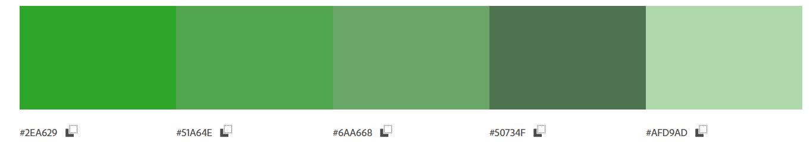

- Verde Cítrico – #2EAG29: Este color transmite energía, acción y máximo dinamismo. En PlantaE, lo utilizamos para incentivar la acción primaria (CTA) en botones importantes como "Añadir Planta" o "Guardar Perfil". Representa la proactividad y el éxito.
- Verde Hoja – #51A64E: Este color simboliza crecimiento y salud. Por ello, lo empleamos estratégicamente en indicadores de estado "saludable" y botones de confirmación importantes. Su intensidad refuerza la identidad de la marca y la sensación de seguridad en la gestión de tus cultivos.
- Verde Musgo – #6AA668: Este color está asociado con la serenidad, estabilidad y equilibrio. Se utiliza en fondos de contenedores y tarjetas para agrupar información de manera visualmente agradable, fomentando una sensación de tranquilidad mientras interactúas con los datos.
- Verde Oliva Oscuro – #50734F: Este color representa profundidad, seriedad y elegancia. Por ello, se usa en los fondos principales de la interfaz para crear un alto contraste con el texto claro y dar un soporte visual robusto y profesional al diseño general.
- Menta Pálido – #AFD9AD: Este color evoca frescura, ligereza y un ambiente abierto. Se utiliza en fondos de página muy claros o como un tono de acento sutil para secciones que requieren máxima claridad y un toque de luminosidad, sin distraer del contenido.

**Tipografía**

Se seleccionó la tipografía "Open Sans" como fuente principal para los títulos (H1 y H2) en estilo Bold para resaltar jerarquía, subtítulos y descripciones en Semi-bold, textos de párrafos en regular para asegurar la legibilidad y notas o captions en ligth para diferenciar información secundaria. Además esta fuente es visualmente agradable y de fácil lectura gracias a sus formas neutrales y abiertas, lo que garantiza una experiencia cómoda y comprensible para el usuario en toda la plataforma.

Para dirigir la atención del usuario de manera efectiva, implementamos una jerarquía tipográfica basada en el tamaño. Esta jerarquía resalta elementos críticos (títulos, botones) con fuentes más grandes y asigna tamaños menores a la información de soporte, lo que resulta en una interacción más intuitiva y una mayor eficiencia en la navegación del producto.

**Branding**

El branding de PlantaE está diseñado para reflejar la innovación, el crecimiento y la sostenibilidad. El logotipo y los íconos adoptan un enfoque que fusiona lo orgánico con lo tecnológico, utilizando una simbología clara que comunica el propósito de la plataforma. El diseño central es una planta que integra circuitos y tecnología en sus hojas y tallo. Este concepto visual representa la gestión inteligente y el monitoreo digital de los cultivos, con una apariencia limpia, moderna y fácilmente reconocible en cualquier entorno digital.

    

**Espaciado**

El diseño de PlantaE implementa una estrategia deliberada de uso del espacio en blanco (whitespace), tanto a nivel macro como micro. Este enfoque es crucial para ofrecer una experiencia de usuario clara y sin fricciones. El espacio negativo no solo aporta valor estético, sino que mejora la comprensión del contenido y dirige la atención del usuario hacia elementos clave, como llamadas a la acción y secciones prioritarias. La interfaz también define un ancho máximo para el contenido, previniendo la fatiga visual. Finalmente, la gestión cuidadosa de los márgenes y los rellenos laterales garantiza una estructura visual armoniosa y una interfaz adaptable a cualquier tamaño de pantalla.

**Dimensiones para el tono de comunicación y lenguaje aplicado**

En PlantaE, definimos cuidadosamente el tono de nuestra comunicación para alinearlo con la misión de nuestra plataforma: digitalizar y optimizar el cuidado de cultivos urbanos y promover la sostenibilidad. Buscamos establecer una conexión cercana y de confianza con nuestro público, que valora la tecnología y el medio ambiente. Nuestro tono de voz busca ser educativo, alentador y profesional, combinando una comunicación clara, accesible y empática.

Optamos por un tono casual, pero experto, que permita a los usuarios (desde el jardinero amateur hasta el vivero) sentirse cómodos al interactuar con funcionalidades clave para el monitoreo y cuidado de sus plantas. Queremos que cada interacción refleje entusiasmo por el crecimiento y confianza en la tecnología. Este equilibrio nos permite inspirar acción y un cuidado responsable, al tiempo que proyectamos confianza y experiencia en el sector de la tecnología ambiental y el IoT. 

Aspectos Clave en el Diseño de PlantaE:
- Consistencia: La coherencia en el diseño es esencial para brindar una experiencia uniforme e intuitiva. Todos los elementos visuales e interactivos de PlantaE (iconografía, paleta de verdes, jerarquía tipográfica) mantienen una línea funcional clara, lo que permite a los usuarios familiarizarse rápidamente con la lectura de datos y operar la plataforma en su día a día.
- Navegación: La estructura de navegación ha sido pensada para ser intuitiva, verde (natural) y ordenada. Los usuarios pueden acceder fácilmente a funciones como monitoreo en tiempo real, historial de datos, configuración de sensores y recomendaciones personalizadas. Los menús son claros y las opciones están organizadas para ahorrar tiempo y facilitar la toma de decisiones sobre riego y fertilización.
- Accesibilidad: La plataforma fue diseñada para adaptarse a todo tipo de usuarios y dispositivos. Desde computadoras hasta tablets o celulares, PlantaE ofrece botones de acción claros, opciones de idioma, y una navegación simplificada, permitiendo a cualquier usuario monitorear sus plantas en ambientes dinámicos o mientras está en movimiento.

**Elementos de Diseño**

Uno de los elementos clave es la línea, utilizada para dividir secciones, delimitar los campos de los formularios o separar las tarjetas de las plantas. Su uso sutil en los bordes y como separador organiza visualmente la interfaz, guiando la lectura de datos y evitando la saturación. El color también cumple un rol fundamental, no solo en la identidad visual de la naturaleza sino en la comunicación funcional. La paleta de verdes (oscuro, medio y brillante) se selecciona por su asociación emocional con el crecimiento, la salud y la tecnología, y su capacidad para transmitir estados como éxito (verde brillante), alerta (rojo) o datos activos.

En cuanto al tamaño, se utiliza jerárquicamente para resaltar títulos, botones de acción y texto de soporte. Los tamaños más grandes, como los títulos de bienvenida o las secciones ("Mis plantas," "Gestión de plantas"), captan la atención en puntos clave de la navegación, mientras que los más pequeños se emplean para detalles secundarios (fechas, tooltips), lo que mejora tanto la comprensión como la eficiencia en la interacción. Por su parte, la textura es sutil, gracias al uso de fondos suaves y planos y los degradados en los botones, los cuales aportan modernidad y enfoque sin distraer de la funcionalidad principal de monitoreo.

El espacio es uno de los elementos más destacados del diseño de PlantaE. Se han implementado márgenes amplios y rellenos generosos dentro y alrededor de las tarjetas (que contienen la información de cada planta), lo que permite una interfaz despejada, fácil de recorrer y cómoda para los usuarios. Esto es esencial para reducir la carga cognitiva al revisar datos en tiempo real. A nivel de valor o brillo (value), se aplican contrastes notables que dan lugar a jerarquías visuales claras: el texto blanco sobre fondos verdes oscuros y los botones verdes brillantes sobre el fondo oscuro se diferencian claramente para guiar al usuario a las acciones de monitoreo y configuración.

Respecto a las formas, se ha optado por geometrías amigables y redondeadas. Los botones y las tarjetas con bordes suaves (border-radius) y los íconos estilizados (como la planta en el header) no solo mejoran la estética, sino que también transmiten accesibilidad, orden y modernidad. Estas formas se alinean con la imagen de una herramienta tecnológica funcional pero cercana a la naturaleza.

**Principios de Diseño**

En cuanto a los principios de diseño, el contraste se emplea para asegurar que los elementos más importantes, como el botón de "Ingresar" o los indicadores de alerta de los sensores, sean claramente visibles sobre el fondo. Este principio es clave en la accesibilidad visual y para la rápida toma de decisiones. La repetición de colores, las formas redondeadas y la iconografía refuerza la familiaridad y la consistencia del sistema visual, haciendo que los usuarios comprendan rápidamente la función de cada componente.

La alineación contribuye a la profesionalidad y al orden del diseño: los formularios, encabezados y listas de gestión (como la tabla de sensores) mantienen una disposición coherente y clara, lo que facilita la navegación intuitiva. Por último, el principio de proximidad agrupa de manera lógica los elementos relacionados (como el nombre de la planta y su tipo, o los sensores y sus alertas), mejorando la lectura, la interacción y la comprensión de cada bloque de información en la plataforma.

Estos elementos y principios no se aplican de forma aislada, sino como parte integral de un sistema visual que busca ser funcional, estético y coherente con la misión de PlantaE: facilitar la gestión inteligente de cultivos a través de una experiencia clara, empática y eficiente.

### 4.1.2. Web Style Guidelines

***PlantaE*** se compromete a ofrecer una interfaz digital que no solo sea visualmente atractiva, sino también funcional y adaptable a distintos dispositivos. La prioridad está en la usabilidad, la accesibilidad y la coherencia visual, garantizando que cada usuario pueda interactuar con la aplicación de manera intuitiva y sin barreras. Estos lineamientos buscan asegurar una experiencia unificada, fresca y eficiente, en armonía con los valores de sostenibilidad y conexión con la naturaleza que inspiran al proyecto.

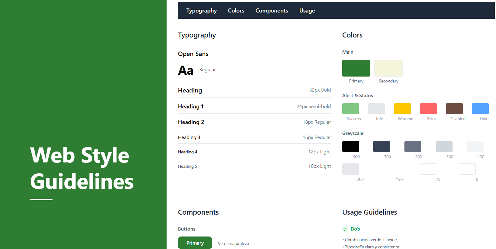

## 4.2. Information Architecture

### 4.2.1. Organization Systems

En **PlantaE**, el sistema de organización de la información combina enfoques jerárquicos, secuenciales y categóricos para optimizar la experiencia de los distintos tipos de usuarios: hogares urbanos y viveros comerciales. Su propósito es facilitar la navegación, reducir la carga cognitiva y priorizar los contenidos más relevantes según el contexto de uso.

A nivel de la **landing page**, se emplea una organización **jerárquica** que guía al usuario desde la propuesta de valor hasta la acción final. Los elementos se disponen visualmente de forma progresiva: encabezado con logotipo y menú principal, sección hero con mensaje clave y llamada a la acción, beneficios principales, funcionamiento del sistema IoT, testimonios y registro. Esta estructura responde a un patrón de lectura en “Z”, que favorece la comprensión inmediata y conduce naturalmente a los botones de conversión.

En los flujos internos de la **web application**, se aplica una organización **secuencial**, orientada a tareas. Los procesos siguen una lógica paso a paso, desde el registro de plantas y sensores IoT hasta la consulta de métricas, generación de reportes y descarga de resultados. Este enfoque asegura que el usuario pueda realizar acciones sin ambigüedades ni interrupciones, manteniendo una progresión cognitiva clara.

Asimismo, se utiliza una organización **categórica por tipo de usuario**, diferenciando el acceso y contenido según el perfil. Los usuarios domésticos visualizan información simplificada sobre sus plantas (estado, humedad, alertas), mientras que los viveros comerciales acceden a paneles especializados con métricas históricas, variables críticas y reportes de rendimiento. Esta categorización garantiza que cada grupo reciba información relevante a su nivel de gestión.

Finalmente, la organización **visual y cromática** mantiene coherencia con los principios de sostenibilidad del proyecto. Los tonos verdes, beige y tierra segmentan visualmente las secciones, reforzando la conexión con la naturaleza y facilitando la orientación del usuario. Esta integración entre jerarquía visual y arquitectura de información permite que PlantaE comunique de manera efectiva su identidad ecológica, tecnológica y accesible.

### 4.2.2. Labeling Systems

A continuación, se presenta el sistema de etiquetado (labeling system) diseñado para la plataforma **PlantaE**.  
Este sistema busca garantizar una comunicación clara, coherente y accesible en todos los puntos de interacción, tanto en la **Landing Page** como en la **Aplicación Web**.  
Las etiquetas fueron definidas bajo principios de **claridad semántica, consistencia visual y tono cercano**, manteniendo coherencia con la identidad ecológica y tecnológica del producto.

El objetivo principal es minimizar la carga cognitiva de los usuarios —ya sean hogares o viveros comerciales— facilitando la comprensión de las funciones, la navegación entre secciones y el acceso a información relevante.

---

#### **Landing Page**

- **Home:** Sección principal de bienvenida que introduce la propuesta de valor de PlantaE. Incluye un mensaje destacado sobre el monitoreo inteligente de plantas con tecnología IoT, acompañado de un call to action (“Descubre más”), el logotipo y la barra de navegación.  
- **Nosotros:** Presenta una breve descripción de EcoTech como startup universitaria enfocada en sostenibilidad urbana. Se explica el propósito del proyecto y cuál es el compromiso con el cuidado inteligente de plantas y cultivos urbanos.  
- **Servicios:** Muestra los servicios principales que ofrece PlantaE mediante tarjetas informativas con iconos y descripciones. Incluye: Monitoreo en Tiempo Real, Alertas de Riego, Recomendaciones IA, etc.    
- **Video – About the Product:** Sección demostrativa donde se incluye un video que permite conocer cómo funciona PlantaE en acción. Presenta la interfaz del sistema y explica visualmente el flujo del producto.  
- **Testimonios:** Tarjetas con opiniones reales de usuarios que validan la efectividad del sistema. Incluyen nombre, rol del usuario y valoración, destacando beneficios como reducción de pérdidas, aumento de productividad y facilidad de monitoreo.
- **Contacto:** Pie de página con información institucional y enlaces directos. Incluye: Descripción breve de PlantaE, Enlaces a servicios, Información de la empresa, etc.

---

#### **Aplicación Web – Usuarios Domésticos**

- **Inicio:** Vista inicial del vivero después de iniciar sesión.
- **Dashboard:** Panel con la visión general del vivero y métricas principales.
- **Plantas:** Listado completo de plantas registradas en el vivero.
- **Sensores:** Panel para visualizar sensores IoT asociados.
- **Dispositivos:** Gestión de dispositivos IoT instalados en el vivero.
- **Vivero:** Módulo exclusivo del rol vivero (gestión de áreas, espacios o administración específica del vivero).
- **Gestión:** Herramientas para organizar, editar y administrar plantas o configuraciones operativas avanzadas.
- **Alertas:** Panel de notificaciones ambientales y advertencias importantes.
- **Reportes:** Análisis gráficos, estadísticas y reportes del vivero.
- **Perfil:** Área de información personal y configuración de la cuenta del vivero.

---

#### **Aplicación Web – Viveros Comerciales**

- **Inicio:** Pantalla inicial del usuario doméstico.
- **Dashboard:** Vista resumida del estado general de sus plantas.
- **Plantas:** Listado de plantas registradas.
- **Sensores:** Visualización de sensores IoT asociados.
- **Dispositivos:** Gestión de dispositivos IoT conectados.
- **Gestión:** Herramientas para organizar o editar plantas del usuario.
- **Alertas:** Panel de notificaciones y advertencias ambientales.
- **Reportes:** Vista con estadísticas e historial del estado de sus plantas.
- **Perfil:** Datos personales y ajustes básicos del usuario.

### 4.2.3. SEO Tags and Meta Tags

**1. Landing Page**

**Charset**

    `<meta charset="utf-8">`
 
Indica al navegador cómo interpretar los caracteres del texto. UTF-8 garantiza la correcta visualización de letras con tildes, la “ñ” y otros símbolos, evitando errores de lectura.

**Viewport (responsive)**

    `<meta name="viewport" content="width=device-width, initial-scale=1">`

Permite que la página se adapte al tamaño de cualquier pantalla, asegurando una experiencia responsiva en móviles, tablets y equipos de escritorio.

**Title (SEO)**

    `<title>PlantaE | Monitorea tus cultivos urbanos con IoT</title>`

Define el título que se muestra en la pestaña del navegador y en los resultados de búsqueda, destacando el propósito principal de la plataforma.

**Meta Description (SEO)**

    `<meta name="description" content="Supervisa tus cultivos urbanos en tiempo real con sensores IoT. Recibe alertas y recomendaciones personalizadas para reducir el uso de agua y mantener tus plantas saludables.">`

Proporciona un resumen breve y atractivo del contenido del sitio, ayudando a captar la atención de los usuarios en buscadores.

**Meta Author**

    `<meta name="author" content="Equipo PlantaE">`

Esta línea de código identifica a los autores o responsables del desarrollo del sitio web.

**Meta Robots**

    `<meta name="robots" content="index, follow">`
    
Permite que los motores de búsqueda indexen el contenido y sigan los enlaces del sitio, favoreciendo su posicionamiento.

**Meta Language**

    `<meta name="language" content="es">`
    
Especifica el idioma principal del contenido, ayudando a su correcta interpretación por navegadores y buscadores.

**Meta Copyright**

    `<meta name="copyright" content="PlantaE 2025">`
    
Declara los derechos de autor sobre el contenido y establece el año de publicación.

**2. Web Application (Frontend)**

**Charset**

    `<meta charset="utf-8">`
    
Garantiza que los textos y símbolos del panel interno se muestren correctamente en todos los navegadores.

**Viewport (responsive)**

    `<meta name="viewport" content="width=device-width, initial-scale=1">`

Permite que la interfaz del dashboard sea responsiva, manteniendo la legibilidad en diferentes dispositivos.

**Title (identificación de módulo)**

    `<title>PlantaE App | Panel de monitoreo</title>`

Define el título visible en la pestaña del navegador, identificando claramente el entorno de gestión de la aplicación.

**Meta Description**

    `<meta name="description" content="Panel interno de PlantaE para monitorear métricas, alertas y sensores IoT. Acceso solo para usuarios autorizados.">`

Resume la finalidad de la aplicación, facilitando su identificación en herramientas de desarrollo o enlaces compartidos.

**Meta Author**

    `<meta name="author" content="Equipo PlantaE">`

Reconoce al equipo de desarrollo responsable de la aplicación web.

**Meta Robots (privacidad)**

    `<meta name="robots" content="noindex, nofollow">`

Evita que los buscadores indexen o sigan los enlaces del panel interno, protegiendo la información privada de los usuarios.

**Meta Language**

    `<meta name="language" content="es">`

Declara el idioma principal de la aplicación, contribuyendo a la accesibilidad y coherencia lingüística.

**Meta Copyright**

    `<meta name="copyright" content="PlantaE 2025">`
    
Establece los derechos de autor sobre el software y su año de creación.

### 4.2.4. Searching Systems

El sistema de búsqueda de PlantaE está diseñado para ser claro, ligero y de fácil procesamiento, priorizando la eficiencia en la localización de datos para ambos segmentos de usuarios.

**Vista para los hogares urbanos**

##### 1. Medios de ayuda para la búsqueda de datos

- Barra de búsqueda principal en los módulos de monitoreo y el dashboard.
- Autocompletado inteligente: Muestra sugerencias de nombres de plantas registrados por el usuario y tipos de cultivo.
- Historial de búsquedas recientes: Acceso rápido a las plantas o sensores monitoreados recientemente.
- Mensajes contextuales si no se encuentran resultados: Ofrece una sugerencia de acción clara.

##### 2. Filtros y opciones

Los filtros permiten segmentar la búsqueda por criterios de estado y clasificación:

- Por Nombre de la Planta
- Por Tipo de Cultivo
- Por Ubicación/Área
- Por Estado de Alerta:
    - Saludable (Verde)
    - En Observación (Amarillo)
    - Alerta Crítica (Rojo)
- Por Tipo de Sensor Conectado

##### 3. Visualización de resultados

Los resultados se visualizan de manera intuitiva y visualmente jerárquica:

- Tarjetas con vista de Grid
    - Información en la tarjeta: Nombre, Tipo de planta, Foto y Última revisión.
    - Alertas: Indicador circular de color junto a la "Última revisión".
- Filas en la Vista de Gestión
    - Filas con: Nombre, Sensor, Alerta, Reporte.
    - Alerta: Círculo de color (Rojo/Amarillo/Verde) para identificación inmediata.
    - Botón de acción rápida: Link "Ver reporte" para acceder a detalles.

**Vista de viveros comerciales**

##### 1. Medios de ayuda para la búsqueda de datos

- Buscador centralizado para los módulos "Inventario de Lotes" y "Gestión de Clientes"
- Autocompletado especializado: Ofrece sugerencias de códigos de lote, nombres de clientes o especies a nivel de producción.
- Filtros persistentes en la barra lateral para alternar entre la gestión de Lotes/Stock.

##### 2. Filtros y opciones

Los filtros permiten segmentar el inventario y la producción a nivel masivo:

- Por nombre de la Especie/Variedad
- Por lote de Siembra/ID de Área
- Por estado de Inventario/Stock
- Por métrica crítica:
    - Humedad Baja Extrema (Requiere riego masivo).
    - Temperatura Extrema (Requiere ventilación/calefacción de lote).
    - pH Anormal (Requiere ajuste de solución nutritiva).
    - Sensor Desconectado (Alerta de sistema de infraestructura).
- Por Fecha de Cosecha.

##### 3. Visualización de resultados

El formato es tabular, priorizando la densidad de información y la gestión de métricas agregadas.

- Contenido de Resultados:
    - Código de lotes o especie
    - Tipo de especie 
    - Cantidad de stock
    - Alerta promedio de sensores
    - Edad promedio
- Colores de Estado:
    - Verde: Producción Saludable
    - Amarillo: Lote con Monitoreo
    - Rojo: Riesgo Crítico en Lote

### 4.2.5. Navigation Systems

La navegación principal de la aplicación web está diseñada para una interacción directa y eficiente. Los controles se ubican en una barra horizontal superior fija y persistente que proporciona acceso inmediato a las áreas operacionales fundamentales: Dashboard, Mis Plantas, Gestión de Plantas y el área de Ajustes. La estructura interna del contenido se gestiona mediante filtros y botones de acción, siendo el botón "Añadir plantas" el principal elemento de interacción.

En el Landing Page, el flujo de usuario se establece principalmente a través del desplazamiento vertical (scroll), construyendo una experiencia narrativa que expone la propuesta de valor y los beneficios del producto. La barra de navegación superior utiliza enlaces ancla para dirigir al visitante a secciones informativas específicas (como Benefits o Testimonials). La finalidad de este recorrido es conducir a la audiencia hacia los Call to Actions (CTAs) finales de registro.

La navegación del sistema se diferencia de forma consciente según el perfil de usuario. El Jardinero Amateur sigue un recorrido simplificado que se enfoca en su lista de "Mis Plantas" y el monitoreo individual. En contraste, el Gestor Profesional (Vivero) accede a módulos especializados donde se requiere una Barra Lateral Fija para visualizar la gestión de Lotes/Stock, optimizando así su recorrido para tareas complejas y de gran volumen.

## 4.3. Landing Page UI Design

### 4.3.1. Landing Page Wireframe
A continuación, se presentan los wireframes de las principales secciones de la landing page. Cada imagen ilustra el diseño propuesto para las diferentes funcionalidades, flujos de navegación y elementos de interacción de la plataforma.

Wireframe:

En esta primera sección se presenta la pantalla Home de la landing page.

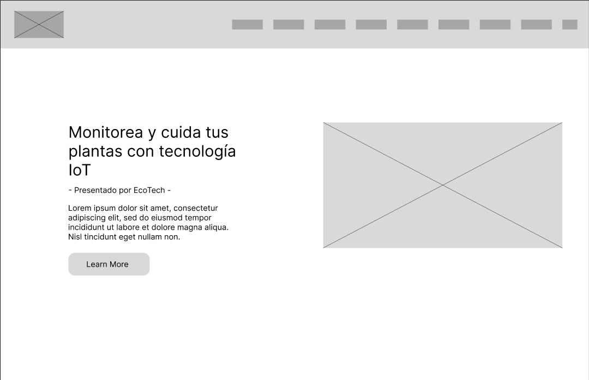

Se presenta la sección de propuesta de who are we:

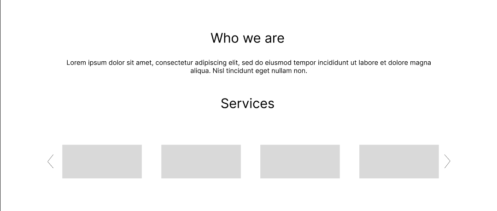

Se presenta la sección de propuesta de Services:

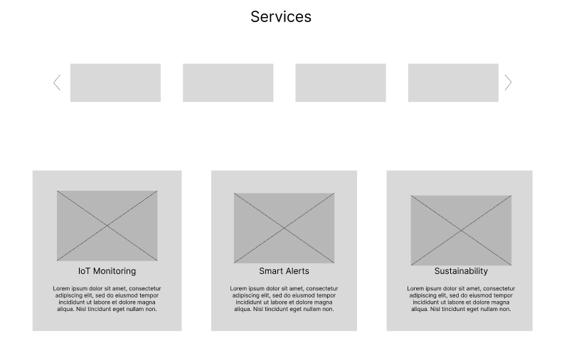

Se presenta la sección de propuesta de Benefits:

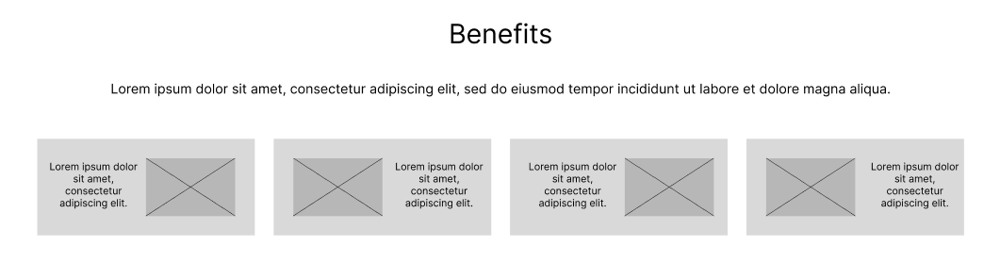

Se presenta la sección de propuesta de Testimonials:

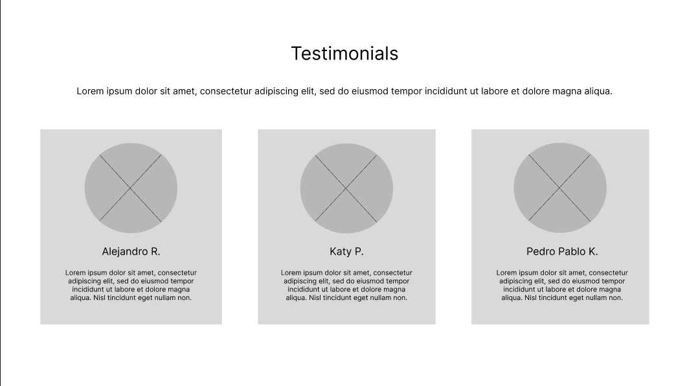

Se presenta la sección de propuesta de Frequently Asked Questions:

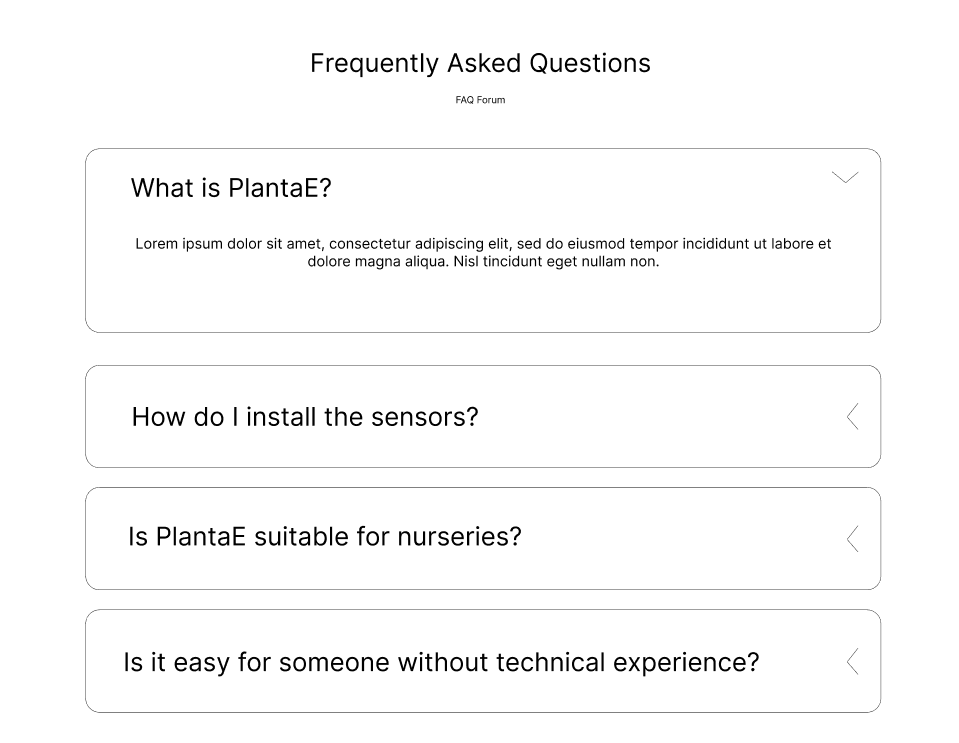

Se presenta la sección de propuesta de Contact:

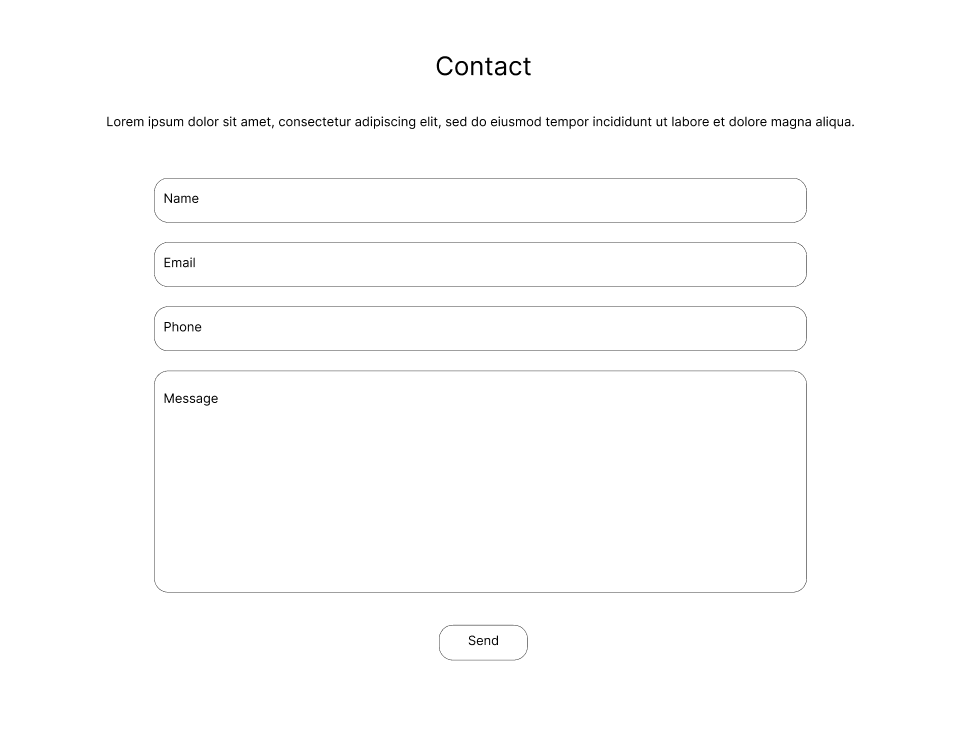

Se presenta la sección de propuesta de Download:

Se presenta la sección de propuesta de Footer:

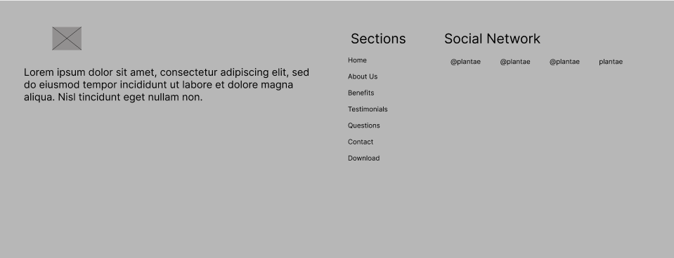

### 4.3.2. Landing Page Mock-up

Wireflow:

En esta primera sección se presenta la pantalla Home de la landing page.

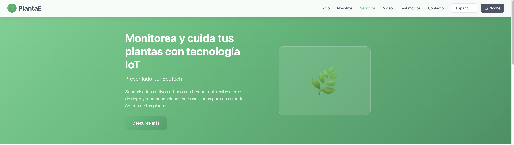

Se presenta la sección de quienes somos:

Se presenta la sección de propuesta de Services:

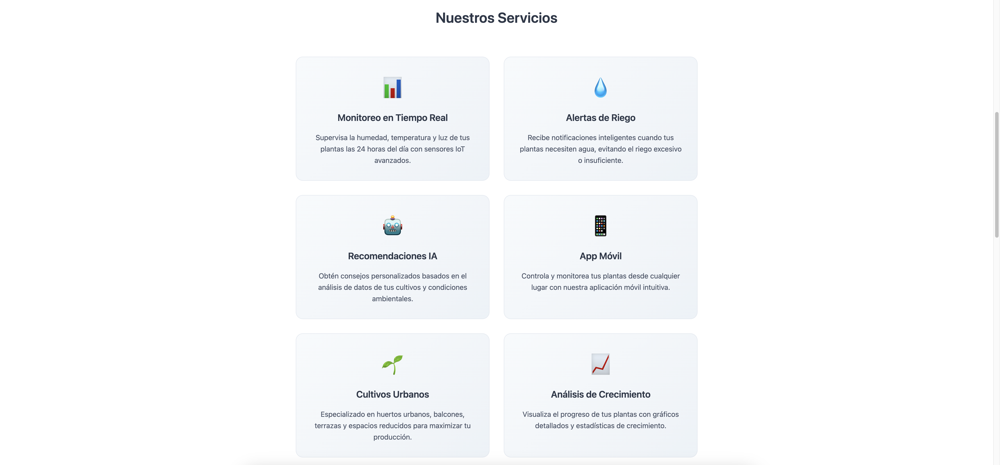

Se presenta la sección de propuesta de About the product:

Se presenta la sección de propuesta de Testimonials:

Se presenta la sección de propuesta de Contact:

## 4.4. Web Applications UX/UI Design

### 4.4.1. Web Applications Wireframes

### 4.4.2. Web Applications Wireflow Diagrams

### 4.4.3. Web Applications Mock-ups

### 4.4.4. Web Applications User Flow Diagrams

## 4.5. Web Applications Prototyping

## 4.6. Domain-Driven Software Architecture

### 4.6.1. Design-Level Event Storming

### 4.6.2. Software Architecture Context Diagram

### 4.6.3. Software Architecture Container Diagrams

### 4.6.4. Software Architecture Components Diagrams

## 4.7. Software Object-Oriented Design

### 4.7.1. Class Diagrams

## 4.8. Database Design

### 4.8.1. Database Diagrams
