# Capítulo V: Product Implementation, Validation & Deployment

## 5.1. Software Configuration Management.

### 5.1.1 Software Development Environment Configuration

A continuación, se listan las herramientas y estándares adoptados por el equipo para el desarrollo colaborativo del sistema:

| Actividad               | Herramienta / Guía    | Propósito                                                    | Tipo de acceso / Ruta                    |
| :---------------------- | :-------------------- | :----------------------------------------------------------- | :--------------------------------------- |
| Project Management      | Trello                | Seguimiento de backlog, tareas y sprints.                    | https://trello.com/                      |
| Requirements Management | Gherkin Conventions   | Escritura legible de requisitos con formato Given/When/Then. | https://cucumber.io/docs/gherkin/        |
| Product UX/UI Design    | Figma                 | Prototipos y diseño responsive.                              | https://figma.com                        |
| Landing Page            | HTML, CSS, JavaScript | Construcción del Landing Page del sistema.                   | https://code.visualstudio.com            |
| Version Control         | Git + GitHub          | Gestión colaborativa del código fuente.                      | https://github.com                       |
| Software Deployment     | Github pages          | Despliegue continuo del sistema en ambientes de testing.     | https://railway.app / https://render.com |

## Landing Page Development

Ruta de referencia:

- Link oficial de Github: https://github.com
- Link oficial de Angular: https://angular.io/
- Link oficial de Tailwind CSS: https://tailwindcss.com/
- Link oficial de Astro: https://astro.build/
- Link oficial de la documentación de Mozilla para HTML: https://developer.mozilla.org/es/docs/Web/HTML
- Link oficial de la documentación de Mozilla para CSS: https://developer.mozilla.org/es/docs/Web/CSS
- Link oficial de la documentación de Mozilla para TypeScript: https://www.typescriptlang.org/docs/
- Link oficial de la documentación de Mozilla para Java: https://docs.oracle.com/en/java/
- Link oficial de Spring Boot: https://spring.io/projects/spring-boot
- Link oficial de Visual Studio Code: https://code.visualstudio.com/

## Frontend Web Applications Development

Ruta de referencia:

- Link oficial de Github: https://github.com
- Link oficial de Angular: https://angular.io/
- Link oficial de la documentación de Mozilla para HTML: https://developer.mozilla.org/es/docs/Web/HTML
- Link oficial de la documentación de Mozilla para CSS: https://developer.mozilla.org/es/docs/Web/CSS
- Link oficial de la documentación de Mozilla para TypeScript: https://www.typescriptlang.org/docs/
- Link oficial de IntelliJ IDEA: https://www.jetbrains.com/idea/

## Backend Development

Ruta de referencia:

- Link oficial de Github: https://github.com
- Link oficial de la documentación de Oracle para Java: https://docs.oracle.com/en/java/
- Link Oficial de la documentación de Spring Boot: https://spring.io/projects/spring-boot
- Link oficial de Spring Boot: https://spring.io/projects/spring-boot
- Link oficial de IntelliJ IDEA: https://www.jetbrains.com/idea/

## Diseño UX/UI de Producto
En cuanto al diseño de experiencia de usuario, usamos UXPressia para crear y compartir documentos como user personas, mapas de empatía y journey maps, lo que ayudó a nuestro equipo a entender mejor a los usuarios y validar las ideas antes de empezar la implementación.

Ruta de Referencia: https://uxpressia.com/

### 5.1.2. Source Code Management

En esta sección el equipo establece los medios y esquema de organización que aplicará para el seguimiento de modificaciones. Para ello se utilizará **GitHub** como plataforma y sistema de control de versiones.

A continuación se indican los URLs de los repositorios de GitHub para cada producto:

#### Repositorio de github - Landing Page de PlantaE

- **Landing Page**: https://github.com/PlantaE-open-sorce/PlantaE-landing

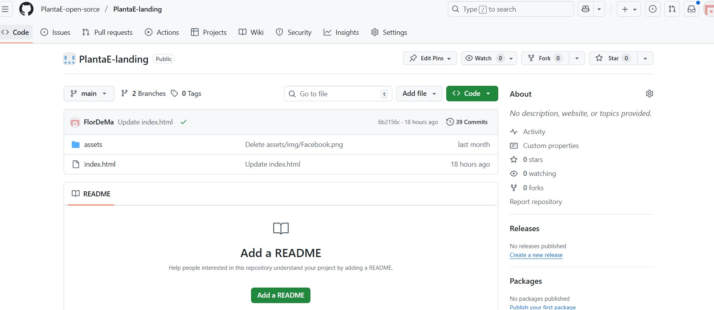

#### Repositorio de github - Frontend de PlantaE

- **Frontend**: https://github.com/PlantaE-open-sorce/PlantaE-landing
  
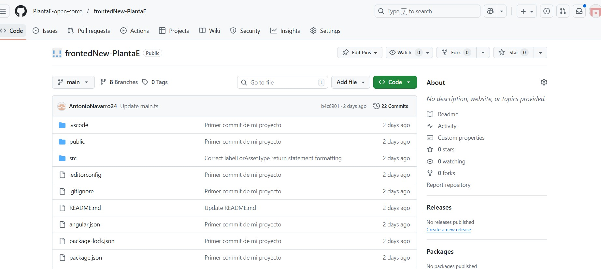

#### Repositorio de github - Backend de PlantaE

- **Bckend**: https://github.com/PlantaE-open-sorce/PlantaE-landing
  
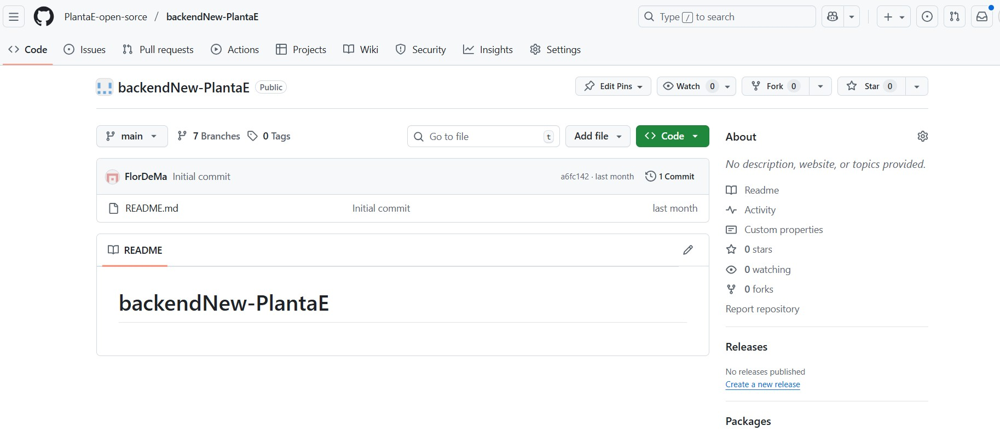

#### GitFlow Workflow

Se implementará el modelo de ramificación propuesto por Vincent Driessen en su artículo *“A successful Git branching model”*, conocido como **GitFlow**. Este modelo organiza el trabajo en las siguientes ramas:

- `main`: Rama principal, contiene siempre el código en producción.
- `develop`: Rama de desarrollo principal, donde se integran las funcionalidades antes de pasar a producción.
- `feature/*`: Ramas creadas a partir de `develop` para desarrollar nuevas funcionalidades.**Convención de nombres:** `feature/<nombre-corto-descriptivo>`_Ejemplo: `feature/login-auth`_
- `release/*`: Ramas creadas desde `develop` cuando se prepara una nueva versión para producción.**Convención de nombres:** `release/<versión>`_Ejemplo: `release/TB1`_

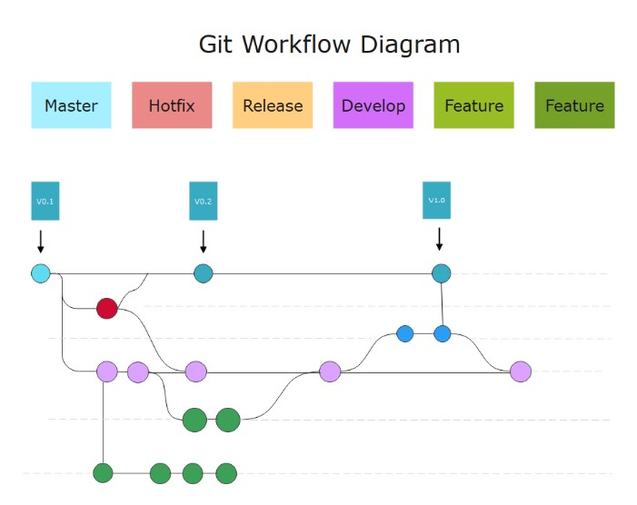

#### Versionado Semántico

Se aplicará el esquema de **Semantic Versioning 2.0.0**, con el siguiente formato:

- **MAJOR**: Incompatibilidades en la API.
- **MINOR**: Nuevas funcionalidades sin romper compatibilidad.
- **PATCH**: Correcciones de errores menores y ajustes sin afectar funcionalidades.

_Ejemplo de versión:_ `v1.3.2`

#### Convenciones de Commits

Se utilizará el estándar de **Conventional Commits** para los mensajes de commits. Esto facilitará la automatización en los procesos de integración continua y generación de changelogs.

**Ejemplos:**

- `feat: add login functionality`
- `fix: correct null pointer exception on user service`
- `chore: update dependencies`

### 5.1.3. Source Code Style Guide & Conventions.

### Landing Page:
**Resumen:** Como principales tecnologías, usaremos Astro, Tailwind CSS, HTML y TypeScript. Componentes pequeños y tipados, comunicación clara por props, y estilos utilitarios y organizados.
| **Tecnología** | **Convenciones principales** | **Convenciones para código** |
|---|---|---|
| **Tailwind CSS** | - Usar solo clases utilitarias de Tailwind. - Ordenar clases en bloques: Layout → Box Model → Tipografía → Colores/Fondos → Otros. - Mantener legibilidad en clases largas. | - Usar `@apply` para estilos reutilizables. - Evitar clases condicionales en el HTML. - Usar clases de estado (hover, focus, etc.) en lugar de JavaScript para interacciones simples.  - Mantener la estructura de carpetas organizada y coherente.  - Reutilizar el máximo de clases de tailwind. |
| **HTML** | - Usar etiquetas semánticas (`header`, `main`, `section`, etc.). - Indentación de 2 espacios. - Atributos entre comillas dobles `"`. - Orden de atributos: `id`, `class` → accesibilidad (`aria-*`) → funcionales (`src`, `href`, `alt`). - Nombres en kebab-case (`main-section`). | - Mantener el HTML limpio y libre de código comentado. - Usar comentarios para secciones complejas o importantes.  - Usar `data-*` atributos para información adicional.  - Evitar el uso de inline styles. |
| **TypeScript** | - Variables/funciones en `camelCase`. - Clases/interfaces en `PascalCase`. - Constantes en `UPPER_SNAKE_CASE`. - Tipado obligatorio en variables, parámetros y retornos. - Ordenar imports de externos a internos. | - Usar `readonly` para propiedades que no deben cambiar. - Preferir funciones puras y evitar efectos secundarios.  - Usar destructuración para extraer valores de objetos y arrays. |
| **Astro** | - Archivos `.astro` en `PascalCase`. - Orden del archivo: frontmatter → HTML/JSX → estilos `\<style>`. - Props siempre tipadas con TypeScript. - Importaciones cortas y claras. - Componentes pequeños y reutilizables. | - Mantener la lógica de los componentes en el archivo `.astro` y evitar la lógica compleja en el frontmatter. - Usar `Astro.fetch` para obtener datos de manera eficiente.  - Utilización de props para comunicación entre componentes. |

### Front-End:

**Resumen:** Como principales tecnologías, usaremos Vue.js, HTML, JavaScript y CSS. Componentes pequeños y tipados, comunicación clara por props/emits, y manejo de estado y APIs mantenible.

| **Tecnología** | **Convención** | **Convenciones para código** |
|----------------|----------------|------------------------------|
| **HTML5** | Uso semántico de etiquetas (`header`, `main`, `section`, `footer`). Atributos en comillas dobles. Indentación de 2 espacios. | - Mantener el HTML limpio y libre de código comentado. - Usar comentarios para secciones complejas o importantes.  - Usar `data-*` atributos para información adicional.  - Evitar el uso de inline styles. |
| **CSS3** | Estilos modulares y reutilizables. Variables globales para colores/tipografía. Evitar `!important`. | - Usar BEM (Block Element Modifier) para nombrar clases. - Mantener la especificidad baja y evitar selectores complejos. - Utilizar preprocesadores como SASS o LESS si es necesario. |
| **TypeScript** | - Variables/funciones en `camelCase`. - Clases/interfaces en `PascalCase`. - Constantes en `UPPER_SNAKE_CASE`. - Tipado obligatorio en variables, parámetros y retornos. - Ordenar imports de externos a internos. | - Usar `readonly` para propiedades que no deben cambiar. - Preferir funciones puras y evitar efectos secundarios.  - Usar destructuración para extraer valores de objetos y arrays. |
| **Angular** | - Componentes en `PascalCase`. - Servicios en `camelCase`. - Módulos en `PascalCase`. - Uso de `@Input` y `@Output` para comunicación entre componentes. | - Mantener los componentes pequeños y enfocados en una sola responsabilidad. - Utilzación de nuevas directivas como @if, @for o @else de Angular versión 20. - No utilizar NgModules por nuevas recomendaciones de Angular versión 20. |

### Back-End:

**Resumen:** Como principales tecnologías, C# y .NET. Como principales tecnologías, se utilizarán C# y .NET, enfocándose en un código limpio, seguro y mantenible bajo buenas prácticas de arquitectura, nomenclatura, validación, seguridad y pruebas.

| **Tecnología** | **Convención** | **Convenciones para código** |
|----------------|----------------|------------------------------|
| **Java** | Lenguaje principal. Usar sintaxis moderna (Java 17+), convenciones de nomenclatura estándar de Oracle, y programación orientada a objetos junto con patrones modernos (Streams, Optional, records, etc.). | - Mantener el código limpio y bien estructurado. - Usar comentarios para explicar la lógica compleja. - Seguir las convenciones de nomenclatura de Oracle. |
| **Spring Boot** | Framework principal para el backend. Uso de **arquitectura en capas** (API, Application, Domain, Infrastructure). Enfoque en modularidad, mantenibilidad y soporte multiplataforma. | - Seguir las mejores prácticas de diseño de API REST. - Utilizar anotaciones de validación para entradas de usuario. - Implementar manejo de errores y excepciones de manera consistente. |
| **Maven** | Herramienta de gestión y construcción del proyecto. Uso de un `pom.xml` bien estructurado para gestionar dependencias, plugins y perfiles de construcción. | - Mantener una estructura de proyecto coherente y organizada. - Utilizar versiones específicas de dependencias para evitar conflictos. - Documentar la configuración del `pom.xml` para facilitar su comprensión. |
| **JPA/Hibernate** | Framework de mapeo objeto-relacional. Uso de anotaciones para definir entidades, relaciones y consultas. Enfoque en la eficiencia y optimización de acceso a datos. | - Definir entidades claras y bien estructuradas. - Utilizar consultas JPQL o Criteria API para operaciones complejas. - Implementar estrategias de caché para mejorar el rendimiento. |
| **Swagger** | Generación automática de documentación de la API REST. Versionado claro (`/api/v1`, `/api/v2`) y contratos visibles para clientes externos. | - Incluir ejemplos de solicitudes y respuestas en la documentación. - Mantener la documentación actualizada con los cambios en la API. - Utilizar herramientas de generación de documentación para automatizar el proceso. |

### 5.1.4. Software Deployment Configuration

Esta sección detalla los pasos necesarios para desplegar de forma satisfactoria los productos digitales que componen la solución: el landing page.

**1. Landing Page - HTML, CSS y Javascript**

Para que nuestra landing page esté disponible para todos nuestros usuarios, la publicamos como un sitio web utilizando la plataforma de GitHub. El proceso se llevó a cabo de la siguiente manera:

**1. Registro en GitHub**
Creamos una cuenta en GitHub para poder gestionar los repositorios del proyecto y almacenar el código de la Landing Page de PlantaE.

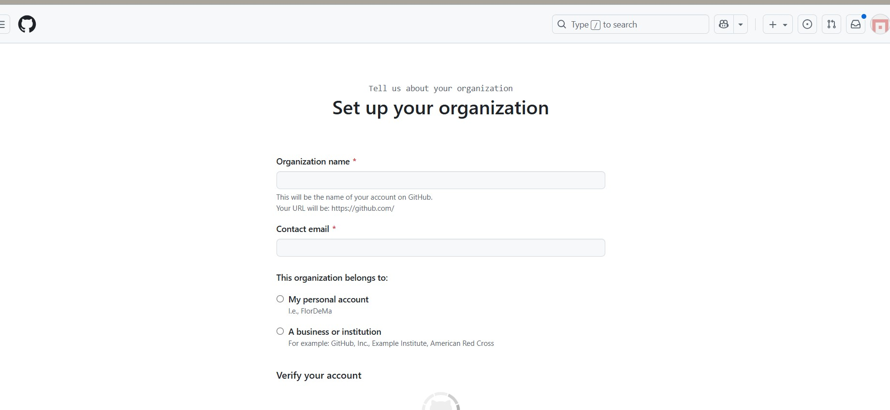

**2. Creación del repositorio**

Hicimos clic en el botón “New” para generar un nuevo repositorio.
Le asignamos el nombre “landing-page” dentro de nuestra organización

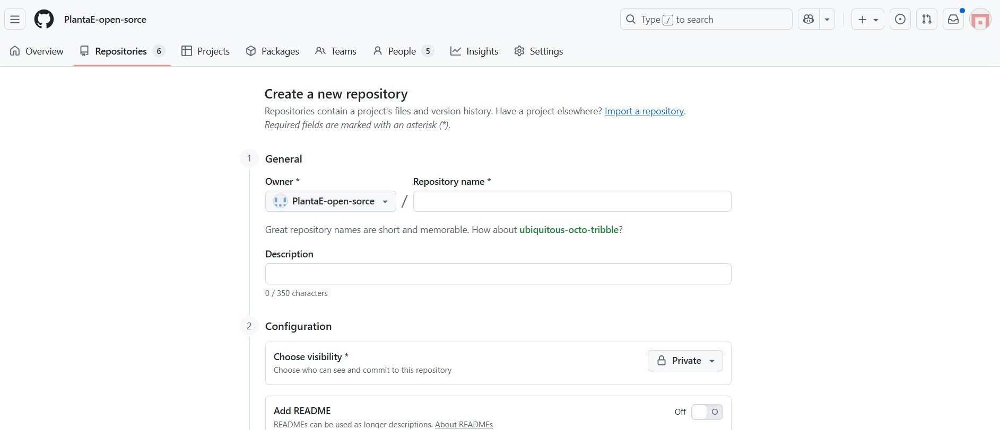

**3. Configuración del repositorio
**
Nos aseguramos de que el repositorio tenga visibilidad pública para permitir la integración con Vercel.
Añadimos un archivo README.md inicial y configuramos un .gitignore adecuado para excluir archivos innecesarios.

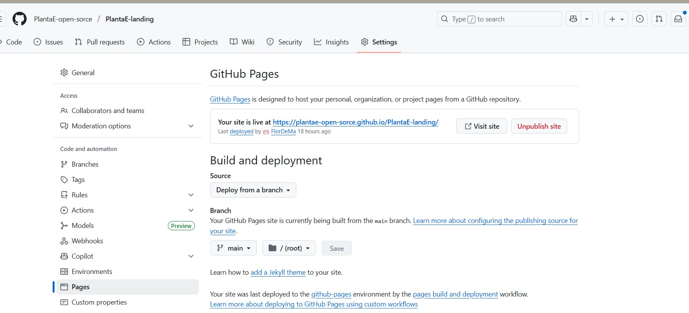

**4. Carga de los archivos de la landing page**

Accedimos al repositorio creado.
Subimos los archivos generados del proyecto (HTML, TailwindCSS, TypeScript, Astro).
Verificamos que los cambios se hicieran en la rama principal (main).
Finalmente, confirmamos la acción con “Commit changes” para guardar los archivos.

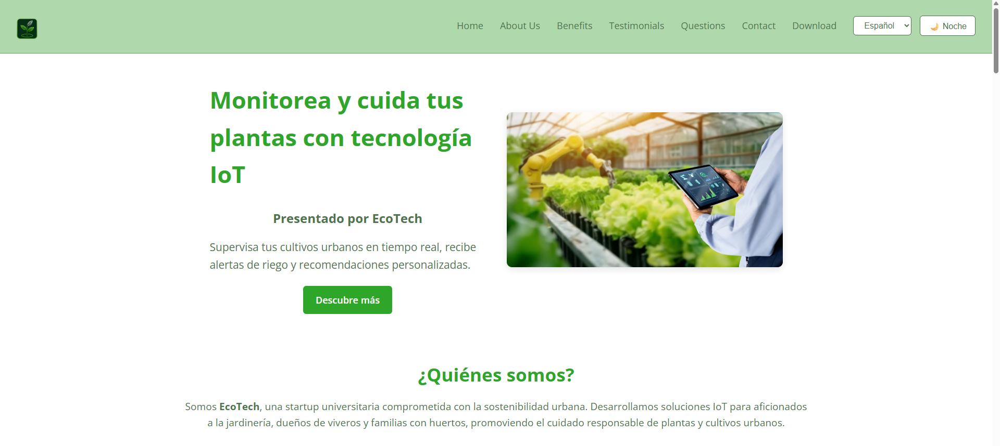

### Despliegue del Frontend Web Applications
Para que nuestra Frontend Web Application esté disponible para todos nuestros usuarios, la publicamos como un sitio web utilizando la plataforma de GitHub. El proceso se llevó a cabo de la siguiente manera: 

**1. Registro en GitHub**
Creamos una cuenta en GitHub para poder gestionar los repositorios del proyecto y almacenar el código de la Frontend Web Application de PlantaE. 

**2. Creación del repositorio**

Hicimos clic en el botón “New” para generar un nuevo repositorio
Le asignamos el nombre “frontend” dentro de nuestra organización PlantaE.

**3. Despliegue en Windows Azure**

Tanto en Frontend como el backend se desplegaron en maquina virtual

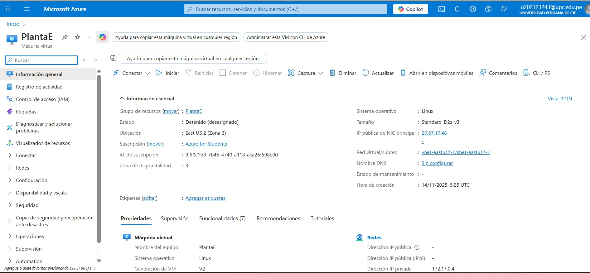

### Despliegue del RESTful Web Services

Para que nuestro RESTful Web Services esté disponible para todos nuestros usuarios, lo desplegamos utilizando Amazon Web Services (AWS) como plataforma de infraestructura en la nube. El proceso se llevó a cabo de la siguiente manera:

Como arquitectura general, el flujo de integración y despliegue continuo se compone de:

**1. Registro en GitHub**

Creamos una cuenta en GitHub para poder gestionar los repositorios del proyecto y almacenar el código del RESTful Web Services de Prime-Fix.

Creamos un repositorio llamado backend dentro de nuestra organización prime-fix.

**2. Base datos en Microsoft Azure**

Creamos una instancia de base de datos en Amazon RDS para almacenar los datos de la aplicación.
Configuramos los parámetros de la base de datos, incluyendo el motor (MySQL, PostgreSQL, etc.), tamaño, y credenciales de acceso.

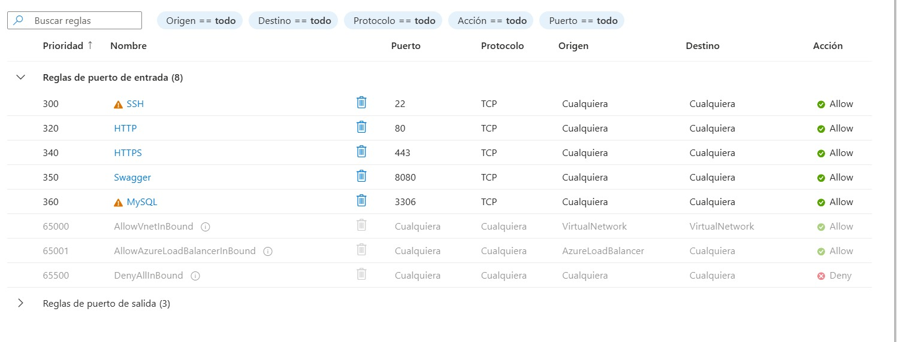

**3. Build en Microsoft Azure C**

Configuramos un proyecto en la maquina virtual  para compilar el código del backend.
Construye la imagen Docker utilizando un archivo Dockerfile que define el entorno de ejecución.
Con todos estos archivos podemos compilar el proyecto de Java v.25 y Spring Boot v.3.5.7

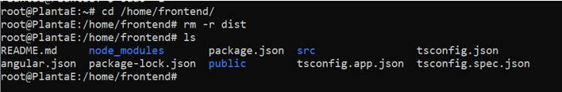

**4. Actualizar la maquina virtual**

Creamos un repositorio en Amazon ECR para almacenar las imágenes Docker del backend.
Configuramos las políticas de acceso para permitir que AWS CodeBuild pueda subir imágenes al repositorio.
Subimos la imagen Docker generada por CodeBuild al repositorio de ECR.

**6. Despliegue en Maquina Virtual**

Configuramos un servicio en Windows Azure para desplegar el springboot del backend.
Configuramos las variables de entorno necesarias para la conexión con la base de datos y otros servicios.
Definimos la configuración de escalado automático para manejar la carga de tráfico.
Finalmente, iniciamos el servicio para que el backend esté disponible públicamente.

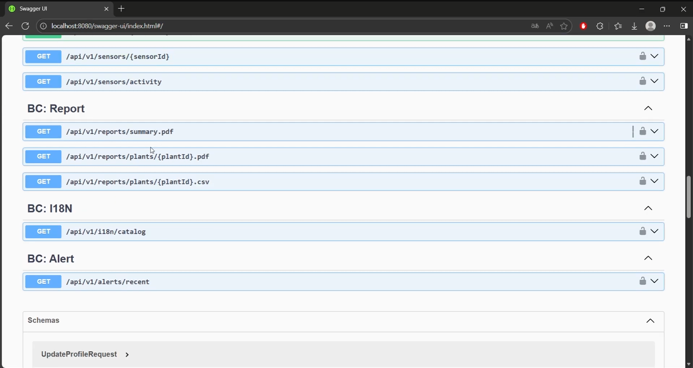

## 5.2. Landing Page, Services & Applications Implementation

### 5.2.1 Sprint 1

#### 5.2.1.1. Sprint Planning 1

A continuación, se presenta la planificación correspondiente a nuestro Sprint 1, el cual tiene como enfoque principal el desarrollo de la landing page de PlantaE. En esta etapa inicial, el equipo definió el objetivo del sprint, seleccionó las historias de usuario más relevantes y estableció los entregables clave que permitirán construir una primera versión funcional y visualmente atractiva de la página. Esta planificación busca asegurar un entendimiento compartido entre todos los miembros del equipo y sentar las bases para comunicar eficazmente el valor de la plataforma a los usuarios potenciales.

| Sprint #                        | Sprint 1                                                                                                                                                             |
| :------------------------------ | :------------------------------------------------------------------------------------------------------------------------------------------------------------------- |
| **Sprint Planning Background**  |                                                                                                                                                                      |
| Date                            | 2025-09-10                                                                                                                                                           |
| Time                            | 19:00 pm (GMT-5)                                                                                                                                                     |
| Location                        | Modalidad remota mediante la plataforma Discord                                                                                                                      |
| Prepared By                     | Contreras Leon, Flor De María                                                                                                                                        |
| Attendees (to planning meeting) | Apaza Bocanegra, Elizabeth Noelia / Contreras Leon, Flor De María / Guillen Galindo, Julio Adolfo / Miraval Pomalaya, Rodrigo Jesus / Navarro Chinga, Antonio Jhair  |
| Sprint 0 Review Summary         | Dado que este es el sprint inicial, no se presenta un resumen del sprint anterior.                                                                                   |
| Sprint 0 Retrospective Summary  | Dado que este es el sprint inicial, no se presenta una retroalimentación del sprint anterior.                                                                        |
| **Sprint Goal & User Stories**  |                                                                                                                                                                      |
| Sprint 1 Goal                   | Nos enfocamos en implementar la estructura principal y las funcionalidades clave de la landing page pública de PlantaE. Creemos que esto aportará una percepción más sólida del producto y despertará mayor interés entre los usuarios potenciales, al comunicar de forma clara el valor y los beneficios de la plataforma. Esto se confirmará cuando los visitantes puedan navegar de manera fluida por la página, comprendan fácilmente qué ofrece PlantaE y muestren intención de interactuar o registrarse.                                                                                                              |
| Sprint 1 Velocity               | 18 puntos                                                                                                                                                            |
| Sum of Story Points             | 18 puntos                                                                                                                                                            |

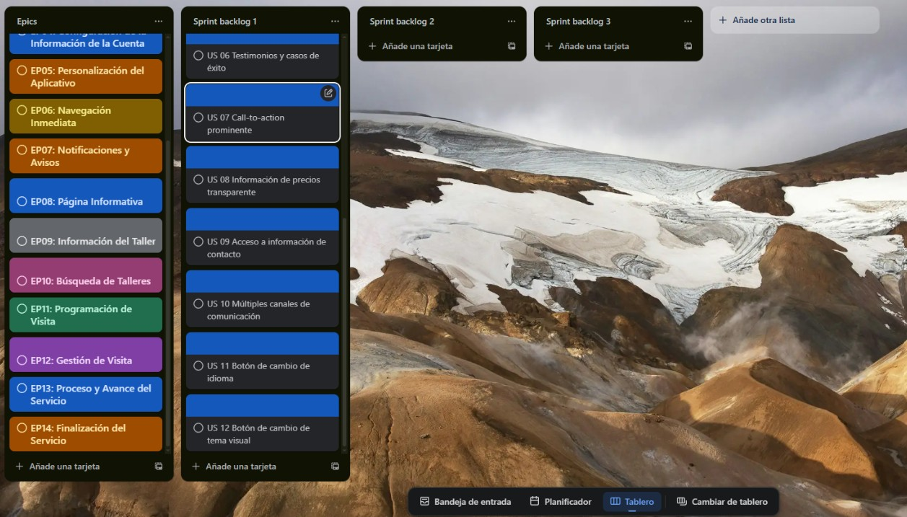
Link del Trello primera version Sprint 1: https://trello.com/b/eD8ju2rS/sprint-1

#### 5.2.1.2 Aspect Leaders and Collaborators

##### Aspect Leaders and Collaborators

Durante el Sprint 1, se han definido los principales aspectos a desarrollar, correspondientes a funcionalidades específicas como la visualización de contenido, navegación fluida, adaptabilidad responsiva y gestión de autenticación de usuarios.

Con el objetivo de asegurar una comunicación clara y eficiente dentro del equipo, se elaboró la siguiente matriz de liderazgo y colaboración (LACX), asignando para cada aspecto un líder responsable (L) y colaboradores de apoyo (C).

| Team Member (Last Name, First Name) | GitHub Username    | Questions and Tutorial | About us | Benefits | Testimonials | Contact and Download |
| :---------------------------------- | :----------------- | :--------------------- | :------- | :------- | :----------- | :------------------- |
| Apaza Bocanegra, Elizabeth Noelia   | Elizabeth-Apaza    | L                      | C        | C        | C            | C                    |
| Contreras Leon, Flor De María       | FlorDeMa           | C                      | L        | C        | C            | C                    |
| Guillen Galindo, Julio Adolfo	      | julio645           | C                      | C        | L        | C            | C                    |
| Miraval Pomalaya, Rodrigo Jesus     | RodMiraval         | C                      | C        | C        | L            | C                    |
| Navarro Chinga, Antonio Jhair       | AntonioNavarro24   | C                      | C        | C        | C            | L                    |

#### 5.2.1.3 Sprint Backlog 1

El objetivo principal de este Sprint es diseñar, implementar y validar las secciones del landing page, asegurando una navegación fluida, una experiencia responsiva en todos los dispositivos y funcionalidades críticas como registro. Se busca garantizar que el usuario final pueda interactuar de manera sencilla y eficiente con la plataforma, mejorando su satisfacción y promoviendo el cumplimiento de los objetivos de negocio.

| User Story ID | User Story Title                  | Task ID | Task Title                                     | Task Description                                                                                                                                  | Estimated Hours | Assigned To     | Status |
| ------------- | --------------------------------- | ------- | ---------------------------------------------- | ------------------------------------------------------------------------------------------------------------------------------------------------ | --------------- | ---------------- | ------ |
| US-009        | Sección de Contáctanos            | T09-1   | Diseño del Formulario de Contacto              | Diseñar un formulario con campos de nombre, correo electrónico y mensaje.                                                                         | 1/2             | Julio Adolfo    | Done  |
|               |                                   | T09-2   | Implementación de Envío Válido                 | Programar el formulario para almacenar la solicitud y notificar al equipo cuando los datos estén completos.                                       | 1               | Elizabeth-Apaza | Done  |
|               |                                   | T09-3   | Validación de Campos                           | Implementar validación que muestre errores cuando falten datos obligatorios o el correo sea inválido.                                             | 1/2             | Flor De María   | Done  |
| US-010        | Mostrar autores de la aplicación  | T10-1   | Diseño de la Sección de Autores                | Diseñar sección “Sobre nosotros” con espacio para lista de nombres, roles y fotos.                                                                | 1/2             | Julio Adolfo    | Done  |
|               |                                   | T10-2   | Implementación de Autores                      | Mostrar dinámicamente los autores con su nombre, rol y fotografía.                                                                                | 1               | Elizabeth-Apaza | Done  |
| US-024        | Consultar Preguntas Frecuentes    | T24-1   | Definición de Preguntas Frecuentes             | Redactar al menos tres preguntas frecuentes relacionadas con sensores y uso de la app.                                                            | 1/2             | Julio Adolfo    | Done  |
|               |                                   | T24-2   | Implementación de Sección FAQ                  | Implementar sección de ayuda que muestre preguntas y respuestas de forma clara y accesible.                                                        | 1              | Flor De María   | Done  |
| US-025        | Contacto directo                  | T25-1   | Diseño de Formulario de Contacto Directo       | Crear formulario de nombre, correo electrónico y mensaje para contacto directo.                                                                   | 1/2             | Flor De María   | Done  |
|               |                                   | T25-2   | Implementación de Envío Válido en Formulario   | Almacenar la solicitud en sistema cuando los datos estén completos.                                                                               | 1               | Rodrigo Jesus   | Done  |
|               |                                   | T25-3   | Mensaje de Confirmación                        | Mostrar mensaje de confirmación “Gracias por tu mensaje, te responderemos pronto” tras el envío.                                                   | 1/2            | Rodrigo Jesus   | Done  |
| US-026        | Información institucional         | T26-1   | Diseño de Footer                               | Diseñar footer con enlaces a redes sociales, contacto y términos legales.                                                                         | 1/2             | Antonio Jhair   | Done  |
|               |                                   | T26-2   | Implementación de Footer Fijo                  | Implementar el footer de manera persistente en todo el sitio.                                                                                     | 1               | Julio Adolfo    | Done  |
| US-027        | Acceso a secciones principales    | T27-1   | Definición de Menú de Navegación               | Diseñar menú principal con enlaces a Inicio, Beneficios y Contacto.                                                                               | 1/2             | Rodrigo Jesus   | Done  |
|               |                                   | T27-2   | Implementación de Navegación Principal         | Implementar navegación accesible y funcional a las secciones clave desde el menú.                                                                 | 1               | Flor De María   | Done  |
| US-028        | Comprensión inmediata             | T28-1   | Diseño del Mensaje Principal                   | Diseñar mensaje de valor que represente la esencia de PlantaE en la primera pantalla.                                                             | 1/2             | Flor De María   | Done  |
|               |                                   | T28-2   | Implementación de Mensaje de Valor             | Programar la visualización del mensaje principal al cargar la página.                                                                             | 1               | Julio Adolfo    | Done  |
| US-029        | Beneficios segmentados            | T29-1   | Definición de Contenido por Perfil             | Redactar beneficios diferenciados para hogar, vivero y comunidad.                                                                                 | 1/2             | Antonio Jhair   | Done  |
|               |                                   | T29-2   | Implementación de Beneficios Personalizados    | Mostrar dinámicamente la información segmentada según el perfil seleccionado.                                                                     | 1               | Elizabeth-Apaza | Done  |
| US-033        | Testimonios de usuarios           | T33-1   | Diseño de la Sección de Testimonios            | Diseñar sección visualmente atractiva para mostrar experiencias de usuarios.                                                                      | 1/2             | Julio Adolfo    | Done  |
|               |                                   | T33-2   | Implementación de Testimonios                  | Mostrar mínimo tres testimonios con nombre, tipo de usuario y comentario.                                                                         | 1               | Flor De María   | Done  |
|               |                                   | T33-3   | Validación de Datos de Testimonios             | Asegurar que cada testimonio incluya nombre, tipo de usuario y comentario.                                                                        | 1/2             | Julio Adolfo    | Done  |

#### 5.2.1.4. Development Evidence for Sprint Review

Durante el Sprint 1, el equipo se enfocó exclusivamente en el desarrollo de la Landing Page de la plataforma PlantaE.
El objetivo principal fue construir una página pública funcional, atractiva visualmente y completamente responsiva, que comunique eficazmente la propuesta de valor de la plataforma a los usuarios potenciales.
A lo largo del Sprint se diseñaron e implementaron secciones clave como Hero, Sobre Nosotros, Beneficios, Testimonios, Preguntas Frecuentes, Tutoriales, Contacto y el Footer.
También se trabajó en asegurar la adaptabilidad móvil, el cumplimiento de criterios de accesibilidad y la optimización inicial para motores de búsqueda (SEO).

#### Productos según alcance del Sprint:

##### Landing Page

Durante el Sprint 1 se implementó la Landing Page de PlantaE.
Los principales avances fueron:

- Diseño responsivo para diferentes tamaños de pantalla.
- Creación de secciones: Hero, Sobre Nosotros, Beneficios, Testimonios, Preguntas Frecuentes, Contacto y Footer.
- Aplicación de buenas prácticas de accesibilidad (etiquetado semántico, contraste adecuado).
- Optimización inicial para motores de búsqueda (SEO básico).
- Implementación de navegación fluida entre secciones.
- Validación de compatibilidad en navegadores y dispositivos.

#### 5.2.1.5 Execution Evidence for Sprint Review

        

- Parte de inicio.

    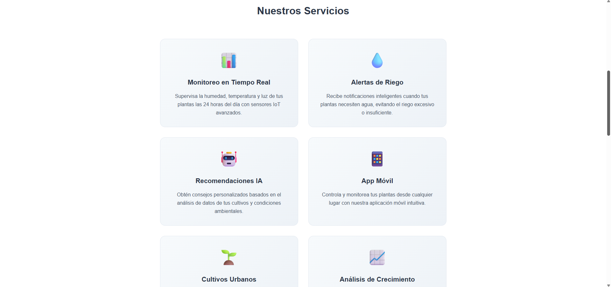    

- Servicios que ofrece PlantE

    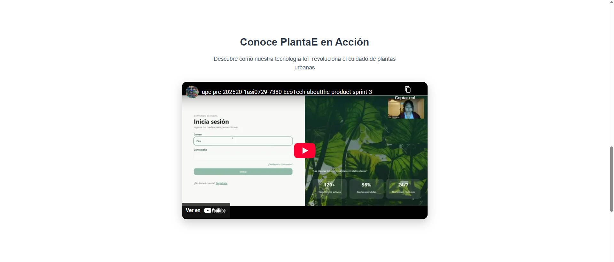    

- Video de introducción

    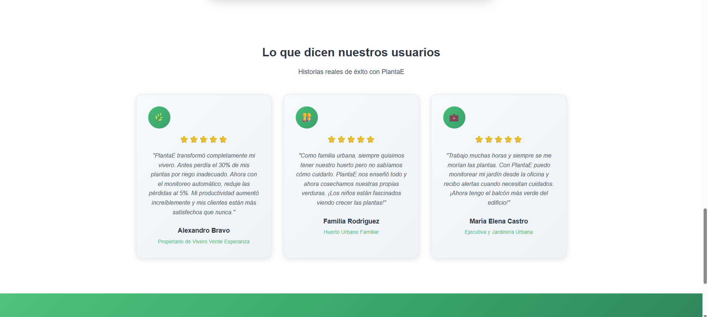    

- Testimonios de usuarios.

#### 5.2.1.6 Services Documentation Evidence for Sprint Review

Durante este sprint se completó el diseño e implementación del Landing Page del sistema, el cual forma parte del acceso inicial al sistema y constituye un punto de entrada fundamental para los usuarios. Aunque no se implementaron endpoints tradicionales de tipo REST en este sprint, se documenta a continuación la URL del recurso publicado, junto con evidencia de despliegue, interacción y commits relacionados.

**Descripción del Logro:**

-Implementación del Landing Page estático.

-Deployment del landing page.

### Recursos del Sprint

| Recurso      | Acción implementada   | Método HTTP | URL / Endpoint                                                              | Link de repositorio                                                         |
| ------------ | --------------------- | ----------- | --------------------------------------------------------------------------- | --------------------------------------------------------------------------- |
| Landing Page | Visualización inicial | GET         | https://plantae-open-sorce.github.io/PlantaE-landing/                       | https://github.com/PlantaE-open-sorce/PlantaE-landing                       |

#### 5.2.1.7. Software Deployment Evidence for Sprint Review.

Durante este Sprint, se realizaron actividades de despliegue de la Landing Page utilizando GitHub Pages como plataforma de hosting. A continuación, se detallan los pasos ejecutados:

**1- Se accedió a la sección Settings del repositorio.**

Dentro de Pages, se seleccionó la rama (main o master) y la carpeta (root o /docs) desde la cual GitHub Pages debía publicar el sitio.
Se guardaron los cambios para activar la publicación automática.

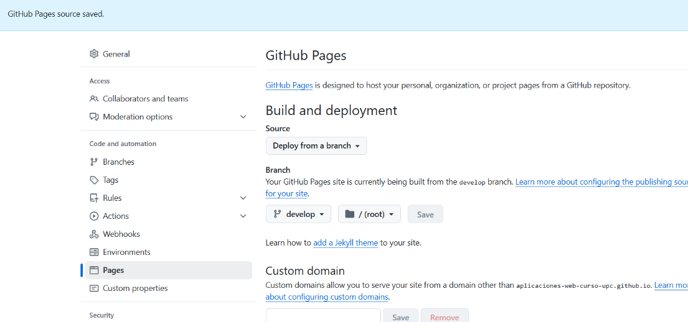

**2- Por default ya esta activado el https**

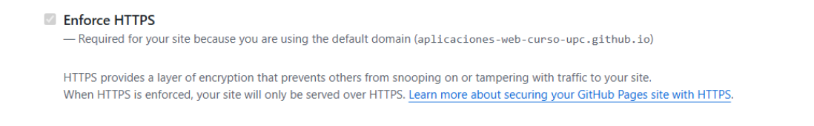

**3- En la seccion "All workflows" se puede ver que la app se esta deployando.**

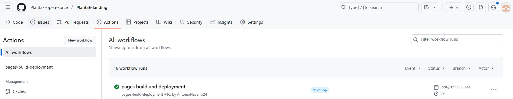

**4- El landing page fue exitosamente deployado**

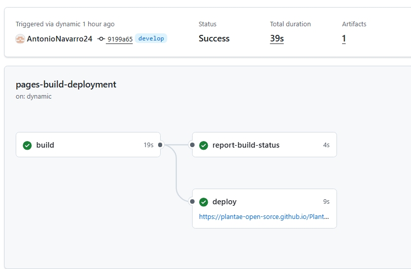

**5- Se obtuvo y verificó la URL pública proporcionada por GitHub Pages.**

### 5.2.2. Sprint 2
Se documenta el proceso de implementación, pruebas, documentación y despliegue del segundo Sprint, enfocado en la construcción de la Frontend Web Application de PlantaE. Este sprint se centró en desarrollar las interfaces de usuario principales utilizando Angular y TypeScript, asegurando una experiencia fluida y atractiva para ambos segmentos objetivo: dueños de plantas y viveros.

#### 5.2.2.1. Sprint Planning 2.

| Sprint #                        | Sprint 1                                                                                                                                                            |
| :------------------------------ | :------------------------------------------------------------------------------------------------------------------------------------------------------------------ |
| **Sprint Planning Background**  |                                                                                                                                                                     |
| Date                            | 2025-09-10                                                                                                                                                          |
| Time                            | 19:00 pm (GMT-5)                                                                                                                                                    |
| Location                        | Modalidad remota mediante la plataforma Discord                                                                                                                     |
| Prepared By                     | Contreras Leon, Flor De María                                                                                                                                       |
| Attendees (to planning meeting) | Apaza Bocanegra, Elizabeth Noelia / Contreras Leon, Flor De María / Guillen Galindo, Julio Adolfo / Miraval Pomalaya, Rodrigo Jesus / Navarro Chinga, Antonio Jhair |
| Sprint 1 Review Summary         | Dado que este es el sprint inicial, no se presenta un resumen del sprint anterior.                                                                                  |
| Sprint 1 Retrospective Summary  | Dado que este es el sprint inicial, no se presenta una retroalimentación del sprint anterior.                                                                       |
| **Sprint Goal & User Stories**  |                                                                                                                                                                     |
| Sprint 2 Goal                   | Nos enfocamos en implementar la estructura principal y las funcionalidades clave de la landing page pública de PlantaE. Creemos que esto aportará una percepción más sólida del producto y despertará mayor interés entre los usuarios potenciales, al comunicar de forma clara el valor y los beneficios de la plataforma. Esto se confirmará cuando los visitantes puedan navegar de manera fluida por la página, comprendan fácilmente qué ofrece PlantaE y muestren intención de interactuar o registrarse.                                                                                                             |
| Sprint 2 Velocity               | 18 puntos                                                                                                                                                           |
| Sum of Story Points             | 18 puntos                                                                                                                                                           |

#### 5.2.2.2. Aspect Leaders and Collaborators.

En esta sección se presenta la Leadership-and-Collaboration Matrix (LACX) correspondiente al Sprint 2, enfocado en el desarrollo de los bounded contexts del backend y la implementación de la arquitectura de microservicios. Esta matriz define los roles, responsabilidades y nivel de participación de cada miembro del equipo durante el desarrollo de los Web Services RESTful.
#### Aspectos Clave del Sprint 2
Para el Sprint 2, se han identificado cuatro aspectos fundamentales que abarcan el desarrollo frontend completo:

#### Frontend Development (Desarrollo de Interfaces)

- Desarrollo de la aplicación web con Angular

- Implementación de componentes, servicios, guards e interceptors

- Creación de páginas y vistas principales

#### UI/UX Implementation (Implementación de Diseño)

- Traducción de wireframes y mockups a interfaces funcionales

- Implementación de diseño responsive y adaptable

- Optimización de la experiencia de usuario

#### Navigation & Routing (Navegación y Enrutamiento)

- Configuración del sistema de navegación entre páginas

- Implementación de guards de autenticación y autorización

- Definición de flujos de navegación para ambos segmentos de usuarios

#### Integration & Deployment (Integración y Despliegue)Integration & Deployment (Integración y Despliegue)

Integración con la Landing Page existente

Configuración de variables de entorno y entornos

Despliegue y puesta en producción de la aplicación frontend
| Team Member (Last Name, First Name) | GitHub Username  | Frontend Development | UI/UX Implementation | Navigation & Routing | Integration & Deployment |
| :---------------------------------- | :--------------- | :------------------- | :------------------- | :------------------- | :----------------------- |
| Apaza Bocanegra, Elizabeth Noelia   | Elizabeth-Apaza  | L                    | C                    | C                    | C                        | 
| Contreras Leon, Flor De María       | FlorDeMa         | C                    | L                    | C                    | C                        |
| Guillen Galindo, Julio Adolfo	      | julio645         | C                    | C                    | L                    | C                        |  
| Miraval Pomalaya, Rodrigo Jesus     | RodMiraval       | C                    | C                    | C                    | L                        |
| Navarro Chinga, Antonio Jhair       | AntonioNavarro24 | C                    | C                    | C                    | C                        | 

#### 5.2.2.3 Sprint Backlog 2

El propósito de este Sprint es crear, desarrollar y probar las secciones del frontend, asegurando una navegación intuitiva y el correcto funcionamiento de elementos clave. El objetivo es que los usuarios puedan interactuar fácilmente con la plataforma, aumentando su satisfacción y contribuyendo al logro de los objetivos del negocio.

Enlace: https://trello.com/b/4aXdCQPO/plante-frontend

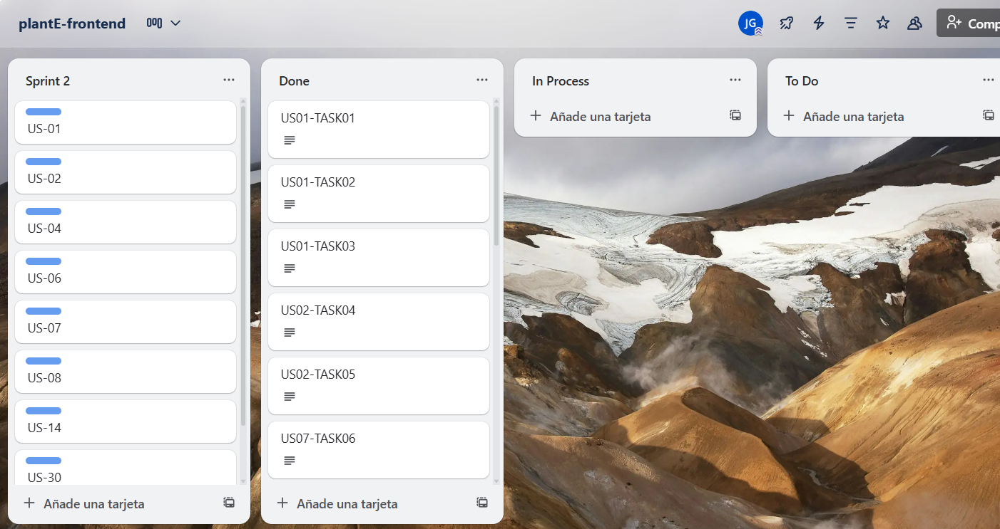
<figcaption style="font-size: 0.9em; color: #555;">
    <strong>Figura 1:</strong> Sprint Backlog 2.
  </figcaption>

| User Story ID | User Story Title                | Task ID | Task Title                                         | Description                                                                                                     | Estimated Hours | Assigned To     | Status |
| :-----------: | :-----------------------------: | :-----: | :------------------------------------------------: | :-------------------------------------------------------------------------------------------------------------: | :-------------: | :-------------: | :---------: |
| US-01        | Acceso a la plataforma           | T01-1   | Diseño de pantallas de registro e inicio de sesión | Diseñar formularios de registro e inicio de sesión con campos claros y estilo coherente al branding de PlantaE. | 3               | Elizabeth Apaza | Done        | 
|              |                                  | T01-2   | Implementación del formulario de inicio de sesión  | Programar la funcionalidad para ingresar credenciales y redirigir al dashboard.                                 | 3               | Elizabeth Apaza | Done        |
|              |                                  | T01-3   | Implementación del formulario de registro          | Programar la creación de cuentas con validaciones y confirmación visual de registro exitoso.                    | 4               | Elizabeth Apaza | Done        |
| US-02        | Recuperación de contraseña       | T02-1   | Diseño de interfaz de recuperación                 | Crear la pantalla con campo de correo electrónico y botón de envío para restablecer contraseña.                 | 6               | Antonio Navarro | Done        |
|              |                                  | T02-2   | Implementación de funcionalidad de recuperación    | Integrar lógica de envío de correo y mensajes de confirmación visual.                                           | 6               | Antonio Navarro | Done        |
| US-07        | Gestión de perfil                | T07-1   | Diseño del perfil del usuario                      | Diseñar la vista de perfil con campos editables (nombre, correo, idioma, notificaciones).                       | 3               | Julio Guillen   | Done        |
|              |                                  | T07-2   | Implementación de edición de perfil                | Programar la actualización de datos personales con validaciones.                                                | 5               | Julio Guillen   | Done        |
|              |                                  | T07-3   | Implementación del cambio de idioma                | Agregar soporte multilenguaje (es/en) en el frontend usando un switch persistente.                              | 5               | Julio Guillen   | Done        |
| US-08        | Alternar modo oscuro/claro       | T08-1   | Diseño del botón de cambio de modo                 | Diseñar un toggle visual para activar el modo oscuro o claro.                                                   | 3               | Flor Contreras  | Done        |
|              |                                  | T08-2   | Implementación de modo oscuro/claro                | Aplicar estilos dinámicos con CSS variables o framework (Tailwind, Bootstrap) para alternar entre temas.        | 3               | Flor Contreras  | Done        |
| US-04        | Alertas de cultivo               | T04-1   | Diseño del componente de alertas                   | Crear una sección de notificaciones con iconos y colores distintivos por tipo de alerta.                        | 4               | Rodrigo Miraval | Done        |
|              |                                  | T04-2   | Implementación de visualización de alertas         | Mostrar alertas en tiempo real (mock data o API simulada) con historial visual.                                 | 5               | Rodrigo Miraval | Done        |
| US-06        | Panel de métricas                | T06-1   | Diseño del panel de gráficos                       | Diseñar interfaz visual para mostrar gráficos de humedad, temperatura y luz.                                    | 5               | Flor Contreras  | Done        |
|              |                                  | T06-2   | Implementación de gráficos interactivos            | Integrar librería (Chart.js o Recharts) para mostrar datos dinámicos.                                           | 5               | Flor Contreras  | Done        |
| US-14        | Identificar plantas más críticas | T14-1   | Diseño del panel de criticidad                     | Diseñar vista con lista ordenada de plantas según prioridad o nivel de riesgo.                                  | 6               | Antonio Navarro | Done        |
|              |                                  | T14-2   | Implementación de orden dinámico                   | Programar lógica para ordenar y destacar plantas críticas.                                                      | 5               | Antonio Navarro | Done        |
| US-30        | Selección de idioma              | T30-1   | Diseño del selector de idioma                      | Diseñar el botón o dropdown de idioma en el header.                                                             | 4               | Elizabeth Apaza | Done        |
|              |                                  | T30-2   | Persistencia de idioma en sesión                   | Mantener el idioma seleccionado mientras el usuario navega por la app.                                          | 4               | Elizabeth Apaza | Done        |
| US-31        | Optimización para escritorio     | T31-1   | Diseño responsive de dashboard                     | Adaptar componentes visuales para pantallas grandes con diseño fluido.                                          | 6               | Julio Guillen   | Done        |
|              |                                  | T31-2   | Pruebas de responsividad y UX                      | Verificar visualización en diferentes dispositivos (mobile, tablet, desktop).                                   | 5               | Julio Guillen   | Done        |
| US-32	       | Registro de lotes de plantas	    | T32-1   | Diseño del registro de lotes	                     | Diseñar formulario y atributos necesarios para registrar lotes con gestión masiva.	                             | 5               | Elizabeth Apaza | Done        |
|              |                                  | T32-2	  | Implementación de registro de lotes                | Implementar lógica para crear entidad Lote y generar evento Registered batch.	                                 | 6	             | Julio Guillen   | Done        |
| US-33        | Registro aplicación de insumos   | T33-1   | Diseño del módulo de insumos	                     | Diseñar UI para registrar tipo, cantidad y costo de insumos aplicados.                                          | 4               | Julio Guillen   | Done        |
|              |                                  | T33-2   |	Implementación del registro de insumos	           | Programar lógica para almacenar insumos aplicados y generar evento Input Applied to Asset.	                     | 6	             | Antonio Navarro | Done        |
| US-34	       | Detección tendencias de riesgo   | T34-1	  | Diseño de análisis de tendencias                   | Diseñar mecanismo visual o estructura para mostrar detección temprana de tendencias de riesgo.	                 | 5               | Flor Contreras  | Done        |
|              |                                  | T34-2	  | Implementación de política Analyze Trends	         | Implementar comando Detect trend y generación del evento Risk Trend Detected.	                                 | 7               | Flor Contreras  | Done        |
| US-35	       | Registro acciones de cuidado     |	T35-1	  | Diseño del registro de acciones manuales	         | Diseñar pantalla o formulario para registrar podas, fertilización u otras acciones.                             | 4               | Flor Contreras  | Done        |
|              |                                  | T35-2   | Implementación del comando RegistrarAccion         | Implementar ejecución del comando y generación del evento Registered Manual Action.                             | 5               | Flor Contreras  | Done        |
| US-36        | Asignación de rutina para lotes  | T36-1	  | Diseño de rutina automática	                       | Diseñar flujo de asignación automática cuando se registra un nuevo lote.	                                       | 5               | Rodrigo Miraval | Done        |
|              |                                  | T36-2   | Implementación de Auto-Assign Routine	             | Programar la policy que ejecuta la asignación y genera Scheduled tasks.	                                       | 7               | Rodrigo Miraval | Done        |
| US-37	       | Agendar tareas puntuales	        | T37-1	  | Diseño de tareas específicas	                     | Diseñar UI para crear y configurar tareas puntuales con fecha y activo asociado.                                | 4               | Julio Guillen   | Done        |
|              |                                  | T37-2   | Implementación de tareas específicas               | Implementar creación de Scheduled Specific Task y su gestión en el sistema.                                     | 6               | Julio Guillen   | Done        |
| US-38	       | Panel de Tareas Pendientes	      | T38-1	  | Diseño del panel To-Do	                           | Diseñar vista con listado ordenado por urgencia y filtrado por fecha.	                                         | 5               | Elizabeth Apaza | Done        |
|              |                                  | T38-2	  | Implementación del panel	                         | Implementar consulta y visualización de Scheduled tasks pendientes.	                                           | 6               | Elizabeth Apaza | Done        |
                                                  
#### 5.2.2.4. Development Evidence for Sprint Review.
**En esta sección se presenta la evidencia detallada del desarrollo alcanzado durante el Sprint 2, enfocado en la implementación de la Frontend Web Application de EcoTech utilizando Angular y TypeScript. Durante este segundo sprint, el equipo de EcoTech se concentró en desarrollar las interfaces de usuario principales que conectarán a los dos segmentos objetivo con las funcionalidades core de la plataforma.**

El desarrollo se llevó a cabo utilizando Angular como framework principal, junto con TypeScript para garantizar robustez en el código y HTML/CSS para la estructura y estilos. Se implementó una arquitectura de componentes reutilizables siguiendo las mejores prácticas de Angular, con separación clara entre componentes de presentación, servicios de lógica de negocio, guards de navegación e interceptors para manejo de HTTP.

Las principales funcionalidades implementadas durante este sprint abarcan todas las interfaces necesarias para que tanto usuarios particulares como administradores de viveros puedan interactuar eficientemente con EcoTech. Se desarrollaron componentes modulares y reutilizables, implementando lazy loading para optimizar el rendimiento y una experiencia de usuario fluida y responsive.

El trabajo de desarrollo se organizó siguiendo las mejores prácticas de desarrollo frontend, implementando componentes standalone según las nuevas recomendaciones de Angular, gestión de estado reactiva con RxJS, validaciones de formularios robustas y diseño responsive que funciona óptimamente en desktop, tablet y móvil.

Se estableció la integración completa con la Landing Page existente, agregando enlaces directos que permiten a los usuarios navegar fluidamente desde la página de presentación hacia la aplicación web funcional. La configuración incluye internacionalización (i18n), cambio de tema dinámico y optimización de rendimiento con lazy loading.
| Repository            | Branch  | Commit Message                                                   | Commit Message Body                               | Author           | Committed on (Date) |
|----------------------|----------|------------------------------------------------------------------|----------------------------------------------------|------------------|----------------------|
| plantae/frontend     | develop  | Update main.ts                                                   | Update main.ts                                     | AntonioNavarro24 | Nov 15, 2025         |
| plantae/frontend     | develop  | Update devices.view.ts                                           | Update devices.view.ts                             | Elizabeth-Apaza  | Nov 14, 2025         |
| plantae/frontend     | develop  | Update translate.pipe.ts                                         | Update translate.pipe.ts                           | Elizabeth-Apaza  | Nov 14, 2025         |
| plantae/frontend     | develop  | Update home.view.ts                                              | Update home.view.ts                                | Elizabeth-Apaza  | Nov 14, 2025         |
| plantae/frontend     | develop  | Update styles.css                                                | Update styles.css                                  | Elizabeth-Apaza  | Nov 14, 2025         |
| plantae/frontend     | develop  | Correct labelForAssetType return statement formatting            | Correct formatting                                 | FlorDeMa         | Nov 14, 2025         |
| plantae/frontend     | develop  | Update login.view.ts                                             | Update login.view.ts                               | FlorDeMa         | Nov 14, 2025         |
| plantae/frontend     | develop  | Update auth.guard.ts                                             | Update auth.guard.ts                               | FlorDeMa         | Nov 14, 2025         |
| plantae/frontend     | develop  | Update app.routes.ts                                             | Update app.routes.ts                               | FlorDeMa         | Nov 14, 2025         |
| plantae/frontend     | develop  | Update paged-result.model.ts                                     | Update paged-result.model.ts                       | RodMiraval       | Nov 14, 2025         |
| plantae/frontend     | develop  | Add files via upload                                             | Add files via upload                               | julio645         | Nov 14, 2025         |
| plantae/frontend     | develop  | Delete src/app/plant-care/application/facades directory          | Delete facades directory                           | julio645         | Nov 14, 2025         |
| plantae/frontend     | develop  | Update alert.facade.ts                                           | Update alert.facade.ts                             | RodMiraval       | Nov 14, 2025         |
| plantae/frontend     | develop  | Add files via upload                                             | Add files via upload                               | julio645         | Nov 14, 2025         |
| plantae/frontend     | develop  | Delete src/styles.css                                            | Delete styles.css                                  | julio645         | Nov 14, 2025         |
| plantae/frontend     | develop  | Update main.ts                                                   | Update main.ts                                     | RodMiraval       | Nov 14, 2025         |
| plantae/frontend     | develop  | Update index.html                                                | Update index.html                                  | RodMiraval       | Nov 14, 2025         |
| plantae/frontend     | develop  | Add files via upload                                             | Add files via upload                               | julio645         | Nov 14, 2025         |
| plantae/frontend     | develop  | Delete src/environments directory                                | Delete environments directory                      | julio645         | Nov 14, 2025         |
| plantae/frontend     | develop  | Update README.md                                                 | Update README.md                                   | julio645         | Nov 14, 2025         |
| plantae/frontend     | develop  | Update README.md                                                 | Update README.md                                   | julio645         | Nov 14, 2025         |
| plantae/frontend     | develop  | Primer commit de mi proyecto                                     | Primer commit de mi proyecto                       | FlorDeMa         | Nov 14, 2025         |

**Funcionalidades Implementadas con Operaciones CRUD**
- **Sistema de autenticación completo**
Login, registro y gestión de sesiones de usuarios.

- **Gestión de perfiles de usuario**
Edición de datos de perfil con validaciones en tiempo real.

- **Gestión de plantas con avisos**
Funcionalidad completa de agregar, listar, editar y eliminar plantas, incluyendo sistema de recordatorios.

- **Módulo "Mis Plantas"**
Visualización en lista y detalle de plantas asociadas a cada usuario.

- **Panel de administración de plantas (plant-manage)**
Interfaz para gestionar el inventario de plantas con operaciones CRUD.

- **Página de inicio personalizada**
Acceso rápido a opciones como configuración y dashboard principal.

- **Integración unificada con la Landing Page**
Navegación fluida entre la página de presentación y la aplicación web.

#### 5.2.2.5. Execution Evidence for Sprint Review.
**Durante el Sprint 2, se logró la implementación exitosa y el despliegue de la Frontend Web Application de EcoTech, estableciendo una interfaz de usuario completa y funcional que conecta ambos segmentos objetivo con las funcionalidades principales de la plataforma.**

**Principales logros del Sprint 2:**

**Aplicación Web Semi Completa: **Se desarrolló parcialmente la aplicación de Angular con las páginas y componentes necesarios para ambos tipos de usuarios (usuarios particulares y administradores de viveros).

**Experiencia de Usuario Optimizada:** Interfaces responsive e intuitivas que funcionan perfectamente en desktop, tablet y móvil con diseño consistente y accesible.

**Sistema de Navegación Robusto:** Implementación completa de routing con guards de autenticación, lazy loading y protección de rutas sensibles.

**Funcionalidades Interactivas:** Componentes dinámicos incluyendo calendarios de cuidados, filtros de búsqueda de plantas, dashboards de seguimiento y formularios con validaciones en tiempo real.

**Integración con Landing Page:** Enlaces funcionales desde la landing page hacia la aplicación web, creando un flujo de usuario continuo y sin fricciones.

**Funcionalidades implementadas y desplegadas:**

**Sistema de Autenticación:** Login, registro y gestión de sesiones con validaciones completas

**Gestión de Plantas:** CRUD para registro, edición y selección de plantas

**Vista de Seguimiento:** Monitoreo en tiempo real del estado y cuidados de plantas

**Sistema de Recordatorios:** Configuración y visualización de alertas para cuidados de plantas

**Landing Page Actualizada:** Enlaces directos hacia la aplicación web desde la landing page

**Screenshots de la aplicación en funcionamiento:**

    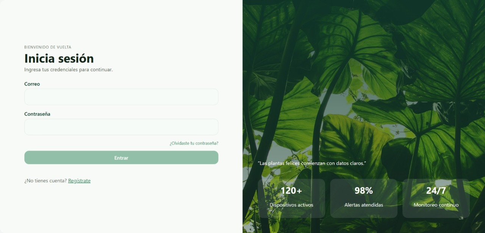    

- Página de login para usuarios
  

    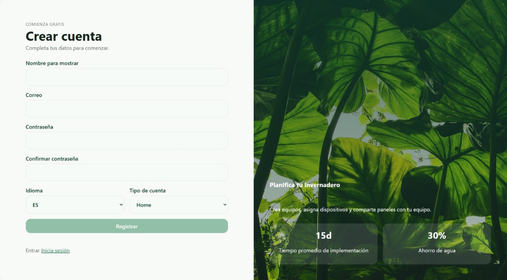    

- Página de registro para nuevos usuarios
  

    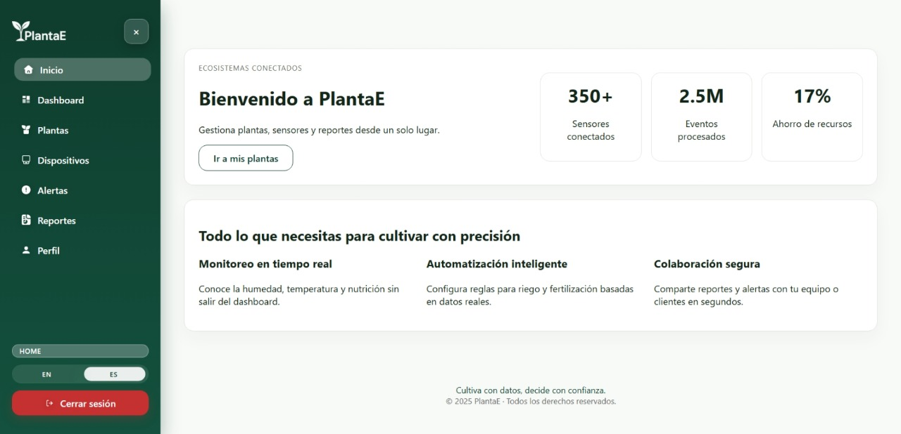    

- Página principal de la aplicación web con navegación y funcionalidades principales
  

    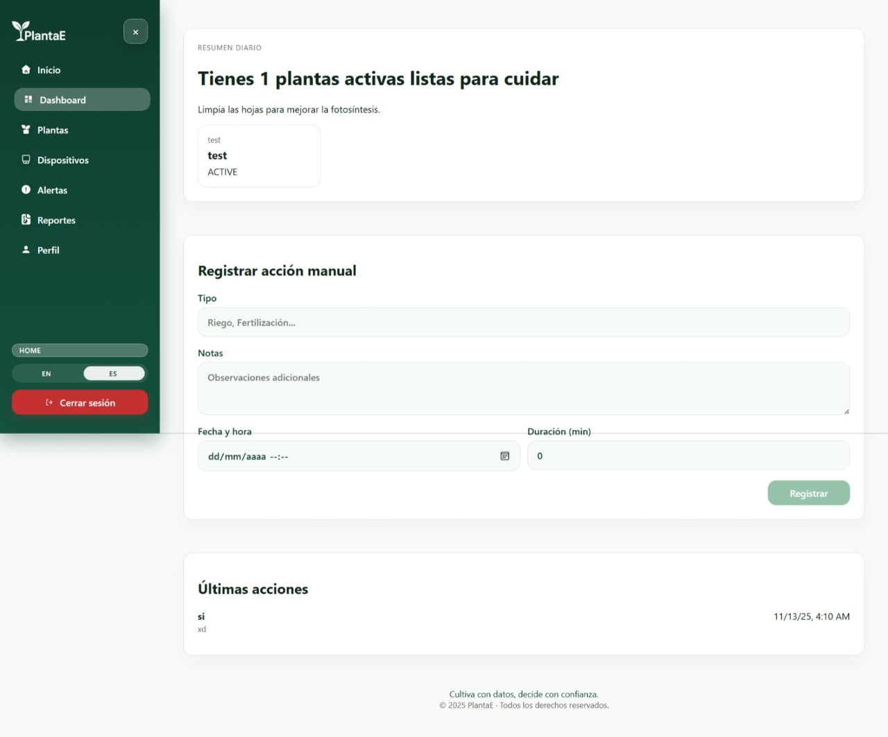    

- Página del Dashboard
  

    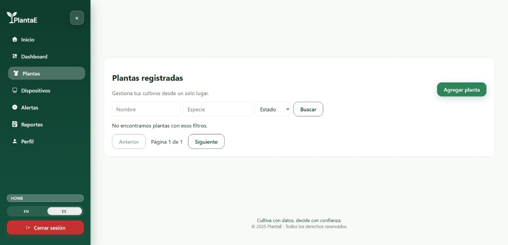    

- Página de gestión de plantas
  

    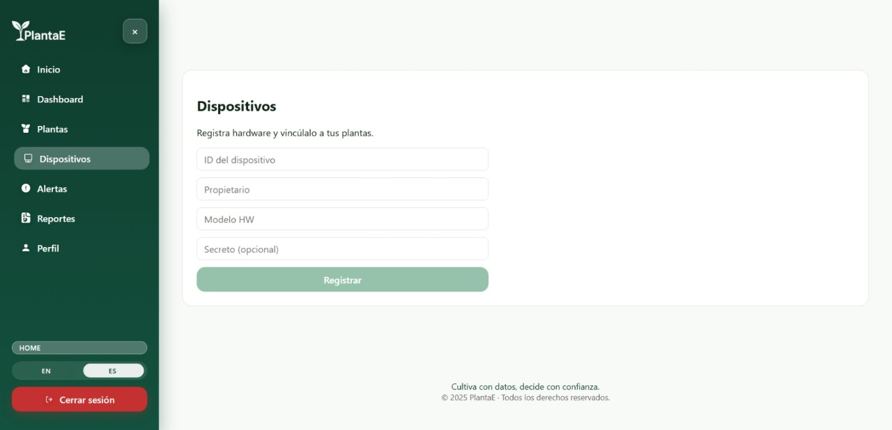    

- Página de vista para ver detalles los dispositivos
  

    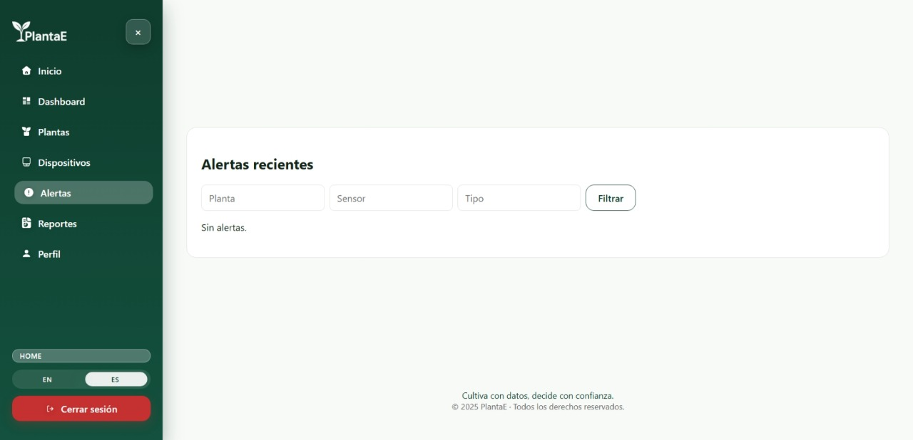    

- Página de alertas de plantas

    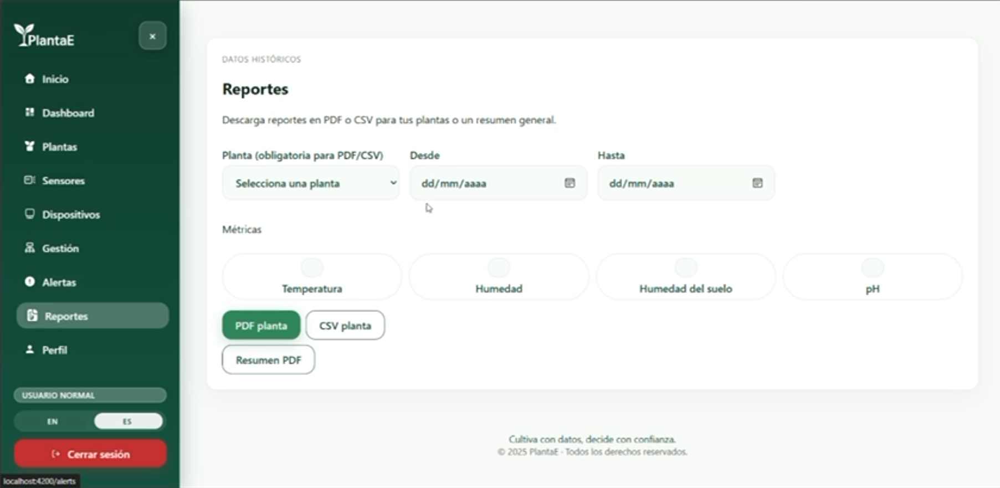    

- Panel de gestión de reportes
  

    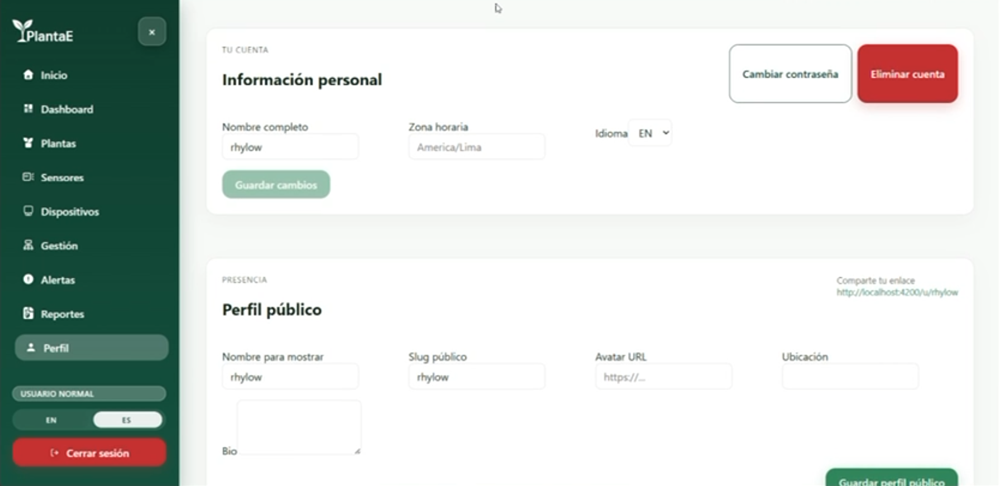    

- Página de usuario
  
 ### Primera Version Sprint 2
**Enlaces de despliegue:** 

**Frontend Application:** https://plant-e-frontend.vercel.app/auth/login

**Landing Page:** https://plantae-open-sorce.github.io/PlantaE-landing/

#### 5.2.2.6. Services Documentation Evidence for Sprint Review.

Durante este sprint se completó el diseño e implementación del FrontEnd del sistema, el cual forma parte del acceso inicial al sistema y constituye un punto de entrada fundamental para los usuarios. Implementando los endpoints de tipo REST en este sprint, se documenta a continuación la URL del recurso publicado, junto con evidencia de despliegue, interacción y commits relacionados.

**Descripción del Logro:**

-Implementación del FrontEnd.

-Deployment del FrontEnd.

### Recursos del Sprint

| Recurso      | Acción implementada   | Método HTTP | URL / Endpoint                                                              | Link de repositorio                                                         |
| ------------ | --------------------- | ----------- | --------------------------------------------------------------------------- | --------------------------------------------------------------------------- |
| FrontEnd     | Visualización inicial | GET         | http://20.57.10.48/login                                                    | https://github.com/PlantaE-open-sorce/frontedNew-PlantaE                    |

- Component Documentation: https://github.com/PlantaE-open-sorce/ReportNew-PlantaE/blob/fa2781f82273933e6fd230767d0d6da1d9f0aaa8/assets/documentation/Component%20Documentation

- Module Documentation:https://github.com/PlantaE-open-sorce/ReportNew-PlantaE/blob/2bec321d980f51e31d3c02847d06208262a7934d/assets/documentation/Module%20Documentation

- Design Patterns: https://github.com/PlantaE-open-sorce/ReportNew-PlantaE/blob/4482f49e0503049298653b9b382b04b654dfdcc1/assets/documentation/Design%20Patterns%3A

- Routing Guide: https://github.com/PlantaE-open-sorce/ReportNew-PlantaE/blob/4dd3ec64653c496cfb0e0ec20120c29fd7c923f0/assets/documentation/Routing%20Guide

#### 5.2.2.7. Software Deployment Evidence for Sprint Review.
**Documentación Técnica – Sprint 2**

Durante el **Sprint 2**, se desarrolló documentación técnica **comprehensiva** para la **Frontend Web Application** implementada.  
La documentación incluye guías de componentes, patrones de diseño implementados y guías de mantenimiento para facilitar el desarrollo futuro y la colaboración del equipo.

---

**Documentación de Frontend generada**

La aplicación cuenta con documentación completa que incluye:

- **Especificación de componentes** con props y eventos soportados  
- **Guías de estilo** y patrones de diseño implementados  
- **Estructura de navegación** y configuración de rutas (*routing configuration*)  
- **Validaciones de formularios** y manejo de errores  
- **Guías de internacionalización** y cambio de tema  
- **Ejemplos de uso** y casos de testing  

---

**Módulos principales documentados**

**Authentication**
**Componentes:** `Login`, `Register`  
**Funcionalidades:** Inicio de sesión, registro, gestión de sesiones  

---

**User Management**
**Componentes:** `Profile`, `EditProfile`, `UserDashboard`  
**Funcionalidades:** Gestión de perfil, edición de datos, panel personal  

---

**Workshop Search**
**Componentes:** `Search`, `Filter`, `WorkshopList`  
**Funcionalidades:** Búsqueda avanzada, filtros dinámicos, resultados paginados  

**Tracking Dashboard**
**Componentes:** `TrackingState`, `NotificationView`, `ProgressBar`  
**Funcionalidades:** Seguimiento en tiempo real, visualización de estados, notificaciones  

**Evidencias de despliegue:**

#### 5.2.2.8. Team Collaboration Insights during Sprint.
**Organización Estratégica del Equipo**

El trabajo se organizó de manera estratégica, asignando a cada miembro módulos específicos según sus fortalezas técnicas y experiencia:

- **Apaza Bocanegra, Elizabeth Noelia** lideró el desarrollo del sistema de autenticación y modelos de seguridad, componentes críticos para la protección de datos de usuarios.  
- **Contreras Leon, Flor De María** se especializó en el dashboard de resumen y gestión de datos agregados, enfocándose en la presentación de métricas clave para los usuarios.  
- **Guillen Galindo, Julio Adolfo** desarrolló el núcleo del sistema de plantas, implementando los modelos y repositorios para la gestión del catálogo botánico.  
- **Miraval Pomalaya, Rodrigo Jesus** implementó la gestión de perfiles de usuario, asegurando una experiencia personalizada y consistente.  
- **Navarro Chinga, Antonio Jhair** desarrolló el sistema de configuraciones y preferencias, permitiendo la personalización de la aplicación.  

---

**Arquitectura Implementada para PLANT-CARE**

**PRESENTATION**  
- Log-in y perfil (`login`, `profile`, `register`)  
- Inicio y opciones (`setting`, `dashboard`)  
- Añadir plantas con avisos (`add-plant`)  
- Mis plantas y detalles de plantas (`plant-list`, `plant-detail`)  
- Gestión de plantas (`plant-manage`)  

**GUARDS**  
- Sistema de protección de rutas y autenticación  

**COMPONENTS**  
- Shell principal de la aplicación (`plant-care-shell`)  

**INFRASTRUCTURE**  
- `Auth-http` (Elizabeth)  
- `Dashboard-http` (Flor)  
- `Plant-http` (Julio)  
- `Settings-http` (Antonio)  
- `Profile-http` (Rodrigo)  

**DOMAIN**  
- `Auth.model` (Elizabeth)  
- `Dashboard-summary.model` (Flor)  
- `Plant.model`, `Plant-metrics.model`, `Plant-type.model` (Julio)  
- `Settings.model` (Antonio)  
- `User-profile.model` (Rodrigo)  

**REPOSITORIES**  
- `Auth.repository` (Elizabeth)  
- `Dashboard.repository` (Flor)  
- `Plant.repository` (Julio)  
- `Settings.repository` (Antonio)  
- `Profile.repository` (Rodrigo)  

**APPLICATION**  
- `Auth.facade` (Elizabeth)  
- `Dashboard.facade` (Flor)  
- `Plant.facade` (Julio)  
- `Settings.facade` (Antonio)  
- `Profile.facade` (Rodrigo)  

---

El **Sprint 2** consolidó al equipo como una unidad técnica cohesiva especializada en desarrollo frontend con **Angular**, estableciendo bases arquitectónicas sólidas para el módulo **PLANT-CARE** y sentando las bases para la integración futura con servicios backend.

### 5.2.3 Sprint 3

En el Sprint 3, el equipo se reunió para establecer los objetivos, las tareas y los resultados esperados para esta iteración. Durante este sprint, se centrará en comenzar el desarrollo del backend y en mejorar el frontend para entregar una versión más completa y refinada. El propósito principal es construir una base técnica estable y lanzar una versión funcional de la aplicación que sea accesible y brinde una primera experiencia positiva al usuario.

#### 5.2.3.1. Sprint Planning 3

| Sprint #                        | Sprint 3                                                                                                                                                             |
| :------------------------------ | :------------------------------------------------------------------------------------------------------------------------------------------------------------------- |
| **Sprint Planning Background**  |                                                                                                                                                                      |
| Date                            | 2025-09-10                                                                                                                                                           |
| Time                            | 19:00 pm (GMT-5)                                                                                                                                                     |
| Location                        | Modalidad remota mediante la plataforma Discord                                                                                                                      |
| Prepared By                     | Contreras Leon, Flor De María                                                                                                                                        |
| Attendees (to planning meeting) | Apaza Bocanegra, Elizabeth Noelia / Contreras Leon, Flor De María / Guillen Galindo, Julio Adolfo / Miraval Pomalaya, Rodrigo Jesus / Navarro Chinga, Antonio Jhair. |
| Sprint 2 Review Summary         | Se consiguió lanzar una primera versión del frontend. Esto permitió detectar varias áreas de mejora relacionadas con la presentación de información clave para el núcleo del negocio. Además, gracias a la retroalimentación del docente, se identificó que ciertas partes del desarrollo no estaban correctamente elaboradas, lo que generó inconsistencias con lo implementado en el frontend.       |
| Sprint 2 Retrospective Summary  | Durante el sprint anterior, notamos que no se cumplieron los tiempos de entrega establecidos, lo que generó una fuerte presión al acercarse la fecha límite debido a la acumulación de tareas pendientes. Consideramos que se pueden aprovechar mejor los tiempo y las herramientas de gestión para monitorear el progreso del equipo de manera más eficiente.                                         |
| **Sprint Goal & User Stories**  |                                                                                                                                                                      |
| Sprint 3 Goal                   | Nuestro objetivo es actualizar la aplicación web del frontend e implementar la primera versión de los servicios web del backend. Con ello, buscamos ofrecer a las partes interesadas una demostración clara del funcionamiento de las vistas principales y de la interacción fluida con los endpoints del backend. El cumplimiento de este objetivo se validará al alcanzar una efectividad del 100% en las consultas realizadas a la API.                                                                                                                                                                                     |
| Sprint 3 Velocity               | 25 puntos                                                                                                                                                            |
| Sum of Story Points             | 8 puntos                                                                                                                                                             |

#### 5.2.3.2 Aspect Leaders and Collaborators

En este Sprint, el equipo enfocó sus esfuerzos principalmente en el desarrollo del backend, implementando endpoints para el acceso y manejo de datos. Al mismo tiempo, se trabajó en la optimización del frontend, con el objetivo de ajustar la interfaz a los diseños previamente establecidos y aplicar patrones de diseño sólidos. A continuación, la Matriz de Liderazgo y Colaboración (LACX) muestra de forma detallada los roles de liderazgo y apoyo que cada integrante del equipo desempeñó en estos aspectos clave del Sprint.

| Team Member (Last Name, First Name) | GitHub Username    | Design Patterns Implementation Leader | Data Leader | Backend Endpoints Leader | Frontend Refinement Leader |
| :---------------------------------- | :----------------- | :------------------------------------ | :---------- | :----------------------- | :------------------------- |
| Apaza Bocanegra, Elizabeth Noelia   | Elizabeth-Apaza    | C                                     | C           | C                        | C                          |
| Contreras Leon, Flor De María       | FlorDeMa           | L                                     | C           | C                        | C                          |
| Guillen Galindo, Julio Adolfo	      | julio645           | C                                     | L           | C                        | C                          |
| Miraval Pomalaya, Rodrigo Jesus     | RodMiraval         | C                                     | C           | L                        | C                          |
| Navarro Chinga, Antonio Jhair       | AntonioNavarro24   | C                                     | C           | C                        | L                          |

#### 5.2.3.3 Sprint Backlog 3

El Sprint Backlog 3 se centró en el desarrollo de los *bounded contexts* definidos para el proyecto. Aunque se dio prioridad al backend sobre el frontend, esta decisión permitirá que las funcionalidades estén listas para su integración, reduciendo la complejidad del desarrollo en la interfaz. Esto se debe a que los servicios esenciales para el funcionamiento de la aplicación y el cumplimiento de las historias de usuario ya estarán implementados. En conjunto, este trabajo sienta una base sólida que brindará una ventaja significativa en los próximos sprints frente a otros enfoques de desarrollo ágil.

Enlace: https://trello.com/invite/b/693088880f466beac75727f8/ATTIe77b8053b13c98c258bbd098f6b505cfF9777D47/plante

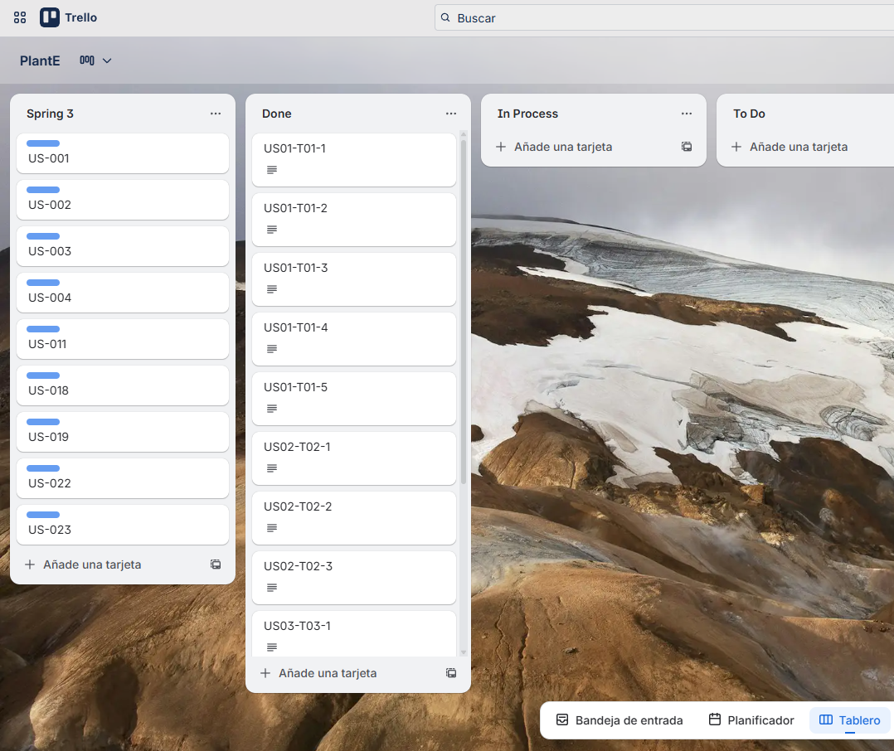
<figcaption style="font-size: 0.9em; color: #555;">
    <strong>Figura 1:</strong> Sprint Backlog 3.
  </figcaption>

| User Story ID | User Story Title             | Task ID | Task Title                       | Task Description                                                                     | Estimated Hours | Assigned To     | Status |
| :-----------: | :--------------------------- | :-----: | :------------------------------- | :----------------------------------------------------------------------------------- | :-------------: | :-------------- | :----- |
| US-001	    | Acceso a la plataforma       | T01-1	 | Modelo y migraciones de usuarios | Definir tabla users, índices (email único), timestamps y soft-delete.                | 4	             | Elizabeth Apaza | Done   |
| 	            |                              | T01-2	 | Endpoint de registro	            | POST /api/v1/auth/register con validación, hashing y verificación de email opcional. | 6	             | Julio Guillen   | Done   |
| 	            |                              | T01-3 	 | Endpoint de login	            | POST /api/v1/auth/login con JWT/refresh, lockout por intentos y auditoría.           | 8	             | Rodrigo Miraval | Done   |
| 	            |                              | T01-4	 | Gestión de sesiones/refresh	    | Rotación de refresh tokens, revoke/blacklist y expiraciones.	                       | 6	             | Elizabeth Apaza | Done   |
| 	            |                              | T01-5	 | Tests de auth                    | Unit/integration (registro, login, expiración, lockout).	                           | 6	             | Julio Guillen   | Done   |
| US-002        |	Recuperación de contraseña | T02-1	 | Token y plantilla de reset	    | Generar token firmado/expirable y payload seguro; stub de email.	                   | 4	             | Flor Contreras  | Done   |
|               |                              | T02-2	 | Endpoint solicitud reset         | POST /api/v1/auth/forgot-password (rate limit, respuesta idempotente).	           | 3	             | Elizabeth Apaza | Done   |
|               |                              | T02-3	 | Endpoint confirmar reset	        | POST /api/v1/auth/reset-password con validaciones y rotación de credenciales.	       | 4	             | Julio Guillen   | Done   |
| US-022        |	Cambio de contraseña       | T22-1	 | Endpoint change password	        | PATCH /api/v1/auth/change-password (auth requerida, políticas de complejidad).	   | 3	             | Antonio Navarro | Done   |
| US-023	    | Eliminar cuenta              | T23-1	 | Endpoint delete account          | DELETE /api/v1/account (GDPR-like: borrar o anonimizar datos relacionados).	       | 6	             | Rodrigo Miraval | Done   |
| US-003        |	Gestión de plantas         | T03-1	 | Modelo Plant & media	            | Tabla plants (user_id, name, type, photo_url), ownership y constraints.              | 5	             | Flor Contreras  | Done   |
|               |                              | T03-2 	 | CRUD plantas (API)	            | Endpoints REST con paginación, filtros por tipo, validación de foto.	               | 6	             | Elizabeth Apaza | Done   |
| US-011	    | Agregar sensores IoT         | T11-1	 | Modelo Sensor & vínculo          | Tablas sensors y plant_sensors; estados y códigos de registro.	                   | 5	             | Flor Contreras  | Done   |
|               |                              | T11-2	 | Endpoint vinculación	            | POST /api/v1/sensors/link por código, validación y ownership.	                       | 4	             | Flor Contreras  | Done   |
| US-018        | Lista de sensores activos	   | T18-1	 | Endpoint listado/estado	        | GET /api/v1/sensors con estado, planta asociada y filtros.	                       | 4	             | Antonio Navarro | Done   |
|               |                              | T18-2   | Desvincular/eliminar sensor     	| DELETE /api/v1/sensors/{id} con reglas de historial.	                               | 3	             | Rodrigo Miraval | Done   |
| US-019	    | Consultar datos de un sensor | T19-1 	 | Ingesta y esquema de lecturas	| Tabla sensor_readings (humedad, luz, temp, ts); índices por sensor/fecha.            | 6	             | Flor Contreras  | Done   |
|               |                              | T19-2   | Endpoint histórico	            | GET /api/v1/sensors/{id}/readings con rango de fechas y agregaciones.	               | 6	             | Elizabeth Apaza | Done   |
| US-004        |	Alertas de cultivo	       | T04-1	 | Motor de umbrales	            | Servicio que evalúa lecturas vs umbrales por planta/tipo (riego/luz/temp).	       | 6	             | Julio Guillen   | Done   |
|               |                              | T04-2	 | Persistencia de alertas          | Tabla alerts (type, severity, plant_id, sensor_id, ts, estado).	                   | 4	             | Antonio Navarro | Done   |
|               |                              | T04-3	 | Endpoints alertas	            | GET /api/v1/alerts (listado, filtros) y GET /api/v1/plants/{id}/alerts (historial).  | 5	             | Julio Guillen   | Done   |

#### 5.2.3.4. Development Evidence for Sprint Review

Se mostrará a continuación una tabla con los commits realizados en el repositorio del backend de PlantE durante el sprint. Esta información evidencia las tareas de desarrollo e implementación efectuadas en la aplicación, como la creación de endpoints, la organización modular del código, la configuración para el despliegue y la elaboración de documentación técnica. Cada commit representa una mejora o funcionalidad importante incorporada en la rama principal del proyecto.
| Repository 		               | Branch                           | Commit Id 								 | Commit Message             	         					 	| Commit Message Body                                            | Committed on (Date) |
| :------------------------------- | :------------------------------- | :--------------------------------------- | :----------------------------------------------------------- | :------------------------------------------------------------- | :------------------ |
| feature/adding-home-options      | feature/adding-home-options      | 0609611cfca7d7e59b9fe3935253ac9975f4518b | Merge branch 'feature/adding-home-options' into develop      | -                                                              | Nov 15, 2025        |
| feature/adding-home-options      | feature/adding-home-options      | 0b8466e959e7896c02578ed6dd8a35c7a23fefdf | Reemplazo completo del backend para myplants details         | Reemplazo completo del backend para myplants details           | Nov 15, 2025        |
| feature/adding-login-profile     | feature/adding-myplants-details  | 4c739fedc539ef752cc791f4081a46216f1a0c41 | Merge branch 'feature/adding-myplants-details' into develop  | -                                                              | Nov 14, 2025        |
| feature/adding-management-plants | feature/adding-myplants-details  | b04b9dfac519df4149fc2ce3bb473fd887b2571f | Reemplazo completo del backend para myplants details         | Reemplazo completo del backend para myplants details           | Nov 14, 2025        |
| feature/adding-management-plants | feature/adding-login-profile     | 28b8a03b16aab6cebfe0217dbd02a3a82a185664 | Merge branch 'feature/adding-login-profile' into develop     | -                                                              | Nov 14, 2025        |
| feature/adding-login-profile     | feature/adding-login-profile     | 0c2cc477c174597d41b2120cbe0e30e919338921 | Añadiendo backend para login y profile                       | Añadiendo backend para login y profile                         | Nov 14, 2025        |
| feature/adding-login-profile     | feature/adding-management-plants | 6e640a89acbbe66ea295f18edeb31112987d38e8 | Merge branch 'feature/adding-management-plants' into develop | -                                                              | Nov 14, 2025        |
| feature/adding-login-profile     | feature/adding-management-plants | 956fb8baa1b71f57202452db637aa3dc4f40c22b | Añadiendo backend nuevo para management plants               | Añadiendo backend nuevo para management plants                 | Nov 14, 2025        |
| feature/adding-myplants-details  | feature/adding-management-plants | 7fecc6867ecacc51770c40ea5e6cfac28e13b47f | Añadiendo backend desde cero                                 | Añadiendo backend desde cero                                   | Nov 14, 2025        |
| feature/adding-myplants-details  | develop                          | a6fc142372c6951ecc3bfb4a23b71cc1a0452474 | Initial commit                                               | Initial commit                                                 | Oct 21, 2025        |

| **Repository**                           | **Branch** | **Commit ID** | **Body** | **Commit Message**                                                                                | **Commited on (Date)** |
| :--------------------------------------- | :--------- | :------------ | :------- | :------------------------------------------------------------------------------------------------ | :--------------------- |
| G2-Aplicaciones-Open-Source/backend-java | main       | 94125b6       |          | feat: implement ExperienceMedia endpoint with full CRUD, validation and OpenAPI docs              | 2025-06-21             |

#### 5.2.3.5 Execution Evidence for Sprint Review

En este sprint, hemos logrado avances significativos en el desarrollo del backend de nuestro producto. Nos hemos concentrado en implementar múltiples endpoints RESTful, así como la lógica de negocio correspondiente, asegurando la correcta persistencia de datos en la base de datos MySQL. También se configuró el despliegue en maquina virtual Windows Azure  y se verificó el funcionamiento mediante la conexión al servidor de ubuntu y el puerto accesible 4. A continuación, se presentan evidencias técnicas del backend desarrollado durante este sprint.

**Capturas de Pantalla de MySQL conectado a la database de la maquina virtual**

- Datos en bounded context
  

    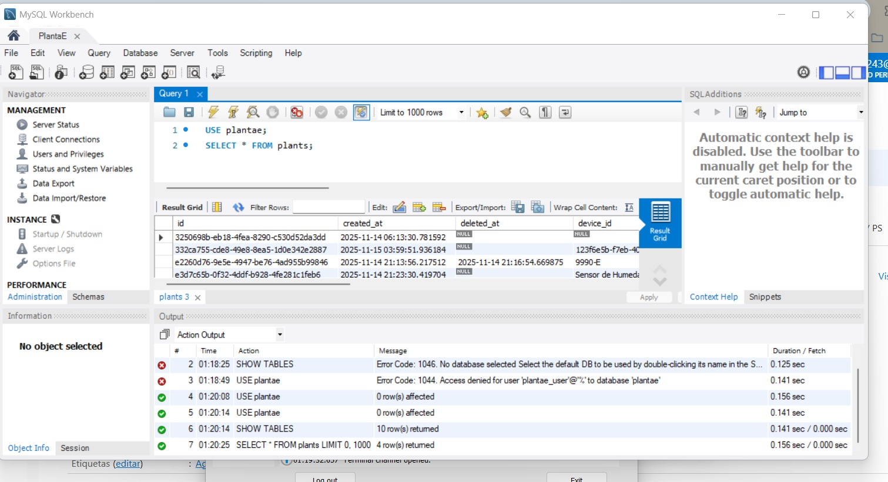    

- Puerto MySQL prendido:

    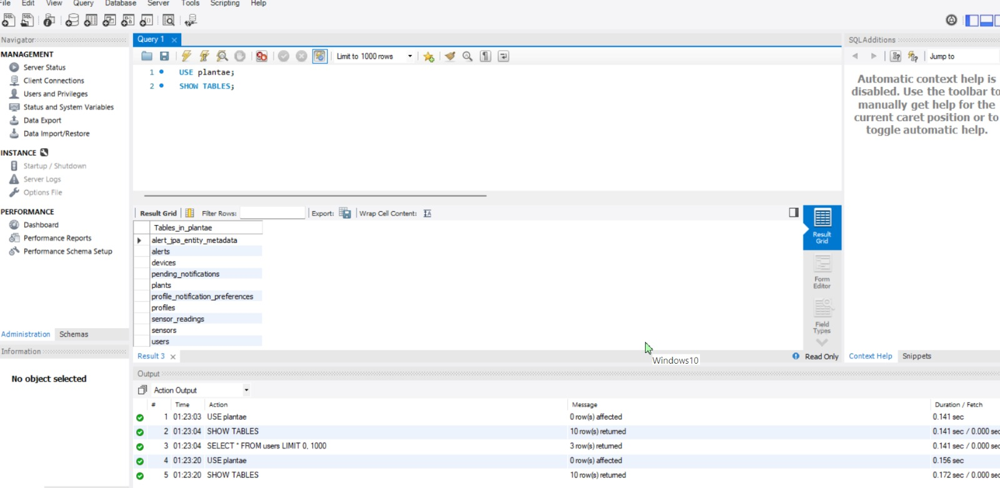    

- Datos en bounded context Profiles:

        

- Tablas de base de datos:

    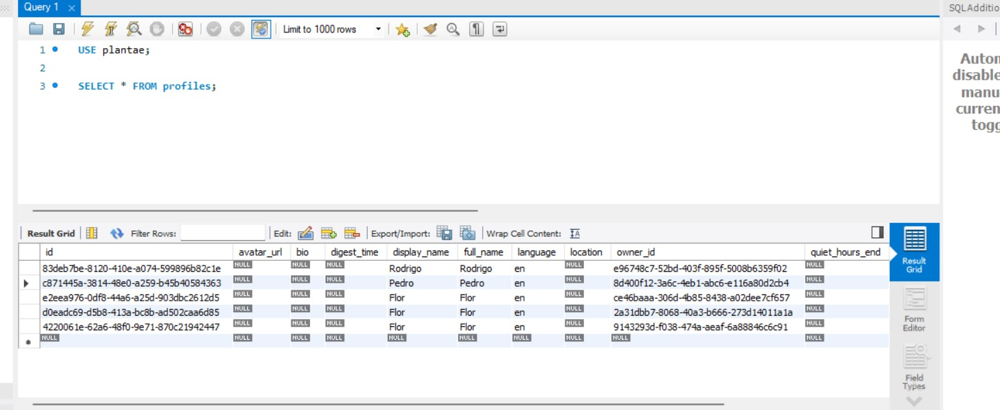    

- Datos en bounded context User:

    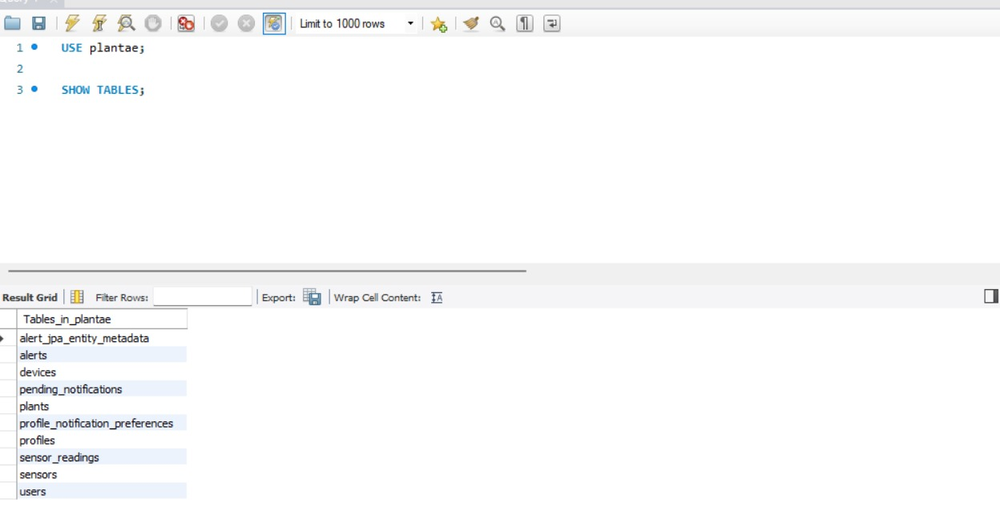    

- Datos en bounded context Plants Details:

    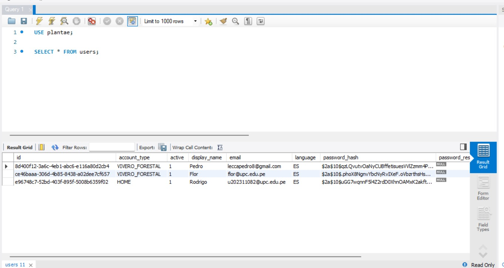    

- Datos en bounded context Sensors:
  

    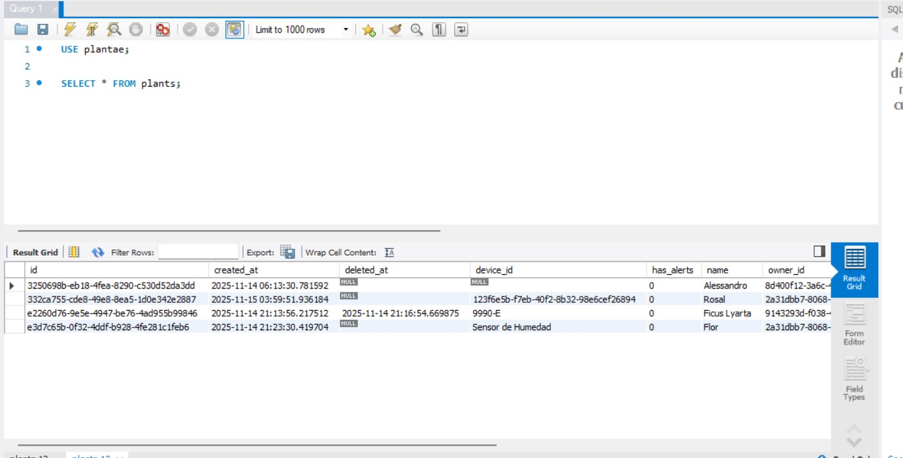    

**Evidencias visuales del Backend deployado**

    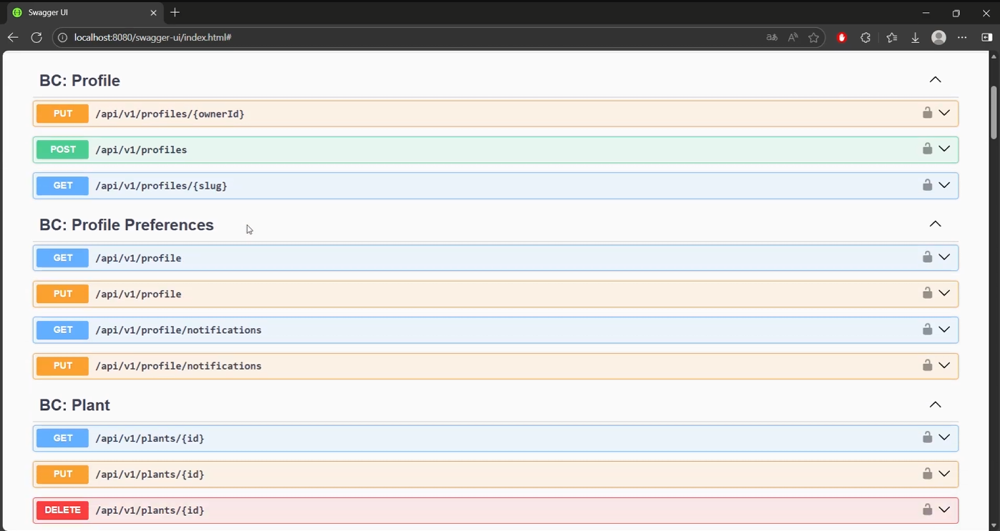    

    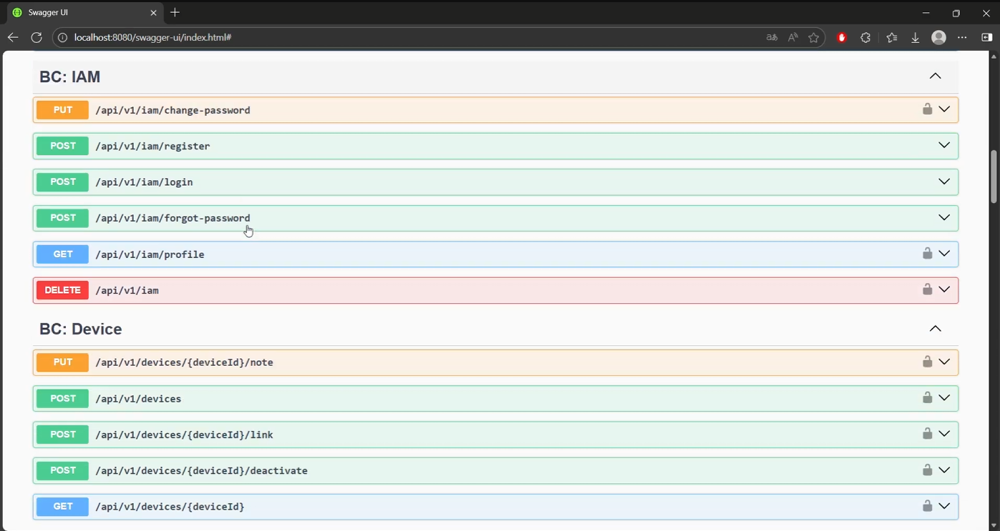    

    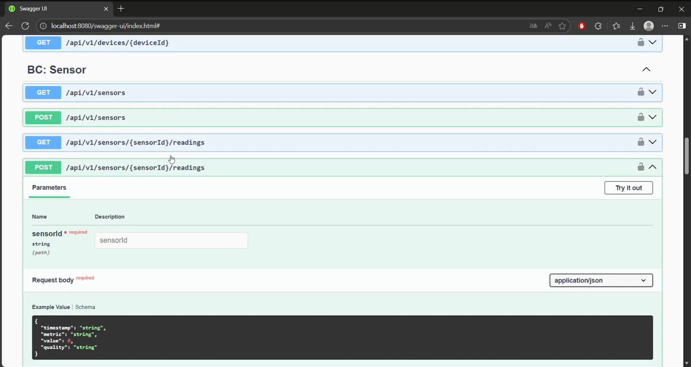    

        

**Funcionamiento de Backend deployado**

    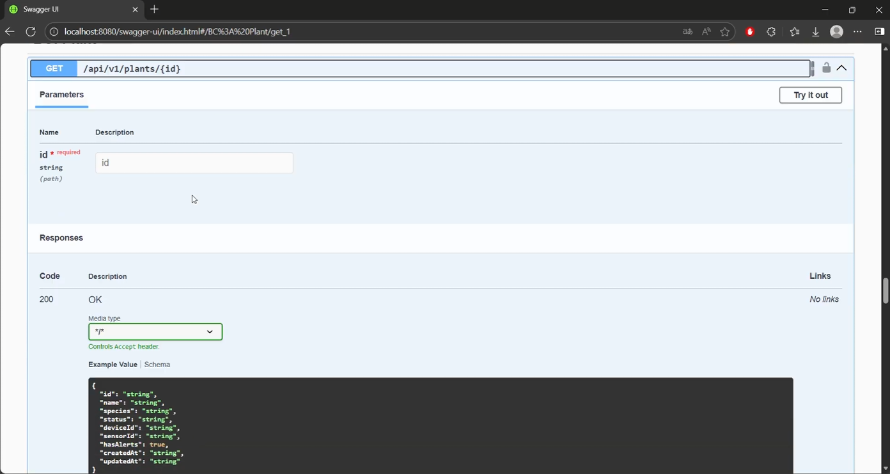    

#### 5.2.3.6 Services Documentation Evidence for Sprint Review

En esta sección se muestra la evidencia de la documentación de los servicios creados durante el sprint, los cuales pueden consultarse y visualizarse a través de Swagger dentro de la aplicación PlantE. A continuación, se describen los endpoints más relevantes implementados para cada módulo funcional, indicando su método HTTP, la ruta asociada y una breve descripción de cada uno.

    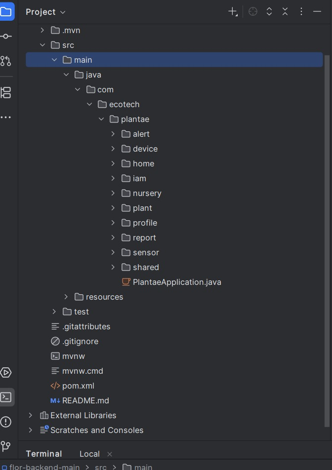    

    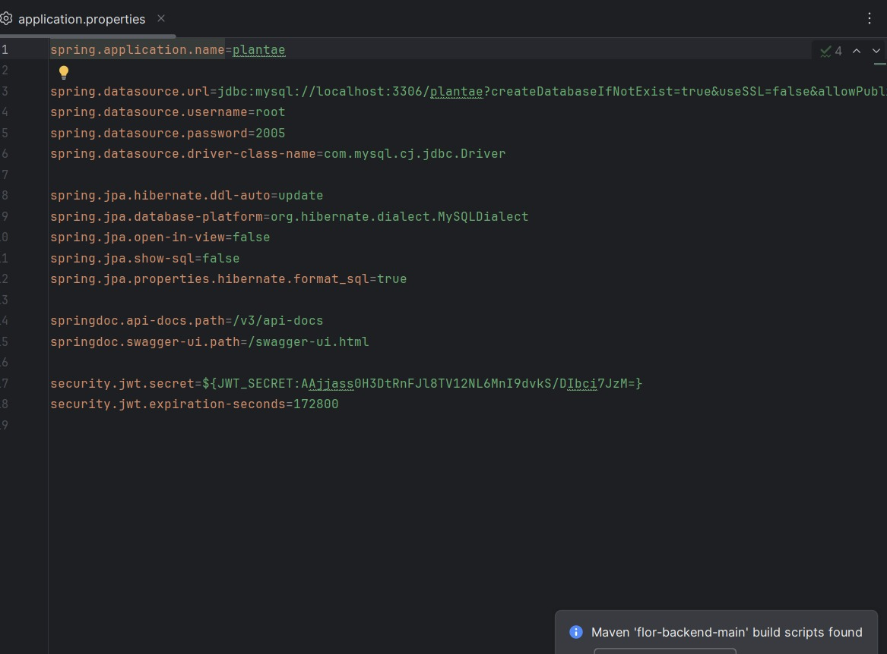    

# Endpoints EcoTech (API)
Prefijo base para todos los endpoints: `/api/v1`. Todos los strings/enums funcionales se mantienen en inglés (`ACTIVE`, `soilMoisture`, etc.). Salvo que se indique como público, cada ruta requiere `Authorization: Bearer <JWT>`.

---

## IAM (Autenticación y Cuenta)
| Método | Ruta                   | Auth    | Descripción                                                                              |
| ------ | ---------------------- | ------- | ---------------------------------------------------------------------------------------- |
| POST   | `/iam/register`        | Público | Registro de usuario (`email`, `password`, `confirmPassword`, `displayName`, `language`). |
| POST   | `/iam/login`           | Público | Login con `email/password`; retorna JWT + mensaje localizado.                            |
| POST   | `/iam/forgot-password` | Público | Lanza flujo de recuperación (`{ "email": "" }`).                                         |
| PUT    | `/iam/change-password` | Bearer  | Cambia contraseña (`currentPassword`, `newPassword`).                                    |
| DELETE | `/iam`                 | Bearer  | Elimina la cuenta actual.                                                                |
| GET    | `/iam/profile`         | Bearer  | Perfil del usuario autenticado; soporta `AcceptLanguage`.                                |

---

## Profile (Perfiles Públicos)
| Método | Ruta                  | Auth   | Descripción                                                                        |
| ------ | --------------------- | ------ | ---------------------------------------------------------------------------------- |
| POST   | `/profiles`           | Bearer | Create profile (`ownerId`, `displayName`). Autogenerates slug, resolves conflicts. |
| PUT    | `/profiles/{ownerId}` | Bearer | Update public fields (`displayName`, `bio`, `avatarUrl`, `location`, `timezone`).  |
| GET    | `/profiles/{slug}`    | Bearer | Fetch profile by public slug (404 if missing).                                     |

### Preferencias y Notificaciones
| Método | Ruta                     | Auth   | Descripción                                                                |
| ------ | ------------------------ | ------ | -------------------------------------------------------------------------- |
| GET    | `/profile`               | Bearer | Get personal preferences (fullName, timezone, language).                   |
| PUT    | `/profile`               | Bearer | Update preferences (`fullName`, `timezone`, `language`).                   |
| GET    | `/profile/notifications` | Bearer | Fetch notification settings (quiet hours, digest time, per-type channels). |
| PUT    | `/profile/notifications` | Bearer | Update notification settings (HH:mm quiet hours, digest, channel toggles). |

### Catálogo i18n
| Método | Ruta                                   | Auth   | Descripción                                                |
| ------ | -------------------------------------- | ------ | ---------------------------------------------------------- |
| GET    | `/i18n/catalog?namespace={alerts|...}` | Public | Retrieve key→text catalog localized via `Accept-Language`. |

---

## Plants
| Método | Ruta                  | Auth   | Descripción                                                                                                                                             |
| ------ | --------------------- | ------ | ------------------------------------------------------------------------------------------------------------------------------------------------------- |
| POST   | `/plants`             | Bearer | Create plant (`name`, `species`, optional `deviceId`, `sensorId`).                                                                                      |
| GET    | `/plants`             | Bearer | Paginated search (`name`, `species`, `status=ACTIVE| INACTIVE`, `createdFrom`, `createdTo`, `hasAlerts`, `sensorId`, `sort=field,dir`, `page`, `size`). |
| GET    | `/plants/{id}`        | Bearer | Retrieve plant by ID.                                                                                                                                   |
| PUT    | `/plants/{id}`        | Bearer | Update plant (any field + status).                                                                                                                      |
| DELETE | `/plants/{id}`        | Bearer | Soft delete plant (sets `deletedAt`).                                                                                                                   |
| GET    | `/plants/{id}/alerts` | Bearer | Recent alerts for a plant (supports `page`/`size`, honors `Accept-Language`).                                                                           |

---

## Sensors & Readings
| Método | Ruta                             | Auth   | Descripción                                                                                                                                                          |
| ------ | -------------------------------- | ------ | -------------------------------------------------------------------------------------------------------------------------------------------------------------------- |
| POST   | `/sensors`                       | Bearer | Register sensor (`type`, `ownerId`, optional `plantId`). Auto-links plant sensorId.                                                                                  |
| POST   | `/sensors/{sensorId}/link`       | Bearer | Link sensor to plant (`plantId`).                                                                                                                                    |
| POST   | `/sensors/{sensorId}/deactivate` | Bearer | Set sensor status to `INACTIVE`.                                                                                                                                     |
| GET    | `/sensors`                       | Bearer | Paginated list (`type`, `status`, `plantId`, `page`, `size`).                                                                                                        |
| GET    | `/sensors/{sensorId}`            | Bearer | Sensor details.                                                                                                                                                      |
| POST   | `/sensors/{sensorId}/readings`   | Bearer | Ingest reading (`timestamp` optional ISO-8601, `metric` {soilMoisture, temperature, humidity, light}, ∈ `value`, optional `quality`).                                |
| GET    | `/sensors/{sensorId}/readings`   | Bearer | Paginated readings (`from`, `to`, `metric`, `page`, `size`).                                                                                                         |
| GET    | `/sensors/activity`              | Bearer | Most active sensors (`from`, `to`, `top=10`).                                                                                                                        |
| (Auto) | Simulation                       | n/a    | When `simulation.sensors.enabled=true` (default), a scheduler injects random readings for each active sensor every `simulation.sensors.delay-ms` ms (default 15000). |

---

## Devices
| Método | Ruta                             | Auth   | Descripción                                                            |
| ------ | -------------------------------- | ------ | ---------------------------------------------------------------------- |
| POST   | `/devices`                       | Bearer | Register device (`deviceId`, `ownerId`, `hwModel`, optional `secret`). |
| POST   | `/devices/{deviceId}/link`       | Bearer | Link device to plant (`plantId`).                                      |
| POST   | `/devices/{deviceId}/deactivate` | Bearer | Deactivate device.                                                     |
| PUT    | `/devices/{deviceId}/note`       | Bearer | Update device note (`note`).                                           |
| GET    | `/devices/{deviceId}`            | Bearer | Fetch device info.                                                     |

---

## Alerts
| Método | Ruta                       | Auth   | Descripción                                                                             |
| ------ | -------------------------- | ------ | --------------------------------------------------------------------------------------- |
| GET    | `/alerts/recent`           | Bearer | Owner-scoped alerts (`plantId`, `sensorId`, `type`, `page`, `size`, `Accept-Language`). |
| GET    | `/plants/{plantId}/alerts` | Bearer | Alerts for specific plant (`page`, `size`, `Accept-Language`).                          |

Alerts are triggered internally via handlers (`RaiseAlertHandler`, `ResolveAlertHandler`) for THRESHOLD_BREACH, SENSOR_INACTIVE, DEVICE_DEACTIVATED, WEEKLY_REPORT, MONTHLY_REPORT. Notifications respect profile quiet hours and preferences, falling back to queued dispatch.

---
## Reports
| Método | Ruta                            | Auth   | Descripción                                                                         |
| ------ | ------------------------------- | ------ | ----------------------------------------------------------------------------------- |
| GET    | `/reports/plants/{plantId}.pdf` | Bearer | Plant PDF report (`from`, `to`, optional `metrics`, optional `ownerId` for admins). |
| GET    | `/reports/plants/{plantId}.csv` | Bearer | Plant CSV export (`from`, `to`, optional `ownerId`).                                |
| GET    | `/reports/summary.pdf`          | Bearer | Summary PDF across plants (`from`, `to`, optional `ownerId`).                       |

All report endpoints derive the effective owner from the authenticated user unless
an ADMIN supplies `ownerId`.

---

## Notas Generales
1. **Autenticación:** Genera un JWT en `/iam/login` y adjúntalo como `Bearer`. Las rutas públicas están listadas explícitamente.
2. **Localización:** `Accept-Language` puede sobrescribir temporalmente el idioma persistido del perfil.
3. **Códigos HTTP:** Se usan los estándar de Spring (201 en creaciones, 202 cuando se acepta procesamiento, 404 si no existe, 409 ante conflictos, 401 sin autenticación).
4. **Fechas/Horas:** Para filtros `from`/`to` usa formato ISO-8601 (`2025-05-10T12:00:00Z`).
   
---

## Flujo End-to-End (Resumen)
1. **Alta de usuario y perfil**
 - `POST /iam/register` guarda usuario + idioma.
 - `POST /profiles` (opcional) crea perfil público; `PUT /profile` y `PUT /profile/notifications` configuran idioma, zona horaria, quiet hours y canales.
2. **Onboarding de device/sensor**
 - Device: `POST /devices` + `POST /devices/{id}/link` para asociarlo a la planta.
 - Sensor: `POST /sensors` (tipo, owner, plantId opcional). Autoasigna `sensorId` a la planta.
3. **Gestión de plantas**
 - Crear con `POST /plants`, consultar/vincular con filtros (`GET /plants`), actualizar `PUT /plants/{id}`, eliminar lógico `DELETE /plants/{id}`.
4. **Recolección de datos**
 - Lecturas reales via `POST /sensors/{id}/readings` o simuladas (scheduler configurable). Alimentan `/sensors/{id}`, `/sensors/{id}/readings`, `/sensors/activity`.
5. **Alertas automáticamente**
 - `RaiseAlertHandler` dispara eventos cuando se violan umbrales/sensores inactivos/dispositivos inactivos. Se guardan, marcan `plant.hasAlerts` y se envían notificaciones respetando preferencias y quiet hours (si corresponde se encola en `pending_notifications`).
 - Consultas mediante `/alerts/recent` o `/plants/{id}/alerts`.
6. **Reportes**
 - Dueños (o admins indicando `ownerId`) obtienen PDF/CSV para plantas y un resumen global (`/reports/...`).
7. **Seguridad y Swagger**
 - JWT Bearer para todo lo privado; públicas: `/iam/login`, `/iam/register`, `/iam/forgot-password`, `/i18n/catalog`, `/swagger-ui.html`, `/v3/api-docs`.
 - Swagger tiene esquema Bearer: usa “Authorize” para probar rutas protegidas.

#### 5.2.3.7. Software Deployment Evidence for Sprint Review

Durante el Sprint 3 se logró desplegar satisfactoriamente la API del backend del proyecto en la plataforma Render, lo que permitió habilitar el acceso público a los endpoints desarrollados y documentados. Esto garantiza que las funcionalidades implementadas puedan ser evaluadas y probadas externamente en un entorno de staging.

El despliegue contempla una instancia de servidor ejecutando la aplicación Spring Boot, junto con una base de datos PostgreSQL conectada de forma remota.

**Entorno de Despliegue**
- Plataforma: Microsoft Azure
- Base de datos: PostgreSQL
- Gestor de Base de Datos: pgAdmin 4
- Tipo de despliegue: Máquina Virtual

**Archivos de configuración clave**
- `Dockerfile:` Utilizado para generar la imagen necesaria para la ejecución del backend dentro de la máquina virtual.

**Verificación de Despliegue**
Se realizaron pruebas en el entorno de la máquina virtual de Microsoft Azure, además de verificaciones manuales mediante pgAdmin 4. Estas pruebas permitieron confirmar:

- El funcionamiento correcto de los endpoints del backend.
- La persistencia adecuada de los datos en la base de datos PostgreSQL conectada de forma remota.
- La estabilidad del backend desplegado en la VM Ubuntu y su correcta accesibilidad a través de la web.

**Evidencia Visual**

    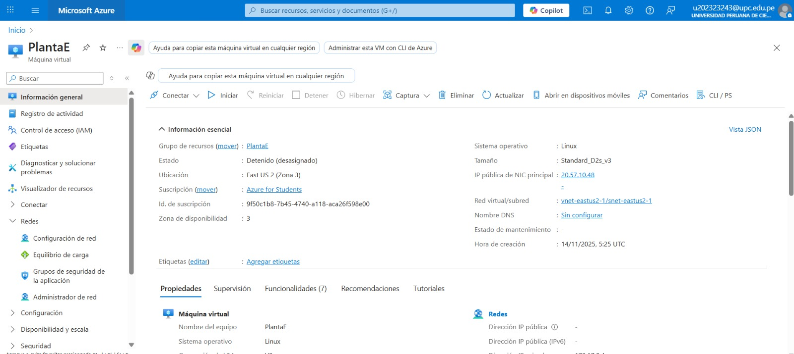    

    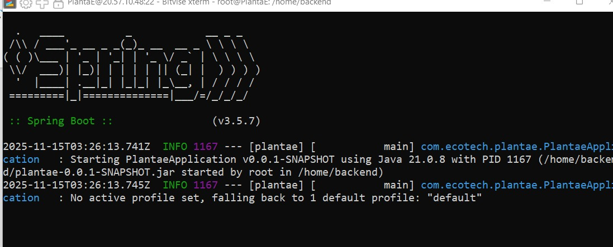    

    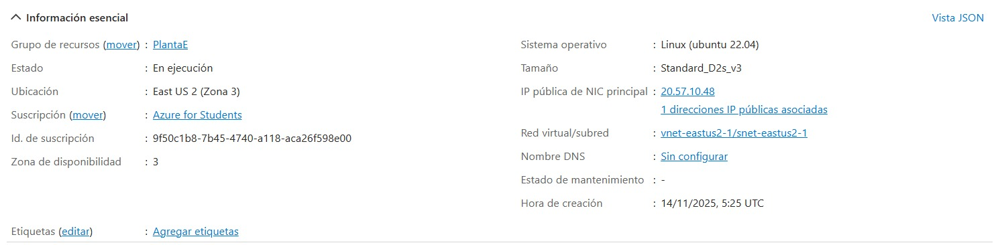    

    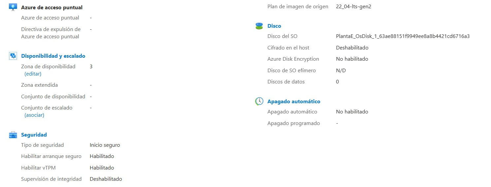    

#### 5.2.3.8 Team Collaboration Insights during Sprint
Durante el Sprint 3, el equipo de Ecotech demostró una colaboración excepcionalmente efectiva en la integración completa entre la Frontend Web Application y los Web Services RESTful del backend de PlantaE. La coordinación técnica precisa y la comunicación constante entre todos los miembros del equipo fueron fundamentales para lograr una integración exitosa y habilitar flujos de trabajo completos.

    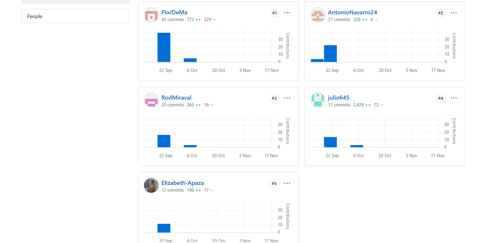

### 5.2.4 Sprint 4

#### 5.2.4.1. Sprint Planning 4

| Sprint #                        | Sprint 3                                                                                                                                                             |
| :------------------------------ | :------------------------------------------------------------------------------------------------------------------------------------------------------------------- |
| **Sprint Planning Background**  |                                                                                                                                                                      |
| Date                            | 2025-12-04                                                                                                                                                           |
| Time                            | 19:00 pm (GMT-5)                                                                                                                                                     |
| Location                        | Modalidad remota mediante la plataforma Discord                                                                                                                      |
| Prepared By                     | Contreras Leon, Flor De María                                                                                                                                        |
| Attendees (to planning meeting) | Apaza Bocanegra, Elizabeth Noelia / Contreras Leon, Flor De María / Guillen Galindo, Julio Adolfo / Miraval Pomalaya, Rodrigo Jesus / Navarro Chinga, Antonio Jhair. |
| Sprint 3 Review Summary         | Se logró desplegar la primera versión del backend, lo que permitió identificar varias mejoras necesarias en la forma de estructurar la información clave de PlantE. Aunque el frontend ya se encontraba finalizado, la retroalimentación del docente evidenció que algunas partes del frontend no estaban correctamente desarrolladas, generando inconsistencias entre ambos lados del sistema.       											 |
| Sprint 3 Retrospective Summary  | En este sprint, a diferencia del anterior, se logró cumplir con los tiempos de entrega establecidos. Esto permitió trabajar con mayor orden y evitar la presión acumulada de tareas pendientes. Aun así, reconocemos la importancia de seguir utilizando de manera eficiente las herramientas de gestión para mantener este ritmo y asegurar un monitoreo constante del progreso del equipo.				                                     |
| **Sprint Goal & User Stories**  |                                                                                                                                                                      |
| Sprint 4 Goal                   | Nuestro objetivo ahora es finalizar el desarrollo del backend y unificarlo correctamente con el frontend. Con ello, buscamos asegurar que las vistas principales interactúen de manera fluida con los servicios web, ofreciendo a las partes interesadas una demostración completa del sistema funcionando de extremo a extremo. El cumplimiento de este objetivo se validará al lograr una integración estable del API desde el frontend.     |
| Sprint 4 Velocity               | 20 puntos                                                                                                                                                            |
| Sum of Story Points             | 10 puntos    																																						 | 

#### 5.2.4.2 Aspect Leaders and Collaborators

Durante el Sprint 4 se definieron los principales aspectos a desarrollar, enfocados inicialmente en funcionalidades del frontend como la visualización de contenido, navegación fluida, adaptabilidad responsiva y la gestión de autenticación de usuarios.

Con el avance del proyecto y el trabajo en backend, se organizó una matriz de liderazgo y colaboración para asegurar una comunicación clara y eficiente dentro del equipo. En esta matriz se asignó a cada aspecto un líder responsable (L) y colaboradores de apoyo (C), garantizando una mejor coordinación entre el desarrollo del frontend y integración con el backend."

| Team Member (Last Name, First Name) | GitHub Username    | Integration & Validation | Data Consistency | Backend Finalization | Frontend Integration |
| :---------------------------------- | :----------------- | :----------------------- | :--------------- | :------------------- | :------------------- |
| Apaza Bocanegra, Elizabeth Noelia   | Elizabeth-Apaza    | L                     	  | C        		 | C       				| C           		   |
| Contreras Leon, Flor De María       | FlorDeMa           | C                        | L       		 | C       			    | C           		   |
| Guillen Galindo, Julio Adolfo	      | julio645           | C                        | C        		 | L        			| C             	   |
| Miraval Pomalaya, Rodrigo Jesus     | RodMiraval         | C                        | C      		     | C        		    | L                    |
| Navarro Chinga, Antonio Jhair       | AntonioNavarro24   | C                        | C      			 | C        			| C                    |

#### 5.2.4.3 Sprint Backlog 4

El objetivo de este Sprint es finalizar el backend e integrarlo completamente con el frontend, asegurando que todas las funcionalidades trabajen de manera coordinada y sin errores. Se busca garantizar que los módulos desarrollados se conecten correctamente con la interfaz, ofreciendo al usuario una experiencia fluida, estable y totalmente funcional. Este sprint consolida la plataforma como un sistema operativo completo y listo para pruebas finales y despliegue.

| User Story ID | User Story Title                    | Task ID | Task Title                                  | Task Description                                                                     | Estimated Hours | Assigned To     | Status |
| :------------ | :---------------------------------- | :------ | :------------------------------------------ | :----------------------------------------------------------------------------------- | :-------------: | :-------------- | :----- |
| **US-006**    | Panel de Métricas                   | T06-1   | Diseño del Panel de Métricas                | Diseñar layout para visualizar métricas clave del cultivo.                           | 1               | Julio Adolfo    | Done   |
|               |                                     | T06-2   | Implementación de Gráficos                  | Programar gráficos dinámicos para mostrar humedad, temperatura y actividad reciente. | 8               | Elizabeth-Apaza | Done   |
|               |                                     | T06-3   | Integración de Datos Reales                 | Conectar panel con la base de datos para mostrar métricas actualizadas.              | 4               | Rodrigo Jesus   | Done   |
| **US-012**    | Visualizar sensores más activos     | T12-1   | Diseño de la Sección de Sensores Activos    | Crear pantalla que muestre los sensores con mayor actividad.                         | 1               | Flor De María   | Done   |
|               |                                     | T12-2   | Implementación de Lista Dinámica            | Programar lista ordenada por actividad y conectada a datos en tiempo real.           | 2               | Elizabeth-Apaza | Done   |
| **US-015**    | Registro de acciones y cosechas     | T15-1   | Diseño de Formulario de Registro            | Crear formulario para registrar acciones realizadas (riego, poda, cosecha).          | 1               | Antonio Jhair   | Done   |
|               |                                     | T15-2   | Implementación de Historial                 | Programar historial que muestre todas las actividades realizadas por fecha y tipo.   | 2               | Julio Adolfo    | Done   |
| **US-021**    | Descargar reportes                  | T21-1   | Diseño del Formato de Reporte               | Definir qué datos incluir en el reporte (sensores, cultivos, alertas, histórico).    | 1               | Rodrigo Jesus   | Done   |
|               |                                     | T21-2   | Implementación de Descarga en PDF           | Programar la exportación de reportes en formato PDF.                                 | 8               | Flor De María   | Done   |
| **US-017**    | Visualizar feedback de la comunidad | T17-1   | Diseño de la Sección de Feedback            | Diseñar vista donde se muestren comentarios y valoraciones de usuarios.              | 1               | Elizabeth-Apaza | Done   |
|               |                                     | T17-2   | Implementación de Visualización de Feedback | Programar listado de comentarios con nombre, valoración y fecha.                     | 4               | Antonio Jhair   | Done   |

#### 5.2.4.4. Development Evidence for Sprint Review

#### 5.2.4.5 Execution Evidence for Sprint Review

#### 5.2.4.6 Services Documentation Evidence for Sprint Review

#### 5.2.4.7. Software Deployment Evidence for Sprint Review.

## 5.3. Validation Interviews

### 5.3.1. Diseño de Entrevistas

**Landing Page / Página de Inicio**
- ¿La información sobre las funciones gratuitas de PlantaE es clara y suficiente?
- ¿El proceso para acceder a la aplicación desde la página de inicio fue directo y sin complicaciones?

**Registro y Autenticación de Usuario**
- ¿El formulario de registro fue simple y rápido de completar?
- ¿Los campos solicitados (nombre, email, contraseña) te parecieron apropiados para crear tu cuenta?
- Durante el registro, ¿quedó claro que estás accediendo a una versión completamente funcional sin restricciones de membresía?

**Dashboard o Panel Principal**
- Al ingresar al panel principal, ¿lograste entender rápidamente cómo navegar por las diferentes secciones?
- ¿La información de resumen que se muestra (como "Mis Plantas" o "Equipos Registrados") es útil para tener una visión general?
- ¿En algún momento te sentiste perdido o confundido dentro del panel?

**Gestión de Plantas**
- Agregar una nueva planta, ¿fue un proceso intuitivo y sencillo?
- ¿La presentación de tus plantas en listas o tarjetas facilita su identificación y organización?
- ¿Encontraste sin problemas la opción para ver el listado de equipos de una planta en específico?

**Gestión de Equipos (dentro de una Planta)**
- Al visualizar los equipos de una planta, ¿la información mostrada es relevante para tus necesidades?
- ¿Agregar un nuevo equipo a una planta fue  (directo) y libre de confusiones?
- Al seleccionar un equipo para ver sus detalles, ¿la información de propiedades mostrada es completa y está bien presentada?

**Configuración y Perfil**
- ¿Ubicaste la sección de Configuración sin dificultad?
- ¿Las opciones de personalización (Idioma y Tema Nocturno) funcionaron correctamente y de inmediato?
- ¿Consideras que estas opciones de configuración son útiles y mejoran tu experiencia en la aplicación?

### 5.3.2. Registro de Entrevistas

**User Persona del Segmento Objetivo 1: Personas con plantas en casa**

|  **DANIEL CASTILLO**                                                                                                                                                                               |  
|:-------------------------------------------------------------------------------------------------------------------------------------------------------------------------------------------------: |
| 
  
                                |
| Género: Masculino                                                                                                                                                                                  |
| Edad: 22 años        
| **Link de la Entrevista:** https://upcedupe-my.sharepoint.com/:v:/g/personal/u202311082_upc_edu_pe/IQDu-vGArPjvQZbIJN1-flTDAfRFYF3reEetcAV8P1jpORY?e=wT3QkQ&nav=eyJyZWZlcnJhbEluZm8iOnsicmVmZXJyYWxBcHAiOiJTdHJlYW1XZWJBcHAiLCJyZWZlcnJhbFZpZXciOiJTaGFyZURpYWxvZy1MaW5rIiwicmVmZXJyYWxBcHBQbGF0Zm9ybSI6IldlYiIsInJlZmVycmFsTW9kZSI6InZpZXcifX0%3D      |
| 
<b>Duración:</b> 00:05:00 &nbsp;&nbsp;&nbsp; <b>Inicio:</b> 00:00:00 &nbsp;&nbsp;&nbsp; <b>Final:</b> 00:05:00 
                                                          |
| Daniel percibe la aplicación como una herramienta clara y fácil de usar, mostrando comodidad y familiaridad con cada paso que se le presenta. Repite varias veces que el sistema es “sencillo” e “intuitivo”, lo que refleja que no encuentra fricciones ni confusiones en el flujo. También valora especialmente la utilidad práctica de los sensores y las alertas, porque entiende que aportan información clave para el cuidado real de las plantas. En general, su actitud es positiva, receptiva y sin objeciones técnicas importantes, transmitiendo que la app le parece funcional, bien organizada y adecuada para usuarios que quieren gestionar sus plantas de manera eficiente.                                                                                                                                                                                    |

|  **ANDRE CARDENAN**                                                                                                                                                                                |  
|:-------------------------------------------------------------------------------------------------------------------------------------------------------------------------------------------------: |
| 
  
                                      |
| Género: Masculino                                                                                                                                                                                  |
| Edad: 21 años        
| **Link de la Entrevista:** https://upcedupe-my.sharepoint.com/:v:/g/personal/u20231c197_upc_edu_pe/IQBAPbPzZ9LaRLTMuplI1HgtAb3jY5Yyp_9oBWWvl_uLqoI?nav=eyJyZWZlcnJhbEluZm8iOnsicmVmZXJyYWxBcHAiOiJTdHJlYW1XZWJBcHAiLCJyZWZlcnJhbFZpZXciOiJTaGFyZURpYWxvZy1MaW5rIiwicmVmZXJyYWxBcHBQbGF0Zm9ybSI6IldlYiIsInJlZmVycmFsTW9kZSI6InZpZXcifX0%3D&e=Nlzd3P      |
| 
<b>Duración:</b> 00:04:05 &nbsp;&nbsp;&nbsp; <b>Inicio:</b> 00:00:00 &nbsp;&nbsp;&nbsp; <b>Final:</b> 00:04:05 
                                                          |
| Andre entiende la aplicación sin dificultad y siente que todo está ordenado y fácil de navegar. A lo largo de la demostración comenta que los procesos ingresar, ver el dashboard, registrar plantas, crear sensores y dispositivos le resultan claros y nada confusos. Le parece especialmente útil que la app permita vincular sensores y mostrar alertas, porque lo ve como algo realmente práctico para cuidar mejor las plantas. En general, transmite una impresión positiva: considera que la herramienta funciona bien, es intuitiva y podría ser utilizada sin problemas por cualquier persona interesada en gestionar sus plantas.           |

**User Persona del Segmento Objetivo 2: Viveros comerciales**

|  **NICOLE GUILLEN**                                                                                                                                                                                |
|:-------------------------------------------------------------------------------------------------------------------------------------------------------------------------------------------------: |
| 
  
                                      |
| Género: Masculino                                                                                                                                                                                  |
| Edad: 35 años                                                                                                                                                                                      |
| **Link de la Entrevista:** https://upcedupe-my.sharepoint.com/:v:/g/personal/u20241a352_upc_edu_pe/IQA3t8o3QYH8Q5MS_7G5JtQbAZmaOU4UJSALY0YLktrarOo?nav=eyJyZWZlcnJhbEluZm8iOnsicmVmZXJyYWxBcHAiOiJPbmVEcml2ZUZvckJ1c2luZXNzIiwicmVmZXJyYWxBcHBQbGF0Zm9ybSI6IldlYiIsInJlZmVycmFsTW9kZSI6InZpZXciLCJyZWZlcnJhbFZpZXciOiJNeUZpbGVzTGlua0NvcHkifX0&e=MEaIVx |
| 
<b>Duración:</b> 00:04:19 &nbsp;&nbsp;&nbsp; <b>Inicio:</b> 00:00:00 &nbsp;&nbsp;&nbsp; <b>Final:</b> 00:04:19 
                                                          |
| Nicoel transmite que la aplicación le resulta clara, ordenada y muy fácil de usar desde el inicio. Percibe que todo el flujo, desde la landing page hasta alertas es intuitivo, sin pasos confusos. La información está bien presentada, es relevante y le permite entender rápidamente cómo funciona cada sección. También valora que los formularios sean breves y que la navegación sea directa. En general, su impresión es positiva, siente que la app está bien estructurada, que cada parte cumple su propósito y que todas las funciones aportan valor a la experiencia del usuario.                                                              |

|  **DIONISIO RODRIGUEZ**                                                                                                                                                                            |
|:-------------------------------------------------------------------------------------------------------------------------------------------------------------------------------------------------: |
| 
  
                                          |
| Género: Masculino                                                                                                                                                                                  |
| Edad: 35 años                                                                                                                                                                                      |
| **Link de la Entrevista:** https://upcedupe-my.sharepoint.com/:v:/g/personal/u202323243_upc_edu_pe/IQDvG7qcbLA4SpbyXvgeLP6zAZK4JCsJsvKpmLwuEPqTFp4?e=TL1NWp&nav=eyJyZWZlcnJhbEluZm8iOnsicmVmZXJyYWxBcHAiOiJTdHJlYW1XZWJBcHAiLCJyZWZlcnJhbFZpZXciOiJTaGFyZURpYWxvZy1MaW5rIiwicmVmZXJyYWxBcHBQbGF0Zm9ybSI6IldlYiIsInJlZmVycmFsTW9kZSI6InZpZXcifX0%3D      |
| 
<b>Duración:</b> 00:05:10 &nbsp;&nbsp;&nbsp; <b>Inicio:</b> 00:00:00 &nbsp;&nbsp;&nbsp; <b>Final:</b> 00:05:10 
                                                          |
| Dionisio percibe que toda la aplicación es clara, directa y fácil de usar. Desde la landing page siente que la información está bien explicada y no encuentra ningún obstáculo para entender las funciones gratuitas ni para navegar. El formulario de registro le parece rápido y lógico, con los datos justos y necesarios. Al llegar al dashboard, entiende de inmediato cómo moverse entre secciones y considera que agregar una planta es un proceso muy intuitivo, ya que todo está ordenado y bien identificado. También interpreta el módulo de vivero como una herramienta útil para organizar sus tareas y anotar fechas límite, nutrientes y prioridades. Finalmente, valora mucho las opciones del perfil, especialmente poder cambiar la contraseña y compartir su información, lo cual ve como funciones prácticas que mejoran la experiencia general dentro de la app. En resumen, su impresión global es positiva: siente que la plataforma es sencilla, funcional y pensada para que cualquier usuario la pueda utilizar sin complicaciones.                                          |

### 5.3.3. Evaluaciones según heurísticas

**Esta evaluacion fue hecho con el Grupo 4:**

    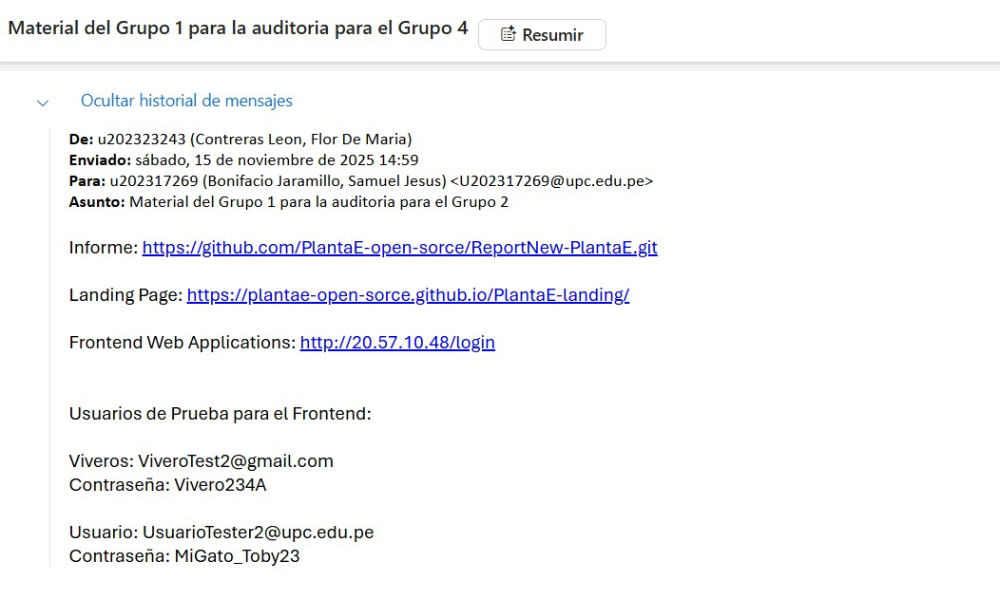    

    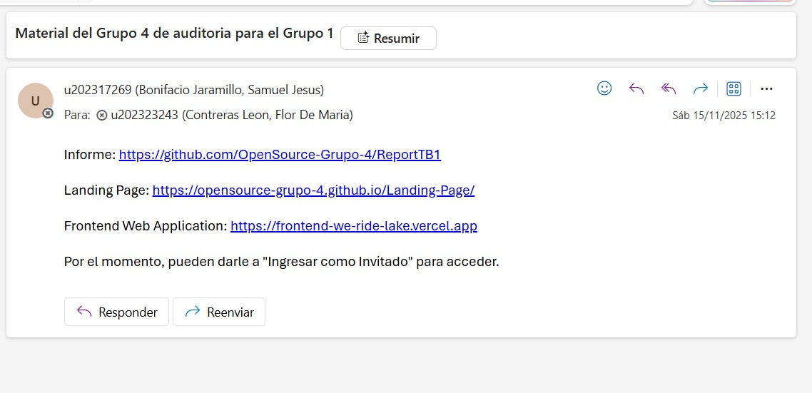    

## Evaluación Heurística de Usabilidad y Diseño Inclusivo para la Aplicación  "PlantaE":

**UX Heuristics & Principles Evaluation**

**Usability – Inclusive Design – Information Architecture**

**CARRERA	: Ingeniería de Software**

**CURSO	: Desarrollo de Aplicaciones Open Source**

**SECCIÓN	: 7380**  
**PROFESORES	: Todos**

**AUDITOR	: Samuel Jesus Bonifacio Jaramillo**

**CLIENTE(S)	:**

	   **Contreras Leon, Flor De María**   

	   **Guillen Galindo, Julio Adolfo**   

	   **Miraval Pomalaya, Rodrigo Jesus** 

	   **Navarro Chinga, Antonio Jhair**

	   **Apaza Bocanegra, Elizabeth Noelia**

**SITE o APP A EVALUAR:** PlantaE

## TAREAS A EVALUAR:

El alcance de esta evaluación incluye la revisión de la usabilidad de las siguientes tareas:

1. Registro de un usuario nuevo
2. Página de Inicio
3. Registro de acciones
4. Plantas registradas
5. Funcionalidad de sensores
6. Búsqueda de dispositivos
7. Gestión de Plantas
8. Alertas
9. Datos de Reportes

No están incluidas en esta versión de la evaluación las siguientes tareas:

1. Perfil
2. Registro como usuario o vivero

## ESCALA DE SEVERIDAD:

Los errores serán puntuados tomando en cuenta la siguiente escala de severidad

| Nivel | Descripción                                                                                                                                                                                    |
| :---: | :--------------------------------------------------------------------------------------------------------------------------------------------------------------------------------------------- |
| 1     | Problema superficial: puede ser fácilmente superador por el usuario ó ocurre con muy poco frecuencia. No necesita ser arreglado a no ser que exista disponibilidad de tiempo.                  |
| 2     | Problema menor: puede ocurrir un poco más frecuentemente o es un poco más difícil de superar para el usuario. Se le debería asignar una prioridad baja resolverlo de cara al siguiente reléase |
| 3     | Problema mayor: ocurre frecuentemente o los usuarios no son capaces de resolverlos. Es importante que sean corregidos y se les debe asignar una prioridad alta.                                |
| 4     | Problema muy grave: un error de gran impacto que impide al usuario continuar con el uso de la herramienta. Es imperativo que sea corregido antes del lanzamiento.                              |

## TABLA RESUMEN:

| \#  | Problema                                                                                 | Escala de severidad | Heurística/Principio violada(o)               |
| :-: | ---------------------------------------------------------------------------------------- | :-----------------: | :-------------------------------------------- |
| 1   | No se encuentra la opción para redirigir al usuario hacia el Frontend desde Landing Page | 2                   | Usability: Libertad y control del usuario     |
| 2   | No se traduce la aplicación por completo                                                 | 1                   | Usability: Consistencia y estándares          |
| 3   | No se puede acceder al Dashboard como vivero                                             | 3                   | Usability: Visibilidad del estado del sistema |
| 4   | Poca intuitividad en panel de Vivero                                                     | 1                   | Usability: Visibilidad del estado del sistema |
| 5   | No se pueden visualizar los reportes generados en PDF                                    | 2                   | Usability: Libertad y control del usuario     |
| 6   | No se puede ingresar una ubicación real                                                  | 1                   | Usability: Consistencia y estándares          |
| 7   | Falta filtrado de plantas                                                                | 2                   | Usability: Libertad y control del usuario     |
| 8   | Falta un dropdown para seleccionar una especie de planta específica                      | 2                   | Usability: Prevención de errores              |
| 9   | No se muestra el mensaje de vinculación de sensores con detalle                          | 2                   | Usability: Visibilidad del estado del sistema |

## DESCRIPCIÓN DE PROBLEMAS:

## PROBLEMA \#1: No se encuentra una opción para redirigir al usuario desde la Landing Page hacia el Frontend

- **Severidad: 2**
- **Heurística violada:** Usabilidad, Libertad y control del usuario
- **Problema:** El usuario que accede a la Landing Page no tiene disponible un acceso  visible para ingresar al sistema (Frontend). Esto genera confusión, incrementa el tiempo de exploración y puede provocar abandono al no saber cómo iniciar sesión o acceder a la - - plataforma funcional.
- **Recomendación:** Incluir un botón visible de acceso al sistema en el header o sección principal de Landing Page, acompañado de un CTA claro como “Ingresar a mi cuenta” o “Ir al panel”.

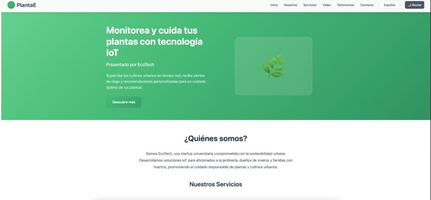

## PROBLEMA \#2: No se traduce la aplicación por completo

- **Severidad: 1**
- **Heurística violada:** Usabilidad \- Consistencia y estándares
- **Problema:** La interfaz mezcla idiomas entre secciones, etiquetas y microtextos. Además del cambio manual entre EN/ES, algunos textos permanecen sin traducirse. Esto afecta la claridad del contenido y puede generar errores de interpretación.
- **Recomendación:** Completar el sistema de internacionalización (i18n), asegurando una traducción integral de todos los componentes.

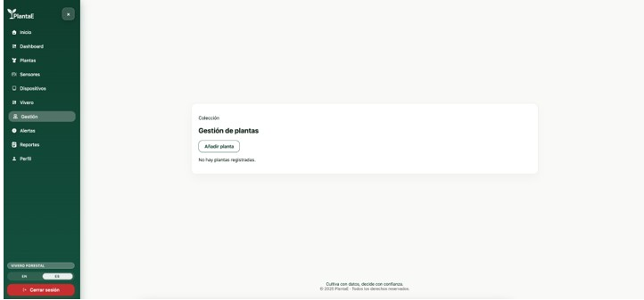

## PROBLEMA \#3: No se puede acceder al Dashboard como vivero

- **Severidad: 3**
- **Heurística violada:** Usabilidad \- Visibilidad del estado del sistema
- **Problema:** El rol “Vivero” no puede verificar el acceso al Dashboard principal o falla al cargar la vista. La interfaz no informa si se trata de un error de permisos, carga o configuración. El usuario queda sin retroalimentación y sin ruta alternativa.
- **Recomendación:** Implementar control de roles con mensajes informativos claros y acciones posibles (por ejemplo, “Solicitar permisos” o redirigir al panel adecuado según su rol).

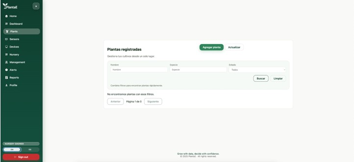

## PROBLEMA \#4: Poca intuitividad en el panel de Vivero

- **Severidad: 1**
- **Heurística violada:** Usabilidad \- Visibilidad del estado del sistema
- **Problema:** Los elementos del panel no cuentan con una estructura fácilmente comprensible a primera vista. Probablemente, los usuarios o cliente deban explorar demasiado para entender dónde realizar las tareas clave, afectando su experiencia.
- **Recomendación:** *Reestructurar el contenido según prioridades del usuario, utilizando agrupaciones visuales, etiquetas más claras e indicadores de acciones principales.*

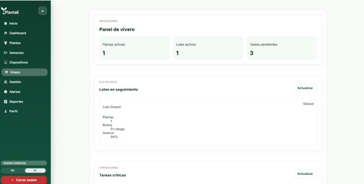

## PROBLEMA \#5: No se pueden visualizar los reportes generados

- **Severidad: 2**
- **Heurística violada:** Usabilidad \- Libertad y control del usuario
- **Problema:** Luego de generar un PDF, CSV o resumen, este se descarga sin opción previa de previsualización o confirmación. Si el archivo contiene errores, el usuario debe repetir el flujo completo sin retroalimentación del sistema.
- **Recomendación:** Agregar un visor de reportes antes de descargar y un mensaje de verificación del contenido generado, así como la posibilidad de cancelar o volver a editar filtros.

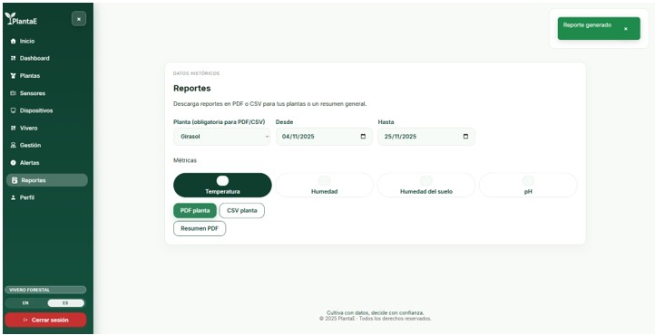

## PROBLEMA \#6: No se puede ingresar una ubicación real

- **Severidad: 1**
- **Heurística violada:** Usabilidad \- Consistencia y estándares
- **Problema:** Campos relacionados a la ubicación de plantas o viveros parecen restringidos o no permiten ingresar direcciones reales, lo que hace que la información no coincida con la del usuario.
- **Recomendación:** Integrar autocompletado basado en mapas o permitir entrada libre de direcciones con validación.

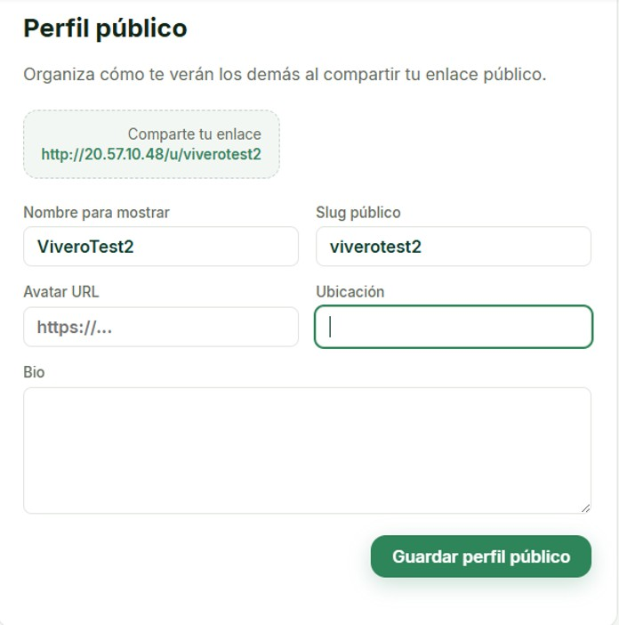

## PROBLEMA \#7: Falta filtrado de plantas

- **Severidad: 2**
- **Heurística violada:** Usabilidad \- Libertad y control del usuario
- **Problema:** La gestión de plantas no permite aplicar autocompletado avanzado (planta, sensor, tipo, especie). El usuario debe escribir toda la lista manualmente, aumentando tiempo y esfuerzo.
- **Recomendación:** Incorporar filtros dinámicos, búsqueda por keywords y ordenamiento para agilizar la gestión, especialmente en viveros con gran cantidad de plantas.

## PROBLEMA \#8: Falta un dropdown para seleccionar una especie específica de planta

- **Severidad: 2**
- **Heurística violada:** Usabilidad \- Prevención de errores
- **Problema:** Actualmente el registro o asignación de plantas depende de texto manual o selección genérica, lo cual puede generar errores tipográficos y datos inconsistentes.
- **Recomendación:** Agregar un dropdown con especies predefinidas y la posibilidad de buscar o registrar nuevas especies bajo un control validado.

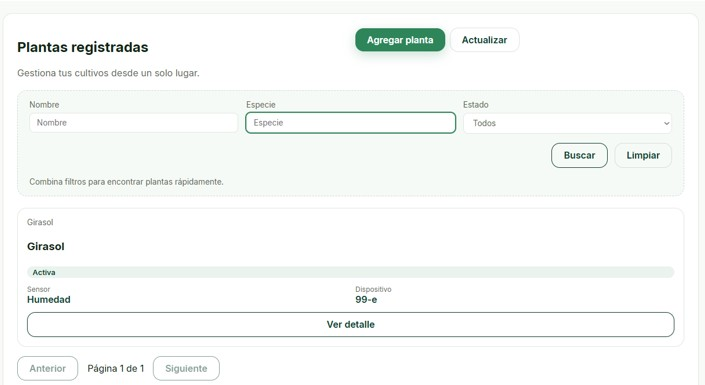

## PROBLEMA \#9: No se muestra un mensaje detallado al vincular sensores

- **Severidad: 2**
- **Heurística violada:** Usabilidad \- Visibilidad del estado del sistema
- **Problema:** Al vincular un sensor, el sistema no comunica con claridad si la operación fue exitosa, qué sensor se vinculó, ni su estado. Esto deja al usuario en incertidumbre.
- **Recomendación:** Implementar mensajes detallados de éxito/fracaso, incluyendo nombre del sensor, planta asociada y tiempo de actualización. Añadir indicadores visuales de estado (conectado/no conectado)

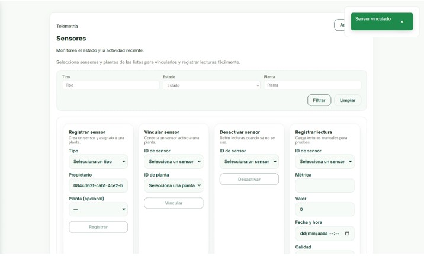

Respositorio de auditoria: https://docs.google.com/document/d/1l-CNk5sWQjeFFNwcNM7c_uK6cvhBi8K9/edit?usp=sharing&ouid=104635486463406620880&rtpof=true&sd=true

---
## Proceso de Evaluacion para el grupo Contrario"

## Evaluación Heurística de Usabilidad y Diseño Inclusivo para la Aplicación  "WeRide"

**UX Heuristics & Principles Evaluation**

**Usability – Inclusive Design – Information Architecture**

**CARRERA:** Ingeniería de Software

**CURSO:** Desarrollo de Aplicaciones Open Source

**SECCIÓN:** 7380  

**PROFESORES:** Todos

**AUDITOR:** Apaza Bocanegra, Elizabeth Noelia

**CLIENTE(S):**
**CLIENTE(S)	:**

	   **Bonifacio Jaramillo, Samuel Jesus**   

	   **Castro Pariona, Jefferson Ernesto**   

	   **Morales Sosa, Arnold Gabriel** 

	   **Romero Meza, Jhimy Pool**

	   **Seminario Castillo, Diego Vicente**

**SITE o APP A EVALUAR:** WeRide

## TAREAS A EVALUAR:

El alcance de esta evaluación incluye la revisión de la usabilidad de las siguientes tareas:

1. Falta de Login en la Landing Page.
2. Funciones Inaccesibles en el login.
3. Interfaz demasiado limpia y sin distribucion clara, imagenes demasiado grandes.
4. Cards demasiado amplias, no funciona el boton de filtrado ni el de favoritos.
5. No hay datos para Bicicletas electricas.
6. No permite Cancelar Reservas.
7. No permite Guardar nuevas reservas desde Booking.
8. La seccion de viaje en ver detalles esta inactiva.
9. El boton Pagar de la seccion planes esta inactivo.
10. Botones de la barra principal como setings, user y demas estan inactivos.
11. No hay opciones de traduccion dificultan comprension de recibos.
12. Reservar vehiculo inactivo.
13. Boton de reservar en cards tambien Inactivo.
14. No permite usar el boton edit booking.

## ESCALA DE SEVERIDAD:

Los errores serán puntuados tomando en cuenta la siguiente escala de severidad

| Nivel | Descripción                                                                                                                                                                                    |
| :---: | :--------------------------------------------------------------------------------------------------------------------------------------------------------------------------------------------- |
| 1     | Problema superficial: puede ser fácilmente superador por el usuario ó ocurre con muy poco frecuencia. No necesita ser arreglado a no ser que exista disponibilidad de tiempo.                  |
| 2     | Problema menor: puede ocurrir un poco más frecuentemente o es un poco más difícil de superar para el usuario. Se le debería asignar una prioridad baja resolverlo de cara al siguiente reléase |
| 3     | Problema mayor: ocurre frecuentemente o los usuarios no son capaces de resolverlos. Es importante que sean corregidos y se les debe asignar una prioridad alta.                                |
| 4     | Problema muy grave: un error de gran impacto que impide al usuario continuar con el uso de la herramienta. Es imperativo que sea corregido antes del lanzamiento.                              |

## TABLA RESUMEN:

| \#    | Problema                                                    | Escala de severidad | Heurística/Principio violada(o)                 |
| :---: | :---------------------------------------------------------- | :-----------------: | :---------------------------------------------- |
| 1	    | Falta de Login en la Landing Page	                          | 2	                | Usability: Libertad y control del usuario       |
| 2	    | Funciones inaccesibles en el Login	                      | 3	                | Usability: Visibilidad del estado del sistema   | 
| 3	    | Interfaz sin distribución clara; imágenes demasiado grandes | 1	                | Usability: Diseño estético y minimalista        |
| 4	    | Cards muy amplias; filtrado y favoritos inactivos	          | 3	                | Usability: Libertad y control del usuario       |
| 5	    | No hay datos para Bicicletas Eléctricas	                  | 2	                | Usability: Consistencia y estándares            |
| 6	    | No permite cancelar reservas	                              | 4	                | Usability: Libertad y control del usuario       |
| 7	    | No se guardan nuevas reservas desde Booking	              | 4	                | Usability: Prevención y recuperación de errores |
| 8	    | Sección “Viaje” en Ver Detalles inactiva	                  | 2	                | Usability: Visibilidad del estado del sistema   |
| 9	    | Botón “Pagar” inactivo en la sección Planes	              | 3	                | Usability: Libertad y control del usuario       |
| 10	| Botones del menú superior (Settings, User, etc.) inactivos  | 2	                | Usability: Visibilidad del estado del sistema   |
| 11	| No hay traducción; dificulta comprensión de recibos	      | 1	                | Usability: Consistencia y estándares            |
| 12	| Función “Reservar vehículo” inactiva	                      | 4	                | Usability: Prevención de errores                |
| 13	| Botón reservar en las cards inactivo	                      | 3	                | Usability: Libertad y control del usuario       |
| 14	| Botón “Edit Booking” no funciona	                          | 3	                | Usability: Flexibilidad y eficiencia de uso     |

## DESCRIPCIÓN DE PROBLEMAS:

## OBSERVACIÓN 1: Falta de Login en la Landing Page

- **Severidad:** 2. Heurística violada: Usabilidad – Libertad y control del usuario
- **Problema:** La Landing Page no ofrece un acceso visible hacia la pantalla de Login. El usuario no tiene una ruta clara para ingresar al sistema, generando confusión y aumentando la tasa de abandono.
- **Recomendación:** Agregar un botón visible (“Iniciar Sesión”, “Ir al Panel”), ubicado en el header o hero principal.

    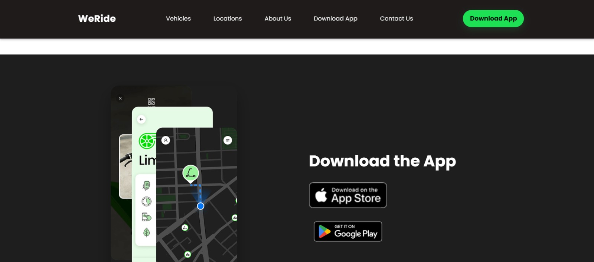    

## OBSERVACIÓN 2: Funciones inaccesibles en el Login

- **Severidad:** 3. Heurística violada: Usabilidad – Visibilidad del estado del sistema
- **Problema:** Algunas funciones de la pantalla de Login no responden o no muestran retroalimentación, como recuperación de contraseña o creación de cuenta. El usuario queda sin información sobre fallas.
- **Recomendación:** Habilitar todos los botones y agregar mensajes de feedback claros (error, éxito, pasos a seguir).

        

## OBSERVACIÓN 3: Interfaz demasiado limpia, sin distribución clara e imágenes muy grandes

- **Severidad:** 1. Heurística violada: Usabilidad – Diseño estético y minimalista
- **Problema:** La interfaz presenta espacios vacíos extensos y elementos demasiado grandes, lo que dificulta encontrar las funciones principales.
- **Recomendación:** Redistribuir el layout usando jerarquía visual, reducir el tamaño de imágenes y reforzar la navegación.

    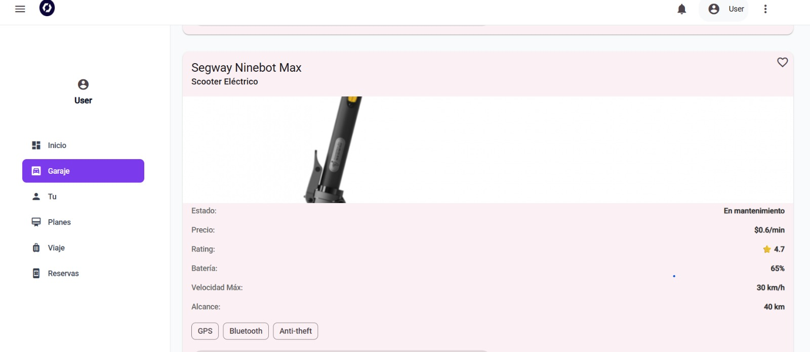    

## OBSERVACIÓN 4: Cards demasiado amplias; botones de filtrado y favoritos no funcionan

- **Severidad:** 3. Heurística violada: Usabilidad – Libertad y control del usuario
- **Problema:** Las cards ocupan demasiado espacio y los botones clave no funcionan, afectando directamente el flujo de selección de vehículos.
- **Recomendación:** Optimizar dimensiones, activar funcionalidad de filtros, favoritos y feedback visual.

    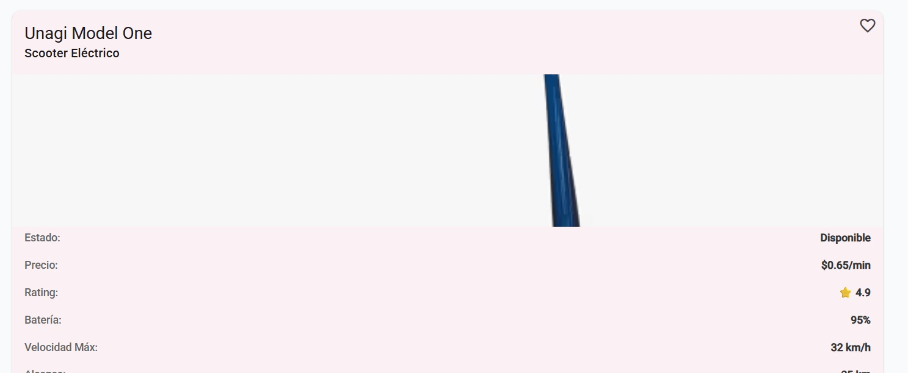    

## OBSERVACIÓN 5: No hay datos para Bicicletas eléctricas

- **Severidad:** 2. Heurística violada: Usabilidad – Consistencia y estándares
- **Problema:** La sección aparece vacía, lo que genera una experiencia inconsistente frente a otras categorías que sí muestran información.
- **Recomendación:** Cargar datos por defecto, mostrar placeholders o indicar que “Pronto habrá disponibilidad”.

    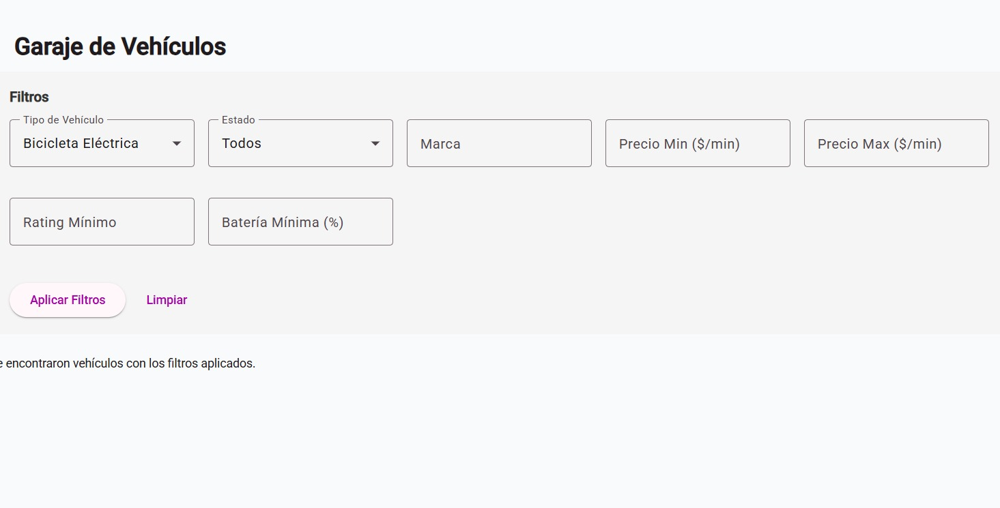    

## OBSERVACIÓN 6: No permite Cancelar Reservas

- **Severidad:** 4. Heurística violada: Usabilidad – Libertad y control del usuario
- **Problema:** Los usuarios no pueden cancelar sus reservas, bloqueando su flujo y generando frustración.
- **Recomendación:** Incorporar botón “Cancelar reserva” con confirmación de acción.

    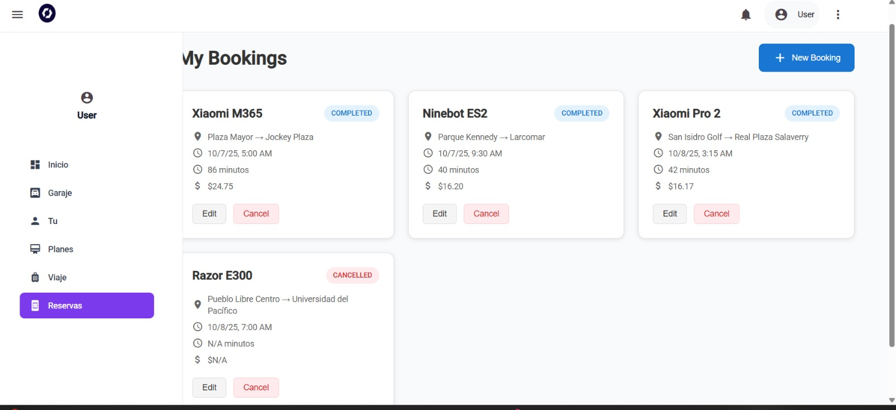    

## OBSERVACIÓN 7: No permite guardar nuevas reservas desde Booking

- **Severidad: 4**. Heurística violada: Usabilidad – Prevención y recuperación de errores
- **Problema:** El flujo de Booking falla al guardar una nueva reserva, interrumpiendo una función crítica.
- **Recomendación:** Corregir el flujo técnico y añadir mensajes que indiquen causa del error y pasos sugeridos.

    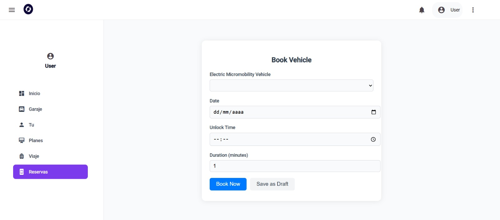    

## OBSERVACIÓN 8: La sección “Viaje” en Ver Detalles está inactiva

- **Severidad:** 2. Heurística violada: Usabilidad – Visibilidad del estado del sistema
- **Problema:** El panel “Viaje” no despliega información ni responde a la interacción. El usuario no entiende si es temporal, un error o falta de permisos.
- **Recomendación:** Activar el componente o mostrar un mensaje informativo (“Función en desarrollo”, “No hay información disponible”).

    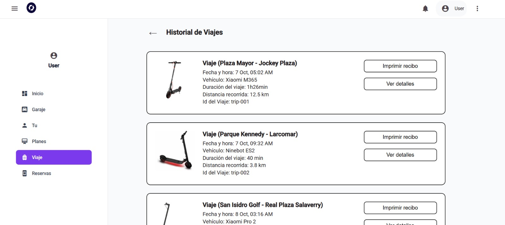    

## OBSERVACIÓN 9: El botón “Pagar” de la sección Planes está inactivo

- **Severidad:** 3. Heurística violada: Usabilidad – Libertad y control del usuario
- **Problema:** El usuario no puede completar el pago de un plan, bloqueando una acción central del modelo de negocio.
- **Recomendación:** Activar el botón, conectar el flujo a la pasarela de pago y agregar validaciones previas.

    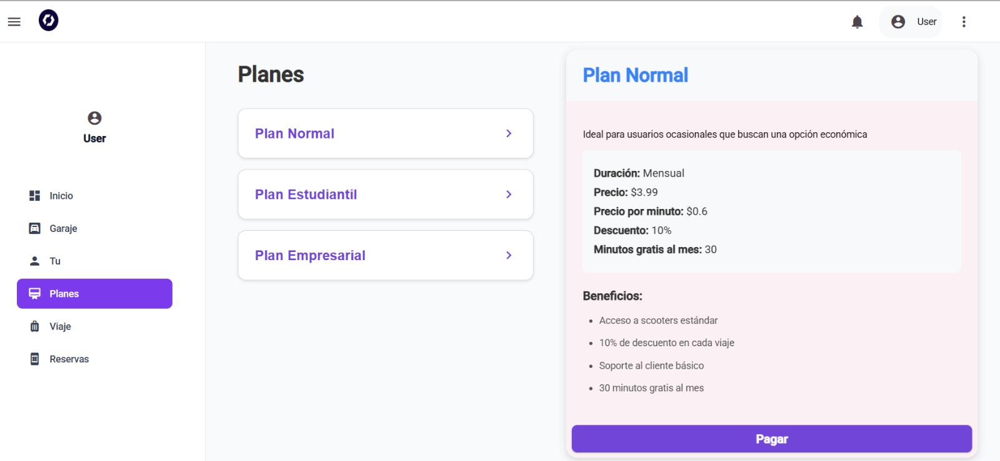    

## OBSERVACIÓN 10: Botones como Settings y User en la barra principal están inactivos

- **Severidad:** 2. Heurística violada: Usabilidad – Visibilidad del estado del sistema
- **Problema:** Los accesos principales no ejecutan acción alguna, lo que genera percepción de sistema incompleto o fallido.
- **Recomendación:** Implementar navegación interna o, al menos, mensajes temporales de “módulo en construcción”.

    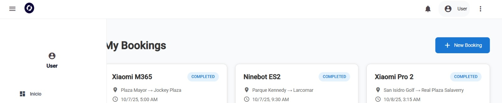    

## OBSERVACIÓN 11: No hay opciones de traducción y dificulta la comprensión de recibos

- **Severidad:** 1. Heurística violada: Usabilidad – Consistencia y estándares
- **Problema:** El contenido de recibos y pantallas clave está solo en un idioma, dificultando la comprensión para usuarios que no lo manejan.
- **Recomendación:** Integrar sistema de internacionalización (i18n) y traducciones completas.

    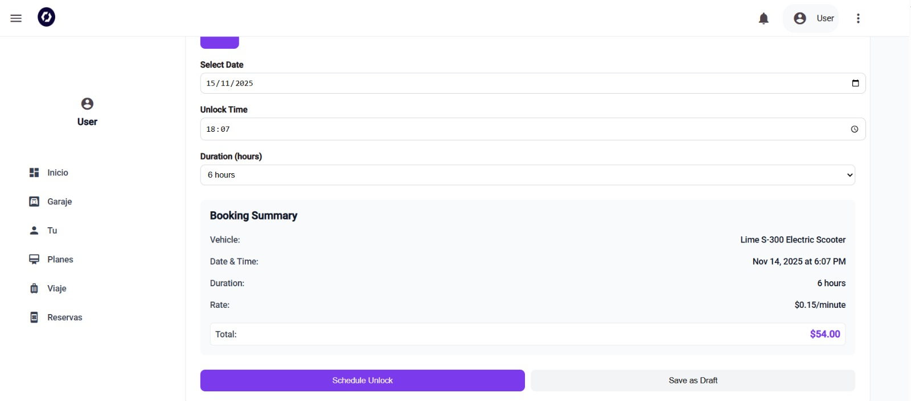    

## OBSERVACIÓN 12: Reservar vehículo está inactivo

- **Severidad:** 4. Heurística violada: Usabilidad – Prevención de errores
- **Problema:** Al intentar reservar un vehículo, el botón o acción no funciona. Esto afecta directamente la funcionalidad principal del sistema.
- **Recomendación:** Habilitar el botón, validar datos y mostrar confirmación de reserva exitosa.

    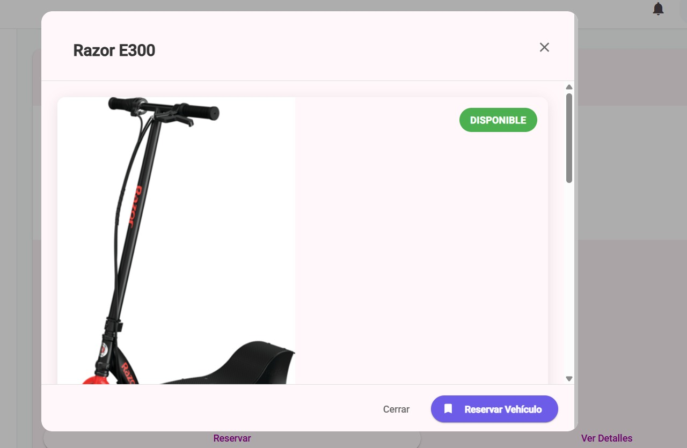    

## OBSERVACIÓN 13: Botón de reservar dentro de las cards también está inactivo

- **Severidad:** 3. Heurística violada: Usabilidad – Libertad y control del usuario
- **Problema:** El usuario no puede reservar desde la vista de cards, obligándolo a pasos adicionales o impidiendo continuar.
- **Recomendación:** Activar interacción, añadir feedback visual y redirigir al flujo de Booking.

    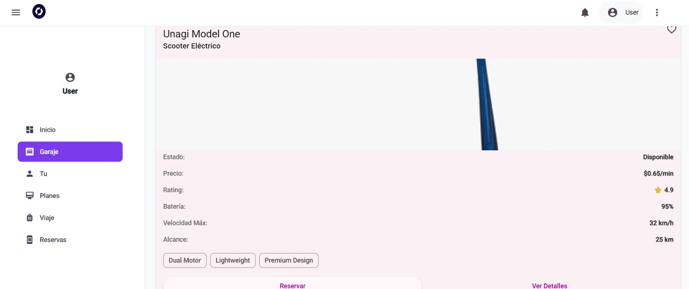    

## OBSERVACIÓN 14: No permite usar el botón “Edit Booking”

- **Severidad:** 3. Heurística violada: Usabilidad – Flexibilidad y eficiencia de uso
- **Problema:** El botón para editar una reserva no responde, y el usuario no puede modificar fechas, horarios o vehículo seleccionado.
- **Recomendación:** Implementar formulario editable, mensajes de validación y confirmación de cambios.

    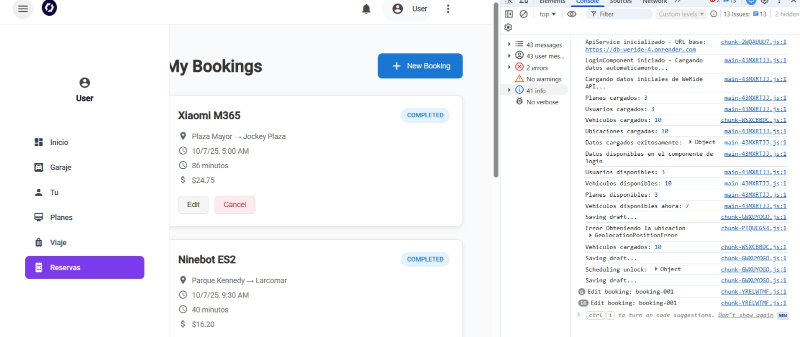    

## 5.4. Video About-the-Product

En esta parte, el equipo ofrece una síntesis de los puntos más importantes de PlantE. El contenido audiovisual describe detalladamente las funciones principales de la aplicación, mostrando cómo cada una fue creada para atender las necesidades de las plantas, ya sean hogares o comericales.

El video incluye demostraciones visuales del uso de la app, mostrando pasos esenciales como las recomendaciones de riego y luz, monitoreo del crecimiento, alertas de cuidado y reportes generales sobre tus plantas registradas.

La narración guía al espectador por toda la experiencia de uso, mientras que testimonios reales aportan credibilidad al compartir cómo la aplicación ha facilitado el cuidado de plantas tanto para principiantes como para aficionados experimentados. Estos relatos destacan la facilidad de uso y la mejora en la salud de las plantas.

En conjunto, el video no solo presenta el producto, sino que lo posiciona como una solución digital efectiva para apoyar el cuidado responsable de las plantas, demostrando su utilidad, su usabilidad y su impacto positivo.

**Video Explicativo**

        

**URL de la Versión Publicada**

- Link de YouTube: https://youtu.be/NjN0LWdj1WI
