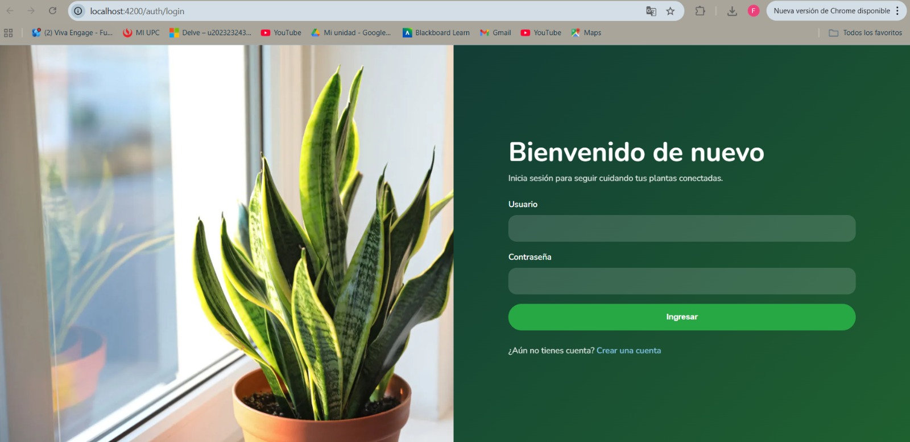
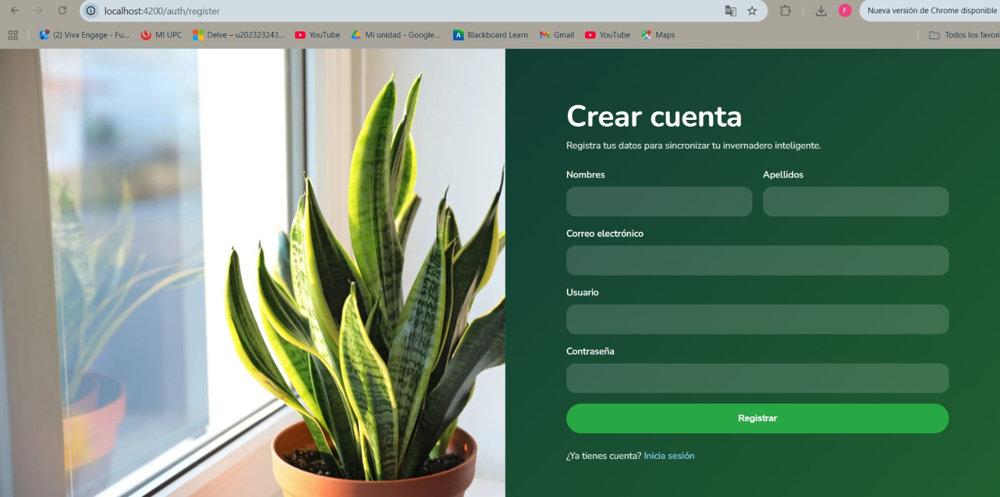
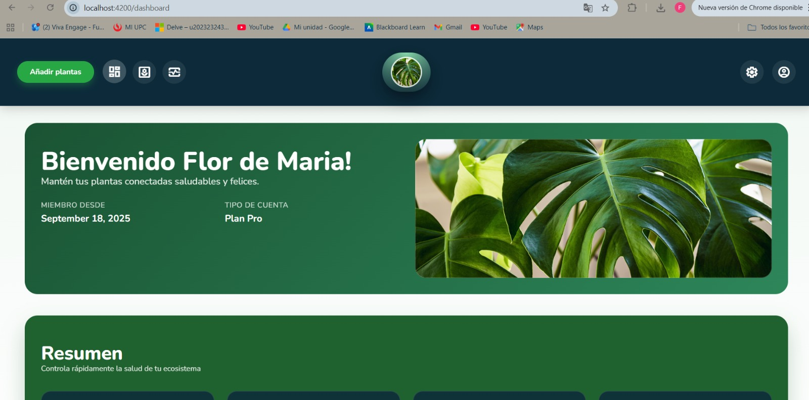
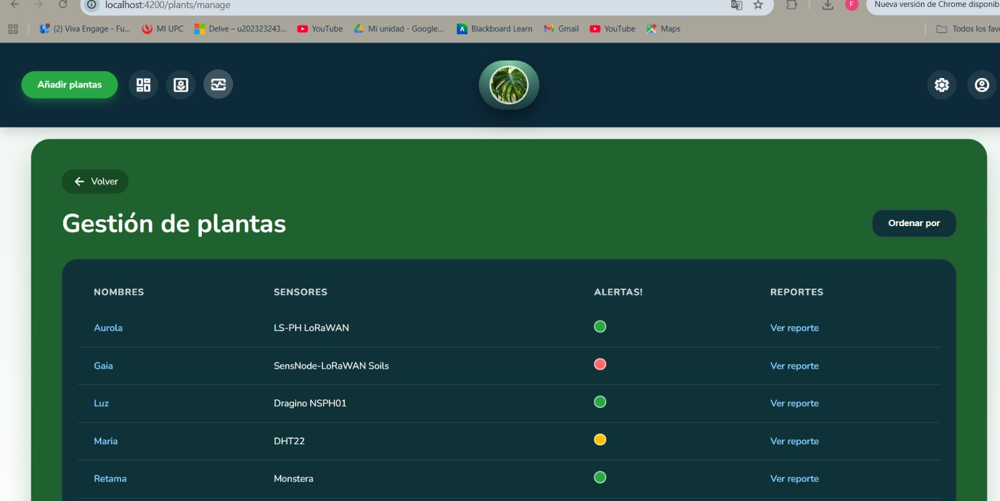
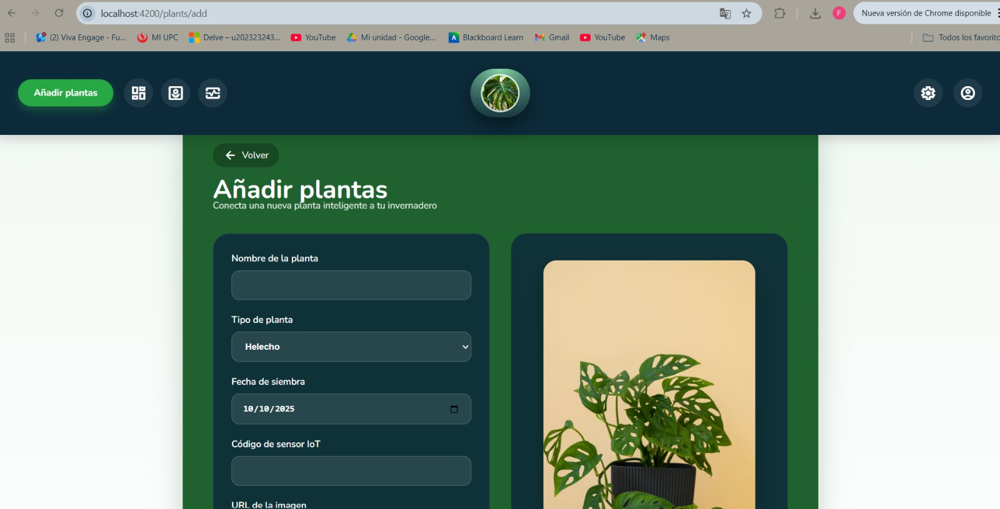
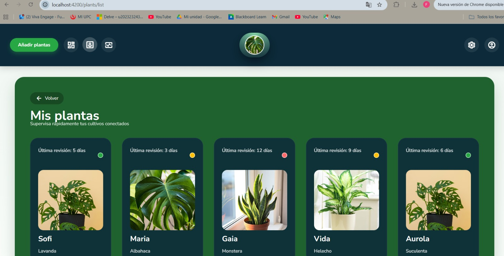
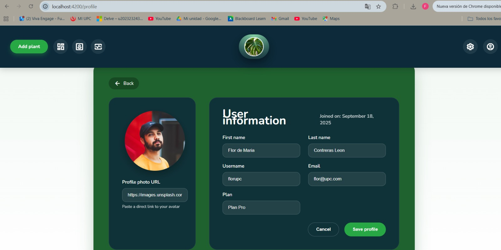

# Capítulo V: Product Implementation, Validation & Deployment

## 5.1. Software Configuration Management.

### 5.1.1 Software Development Environment Configuration

A continuación, se listan las herramientas y estándares adoptados por el equipo para el desarrollo colaborativo del sistema:

| Actividad               | Herramienta / Guía                                    | Propósito                                                     | Tipo de acceso / Ruta                                                                                                                 |
| ----------------------- | ------------------------------------------------------ | -------------------------------------------------------------- | ------------------------------------------------------------------------------------------------------------------------------------- |
| Project Management      | Trello                                                 | Seguimiento de backlog, tareas y sprints.                      | [https://trello.com/](https://trello.com/)                                                                                               |
| Requirements Management | Gherkin Conventions                                    | Escritura legible de requisitos con formato Given/When/Then.   | [https://cucumber.io/docs/gherkin/](https://cucumber.io/docs/gherkin/)                                                                   |
| Product UX/UI Design    | Figma                                                  | Prototipos y diseño responsive.                               | SaaS –[https://figma.com](https://figma.com)                                                                                            |
| Landing Page            | HTML, CSS, JavaScript             | Construcción del Landing Page del sistema.                        |                                                                |
| Version Control         | Git + GitHub                                           | Gestión colaborativa del código fuente.                      | SaaS –[https://github.com](https://github.com)                                                                                          |
| Software Deployment     | Github pages                                           | Despliegue continuo del sistema en ambientes de testing.       | SaaS –[https://railway.app](https://railway.app) / [https://render.com](https://render.com)                                                |                                                                                   |

### 5.1.2. Source Code Management

En esta sección el equipo establece los medios y esquema de organización que aplicará para el seguimiento de modificaciones. Para ello se utilizará **GitHub** como plataforma y sistema de control de versiones.

A continuación se indican los URLs de los repositorios de GitHub para cada producto:

- **Landing Page**: https://github.com/PlantaE-open-sorce/PlantaE-landing

#### GitFlow Workflow

Se implementará el modelo de ramificación propuesto por Vincent Driessen en su artículo *“A successful Git branching model”*, conocido como **GitFlow**. Este modelo organiza el trabajo en las siguientes ramas:

- `main`: Rama principal, contiene siempre el código en producción.
- `develop`: Rama de desarrollo principal, donde se integran las funcionalidades antes de pasar a producción.
- `feature/*`: Ramas creadas a partir de `develop` para desarrollar nuevas funcionalidades.**Convención de nombres:** `feature/<nombre-corto-descriptivo>`_Ejemplo: `feature/login-auth`_
- `release/*`: Ramas creadas desde `develop` cuando se prepara una nueva versión para producción.**Convención de nombres:** `release/<versión>`_Ejemplo: `release/TB1`_

#### Versionado Semántico

Se aplicará el esquema de **Semantic Versioning 2.0.0**, con el siguiente formato:

- **MAJOR**: Incompatibilidades en la API.
- **MINOR**: Nuevas funcionalidades sin romper compatibilidad.
- **PATCH**: Correcciones de errores menores y ajustes sin afectar funcionalidades.

_Ejemplo de versión:_ `v1.3.2`

#### Convenciones de Commits

Se utilizará el estándar de **Conventional Commits** para los mensajes de commits. Esto facilitará la automatización en los procesos de integración continua y generación de changelogs.

**Ejemplos:**

- `feat: add login functionality`
- `fix: correct null pointer exception on user service`
- `chore: update dependencies`

### 5.1.3. Source Code Style Guide & Conventions.

#### Frontend (Landing Page - HTML, CSS, JavaScript)

##### Convenciones generales:

- **Idioma**: Todo el código, incluyendo nombres de variables, funciones y clases, está escrito en **inglés**.
- **Indentación**: 2 espacios.
- **Formato de archivos**: `.html`, `.css`, `.js`
- **Estilo de código adoptado**:
  - https://www.w3schools.com/html/html5_syntax.asp
  - https://google.github.io/styleguide/htmlcssguide.html

##### Nomenclatura:

- **Clases CSS**: `kebab-case` (ej. `main-container`)
- **IDs HTML**: `camelCase` (ej. `mainContent`)
- **Variables JS**: `camelCase` (ej. `userName`)
- **Funciones JS**: `camelCase` (ej. `handleClick()`)

### 5.1.4. Software Deployment Configuration

Esta sección detalla los pasos necesarios para desplegar de forma satisfactoria los productos digitales que componen la solución: el landing page.

**1. Landing Page - HTML, CSS y Javascript**

**Tecnología Base**

* Lenguajes: HTML5, CSS3, JavaScript
* Hosting: GitHub Pages

**Configuración y Despliegue**

* Repositorio de Código Fuente:
  La Landing Page se desarrolla utilizando HTML, CSS y JavaScript puro. Todos los archivos del proyecto deben subirse a un repositorio público en GitHub. Es obligatorio que el archivo `index.html` esté ubicado en la raíz del repositorio (`/`) para que GitHub Pages lo detecte correctamente como punto de entrada del sitio.

**Configuración del despliegue en GitHub Pages** :

* Acceder al repositorio en GitHub.
* Ir a la sección **Settings** del repositorio.
* En el menú lateral, seleccionar  **Pages** .
* En el campo  **Source** , elegir:
  * Rama: `main`
  * Carpeta: `/ (root)`
* Guardar los cambios.

**Publicación** :

Una vez guardada la configuración, GitHub generará automáticamente una URL pública donde la Landing Page estará disponible. Esta URL sigue el formato: `https://<usuario>.github.io/<repositorio>/`

**Actualizaciones** :

Cualquier nuevo commit hecho a la rama `main` será detectado automáticamente por GitHub Pages y aplicado en la versión publicada sin necesidad de acciones adicionales.

## 5.2. Landing Page, Services & Applications Implementation

### 5.2.1 Sprint 1

#### 5.2.1.1. Sprint Planning 1

A continuación, se presenta la planificación correspondiente a nuestro Sprint 1, el cual tiene como enfoque principal el desarrollo de la landing page de PlantaE. En esta etapa inicial, el equipo definió el objetivo del sprint, seleccionó las historias de usuario más relevantes y estableció los entregables clave que permitirán construir una primera versión funcional y visualmente atractiva de la página. Esta planificación busca asegurar un entendimiento compartido entre todos los miembros del equipo y sentar las bases para comunicar eficazmente el valor de la plataforma a los usuarios potenciales.

| Sprint #                             | Sprint 1                                                                                                                                                                                                                                                                                                                                                                                                                                                                                                                              |
| ------------------------------------ | ------------------------------------------------------------------------------------------------------------------------------------------------------------------------------------------------------------------------------------------------------------------------------------------------------------------------------------------------------------------------------------------------------------------------------------------------------------------------------------------------------------------------------------- |
| **Sprint Planning Background** |                                                                                                                                                                                                                                                                                                                                                                                                                                                                                                                                       |
| Date                                 | 2025-09-10                                                                                                                                                                                                                                                                                                                                                                                                                                                                                                                            |
| Time                                 | 19:00 pm (GMT-5)                                                                                                                                                                                                                                                                                                                                                                                                                                                                                                                      |
| Location                             | Modalidad remota mediante la plataforma Discord                                                                                                                                                                                                                                                                                                                                                                                                                                                                                       |
| Prepared By                          | Contreras Leon, Flor De María                                                                                                                                                                                                                                                                                                                                                                                                                                                                                                     |
| Attendees (to planning meeting)      | Apaza Bocanegra, Elizabeth Noelia / Contreras Leon, Flor De María / Guillen Galindo, Julio Adolfo / Miraval Pomalaya, Rodrigo Jesus / Navarro Chinga, Antonio Jhair                                                                                                                                                                                                                                                                                                                                                                          |
| Sprint 0 Review Summary              | Dado que este es el sprint inicial, no se presenta un resumen del sprint anterior.                                                                                                                                                                                                                                                                                                                                                                                                                                                    |
| Sprint 0 Retrospective Summary       | Dado que este es el sprint inicial, no se presenta una retroalimentación del sprint anterior.                                                                                                                                                                                                                                                                                                                                                                                                                                        |
| **Sprint Goal & User Stories** |                                                                                                                                                                                                                                                                                                                                                                                                                                                                                                                                       |
| Sprint 1 Goal                        | Nos enfocamos en implementar la estructura principal y las funcionalidades clave de la landing page pública de PlantaE. Creemos que esto aportará una percepción más sólida del producto y despertará mayor interés entre los usuarios potenciales, al comunicar de forma clara el valor y los beneficios de la plataforma. Esto se confirmará cuando los visitantes puedan navegar de manera fluida por la página, comprendan fácilmente qué ofrece PlantaE y muestren intención de interactuar o registrarse. |
| Sprint 1 Velocity                    | 18 puntos                                                                                                                                                                                                                                                                                                                                                                                                                                                                                                                             |
| Sum of Story Points                  | 18 puntos     

#### 5.2.1.2 Aspect Leaders and Collaborators

##### Aspect Leaders and Collaborators

Durante el Sprint 1, se han definido los principales aspectos a desarrollar, correspondientes a funcionalidades específicas como la visualización de contenido, navegación fluida, adaptabilidad responsiva y gestión de autenticación de usuarios.

Con el objetivo de asegurar una comunicación clara y eficiente dentro del equipo, se elaboró la siguiente matriz de liderazgo y colaboración (LACX), asignando para cada aspecto un líder responsable (L) y colaboradores de apoyo (C).

| Team Member (Last Name, First Name) | GitHub Username    | Questions and Tutorial | About us | Benefits | Testimonials | Contact and Download |
| :---------------------------------- | :----------------- | :--------------------- | :------- | :------- | :----------- | :------------------- |
| Apaza Bocanegra, Elizabeth Noelia | Elizabeth-Apaza     | L                      | C        | C        | C            | C                    |
| Contreras Leon, Flor De María                | FlorDeMa           | C                      | L        | C        | C            | C                    |
| Guillen Galindo, Julio Adolfo	        | julio645         | C                      | C        | L        | C            |                      |
| Miraval Pomalaya, Rodrigo Jesus        | RodMiraval            | C                      | C        | C        | L            | C                    |
| Navarro Chinga, Antonio Jhair    | AntonioNavarro24 | C                      | C        | C        | C            | L                    |

#### 5.2.1.3 Sprint Backlog 1

El objetivo principal de este Sprint es diseñar, implementar y validar las secciones del landing page, asegurando una navegación fluida, una experiencia responsiva en todos los dispositivos y funcionalidades críticas como registro. Se busca garantizar que el usuario final pueda interactuar de manera sencilla y eficiente con la plataforma, mejorando su satisfacción y promoviendo el cumplimiento de los objetivos de negocio.

| User Story ID | User Story Title                  | Task ID | Task Title                                     | Task Description                                                                                                                                  | Estimated Hours |
| ------------- | --------------------------------- | ------- | ---------------------------------------------- | ------------------------------------------------------------------------------------------------------------------------------------------------ | --------------- |
| US-009        | Sección de Contáctanos            | T101    | Diseño del Formulario de Contacto              | Diseñar un formulario con campos de nombre, correo electrónico y mensaje.                                                                         | 1/2h            |
|               |                                   | T102    | Implementación de Envío Válido                 | Programar el formulario para almacenar la solicitud y notificar al equipo cuando los datos estén completos.                                       | 1h              |
|               |                                   | T103    | Validación de Campos                           | Implementar validación que muestre errores cuando falten datos obligatorios o el correo sea inválido.                                             | 1/2h            |
| US-010        | Mostrar autores de la aplicación  | T104    | Diseño de la Sección de Autores                | Diseñar sección “Sobre nosotros” con espacio para lista de nombres, roles y fotos.                                                                | 1/2h            |
|               |                                   | T105    | Implementación de Autores                      | Mostrar dinámicamente los autores con su nombre, rol y fotografía.                                                                                | 1h              |
| US-024        | Consultar Preguntas Frecuentes    | T106    | Definición de Preguntas Frecuentes             | Redactar al menos tres preguntas frecuentes relacionadas con sensores y uso de la app.                                                            | 1/2h            |
|               |                                   | T107    | Implementación de Sección FAQ                  | Implementar sección de ayuda que muestre preguntas y respuestas de forma clara y accesible.                                                        | 1h              |
| US-025        | Contacto directo                  | T108    | Diseño de Formulario de Contacto Directo       | Crear formulario de nombre, correo electrónico y mensaje para contacto directo.                                                                   | 1/2h            |
|               |                                   | T109    | Implementación de Envío Válido en Formulario   | Almacenar la solicitud en sistema cuando los datos estén completos.                                                                               | 1h              |
|               |                                   | T110    | Mensaje de Confirmación                        | Mostrar mensaje de confirmación “Gracias por tu mensaje, te responderemos pronto” tras el envío.                                                   | 1/2h            |
| US-026        | Información institucional         | T111    | Diseño de Footer                               | Diseñar footer con enlaces a redes sociales, contacto y términos legales.                                                                         | 1/2h            |
|               |                                   | T112    | Implementación de Footer Fijo                  | Implementar el footer de manera persistente en todo el sitio.                                                                                     | 1h              |
| US-027        | Acceso a secciones principales    | T113    | Definición de Menú de Navegación               | Diseñar menú principal con enlaces a Inicio, Beneficios y Contacto.                                                                               | 1/2h            |
|               |                                   | T114    | Implementación de Navegación Principal         | Implementar navegación accesible y funcional a las secciones clave desde el menú.                                                                 | 1h              |
| US-028        | Comprensión inmediata             | T115    | Diseño del Mensaje Principal                   | Diseñar mensaje de valor que represente la esencia de PlantaE en la primera pantalla.                                                             | 1/2h            |
|               |                                   | T116    | Implementación de Mensaje de Valor             | Programar la visualización del mensaje principal al cargar la página.                                                                             | 1h              |
| US-029        | Beneficios segmentados            | T117    | Definición de Contenido por Perfil             | Redactar beneficios diferenciados para hogar, vivero y comunidad.                                                                                 | 1/2h            |
|               |                                   | T118    | Implementación de Beneficios Personalizados    | Mostrar dinámicamente la información segmentada según el perfil seleccionado.                                                                     | 1h              |
| US-033        | Testimonios de usuarios           | T119    | Diseño de la Sección de Testimonios            | Diseñar sección visualmente atractiva para mostrar experiencias de usuarios.                                                                      | 1/2h            |
|               |                                   | T120    | Implementación de Testimonios                  | Mostrar mínimo tres testimonios con nombre, tipo de usuario y comentario.                                                                         | 1h              |
|               |                                   | T121    | Validación de Datos de Testimonios             | Asegurar que cada testimonio incluya nombre, tipo de usuario y comentario.                                                                        | 1/2h            |

#### 5.2.1.4. Development Evidence for Sprint Review

Durante el Sprint 1, el equipo se enfocó exclusivamente en el desarrollo de la Landing Page de la plataforma PlantaE.
El objetivo principal fue construir una página pública funcional, atractiva visualmente y completamente responsiva, que comunique eficazmente la propuesta de valor de la plataforma a los usuarios potenciales.
A lo largo del Sprint se diseñaron e implementaron secciones clave como Hero, Sobre Nosotros, Beneficios, Testimonios, Preguntas Frecuentes, Tutoriales, Contacto y el Footer.
También se trabajó en asegurar la adaptabilidad móvil, el cumplimiento de criterios de accesibilidad y la optimización inicial para motores de búsqueda (SEO).

#### Productos según alcance del Sprint:

##### Landing Page

Durante el Sprint 1 se implementó la Landing Page de PlantaE.
Los principales avances fueron:

- Diseño responsivo para diferentes tamaños de pantalla.
- Creación de secciones: Hero, Sobre Nosotros, Beneficios, Testimonios, Preguntas Frecuentes, Contacto y Footer.
- Aplicación de buenas prácticas de accesibilidad (etiquetado semántico, contraste adecuado).
- Optimización inicial para motores de búsqueda (SEO básico).
- Implementación de navegación fluida entre secciones.
- Validación de compatibilidad en navegadores y dispositivos.

#### 5.2.1.5 Execution Evidence for Sprint Review

#### 5.2.1.6 Services Documentation Evidence for Sprint Review

Durante este sprint se completó el diseño e implementación del Landing Page del sistema, el cual forma parte del acceso inicial al sistema y constituye un punto de entrada fundamental para los usuarios. Aunque no se implementaron endpoints tradicionales de tipo REST en este sprint, se documenta a continuación la URL del recurso publicado, junto con evidencia de despliegue, interacción y commits relacionados.

**Descripción del Logro:**

-Implementación del Landing Page estático.

-Deployment del landing page.

### Recursos del Sprint

| Recurso      | Acción implementada   | Método HTTP | URL / Endpoint                                                              | Link de repositorio                                                         |
| ------------ | ---------------------- | ------------ | --------------------------------------------------------------------------- | --------------------------------------------------------------------------- |
| Landing Page | Visualización inicial | GET          | https://plantae-open-sorce.github.io/PlantaE-landing/ | https://github.com/PlantaE-open-sorce/PlantaE-landing |

#### 5.2.1.7. Software Deployment Evidence for Sprint Review.

Durante este Sprint, se realizaron actividades de despliegue de la Landing Page utilizando GitHub Pages como plataforma de hosting. A continuación, se detallan los pasos ejecutados:

**1- Se accedió a la sección Settings del repositorio.**

Dentro de Pages, se seleccionó la rama (main o master) y la carpeta (root o /docs) desde la cual GitHub Pages debía publicar el sitio.
Se guardaron los cambios para activar la publicación automática.

**2- Por default ya esta activado el https**

**3- En la seccion "All workflows" se puede ver que la app se esta deployando.**

**4- El landing page fue exitosamente deployado**

**5- Se obtuvo y verificó la URL pública proporcionada por GitHub Pages.**

### 5.2.2. Sprint 2
Se documenta el proceso de implementación, pruebas, documentación y despliegue del segundo Sprint, enfocado en la construcción de la Frontend Web Application de PlantaE. Este sprint se centró en desarrollar las interfaces de usuario principales utilizando Angular y TypeScript, asegurando una experiencia fluida y atractiva para ambos segmentos objetivo: dueños de plantas y viveros.

#### 5.2.2.1. Sprint Planning 2.

| Sprint #                             | Sprint 1                                                                                                                                                                                                                                                                                                                                                                                                                                                                                                                              |
| ------------------------------------ | ------------------------------------------------------------------------------------------------------------------------------------------------------------------------------------------------------------------------------------------------------------------------------------------------------------------------------------------------------------------------------------------------------------------------------------------------------------------------------------------------------------------------------------- |
| **Sprint Planning Background** |                                                                                                                                                                                                                                                                                                                                                                                                                                                                                                                                       |
| Date                                 | 2025-09-10                                                                                                                                                                                                                                                                                                                                                                                                                                                                                                                            |
| Time                                 | 19:00 pm (GMT-5)                                                                                                                                                                                                                                                                                                                                                                                                                                                                                                                      |
| Location                             | Modalidad remota mediante la plataforma Discord                                                                                                                                                                                                                                                                                                                                                                                                                                                                                       |
| Prepared By                          | Contreras Leon, Flor De María                                                                                                                                                                                                                                                                                                                                                                                                                                                                                                     |
| Attendees (to planning meeting)      | Apaza Bocanegra, Elizabeth Noelia / Contreras Leon, Flor De María / Guillen Galindo, Julio Adolfo / Miraval Pomalaya, Rodrigo Jesus / Navarro Chinga, Antonio Jhair                                                                                                                                                                                                                                                                                                                                                                          |
| Sprint 0 Review Summary              | Dado que este es el sprint inicial, no se presenta un resumen del sprint anterior.                                                                                                                                                                                                                                                                                                                                                                                                                                                    |
| Sprint 0 Retrospective Summary       | Dado que este es el sprint inicial, no se presenta una retroalimentación del sprint anterior.                                                                                                                                                                                                                                                                                                                                                                                                                                        |
| **Sprint Goal & User Stories** |                                                                                                                                                                                                                                                                                                                                                                                                                                                                                                                                       |
| Sprint 1 Goal                        | Nos enfocamos en implementar la estructura principal y las funcionalidades clave de la landing page pública de PlantaE. Creemos que esto aportará una percepción más sólida del producto y despertará mayor interés entre los usuarios potenciales, al comunicar de forma clara el valor y los beneficios de la plataforma. Esto se confirmará cuando los visitantes puedan navegar de manera fluida por la página, comprendan fácilmente qué ofrece PlantaE y muestren intención de interactuar o registrarse. |
| Sprint 1 Velocity                    | 18 puntos                                                                                                                                                                                                                                                                                                                                                                                                                                                                                                                             |
| Sum of Story Points                  | 18 puntos     

#### 5.2.2.2. Aspect Leaders and Collaborators.
En esta sección se presenta la Leadership-and-Collaboration Matrix (LACX) correspondiente al Sprint 2, enfocado en el desarrollo de los bounded contexts del backend y la implementación de la arquitectura de microservicios. Esta matriz define los roles, responsabilidades y nivel de participación de cada miembro del equipo durante el desarrollo de los Web Services RESTful.
#### Aspectos Clave del Sprint 2
Para el Sprint 2, se han identificado cuatro aspectos fundamentales que abarcan el desarrollo frontend completo:

#### Frontend Development (Desarrollo de Interfaces)

- Desarrollo de la aplicación web con Angular

- Implementación de componentes, servicios, guards e interceptors

- Creación de páginas y vistas principales

#### UI/UX Implementation (Implementación de Diseño)

- Traducción de wireframes y mockups a interfaces funcionales

- Implementación de diseño responsive y adaptable

- Optimización de la experiencia de usuario

#### Navigation & Routing (Navegación y Enrutamiento)

- Configuración del sistema de navegación entre páginas

- Implementación de guards de autenticación y autorización

- Definición de flujos de navegación para ambos segmentos de usuarios

#### Integration & Deployment (Integración y Despliegue)Integration & Deployment (Integración y Despliegue)

Integración con la Landing Page existente

Configuración de variables de entorno y entornos

Despliegue y puesta en producción de la aplicación frontend
| Team Member (Last Name, First Name) | GitHub Username    | Frontend Development (L / C) | UI/UX Implementation (L / C) | Navigation & Routing (L / C) | Integration & Deployment (L / C) |
| :---------------------------------- | :----------------- | :--------------------- | :------- | :------- | :----------- |
| Apaza Bocanegra, Elizabeth Noelia | Elizabeth-Apaza     | L                      | C        | C        | C            | 
| Contreras Leon, Flor De María                | FlorDeMa           | C                      | L        | C        | C            |
| Guillen Galindo, Julio Adolfo	        | julio645         | C                      | C        | L        | C            |  
| Miraval Pomalaya, Rodrigo Jesus        | RodMiraval            | C                      | C        | C        | L            |
| Navarro Chinga, Antonio Jhair    | AntonioNavarro24 | C                      | C        | C        | C            | 

#### 5.2.2.3 Sprint Backlog 2

El propósito de este Sprint es crear, desarrollar y probar las secciones del frontend, asegurando una navegación intuitiva y el correcto funcionamiento de elementos clave. El objetivo es que los usuarios puedan interactuar fácilmente con la plataforma, aumentando su satisfacción y contribuyendo al logro de los objetivos del negocio.

Enlace: https://trello.com/b/4aXdCQPO/plante-frontend

<figcaption style="font-size: 0.9em; color: #555;">
    <strong>Figura 1:</strong> Sprint Backlog 2.
  </figcaption>

| User Story ID | User Story Title                 | Task ID | Task Title                                         | Description                                                                                                        | Estimated (Hours) |   Assigned To   | Status |
| :-----------: | :------------------------------: | :-----: | :------------------------------------------------: | :----------------------------------------------------------------------------------------------------------------: | :---------------: | :-------------: | :----: |
| US-01        | Acceso a la plataforma           | T-01    | Diseño de pantallas de registro e inicio de sesión | Diseñar formularios de registro e inicio de sesión con campos claros y estilo coherente al branding de PlantaE. | 3                 | Elizabeth Apaza | Done   | 
| US-01        | Acceso a la plataforma           | T-02    | Implementación del formulario de inicio de sesión  | Programar la funcionalidad para ingresar credenciales y redirigir al dashboard.                                    | 3                 | Elizabeth Apaza | Done   |
| US-01        | Acceso a la plataforma           | T-03    | Implementación del formulario de registro          | Programar la creación de cuentas con validaciones y confirmación visual de registro exitoso.                       | 4                 | Elizabeth Apaza | Done   |
| US-02        | Recuperación de contraseña       | T-04    | Diseño de interfaz de recuperación                 | Crear la pantalla con campo de correo electrónico y botón de envío para restablecer contraseña.                    | 6                 | Antonio Navarro | Done   |
| US-02        | Recuperación de contraseña       | T-05    | Implementación de funcionalidad de recuperación    | Integrar lógica de envío de correo y mensajes de confirmación visual.                                              | 6                 | Antonio Navarro | Done   |
| US-07        | Gestión de perfil                | T-06    | Diseño del perfil del usuario                      | Diseñar la vista de perfil con campos editables (nombre, correo, idioma, notificaciones).                          | 3                 | Julio Guillen   | Done   |
| US-07        | Gestión de perfil                | T-07    | Implementación de edición de perfil                | Programar la actualización de datos personales con validaciones.                                                   | 5                 | Julio Guillen   | Done   |
| US-07        | Gestión de perfil                | T-08    | Implementación del cambio de idioma                | Agregar soporte multilenguaje (es/en) en el frontend usando un switch persistente.                                 | 5                 | Julio Guillen   | Done   |
| US-08        | Alternar modo oscuro/claro       | T-09    | Diseño del botón de cambio de modo                 | Diseñar un toggle visual para activar el modo oscuro o claro.                                                      | 3                 | Flor Contreras  | Done   |
| US-08        | Alternar modo oscuro/claro       | T-10    | Implementación de modo oscuro/claro                | Aplicar estilos dinámicos con CSS variables o framework (Tailwind, Bootstrap) para alternar entre temas.           | 3                 | Flor Contreras  | Done   |
| US-04        | Alertas de cultivo               | T-11    | Diseño del componente de alertas                   | Crear una sección de notificaciones con iconos y colores distintivos por tipo de alerta.                           | 4                 | Rodrigo Miraval | Done   |
| US-04        | Alertas de cultivo               | T-12    | Implementación de visualización de alertas         | Mostrar alertas en tiempo real (mock data o API simulada) con historial visual.                                    | 5                 | Rodrigo Miraval | Done   |
| US-06        | Panel de métricas                | T-13    | Diseño del panel de gráficos                       | Diseñar interfaz visual para mostrar gráficos de humedad, temperatura y luz.                                       | 5                 | Flor Contreras  | Done   |
| US-06        | Panel de métricas                | T-14    | Implementación de gráficos interactivos            | Integrar librería (Chart.js o Recharts) para mostrar datos dinámicos.                                              | 5                 | Flor Contreras  | Done   |
| US-14        | Identificar plantas más críticas | T-15    | Diseño del panel de criticidad                     | Diseñar vista con lista ordenada de plantas según prioridad o nivel de riesgo.                                     | 6                 | Antonio Navarro | Done   |
| US-14        | Identificar plantas más críticas | T-16    | Implementación de orden dinámico                   | Programar lógica para ordenar y destacar plantas críticas.                                                         | 5                 | Antonio Navarro | Done   |
| US-30        | Selección de idioma              | T-17    | Diseño del selector de idioma                      | Diseñar el botón o dropdown de idioma en el header.                                                                | 4                 | Elizabeth Apaza | Done   |
| US-30        | Selección de idioma              | T-18    | Persistencia de idioma en sesión                   | Mantener el idioma seleccionado mientras el usuario navega por la app.                                             | 4                 | Elizabeth Apaza | Done   |
| US-31        | Optimización para escritorio     | T-19    | Diseño responsive de dashboard                     | Adaptar componentes visuales para pantallas grandes con diseño fluido.                                             | 6                 | Julio Guillen   | Done   |
| US-31        | Optimización para escritorio     | T-20    | Pruebas de responsividad y UX                      | Verificar visualización en diferentes dispositivos (mobile, tablet, desktop).                                      | 5                 | Julio Guillen   | Done   |

#### 5.2.2.4. Development Evidence for Sprint Review.
**En esta sección se presenta la evidencia detallada del desarrollo alcanzado durante el Sprint 2, enfocado en la implementación de la Frontend Web Application de EcoTech utilizando Angular y TypeScript. Durante este segundo sprint, el equipo de EcoTech se concentró en desarrollar las interfaces de usuario principales que conectarán a los dos segmentos objetivo con las funcionalidades core de la plataforma.**

El desarrollo se llevó a cabo utilizando Angular como framework principal, junto con TypeScript para garantizar robustez en el código y HTML/CSS para la estructura y estilos. Se implementó una arquitectura de componentes reutilizables siguiendo las mejores prácticas de Angular, con separación clara entre componentes de presentación, servicios de lógica de negocio, guards de navegación e interceptors para manejo de HTTP.

Las principales funcionalidades implementadas durante este sprint abarcan todas las interfaces necesarias para que tanto usuarios particulares como administradores de viveros puedan interactuar eficientemente con EcoTech. Se desarrollaron componentes modulares y reutilizables, implementando lazy loading para optimizar el rendimiento y una experiencia de usuario fluida y responsive.

El trabajo de desarrollo se organizó siguiendo las mejores prácticas de desarrollo frontend, implementando componentes standalone según las nuevas recomendaciones de Angular, gestión de estado reactiva con RxJS, validaciones de formularios robustas y diseño responsive que funciona óptimamente en desktop, tablet y móvil.

Se estableció la integración completa con la Landing Page existente, agregando enlaces directos que permiten a los usuarios navegar fluidamente desde la página de presentación hacia la aplicación web funcional. La configuración incluye internacionalización (i18n), cambio de tema dinámico y optimización de rendimiento con lazy loading.

**Funcionalidades Implementadas con Operaciones CRUD**
- **Sistema de autenticación completo**
Login, registro y gestión de sesiones de usuarios.

- **Gestión de perfiles de usuario**
Edición de datos de perfil con validaciones en tiempo real.

- **Gestión de plantas con avisos**
Funcionalidad completa de agregar, listar, editar y eliminar plantas, incluyendo sistema de recordatorios.

- **Módulo "Mis Plantas"**
Visualización en lista y detalle de plantas asociadas a cada usuario.

- **Panel de administración de plantas (plant-manage)**
Interfaz para gestionar el inventario de plantas con operaciones CRUD.

- **Página de inicio personalizada**
Acceso rápido a opciones como configuración y dashboard principal.

- **Integración unificada con la Landing Page**
Navegación fluida entre la página de presentación y la aplicación web.

#### 5.2.2.5. Execution Evidence for Sprint Review.
**Durante el Sprint 2, se logró la implementación exitosa y el despliegue de la Frontend Web Application de EcoTech, estableciendo una interfaz de usuario completa y funcional que conecta ambos segmentos objetivo con las funcionalidades principales de la plataforma.**

**Principales logros del Sprint 2:**

**Aplicación Web Semi Completa: **Se desarrolló parcialmente la aplicación de Angular con las páginas y componentes necesarios para ambos tipos de usuarios (usuarios particulares y administradores de viveros).

**Experiencia de Usuario Optimizada:** Interfaces responsive e intuitivas que funcionan perfectamente en desktop, tablet y móvil con diseño consistente y accesible.

**Sistema de Navegación Robusto:** Implementación completa de routing con guards de autenticación, lazy loading y protección de rutas sensibles.

**Funcionalidades Interactivas:** Componentes dinámicos incluyendo calendarios de cuidados, filtros de búsqueda de plantas, dashboards de seguimiento y formularios con validaciones en tiempo real.

**Integración con Landing Page:** Enlaces funcionales desde la landing page hacia la aplicación web, creando un flujo de usuario continuo y sin fricciones.

**Funcionalidades implementadas y desplegadas:**

**Sistema de Autenticación:** Login, registro y gestión de sesiones con validaciones completas

**Gestión de Plantas:** CRUD para registro, edición y selección de plantas

**Vista de Seguimiento:** Monitoreo en tiempo real del estado y cuidados de plantas

**Sistema de Recordatorios:** Configuración y visualización de alertas para cuidados de plantas

**Landing Page Actualizada:** Enlaces directos hacia la aplicación web desde la landing page

**Screenshots de la aplicación en funcionamiento:**

Página de login para usuarios

Página de registro para nuevos usuarios

Página principal de la aplicación web con navegación y funcionalidades principales

Página de gestión de plantas

Página de vista para ver detalles de estado de una planta*

Panel de gestión para viveros con plantas registradas

Página de usuario

**Enlaces de despliegue:
**
**Frontend Application: **
**Landing Page: **

#### 5.2.2.6. Services Documentation Evidence for Sprint Review.

#### 5.2.2.7. Software Deployment Evidence for Sprint Review.
**Documentación Técnica – Sprint 2**

Durante el **Sprint 2**, se desarrolló documentación técnica **comprehensiva** para la **Frontend Web Application** implementada.  
La documentación incluye guías de componentes, patrones de diseño implementados y guías de mantenimiento para facilitar el desarrollo futuro y la colaboración del equipo.

---
**Documentación de Frontend generada**

La aplicación cuenta con documentación completa que incluye:

- **Especificación de componentes** con props y eventos soportados  
- **Guías de estilo** y patrones de diseño implementados  
- **Estructura de navegación** y configuración de rutas (*routing configuration*)  
- **Validaciones de formularios** y manejo de errores  
- **Guías de internacionalización** y cambio de tema  
- **Ejemplos de uso** y casos de testing  

---

**Módulos principales documentados**

**Authentication**
**Componentes:** `Login`, `Register`  
**Funcionalidades:** Inicio de sesión, registro, gestión de sesiones  

---

**User Management**
**Componentes:** `Profile`, `EditProfile`, `UserDashboard`  
**Funcionalidades:** Gestión de perfil, edición de datos, panel personal  

---

**Workshop Search**
**Componentes:** `Search`, `Filter`, `WorkshopList`  
**Funcionalidades:** Búsqueda avanzada, filtros dinámicos, resultados paginados  

**Tracking Dashboard**
**Componentes:** `TrackingState`, `NotificationView`, `ProgressBar`  
**Funcionalidades:** Seguimiento en tiempo real, visualización de estados, notificaciones  

**Evidencias de despliegue:**

#### 5.2.2.8. Team Collaboration Insights during Sprint.
**Organización Estratégica del Equipo**

El trabajo se organizó de manera estratégica, asignando a cada miembro módulos específicos según sus fortalezas técnicas y experiencia:

- **Apaza Bocanegra, Elizabeth Noelia** lideró el desarrollo del sistema de autenticación y modelos de seguridad, componentes críticos para la protección de datos de usuarios.  
- **Contreras Leon, Flor De María** se especializó en el dashboard de resumen y gestión de datos agregados, enfocándose en la presentación de métricas clave para los usuarios.  
- **Guillen Galindo, Julio Adolfo** desarrolló el núcleo del sistema de plantas, implementando los modelos y repositorios para la gestión del catálogo botánico.  
- **Miraval Pomalaya, Rodrigo Jesus** implementó la gestión de perfiles de usuario, asegurando una experiencia personalizada y consistente.  
- **Navarro Chinga, Antonio Jhair** desarrolló el sistema de configuraciones y preferencias, permitiendo la personalización de la aplicación.  

---

**Arquitectura Implementada para PLANT-CARE**

**PRESENTATION**  
- Log-in y perfil (`login`, `profile`, `register`)  
- Inicio y opciones (`setting`, `dashboard`)  
- Añadir plantas con avisos (`add-plant`)  
- Mis plantas y detalles de plantas (`plant-list`, `plant-detail`)  
- Gestión de plantas (`plant-manage`)  

**GUARDS**  
- Sistema de protección de rutas y autenticación  

**COMPONENTS**  
- Shell principal de la aplicación (`plant-care-shell`)  

**INFRASTRUCTURE**  
- `Auth-http` (Elizabeth)  
- `Dashboard-http` (Flor)  
- `Plant-http` (Julio)  
- `Settings-http` (Antonio)  
- `Profile-http` (Rodrigo)  

**DOMAIN**  
- `Auth.model` (Elizabeth)  
- `Dashboard-summary.model` (Flor)  
- `Plant.model`, `Plant-metrics.model`, `Plant-type.model` (Julio)  
- `Settings.model` (Antonio)  
- `User-profile.model` (Rodrigo)  

**REPOSITORIES**  
- `Auth.repository` (Elizabeth)  
- `Dashboard.repository` (Flor)  
- `Plant.repository` (Julio)  
- `Settings.repository` (Antonio)  
- `Profile.repository` (Rodrigo)  

**APPLICATION**  
- `Auth.facade` (Elizabeth)  
- `Dashboard.facade` (Flor)  
- `Plant.facade` (Julio)  
- `Settings.facade` (Antonio)  
- `Profile.facade` (Rodrigo)  

---

El **Sprint 2** consolidó al equipo como una unidad técnica cohesiva especializada en desarrollo frontend con **Angular**, estableciendo bases arquitectónicas sólidas para el módulo **PLANT-CARE** y sentando las bases para la integración futura con servicios backend.
