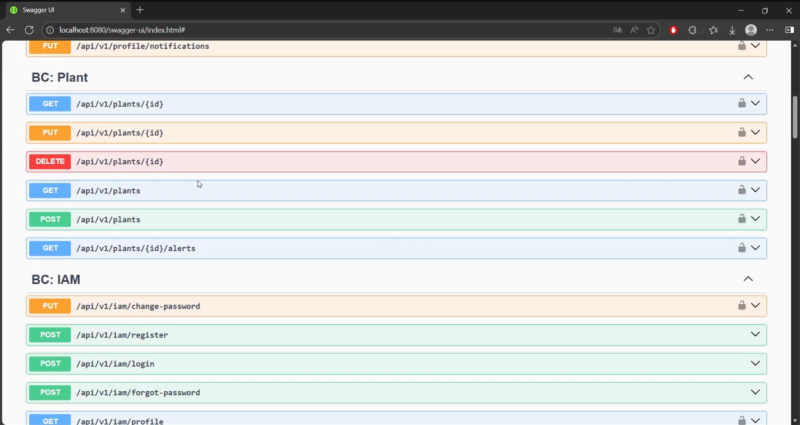
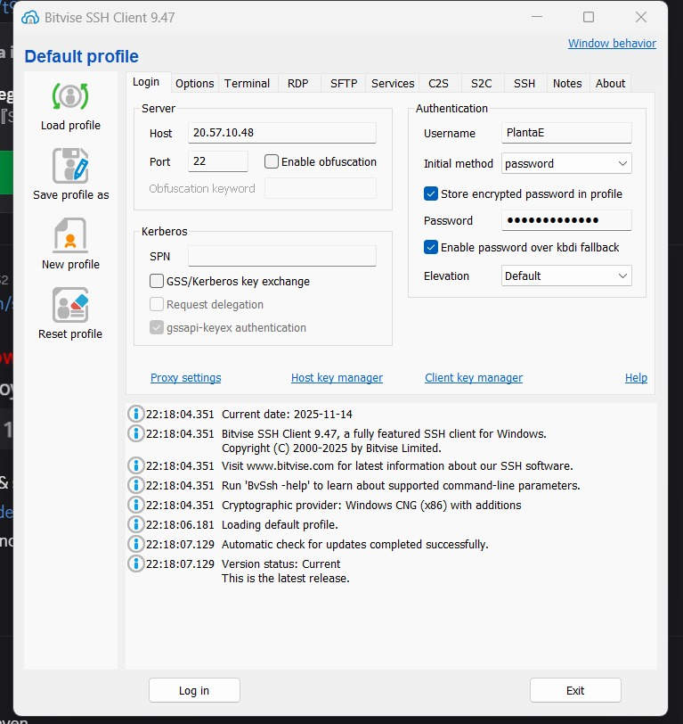

# Capítulo V: Product Implementation, Validation & Deployment

## 5.1. Software Configuration Management.

### 5.1.1 Software Development Environment Configuration

A continuación, se listan las herramientas y estándares adoptados por el equipo para el desarrollo colaborativo del sistema:

| Actividad               | Herramienta / Guía    | Propósito                                                    | Tipo de acceso / Ruta                    |
| :---------------------- | :-------------------- | :----------------------------------------------------------- | :--------------------------------------- |
| Project Management      | Trello                | Seguimiento de backlog, tareas y sprints.                    | https://trello.com/                      |
| Requirements Management | Gherkin Conventions   | Escritura legible de requisitos con formato Given/When/Then. | https://cucumber.io/docs/gherkin/        |
| Product UX/UI Design    | Figma                 | Prototipos y diseño responsive.                              | https://figma.com                        |
| Landing Page            | HTML, CSS, JavaScript | Construcción del Landing Page del sistema.                   | https://code.visualstudio.com            |
| Version Control         | Git + GitHub          | Gestión colaborativa del código fuente.                      | https://github.com                       |
| Software Deployment     | Github pages          | Despliegue continuo del sistema en ambientes de testing.     | https://railway.app / https://render.com |

### 5.1.2. Source Code Management

En esta sección el equipo establece los medios y esquema de organización que aplicará para el seguimiento de modificaciones. Para ello se utilizará **GitHub** como plataforma y sistema de control de versiones.

A continuación se indican los URLs de los repositorios de GitHub para cada producto:

- **Landing Page**: https://github.com/PlantaE-open-sorce/PlantaE-landing

#### GitFlow Workflow

Se implementará el modelo de ramificación propuesto por Vincent Driessen en su artículo *“A successful Git branching model”*, conocido como **GitFlow**. Este modelo organiza el trabajo en las siguientes ramas:

- `main`: Rama principal, contiene siempre el código en producción.
- `develop`: Rama de desarrollo principal, donde se integran las funcionalidades antes de pasar a producción.
- `feature/*`: Ramas creadas a partir de `develop` para desarrollar nuevas funcionalidades.**Convención de nombres:** `feature/<nombre-corto-descriptivo>`_Ejemplo: `feature/login-auth`_
- `release/*`: Ramas creadas desde `develop` cuando se prepara una nueva versión para producción.**Convención de nombres:** `release/<versión>`_Ejemplo: `release/TB1`_

#### Versionado Semántico

Se aplicará el esquema de **Semantic Versioning 2.0.0**, con el siguiente formato:

- **MAJOR**: Incompatibilidades en la API.
- **MINOR**: Nuevas funcionalidades sin romper compatibilidad.
- **PATCH**: Correcciones de errores menores y ajustes sin afectar funcionalidades.

_Ejemplo de versión:_ `v1.3.2`

#### Convenciones de Commits

Se utilizará el estándar de **Conventional Commits** para los mensajes de commits. Esto facilitará la automatización en los procesos de integración continua y generación de changelogs.

**Ejemplos:**

- `feat: add login functionality`
- `fix: correct null pointer exception on user service`
- `chore: update dependencies`

### 5.1.3. Source Code Style Guide & Conventions.

#### Frontend (Landing Page - HTML, CSS, JavaScript)

##### Convenciones generales:

- **Idioma**: Todo el código, incluyendo nombres de variables, funciones y clases, está escrito en **inglés**.
- **Indentación**: 2 espacios.
- **Formato de archivos**: `.html`, `.css`, `.js`
- **Estilo de código adoptado**:
  - https://www.w3schools.com/html/html5_syntax.asp
  - https://google.github.io/styleguide/htmlcssguide.html

##### Nomenclatura:

- **Clases CSS**: `kebab-case` (ej. `main-container`)
- **IDs HTML**: `camelCase` (ej. `mainContent`)
- **Variables JS**: `camelCase` (ej. `userName`)
- **Funciones JS**: `camelCase` (ej. `handleClick()`)

### 5.1.4. Software Deployment Configuration

Esta sección detalla los pasos necesarios para desplegar de forma satisfactoria los productos digitales que componen la solución: el landing page.

**1. Landing Page - HTML, CSS y Javascript**

**Tecnología Base**

* Lenguajes: HTML5, CSS3, JavaScript
* Hosting: GitHub Pages

**Configuración y Despliegue**

* Repositorio de Código Fuente:
  La Landing Page se desarrolla utilizando HTML, CSS y JavaScript puro. Todos los archivos del proyecto deben subirse a un repositorio público en GitHub. Es obligatorio que el archivo `index.html` esté ubicado en la raíz del repositorio (`/`) para que GitHub Pages lo detecte correctamente como punto de entrada del sitio.

**Configuración del despliegue en GitHub Pages** :

* Acceder al repositorio en GitHub.
* Ir a la sección **Settings** del repositorio.
* En el menú lateral, seleccionar  **Pages** .
* En el campo  **Source** , elegir:
  * Rama: `main`
  * Carpeta: `/ (root)`
* Guardar los cambios.

**Publicación** :

Una vez guardada la configuración, GitHub generará automáticamente una URL pública donde la Landing Page estará disponible. Esta URL sigue el formato: `https://<usuario>.github.io/<repositorio>/`

**Actualizaciones** :

Cualquier nuevo commit hecho a la rama `main` será detectado automáticamente por GitHub Pages y aplicado en la versión publicada sin necesidad de acciones adicionales.

## 5.2. Landing Page, Services & Applications Implementation

### 5.2.1 Sprint 1

#### 5.2.1.1. Sprint Planning 1

A continuación, se presenta la planificación correspondiente a nuestro Sprint 1, el cual tiene como enfoque principal el desarrollo de la landing page de PlantaE. En esta etapa inicial, el equipo definió el objetivo del sprint, seleccionó las historias de usuario más relevantes y estableció los entregables clave que permitirán construir una primera versión funcional y visualmente atractiva de la página. Esta planificación busca asegurar un entendimiento compartido entre todos los miembros del equipo y sentar las bases para comunicar eficazmente el valor de la plataforma a los usuarios potenciales.

| Sprint #                        | Sprint 1                                                                                                                                                             |
| :------------------------------ | :------------------------------------------------------------------------------------------------------------------------------------------------------------------- |
| **Sprint Planning Background**  |                                                                                                                                                                      |
| Date                            | 2025-09-10                                                                                                                                                           |
| Time                            | 19:00 pm (GMT-5)                                                                                                                                                     |
| Location                        | Modalidad remota mediante la plataforma Discord                                                                                                                      |
| Prepared By                     | Contreras Leon, Flor De María                                                                                                                                        |
| Attendees (to planning meeting) | Apaza Bocanegra, Elizabeth Noelia / Contreras Leon, Flor De María / Guillen Galindo, Julio Adolfo / Miraval Pomalaya, Rodrigo Jesus / Navarro Chinga, Antonio Jhair  |
| Sprint 0 Review Summary         | Dado que este es el sprint inicial, no se presenta un resumen del sprint anterior.                                                                                   |
| Sprint 0 Retrospective Summary  | Dado que este es el sprint inicial, no se presenta una retroalimentación del sprint anterior.                                                                        |
| **Sprint Goal & User Stories**  |                                                                                                                                                                      |
| Sprint 1 Goal                   | Nos enfocamos en implementar la estructura principal y las funcionalidades clave de la landing page pública de PlantaE. Creemos que esto aportará una percepción más sólida del producto y despertará mayor interés entre los usuarios potenciales, al comunicar de forma clara el valor y los beneficios de la plataforma. Esto se confirmará cuando los visitantes puedan navegar de manera fluida por la página, comprendan fácilmente qué ofrece PlantaE y muestren intención de interactuar o registrarse.                                                                                                              |
| Sprint 1 Velocity               | 18 puntos                                                                                                                                                            |
| Sum of Story Points             | 18 puntos                                                                                                                                                            |

#### 5.2.1.2 Aspect Leaders and Collaborators

##### Aspect Leaders and Collaborators

Durante el Sprint 1, se han definido los principales aspectos a desarrollar, correspondientes a funcionalidades específicas como la visualización de contenido, navegación fluida, adaptabilidad responsiva y gestión de autenticación de usuarios.

Con el objetivo de asegurar una comunicación clara y eficiente dentro del equipo, se elaboró la siguiente matriz de liderazgo y colaboración (LACX), asignando para cada aspecto un líder responsable (L) y colaboradores de apoyo (C).

| Team Member (Last Name, First Name) | GitHub Username    | Questions and Tutorial | About us | Benefits | Testimonials | Contact and Download |
| :---------------------------------- | :----------------- | :--------------------- | :------- | :------- | :----------- | :------------------- |
| Apaza Bocanegra, Elizabeth Noelia   | Elizabeth-Apaza    | L                      | C        | C        | C            | C                    |
| Contreras Leon, Flor De María       | FlorDeMa           | C                      | L        | C        | C            | C                    |
| Guillen Galindo, Julio Adolfo	      | julio645           | C                      | C        | L        | C            | C                    |
| Miraval Pomalaya, Rodrigo Jesus     | RodMiraval         | C                      | C        | C        | L            | C                    |
| Navarro Chinga, Antonio Jhair       | AntonioNavarro24   | C                      | C        | C        | C            | L                    |

#### 5.2.1.3 Sprint Backlog 1

El objetivo principal de este Sprint es diseñar, implementar y validar las secciones del landing page, asegurando una navegación fluida, una experiencia responsiva en todos los dispositivos y funcionalidades críticas como registro. Se busca garantizar que el usuario final pueda interactuar de manera sencilla y eficiente con la plataforma, mejorando su satisfacción y promoviendo el cumplimiento de los objetivos de negocio.

| User Story ID | User Story Title                  | Task ID | Task Title                                     | Task Description                                                                                                                                  | Estimated Hours | Assigned To     | Status |
| ------------- | --------------------------------- | ------- | ---------------------------------------------- | ------------------------------------------------------------------------------------------------------------------------------------------------ | --------------- | ---------------- | ------ |
| US-009        | Sección de Contáctanos            | T09-1   | Diseño del Formulario de Contacto              | Diseñar un formulario con campos de nombre, correo electrónico y mensaje.                                                                         | 1/2             | Julio Adolfo    | Done  |
|               |                                   | T09-2   | Implementación de Envío Válido                 | Programar el formulario para almacenar la solicitud y notificar al equipo cuando los datos estén completos.                                       | 1               | Elizabeth-Apaza | Done  |
|               |                                   | T09-3   | Validación de Campos                           | Implementar validación que muestre errores cuando falten datos obligatorios o el correo sea inválido.                                             | 1/2             | Flor De María   | Done  |
| US-010        | Mostrar autores de la aplicación  | T10-1   | Diseño de la Sección de Autores                | Diseñar sección “Sobre nosotros” con espacio para lista de nombres, roles y fotos.                                                                | 1/2             | Julio Adolfo    | Done  |
|               |                                   | T10-2   | Implementación de Autores                      | Mostrar dinámicamente los autores con su nombre, rol y fotografía.                                                                                | 1               | Elizabeth-Apaza | Done  |
| US-024        | Consultar Preguntas Frecuentes    | T24-1   | Definición de Preguntas Frecuentes             | Redactar al menos tres preguntas frecuentes relacionadas con sensores y uso de la app.                                                            | 1/2             | Julio Adolfo    | Done  |
|               |                                   | T24-2   | Implementación de Sección FAQ                  | Implementar sección de ayuda que muestre preguntas y respuestas de forma clara y accesible.                                                        | 1              | Flor De María   | Done  |
| US-025        | Contacto directo                  | T25-1   | Diseño de Formulario de Contacto Directo       | Crear formulario de nombre, correo electrónico y mensaje para contacto directo.                                                                   | 1/2             | Flor De María   | Done  |
|               |                                   | T25-2   | Implementación de Envío Válido en Formulario   | Almacenar la solicitud en sistema cuando los datos estén completos.                                                                               | 1               | Rodrigo Jesus   | Done  |
|               |                                   | T25-3   | Mensaje de Confirmación                        | Mostrar mensaje de confirmación “Gracias por tu mensaje, te responderemos pronto” tras el envío.                                                   | 1/2            | Rodrigo Jesus   | Done  |
| US-026        | Información institucional         | T26-1   | Diseño de Footer                               | Diseñar footer con enlaces a redes sociales, contacto y términos legales.                                                                         | 1/2             | Antonio Jhair   | Done  |
|               |                                   | T26-2   | Implementación de Footer Fijo                  | Implementar el footer de manera persistente en todo el sitio.                                                                                     | 1               | Julio Adolfo    | Done  |
| US-027        | Acceso a secciones principales    | T27-1   | Definición de Menú de Navegación               | Diseñar menú principal con enlaces a Inicio, Beneficios y Contacto.                                                                               | 1/2             | Rodrigo Jesus   | Done  |
|               |                                   | T27-2   | Implementación de Navegación Principal         | Implementar navegación accesible y funcional a las secciones clave desde el menú.                                                                 | 1               | Flor De María   | Done  |
| US-028        | Comprensión inmediata             | T28-1   | Diseño del Mensaje Principal                   | Diseñar mensaje de valor que represente la esencia de PlantaE en la primera pantalla.                                                             | 1/2             | Flor De María   | Done  |
|               |                                   | T28-2   | Implementación de Mensaje de Valor             | Programar la visualización del mensaje principal al cargar la página.                                                                             | 1               | Julio Adolfo    | Done  |
| US-029        | Beneficios segmentados            | T29-1   | Definición de Contenido por Perfil             | Redactar beneficios diferenciados para hogar, vivero y comunidad.                                                                                 | 1/2             | Antonio Jhair   | Done  |
|               |                                   | T29-2   | Implementación de Beneficios Personalizados    | Mostrar dinámicamente la información segmentada según el perfil seleccionado.                                                                     | 1               | Elizabeth-Apaza | Done  |
| US-033        | Testimonios de usuarios           | T33-1   | Diseño de la Sección de Testimonios            | Diseñar sección visualmente atractiva para mostrar experiencias de usuarios.                                                                      | 1/2             | Julio Adolfo    | Done  |
|               |                                   | T33-2   | Implementación de Testimonios                  | Mostrar mínimo tres testimonios con nombre, tipo de usuario y comentario.                                                                         | 1               | Flor De María   | Done  |
|               |                                   | T33-3   | Validación de Datos de Testimonios             | Asegurar que cada testimonio incluya nombre, tipo de usuario y comentario.                                                                        | 1/2             | Julio Adolfo    | Done  |

#### 5.2.1.4. Development Evidence for Sprint Review

Durante el Sprint 1, el equipo se enfocó exclusivamente en el desarrollo de la Landing Page de la plataforma PlantaE.
El objetivo principal fue construir una página pública funcional, atractiva visualmente y completamente responsiva, que comunique eficazmente la propuesta de valor de la plataforma a los usuarios potenciales.
A lo largo del Sprint se diseñaron e implementaron secciones clave como Hero, Sobre Nosotros, Beneficios, Testimonios, Preguntas Frecuentes, Tutoriales, Contacto y el Footer.
También se trabajó en asegurar la adaptabilidad móvil, el cumplimiento de criterios de accesibilidad y la optimización inicial para motores de búsqueda (SEO).

#### Productos según alcance del Sprint:

##### Landing Page

Durante el Sprint 1 se implementó la Landing Page de PlantaE.
Los principales avances fueron:

- Diseño responsivo para diferentes tamaños de pantalla.
- Creación de secciones: Hero, Sobre Nosotros, Beneficios, Testimonios, Preguntas Frecuentes, Contacto y Footer.
- Aplicación de buenas prácticas de accesibilidad (etiquetado semántico, contraste adecuado).
- Optimización inicial para motores de búsqueda (SEO básico).
- Implementación de navegación fluida entre secciones.
- Validación de compatibilidad en navegadores y dispositivos.

#### 5.2.1.5 Execution Evidence for Sprint Review

#### 5.2.1.6 Services Documentation Evidence for Sprint Review

Durante este sprint se completó el diseño e implementación del Landing Page del sistema, el cual forma parte del acceso inicial al sistema y constituye un punto de entrada fundamental para los usuarios. Aunque no se implementaron endpoints tradicionales de tipo REST en este sprint, se documenta a continuación la URL del recurso publicado, junto con evidencia de despliegue, interacción y commits relacionados.

**Descripción del Logro:**

-Implementación del Landing Page estático.

-Deployment del landing page.

### Recursos del Sprint

| Recurso      | Acción implementada   | Método HTTP | URL / Endpoint                                                              | Link de repositorio                                                         |
| ------------ | --------------------- | ----------- | --------------------------------------------------------------------------- | --------------------------------------------------------------------------- |
| Landing Page | Visualización inicial | GET         | https://plantae-open-sorce.github.io/PlantaE-landing/                       | https://github.com/PlantaE-open-sorce/PlantaE-landing                       |

#### 5.2.1.7. Software Deployment Evidence for Sprint Review.

Durante este Sprint, se realizaron actividades de despliegue de la Landing Page utilizando GitHub Pages como plataforma de hosting. A continuación, se detallan los pasos ejecutados:

**1- Se accedió a la sección Settings del repositorio.**

Dentro de Pages, se seleccionó la rama (main o master) y la carpeta (root o /docs) desde la cual GitHub Pages debía publicar el sitio.
Se guardaron los cambios para activar la publicación automática.

**2- Por default ya esta activado el https**

**3- En la seccion "All workflows" se puede ver que la app se esta deployando.**

**4- El landing page fue exitosamente deployado**

**5- Se obtuvo y verificó la URL pública proporcionada por GitHub Pages.**

### 5.2.2. Sprint 2
Se documenta el proceso de implementación, pruebas, documentación y despliegue del segundo Sprint, enfocado en la construcción de la Frontend Web Application de PlantaE. Este sprint se centró en desarrollar las interfaces de usuario principales utilizando Angular y TypeScript, asegurando una experiencia fluida y atractiva para ambos segmentos objetivo: dueños de plantas y viveros.

#### 5.2.2.1. Sprint Planning 2.

| Sprint #                        | Sprint 1                                                                                                                                                            |
| :------------------------------ | :------------------------------------------------------------------------------------------------------------------------------------------------------------------ |
| **Sprint Planning Background**  |                                                                                                                                                                     |
| Date                            | 2025-09-10                                                                                                                                                          |
| Time                            | 19:00 pm (GMT-5)                                                                                                                                                    |
| Location                        | Modalidad remota mediante la plataforma Discord                                                                                                                     |
| Prepared By                     | Contreras Leon, Flor De María                                                                                                                                       |
| Attendees (to planning meeting) | Apaza Bocanegra, Elizabeth Noelia / Contreras Leon, Flor De María / Guillen Galindo, Julio Adolfo / Miraval Pomalaya, Rodrigo Jesus / Navarro Chinga, Antonio Jhair |
| Sprint 1 Review Summary         | Dado que este es el sprint inicial, no se presenta un resumen del sprint anterior.                                                                                  |
| Sprint 1 Retrospective Summary  | Dado que este es el sprint inicial, no se presenta una retroalimentación del sprint anterior.                                                                       |
| **Sprint Goal & User Stories**  |                                                                                                                                                                     |
| Sprint 2 Goal                   | Nos enfocamos en implementar la estructura principal y las funcionalidades clave de la landing page pública de PlantaE. Creemos que esto aportará una percepción más sólida del producto y despertará mayor interés entre los usuarios potenciales, al comunicar de forma clara el valor y los beneficios de la plataforma. Esto se confirmará cuando los visitantes puedan navegar de manera fluida por la página, comprendan fácilmente qué ofrece PlantaE y muestren intención de interactuar o registrarse.                                                                                                             |
| Sprint 2 Velocity               | 18 puntos                                                                                                                                                           |
| Sum of Story Points             | 18 puntos                                                                                                                                                           |

#### 5.2.2.2. Aspect Leaders and Collaborators.

En esta sección se presenta la Leadership-and-Collaboration Matrix (LACX) correspondiente al Sprint 2, enfocado en el desarrollo de los bounded contexts del backend y la implementación de la arquitectura de microservicios. Esta matriz define los roles, responsabilidades y nivel de participación de cada miembro del equipo durante el desarrollo de los Web Services RESTful.
#### Aspectos Clave del Sprint 2
Para el Sprint 2, se han identificado cuatro aspectos fundamentales que abarcan el desarrollo frontend completo:

#### Frontend Development (Desarrollo de Interfaces)

- Desarrollo de la aplicación web con Angular

- Implementación de componentes, servicios, guards e interceptors

- Creación de páginas y vistas principales

#### UI/UX Implementation (Implementación de Diseño)

- Traducción de wireframes y mockups a interfaces funcionales

- Implementación de diseño responsive y adaptable

- Optimización de la experiencia de usuario

#### Navigation & Routing (Navegación y Enrutamiento)

- Configuración del sistema de navegación entre páginas

- Implementación de guards de autenticación y autorización

- Definición de flujos de navegación para ambos segmentos de usuarios

#### Integration & Deployment (Integración y Despliegue)Integration & Deployment (Integración y Despliegue)

Integración con la Landing Page existente

Configuración de variables de entorno y entornos

Despliegue y puesta en producción de la aplicación frontend
| Team Member (Last Name, First Name) | GitHub Username  | Frontend Development | UI/UX Implementation | Navigation & Routing | Integration & Deployment |
| :---------------------------------- | :--------------- | :------------------- | :------------------- | :------------------- | :----------------------- |
| Apaza Bocanegra, Elizabeth Noelia   | Elizabeth-Apaza  | L                    | C                    | C                    | C                        | 
| Contreras Leon, Flor De María       | FlorDeMa         | C                    | L                    | C                    | C                        |
| Guillen Galindo, Julio Adolfo	      | julio645         | C                    | C                    | L                    | C                        |  
| Miraval Pomalaya, Rodrigo Jesus     | RodMiraval       | C                    | C                    | C                    | L                        |
| Navarro Chinga, Antonio Jhair       | AntonioNavarro24 | C                    | C                    | C                    | C                        | 

#### 5.2.2.3 Sprint Backlog 2

El propósito de este Sprint es crear, desarrollar y probar las secciones del frontend, asegurando una navegación intuitiva y el correcto funcionamiento de elementos clave. El objetivo es que los usuarios puedan interactuar fácilmente con la plataforma, aumentando su satisfacción y contribuyendo al logro de los objetivos del negocio.

Enlace: https://trello.com/b/4aXdCQPO/plante-frontend

<figcaption style="font-size: 0.9em; color: #555;">
    <strong>Figura 1:</strong> Sprint Backlog 2.
  </figcaption>

| User Story ID | User Story Title                | Task ID | Task Title                                         | Description                                                                                                     | Estimated Hours | Assigned To     | Status |
| :-----------: | :-----------------------------: | :-----: | :------------------------------------------------: | :-------------------------------------------------------------------------------------------------------------: | :-------------: | :-------------: | :---------: |
| US-01        | Acceso a la plataforma           | T01-1   | Diseño de pantallas de registro e inicio de sesión | Diseñar formularios de registro e inicio de sesión con campos claros y estilo coherente al branding de PlantaE. | 3               | Elizabeth Apaza | Done        | 
|              |                                  | T01-2   | Implementación del formulario de inicio de sesión  | Programar la funcionalidad para ingresar credenciales y redirigir al dashboard.                                 | 3               | Elizabeth Apaza | Done        |
|              |                                  | T01-3   | Implementación del formulario de registro          | Programar la creación de cuentas con validaciones y confirmación visual de registro exitoso.                    | 4               | Elizabeth Apaza | Done        |
| US-02        | Recuperación de contraseña       | T02-1   | Diseño de interfaz de recuperación                 | Crear la pantalla con campo de correo electrónico y botón de envío para restablecer contraseña.                 | 6               | Antonio Navarro | Done        |
|              |                                  | T02-2   | Implementación de funcionalidad de recuperación    | Integrar lógica de envío de correo y mensajes de confirmación visual.                                           | 6               | Antonio Navarro | Done        |
| US-07        | Gestión de perfil                | T07-1   | Diseño del perfil del usuario                      | Diseñar la vista de perfil con campos editables (nombre, correo, idioma, notificaciones).                       | 3               | Julio Guillen   | Done        |
|              |                                  | T07-2   | Implementación de edición de perfil                | Programar la actualización de datos personales con validaciones.                                                | 5               | Julio Guillen   | Done        |
|              |                                  | T07-3   | Implementación del cambio de idioma                | Agregar soporte multilenguaje (es/en) en el frontend usando un switch persistente.                              | 5               | Julio Guillen   | Done        |
| US-08        | Alternar modo oscuro/claro       | T08-1   | Diseño del botón de cambio de modo                 | Diseñar un toggle visual para activar el modo oscuro o claro.                                                   | 3               | Flor Contreras  | Done        |
|              |                                  | T08-2   | Implementación de modo oscuro/claro                | Aplicar estilos dinámicos con CSS variables o framework (Tailwind, Bootstrap) para alternar entre temas.        | 3               | Flor Contreras  | Done        |
| US-04        | Alertas de cultivo               | T04-1   | Diseño del componente de alertas                   | Crear una sección de notificaciones con iconos y colores distintivos por tipo de alerta.                        | 4               | Rodrigo Miraval | Done        |
|              |                                  | T04-2   | Implementación de visualización de alertas         | Mostrar alertas en tiempo real (mock data o API simulada) con historial visual.                                 | 5               | Rodrigo Miraval | Done        |
| US-06        | Panel de métricas                | T06-1   | Diseño del panel de gráficos                       | Diseñar interfaz visual para mostrar gráficos de humedad, temperatura y luz.                                    | 5               | Flor Contreras  | Done        |
|              |                                  | T06-2   | Implementación de gráficos interactivos            | Integrar librería (Chart.js o Recharts) para mostrar datos dinámicos.                                           | 5               | Flor Contreras  | Done        |
| US-14        | Identificar plantas más críticas | T14-1   | Diseño del panel de criticidad                     | Diseñar vista con lista ordenada de plantas según prioridad o nivel de riesgo.                                  | 6               | Antonio Navarro | Done        |
|              |                                  | T14-2   | Implementación de orden dinámico                   | Programar lógica para ordenar y destacar plantas críticas.                                                      | 5               | Antonio Navarro | Done        |
| US-30        | Selección de idioma              | T30-1   | Diseño del selector de idioma                      | Diseñar el botón o dropdown de idioma en el header.                                                             | 4               | Elizabeth Apaza | Done        |
|              |                                  | T30-2   | Persistencia de idioma en sesión                   | Mantener el idioma seleccionado mientras el usuario navega por la app.                                          | 4               | Elizabeth Apaza | Done        |
| US-31        | Optimización para escritorio     | T31-1   | Diseño responsive de dashboard                     | Adaptar componentes visuales para pantallas grandes con diseño fluido.                                          | 6               | Julio Guillen   | Done        |
|              |                                  | T31-2   | Pruebas de responsividad y UX                      | Verificar visualización en diferentes dispositivos (mobile, tablet, desktop).                                   | 5               | Julio Guillen   | Done        |
| US-32	       | Registro de lotes de plantas	    | T32-1   | Diseño del registro de lotes	                     | Diseñar formulario y atributos necesarios para registrar lotes con gestión masiva.	                             | 5               | Elizabeth Apaza | Done        |
|              |                                  | T32-2	  | Implementación de registro de lotes                | Implementar lógica para crear entidad Lote y generar evento Registered batch.	                                 | 6	             | Julio Guillen   | Done        |
| US-33        | Registro aplicación de insumos   | T33-1   | Diseño del módulo de insumos	                     | Diseñar UI para registrar tipo, cantidad y costo de insumos aplicados.                                          | 4               | Julio Guillen   | Done        |
|              |                                  | T33-2   |	Implementación del registro de insumos	           | Programar lógica para almacenar insumos aplicados y generar evento Input Applied to Asset.	                     | 6	             | Antonio Navarro | Done        |
| US-34	       | Detección tendencias de riesgo   | T34-1	  | Diseño de análisis de tendencias                   | Diseñar mecanismo visual o estructura para mostrar detección temprana de tendencias de riesgo.	                 | 5               | Flor Contreras  | Done        |
|              |                                  | T34-2	  | Implementación de política Analyze Trends	         | Implementar comando Detect trend y generación del evento Risk Trend Detected.	                                 | 7               | Flor Contreras  | Done        |
| US-35	       | Registro acciones de cuidado     |	T35-1	  | Diseño del registro de acciones manuales	         | Diseñar pantalla o formulario para registrar podas, fertilización u otras acciones.                             | 4               | Flor Contreras  | Done        |
|              |                                  | T35-2   | Implementación del comando RegistrarAccion         | Implementar ejecución del comando y generación del evento Registered Manual Action.                             | 5               | Flor Contreras  | Done        |
| US-36        | Asignación de rutina para lotes  | T36-1	  | Diseño de rutina automática	                       | Diseñar flujo de asignación automática cuando se registra un nuevo lote.	                                       | 5               | Rodrigo Miraval | Done        |
|              |                                  | T36-2   | Implementación de Auto-Assign Routine	             | Programar la policy que ejecuta la asignación y genera Scheduled tasks.	                                       | 7               | Rodrigo Miraval | Done        |
| US-37	       | Agendar tareas puntuales	        | T37-1	  | Diseño de tareas específicas	                     | Diseñar UI para crear y configurar tareas puntuales con fecha y activo asociado.                                | 4               | Julio Guillen   | Done        |
|              |                                  | T37-2   | Implementación de tareas específicas               | Implementar creación de Scheduled Specific Task y su gestión en el sistema.                                     | 6               | Julio Guillen   | Done        |
| US-38	       | Panel de Tareas Pendientes	      | T38-1	  | Diseño del panel To-Do	                           | Diseñar vista con listado ordenado por urgencia y filtrado por fecha.	                                         | 5               | Elizabeth Apaza | Done        |
|              |                                  | T38-2	  | Implementación del panel	                         | Implementar consulta y visualización de Scheduled tasks pendientes.	                                           | 6               | Elizabeth Apaza | Done        |
                                                  
#### 5.2.2.4. Development Evidence for Sprint Review.
**En esta sección se presenta la evidencia detallada del desarrollo alcanzado durante el Sprint 2, enfocado en la implementación de la Frontend Web Application de EcoTech utilizando Angular y TypeScript. Durante este segundo sprint, el equipo de EcoTech se concentró en desarrollar las interfaces de usuario principales que conectarán a los dos segmentos objetivo con las funcionalidades core de la plataforma.**

El desarrollo se llevó a cabo utilizando Angular como framework principal, junto con TypeScript para garantizar robustez en el código y HTML/CSS para la estructura y estilos. Se implementó una arquitectura de componentes reutilizables siguiendo las mejores prácticas de Angular, con separación clara entre componentes de presentación, servicios de lógica de negocio, guards de navegación e interceptors para manejo de HTTP.

Las principales funcionalidades implementadas durante este sprint abarcan todas las interfaces necesarias para que tanto usuarios particulares como administradores de viveros puedan interactuar eficientemente con EcoTech. Se desarrollaron componentes modulares y reutilizables, implementando lazy loading para optimizar el rendimiento y una experiencia de usuario fluida y responsive.

El trabajo de desarrollo se organizó siguiendo las mejores prácticas de desarrollo frontend, implementando componentes standalone según las nuevas recomendaciones de Angular, gestión de estado reactiva con RxJS, validaciones de formularios robustas y diseño responsive que funciona óptimamente en desktop, tablet y móvil.

Se estableció la integración completa con la Landing Page existente, agregando enlaces directos que permiten a los usuarios navegar fluidamente desde la página de presentación hacia la aplicación web funcional. La configuración incluye internacionalización (i18n), cambio de tema dinámico y optimización de rendimiento con lazy loading.

**Funcionalidades Implementadas con Operaciones CRUD**
- **Sistema de autenticación completo**
Login, registro y gestión de sesiones de usuarios.

- **Gestión de perfiles de usuario**
Edición de datos de perfil con validaciones en tiempo real.

- **Gestión de plantas con avisos**
Funcionalidad completa de agregar, listar, editar y eliminar plantas, incluyendo sistema de recordatorios.

- **Módulo "Mis Plantas"**
Visualización en lista y detalle de plantas asociadas a cada usuario.

- **Panel de administración de plantas (plant-manage)**
Interfaz para gestionar el inventario de plantas con operaciones CRUD.

- **Página de inicio personalizada**
Acceso rápido a opciones como configuración y dashboard principal.

- **Integración unificada con la Landing Page**
Navegación fluida entre la página de presentación y la aplicación web.

#### 5.2.2.5. Execution Evidence for Sprint Review.
**Durante el Sprint 2, se logró la implementación exitosa y el despliegue de la Frontend Web Application de EcoTech, estableciendo una interfaz de usuario completa y funcional que conecta ambos segmentos objetivo con las funcionalidades principales de la plataforma.**

**Principales logros del Sprint 2:**

**Aplicación Web Semi Completa: **Se desarrolló parcialmente la aplicación de Angular con las páginas y componentes necesarios para ambos tipos de usuarios (usuarios particulares y administradores de viveros).

**Experiencia de Usuario Optimizada:** Interfaces responsive e intuitivas que funcionan perfectamente en desktop, tablet y móvil con diseño consistente y accesible.

**Sistema de Navegación Robusto:** Implementación completa de routing con guards de autenticación, lazy loading y protección de rutas sensibles.

**Funcionalidades Interactivas:** Componentes dinámicos incluyendo calendarios de cuidados, filtros de búsqueda de plantas, dashboards de seguimiento y formularios con validaciones en tiempo real.

**Integración con Landing Page:** Enlaces funcionales desde la landing page hacia la aplicación web, creando un flujo de usuario continuo y sin fricciones.

**Funcionalidades implementadas y desplegadas:**

**Sistema de Autenticación:** Login, registro y gestión de sesiones con validaciones completas

**Gestión de Plantas:** CRUD para registro, edición y selección de plantas

**Vista de Seguimiento:** Monitoreo en tiempo real del estado y cuidados de plantas

**Sistema de Recordatorios:** Configuración y visualización de alertas para cuidados de plantas

**Landing Page Actualizada:** Enlaces directos hacia la aplicación web desde la landing page

**Screenshots de la aplicación en funcionamiento:**

        

- Página de login para usuarios
  

        

- Página de registro para nuevos usuarios
  

        

- Página principal de la aplicación web con navegación y funcionalidades principales
  

        

- Página del Dashboard
  

        

- Página de gestión de plantas
  

        

- Página de vista para ver detalles los dispositivos
  

        

- Página de alertas de plantas

        

- Panel de gestión de reportes
  

        

- Página de usuario

**Enlaces de despliegue:
**
**Frontend Application: **
**Landing Page: **

#### 5.2.2.6. Services Documentation Evidence for Sprint Review.

#### 5.2.2.7. Software Deployment Evidence for Sprint Review.
**Documentación Técnica – Sprint 2**

Durante el **Sprint 2**, se desarrolló documentación técnica **comprehensiva** para la **Frontend Web Application** implementada.  
La documentación incluye guías de componentes, patrones de diseño implementados y guías de mantenimiento para facilitar el desarrollo futuro y la colaboración del equipo.

---
**Documentación de Frontend generada**

La aplicación cuenta con documentación completa que incluye:

- **Especificación de componentes** con props y eventos soportados  
- **Guías de estilo** y patrones de diseño implementados  
- **Estructura de navegación** y configuración de rutas (*routing configuration*)  
- **Validaciones de formularios** y manejo de errores  
- **Guías de internacionalización** y cambio de tema  
- **Ejemplos de uso** y casos de testing  

---

**Módulos principales documentados**

**Authentication**
**Componentes:** `Login`, `Register`  
**Funcionalidades:** Inicio de sesión, registro, gestión de sesiones  

---

**User Management**
**Componentes:** `Profile`, `EditProfile`, `UserDashboard`  
**Funcionalidades:** Gestión de perfil, edición de datos, panel personal  

---

**Workshop Search**
**Componentes:** `Search`, `Filter`, `WorkshopList`  
**Funcionalidades:** Búsqueda avanzada, filtros dinámicos, resultados paginados  

**Tracking Dashboard**
**Componentes:** `TrackingState`, `NotificationView`, `ProgressBar`  
**Funcionalidades:** Seguimiento en tiempo real, visualización de estados, notificaciones  

**Evidencias de despliegue:**

#### 5.2.2.8. Team Collaboration Insights during Sprint.
**Organización Estratégica del Equipo**

El trabajo se organizó de manera estratégica, asignando a cada miembro módulos específicos según sus fortalezas técnicas y experiencia:

- **Apaza Bocanegra, Elizabeth Noelia** lideró el desarrollo del sistema de autenticación y modelos de seguridad, componentes críticos para la protección de datos de usuarios.  
- **Contreras Leon, Flor De María** se especializó en el dashboard de resumen y gestión de datos agregados, enfocándose en la presentación de métricas clave para los usuarios.  
- **Guillen Galindo, Julio Adolfo** desarrolló el núcleo del sistema de plantas, implementando los modelos y repositorios para la gestión del catálogo botánico.  
- **Miraval Pomalaya, Rodrigo Jesus** implementó la gestión de perfiles de usuario, asegurando una experiencia personalizada y consistente.  
- **Navarro Chinga, Antonio Jhair** desarrolló el sistema de configuraciones y preferencias, permitiendo la personalización de la aplicación.  

---

**Arquitectura Implementada para PLANT-CARE**

**PRESENTATION**  
- Log-in y perfil (`login`, `profile`, `register`)  
- Inicio y opciones (`setting`, `dashboard`)  
- Añadir plantas con avisos (`add-plant`)  
- Mis plantas y detalles de plantas (`plant-list`, `plant-detail`)  
- Gestión de plantas (`plant-manage`)  

**GUARDS**  
- Sistema de protección de rutas y autenticación  

**COMPONENTS**  
- Shell principal de la aplicación (`plant-care-shell`)  

**INFRASTRUCTURE**  
- `Auth-http` (Elizabeth)  
- `Dashboard-http` (Flor)  
- `Plant-http` (Julio)  
- `Settings-http` (Antonio)  
- `Profile-http` (Rodrigo)  

**DOMAIN**  
- `Auth.model` (Elizabeth)  
- `Dashboard-summary.model` (Flor)  
- `Plant.model`, `Plant-metrics.model`, `Plant-type.model` (Julio)  
- `Settings.model` (Antonio)  
- `User-profile.model` (Rodrigo)  

**REPOSITORIES**  
- `Auth.repository` (Elizabeth)  
- `Dashboard.repository` (Flor)  
- `Plant.repository` (Julio)  
- `Settings.repository` (Antonio)  
- `Profile.repository` (Rodrigo)  

**APPLICATION**  
- `Auth.facade` (Elizabeth)  
- `Dashboard.facade` (Flor)  
- `Plant.facade` (Julio)  
- `Settings.facade` (Antonio)  
- `Profile.facade` (Rodrigo)  

---

El **Sprint 2** consolidó al equipo como una unidad técnica cohesiva especializada en desarrollo frontend con **Angular**, estableciendo bases arquitectónicas sólidas para el módulo **PLANT-CARE** y sentando las bases para la integración futura con servicios backend.

### 5.2.3 Sprint 3

En el Sprint 3, el equipo se reunió para establecer los objetivos, las tareas y los resultados esperados para esta iteración. Durante este sprint, se centrará en comenzar el desarrollo del backend y en mejorar el frontend para entregar una versión más completa y refinada. El propósito principal es construir una base técnica estable y lanzar una versión funcional de la aplicación que sea accesible y brinde una primera experiencia positiva al usuario.

#### 5.2.3.1. Sprint Planning 3

| Sprint #                        | Sprint 3                                                                                                                                                             |
| :------------------------------ | :------------------------------------------------------------------------------------------------------------------------------------------------------------------- |
| **Sprint Planning Background**  |                                                                                                                                                                      |
| Date                            | 2025-09-10                                                                                                                                                           |
| Time                            | 19:00 pm (GMT-5)                                                                                                                                                     |
| Location                        | Modalidad remota mediante la plataforma Discord                                                                                                                      |
| Prepared By                     | Contreras Leon, Flor De María                                                                                                                                        |
| Attendees (to planning meeting) | Apaza Bocanegra, Elizabeth Noelia / Contreras Leon, Flor De María / Guillen Galindo, Julio Adolfo / Miraval Pomalaya, Rodrigo Jesus / Navarro Chinga, Antonio Jhair. |
| Sprint 2 Review Summary         | Se consiguió lanzar una primera versión del frontend. Esto permitió detectar varias áreas de mejora relacionadas con la presentación de información clave para el núcleo del negocio. Además, gracias a la retroalimentación del docente, se identificó que ciertas partes del desarrollo no estaban correctamente elaboradas, lo que generó inconsistencias con lo implementado en el frontend.       |
| Sprint 2 Retrospective Summary  | Durante el sprint anterior, notamos que no se cumplieron los tiempos de entrega establecidos, lo que generó una fuerte presión al acercarse la fecha límite debido a la acumulación de tareas pendientes. Consideramos que se pueden aprovechar mejor los tiempo y las herramientas de gestión para monitorear el progreso del equipo de manera más eficiente.                                         |
| **Sprint Goal & User Stories**  |                                                                                                                                                                      |
| Sprint 3 Goal                   | Nuestro objetivo es actualizar la aplicación web del frontend e implementar la primera versión de los servicios web del backend. Con ello, buscamos ofrecer a las partes interesadas una demostración clara del funcionamiento de las vistas principales y de la interacción fluida con los endpoints del backend. El cumplimiento de este objetivo se validará al alcanzar una efectividad del 100% en las consultas realizadas a la API.                                                                                                                                                                                     |
| Sprint 3 Velocity               | 25 puntos                                                                                                                                                            |
| Sum of Story Points             | 8 puntos                                                                                                                                                             |

#### 5.2.3.2 Aspect Leaders and Collaborators

En este Sprint, el equipo enfocó sus esfuerzos principalmente en el desarrollo del backend, implementando endpoints para el acceso y manejo de datos. Al mismo tiempo, se trabajó en la optimización del frontend, con el objetivo de ajustar la interfaz a los diseños previamente establecidos y aplicar patrones de diseño sólidos. A continuación, la Matriz de Liderazgo y Colaboración (LACX) muestra de forma detallada los roles de liderazgo y apoyo que cada integrante del equipo desempeñó en estos aspectos clave del Sprint.

| Team Member (Last Name, First Name) | GitHub Username    | Design Patterns Implementation Leader | Data Leader | Backend Endpoints Leader | Frontend Refinement Leader |
| :---------------------------------- | :----------------- | :------------------------------------ | :---------- | :----------------------- | :------------------------- |
| Apaza Bocanegra, Elizabeth Noelia   | Elizabeth-Apaza    | C                                     | C           | C                        | C                          |
| Contreras Leon, Flor De María       | FlorDeMa           | L                                     | C           | C                        | C                          |
| Guillen Galindo, Julio Adolfo	      | julio645           | C                                     | L           | C                        | C                          |
| Miraval Pomalaya, Rodrigo Jesus     | RodMiraval         | C                                     | C           | L                        | C                          |
| Navarro Chinga, Antonio Jhair       | AntonioNavarro24   | C                                     | C           | C                        | L                          |

#### 5.2.3.3 Sprint Backlog 3

El Sprint Backlog 3 se centró en el desarrollo de los *bounded contexts* definidos para el proyecto. Aunque se dio prioridad al backend sobre el frontend, esta decisión permitirá que las funcionalidades estén listas para su integración, reduciendo la complejidad del desarrollo en la interfaz. Esto se debe a que los servicios esenciales para el funcionamiento de la aplicación y el cumplimiento de las historias de usuario ya estarán implementados. En conjunto, este trabajo sienta una base sólida que brindará una ventaja significativa en los próximos sprints frente a otros enfoques de desarrollo ágil.

Enlace:

| User Story ID | User Story Title             | Task ID | Task Title                       | Task Description                                                                     | Estimated Hours | Assigned To     | Status |
| :------------ | :--------------------------- | :------ | :------------------------------- | :----------------------------------------------------------------------------------- | :-------------- | :-------------- | :----- |
| US-001	      | Acceso a la plataforma       | T01-1	 | Modelo y migraciones de usuarios | Definir tabla users, índices (email único), timestamps y soft-delete.                | 4	             | Elizabeth Apaza | Done   |
| 	            |                              | T01-2	 | Endpoint de registro	            | POST /api/v1/auth/register con validación, hashing y verificación de email opcional. | 6	             | Julio Guillen   | Done   |
| 	            |                              | T01-3 	 | Endpoint de login	              | POST /api/v1/auth/login con JWT/refresh, lockout por intentos y auditoría.           | 8	             | Rodrigo Miraval | Done   |
| 	            |                              | T01-4	 | Gestión de sesiones/refresh	    | Rotación de refresh tokens, revoke/blacklist y expiraciones.	                       | 6	             | Elizabeth Apaza | Done   |
| 	            |                              | T01-5	 | Tests de auth                    |	Unit/integration (registro, login, expiración, lockout).	                           | 6	             | Julio Guillen   | Done   |
| US-002        |	Recuperación de contraseña   | T02-1	 | Token y plantilla de reset	      | Generar token firmado/expirable y payload seguro; stub de email.	                   | 4	             | Flor Contreras  | Done   |
|               |                              | T02-2	 | Endpoint solicitud reset         |	POST /api/v1/auth/forgot-password (rate limit, respuesta idempotente).	             | 3	             | Elizabeth Apaza | Done   |
|               |                              | T02-3	 | Endpoint confirmar reset	        | POST /api/v1/auth/reset-password con validaciones y rotación de credenciales.	       | 4	             | Julio Guillen   | Done   |
| US-022        |	Cambio de contraseña         | T22-1	 | Endpoint change password	        | PATCH /api/v1/auth/change-password (auth requerida, políticas de complejidad).	     | 3	             | Antonio Navarro | Done   |
| US-023	      | Eliminar cuenta              | T23-1	 | Endpoint delete account          | DELETE /api/v1/account (GDPR-like: borrar o anonimizar datos relacionados).	         | 6	             | Rodrigo Miraval | Done   |
| US-003        |	Gestión de plantas           | T03-1	 | Modelo Plant & media	            | Tabla plants (user_id, name, type, photo_url), ownership y constraints.              | 5	             | Flor Contreras  | Done   |
|               |                              | T03-2 	 | CRUD plantas (API)	              | Endpoints REST con paginación, filtros por tipo, validación de foto.	               | 6	             | Elizabeth Apaza | Done   |
| US-011	      | Agregar sensores IoT         | T11-1	 | Modelo Sensor & vínculo          | Tablas sensors y plant_sensors; estados y códigos de registro.	                     | 5	             | Flor Contreras  | Done   |
|               |                              | T11-2	 | Endpoint vinculación	            | POST /api/v1/sensors/link por código, validación y ownership.	                       | 4	             | Flor Contreras  | Done   |
| US-018        | Lista de sensores activos	   | T18-1	 | Endpoint listado/estado	        | GET /api/v1/sensors con estado, planta asociada y filtros.	                         | 4	             | Antonio Navarro | Done   |
|               |                              | T18-2   | Desvincular/eliminar sensor     	| DELETE /api/v1/sensors/{id} con reglas de historial.	                               | 3	             | Rodrigo Miraval | Done   |
| US-019	      | Consultar datos de un sensor | T19-1 	 | Ingesta y esquema de lecturas	  | Tabla sensor_readings (humedad, luz, temp, ts); índices por sensor/fecha.            | 6	             | Flor Contreras  | Done   |
|               |                              | T19-2   | Endpoint histórico	              | GET /api/v1/sensors/{id}/readings con rango de fechas y agregaciones.	               | 6	             | Elizabeth Apaza | Done   |
| US-004        |	Alertas de cultivo	         | T04-1	 | Motor de umbrales	              | Servicio que evalúa lecturas vs umbrales por planta/tipo (riego/luz/temp).	         | 6	             | Julio Guillen   | Done   |
|               |                              | T04-2	 | Persistencia de alertas          | Tabla alerts (type, severity, plant_id, sensor_id, ts, estado).	                     | 4	             | Antonio Navarro | Done   |
|               |                              | T04-3	 | Endpoints alertas	              | GET /api/v1/alerts (listado, filtros) y GET /api/v1/plants/{id}/alerts (historial).	 | 5	             | Julio Guillen   | Done   |

#### 5.2.3.4. Development Evidence for Sprint Review

Se mostrará a continuación una tabla con los commits realizados en el repositorio del backend de PlantE durante el sprint. Esta información evidencia las tareas de desarrollo e implementación efectuadas en la aplicación, como la creación de endpoints, la organización modular del código, la configuración para el despliegue y la elaboración de documentación técnica. Cada commit representa una mejora o funcionalidad importante incorporada en la rama principal del proyecto.

| **Repository**                           | **Branch** | **Commit ID** | **Body** | **Commit Message**                                                                                | **Commited on (Date)** |
| :--------------------------------------- | :--------- | :------------ | :------- | :------------------------------------------------------------------------------------------------ | :--------------------- |
| G2-Aplicaciones-Open-Source/backend-java | main       | 94125b6       |          | feat: implement ExperienceMedia endpoint with full CRUD, validation and OpenAPI docs              | 2025-06-21             |

#### 5.2.3.5 Execution Evidence for Sprint Review

En esta parte se muestra la evidencia de ejecución correspondiente al sprint del proyecto PlantE, una aplicación enfocada en brindar experiencias turísticas personalizadas. Las capturas presentadas, se demuestran la ejecución exitosa de los endpoints desarrollados, verificando su correcto comportamiento y funcionamiento. Estas pruebas confirman la interacción adecuada con los servicios del backend para realizar operaciones de creación, consulta, actualización y eliminación de recursos vinculados a experiencias, disponibilidades y medios. Cada resultado valida que las funcionalidades implementadas fueron integradas correctamente y se encuentran activas y operativas conforme a los criterios definidos en las historias de usuario del sprint.

**Evidencias visuales del Backend deployado****

        

        

        

        

        

**Funcionamiento de Backend deployado**

        

#### 5.2.3.6 Services Documentation Evidence for Sprint Review

# Endpoints EcoTech (API)
Prefijo base para todos los endpoints: `/api/v1`. Todos los strings/enums funcionales se mantienen en inglés (`ACTIVE`, `soilMoisture`, etc.). Salvo que se indique como público, cada ruta requiere `Authorization: Bearer <JWT>`.

        

---

## IAM (Autenticación y Cuenta)
| Método | Ruta                   | Auth    | Descripción                                                                              |
| ------ | ---------------------- | ------- | ---------------------------------------------------------------------------------------- |
| POST   | `/iam/register`        | Público | Registro de usuario (`email`, `password`, `confirmPassword`, `displayName`, `language`). |
| POST   | `/iam/login`           | Público | Login con `email/password`; retorna JWT + mensaje localizado.                            |
| POST   | `/iam/forgot-password` | Público | Lanza flujo de recuperación (`{ "email": "" }`).                                         |
| PUT    | `/iam/change-password` | Bearer  | Cambia contraseña (`currentPassword`, `newPassword`).                                    |
| DELETE | `/iam`                 | Bearer  | Elimina la cuenta actual.                                                                |
| GET    | `/iam/profile`         | Bearer  | Perfil del usuario autenticado; soporta `AcceptLanguage`.                                |

---

## Profile (Perfiles Públicos)
| Método | Ruta                  | Auth   | Descripción                                                                        |
| ------ | --------------------- | ------ | ---------------------------------------------------------------------------------- |
| POST   | `/profiles`           | Bearer | Create profile (`ownerId`, `displayName`). Autogenerates slug, resolves conflicts. |
| PUT    | `/profiles/{ownerId}` | Bearer | Update public fields (`displayName`, `bio`, `avatarUrl`, `location`, `timezone`).  |
| GET    | `/profiles/{slug}`    | Bearer | Fetch profile by public slug (404 if missing).                                     |

### Preferencias y Notificaciones
| Método | Ruta                     | Auth   | Descripción                                                                |
| ------ | ------------------------ | ------ | -------------------------------------------------------------------------- |
| GET    | `/profile`               | Bearer | Get personal preferences (fullName, timezone, language).                   |
| PUT    | `/profile`               | Bearer | Update preferences (`fullName`, `timezone`, `language`).                   |
| GET    | `/profile/notifications` | Bearer | Fetch notification settings (quiet hours, digest time, per-type channels). |
| PUT    | `/profile/notifications` | Bearer | Update notification settings (HH:mm quiet hours, digest, channel toggles). |

### Catálogo i18n
| Método | Ruta                                   | Auth   | Descripción                                                |
| ------ | -------------------------------------- | ------ | ---------------------------------------------------------- |
| GET    | `/i18n/catalog?namespace={alerts|...}` | Public | Retrieve key→text catalog localized via `Accept-Language`. |

---

## Plants
| Método | Ruta                  | Auth   | Descripción                                                                                                                                             |
| ------ | --------------------- | ------ | ------------------------------------------------------------------------------------------------------------------------------------------------------- |
| POST   | `/plants`             | Bearer | Create plant (`name`, `species`, optional `deviceId`, `sensorId`).                                                                                      |
| GET    | `/plants`             | Bearer | Paginated search (`name`, `species`, `status=ACTIVE| INACTIVE`, `createdFrom`, `createdTo`, `hasAlerts`, `sensorId`, `sort=field,dir`, `page`, `size`). |
| GET    | `/plants/{id}`        | Bearer | Retrieve plant by ID.                                                                                                                                   |
| PUT    | `/plants/{id}`        | Bearer | Update plant (any field + status).                                                                                                                      |
| DELETE | `/plants/{id}`        | Bearer | Soft delete plant (sets `deletedAt`).                                                                                                                   |
| GET    | `/plants/{id}/alerts` | Bearer | Recent alerts for a plant (supports `page`/`size`, honors `Accept-Language`).                                                                           |

---

## Sensors & Readings
| Método | Ruta                             | Auth   | Descripción                                                                                                                                                          |
| ------ | -------------------------------- | ------ | -------------------------------------------------------------------------------------------------------------------------------------------------------------------- |
| POST   | `/sensors`                       | Bearer | Register sensor (`type`, `ownerId`, optional `plantId`). Auto-links plant sensorId.                                                                                  |
| POST   | `/sensors/{sensorId}/link`       | Bearer | Link sensor to plant (`plantId`).                                                                                                                                    |
| POST   | `/sensors/{sensorId}/deactivate` | Bearer | Set sensor status to `INACTIVE`.                                                                                                                                     |
| GET    | `/sensors`                       | Bearer | Paginated list (`type`, `status`, `plantId`, `page`, `size`).                                                                                                        |
| GET    | `/sensors/{sensorId}`            | Bearer | Sensor details.                                                                                                                                                      |
| POST   | `/sensors/{sensorId}/readings`   | Bearer | Ingest reading (`timestamp` optional ISO-8601, `metric` {soilMoisture, temperature, humidity, light}, ∈ `value`, optional `quality`).                                |
| GET    | `/sensors/{sensorId}/readings`   | Bearer | Paginated readings (`from`, `to`, `metric`, `page`, `size`).                                                                                                         |
| GET    | `/sensors/activity`              | Bearer | Most active sensors (`from`, `to`, `top=10`).                                                                                                                        |
| (Auto) | Simulation                       | n/a    | When `simulation.sensors.enabled=true` (default), a scheduler injects random readings for each active sensor every `simulation.sensors.delay-ms` ms (default 15000). |

---

## Devices
| Método | Ruta                             | Auth   | Descripción                                                            |
| ------ | -------------------------------- | ------ | ---------------------------------------------------------------------- |
| POST   | `/devices`                       | Bearer | Register device (`deviceId`, `ownerId`, `hwModel`, optional `secret`). |
| POST   | `/devices/{deviceId}/link`       | Bearer | Link device to plant (`plantId`).                                      |
| POST   | `/devices/{deviceId}/deactivate` | Bearer | Deactivate device.                                                     |
| PUT    | `/devices/{deviceId}/note`       | Bearer | Update device note (`note`).                                           |
| GET    | `/devices/{deviceId}`            | Bearer | Fetch device info.                                                     |

---

## Alerts
| Método | Ruta                       | Auth   | Descripción                                                                             |
| ------ | -------------------------- | ------ | --------------------------------------------------------------------------------------- |
| GET    | `/alerts/recent`           | Bearer | Owner-scoped alerts (`plantId`, `sensorId`, `type`, `page`, `size`, `Accept-Language`). |
| GET    | `/plants/{plantId}/alerts` | Bearer | Alerts for specific plant (`page`, `size`, `Accept-Language`).                          |

Alerts are triggered internally via handlers (`RaiseAlertHandler`, `ResolveAlertHandler`) for THRESHOLD_BREACH, SENSOR_INACTIVE, DEVICE_DEACTIVATED, WEEKLY_REPORT, MONTHLY_REPORT. Notifications respect profile quiet hours and preferences, falling back to queued dispatch.

---
## Reports
| Método | Ruta                            | Auth   | Descripción                                                                         |
| ------ | ------------------------------- | ------ | ----------------------------------------------------------------------------------- |
| GET    | `/reports/plants/{plantId}.pdf` | Bearer | Plant PDF report (`from`, `to`, optional `metrics`, optional `ownerId` for admins). |
| GET    | `/reports/plants/{plantId}.csv` | Bearer | Plant CSV export (`from`, `to`, optional `ownerId`).                                |
| GET    | `/reports/summary.pdf`          | Bearer | Summary PDF across plants (`from`, `to`, optional `ownerId`).                       |

All report endpoints derive the effective owner from the authenticated user unless
an ADMIN supplies `ownerId`.

---

## Notas Generales
1. **Autenticación:** Genera un JWT en `/iam/login` y adjúntalo como `Bearer`. Las rutas públicas están listadas explícitamente.
2. **Localización:** `Accept-Language` puede sobrescribir temporalmente el idioma persistido del perfil.
3. **Códigos HTTP:** Se usan los estándar de Spring (201 en creaciones, 202 cuando se acepta procesamiento, 404 si no existe, 409 ante conflictos, 401 sin autenticación).
4. **Fechas/Horas:** Para filtros `from`/`to` usa formato ISO-8601 (`2025-05-10T12:00:00Z`).
   
---

## Flujo End-to-End (Resumen)
1. **Alta de usuario y perfil**
 - `POST /iam/register` guarda usuario + idioma.
 - `POST /profiles` (opcional) crea perfil público; `PUT /profile` y `PUT /profile/notifications` configuran idioma, zona horaria, quiet hours y canales.
2. **Onboarding de device/sensor**
 - Device: `POST /devices` + `POST /devices/{id}/link` para asociarlo a la planta.
 - Sensor: `POST /sensors` (tipo, owner, plantId opcional). Autoasigna `sensorId` a la planta.
3. **Gestión de plantas**
 - Crear con `POST /plants`, consultar/vincular con filtros (`GET /plants`), actualizar `PUT /plants/{id}`, eliminar lógico `DELETE /plants/{id}`.
4. **Recolección de datos**
 - Lecturas reales via `POST /sensors/{id}/readings` o simuladas (scheduler configurable). Alimentan `/sensors/{id}`, `/sensors/{id}/readings`, `/sensors/activity`.
5. **Alertas automáticamente**
 - `RaiseAlertHandler` dispara eventos cuando se violan umbrales/sensores inactivos/dispositivos inactivos. Se guardan, marcan `plant.hasAlerts` y se envían notificaciones respetando preferencias y quiet hours (si corresponde se encola en `pending_notifications`).
 - Consultas mediante `/alerts/recent` o `/plants/{id}/alerts`.
6. **Reportes**
 - Dueños (o admins indicando `ownerId`) obtienen PDF/CSV para plantas y un resumen global (`/reports/...`).
7. **Seguridad y Swagger**
 - JWT Bearer para todo lo privado; públicas: `/iam/login`, `/iam/register`, `/iam/forgot-password`, `/i18n/catalog`, `/swagger-ui.html`, `/v3/api-docs`.
 - Swagger tiene esquema Bearer: usa “Authorize” para probar rutas protegidas.

#### 5.2.3.7. Software Deployment Evidence for Sprint Review

        

        

#### 5.2.3.8 Team Collaboration Insights during Sprint

## 5.3. Validation Interviews

### 5.3.1. Diseño de Entrevistas

**Landing Page / Página de Inicio**
- ¿La información sobre las funciones gratuitas de PlantaE es clara y suficiente?
- ¿El proceso para acceder a la aplicación desde la página de inicio fue directo y sin complicaciones?

**Registro y Autenticación de Usuario**
- ¿El formulario de registro fue simple y rápido de completar?
- ¿Los campos solicitados (nombre, email, contraseña) te parecieron apropiados para crear tu cuenta?
- Durante el registro, ¿quedó claro que estás accediendo a una versión completamente funcional sin restricciones de membresía?

**Dashboard o Panel Principal**
- Al ingresar al panel principal, ¿lograste entender rápidamente cómo navegar por las diferentes secciones?
- ¿La información de resumen que se muestra (como "Mis Plantas" o "Equipos Registrados") es útil para tener una visión general?
- ¿En algún momento te sentiste perdido o confundido dentro del panel?

**Gestión de Plantas**
- Agregar una nueva planta, ¿fue un proceso intuitivo y sencillo?
- ¿La presentación de tus plantas en listas o tarjetas facilita su identificación y organización?
- ¿Encontraste sin problemas la opción para ver el listado de equipos de una planta en específico?

**Gestión de Equipos (dentro de una Planta)**
- Al visualizar los equipos de una planta, ¿la información mostrada es relevante para tus necesidades?
- ¿Agregar un nuevo equipo a una planta fue  (directo) y libre de confusiones?
- Al seleccionar un equipo para ver sus detalles, ¿la información de propiedades mostrada es completa y está bien presentada?

**Configuración y Perfil**
- ¿Ubicaste la sección de Configuración sin dificultad?
- ¿Las opciones de personalización (Idioma y Tema Nocturno) funcionaron correctamente y de inmediato?
- ¿Consideras que estas opciones de configuración son útiles y mejoran tu experiencia en la aplicación?

### 5.3.2. Registro de Entrevistas

**User Persona del Segmento Objetivo 1: Personas con plantas en casa**

|  **FÁTIMA FLOREZ**                                                                                                                                                                                 |  
|:-------------------------------------------------------------------------------------------------------------------------------------------------------------------------------------------------: |
| 
  
                                      |
| Género: Femenino                                                                                                                                                                                   |
| Edad: 20 años        
| **Link de la Entrevista:** https://upcedupe-my.sharepoint.com/personal/u20231c197_upc_edu_pe/_layouts/15/stream.aspx?id=%2Fpersonal%2Fu20231c197%5Fupc%5Fedu%5Fpe%2FDocuments%2FEntrevista%20F%C3%A1tima%2Emp4&nav=eyJyZWZlcnJhbEluZm8iOnsicmVmZXJyYWxBcHAiOiJPbmVEcml2ZUZvckJ1c2luZXNzIiwicmVmZXJyYWxBcHBQbGF0Zm9ybSI6IldlYiIsInJlZmVycmFsTW9kZSI6InZpZXciLCJyZWZlcnJhbFZpZXciOiJNeUZpbGVzTGlua0NvcHkifX0&ga=1&referrer=StreamWebApp%2EWeb&referrerScenario=AddressBarCopied%2Eview%2Eb8d8127a%2Dd648%2D41ea%2Db6d7%2D5615d27402db                     |
| 
<b>Duración:</b> 00:05:05 &nbsp;&nbsp;&nbsp; <b>Inicio:</b> 00:00:00 &nbsp;&nbsp;&nbsp; <b>Final:</b> 00:05:05 
                                                          |
| La entrevistada Fatima exploró las funciones principales de PlantaE, como el registro, la administración de plantas y equipos, y la configuración general de la aplicación. Según su experiencia, la información es clara, la navegación resulta sencilla y los procesos, desde ingresar hasta personalizar el perfil son simples. Percibió la interfaz como intuitiva y bien estructurada, con funciones que funcionan adecuadamente y contribuyen a una buena experiencia de uso; Sin embargo, señaló que el modo día/noche presentaba fallos en su funcionamiento. En general, consideró que PlantaE ofrece una experiencia casi completa, fluida y accesible, sin generar complicaciones ni confusiones, salvo por los inconvenientes relacionados con el diseño nocturno.                                                                                                     |

|  **ANGELICA APAZA**                                                                                                                                                                                |
|:-------------------------------------------------------------------------------------------------------------------------------------------------------------------------------------------------: |
| 
  
                                  |
| Género: Femenino                                                                                                                                                                                   |
| Edad: 22 años        
| **Link de la Entrevista:** https://upcedupe-my.sharepoint.com/personal/u20231c197_upc_edu_pe/_layouts/15/stream.aspx?id=%2Fpersonal%2Fu20231c197%5Fupc%5Fedu%5Fpe%2FDocuments%2FEntrevista%20Angelica%2Emp4&nav=eyJyZWZlcnJhbEluZm8iOnsicmVmZXJyYWxBcHAiOiJPbmVEcml2ZUZvckJ1c2luZXNzIiwicmVmZXJyYWxBcHBQbGF0Zm9ybSI6IldlYiIsInJlZmVycmFsTW9kZSI6InZpZXciLCJyZWZlcnJhbFZpZXciOiJNeUZpbGVzTGlua0NvcHkifX0&ga=1&referrer=StreamWebApp%2EWeb&referrerScenario=AddressBarCopied%2Eview%2E70e12257%2D19a7%2D47a5%2Dbe35%2D024034a53f4c                        |
| 
<b>Duración:</b> 00:05:05 &nbsp;&nbsp;&nbsp; <b>Inicio:</b> 00:00:00 &nbsp;&nbsp;&nbsp; <b>Final:</b> 00:05:05 
                                                          |
| En la entrevista de Angelica tuvo la oportunidad de probar diversas funciones de PlantaE, entre ellas el registro, la gestión de plantas y equipos, y las opciones de configuración general. Comentó que la aplicación le resultó clara y fácil de usar, con procesos simples desde el inicio de sesión hasta la personalización del perfil. Destacó además que la estructura de la interfaz facilita la navegación y que las herramientas responden de manera eficiente, ofreciendo una experiencia agradable. Aun así, observó que el modo día/noche no operaba correctamente. En términos generales, consideró que PlantaE es una aplicación práctica, completa y accesible, aunque con margen de mejora en su diseño nocturno.                                                                                                                                                   |

|  **CRISTHYAN BRAVO**                                                                                                                                                                               |
|:-------------------------------------------------------------------------------------------------------------------------------------------------------------------------------------------------: |
| 
  
                                |
| Género: Maculino                                                                                                                                                                                   |
| Edad: 22 años        
| **Link de la Entrevista:** https://upcedupe-my.sharepoint.com/personal/u202311082_upc_edu_pe/_layouts/15/stream.aspx?id=%2Fpersonal%2Fu202311082_upc_edu_pe%2FDocuments%2F2025-11-07%2018-27-41%2Emp4&nav=eyJyZWZlcnJhbEluZm8iOnsicmVmZXJyYWxBcHAiOiJTdHJlYW1XZWJBcHAiLCJyZWZlcnJhbFZpZXciOiJTaGFyZURpYWxvZy1MaW5rIiwicmVmZXJyYWxBcHBQbGF0Zm9ybSI6IldlYiIsInJlZmVycmFsTW9kZSI6InZpZXcifX0&ga=1&referrer=StreamWebApp%2EWeb&referrerScenario=AddressBarCopied%2Eview%2E9732982d-a5f6-4dfe-8235-e9c44b623f77                                                                                                                      |
| 
<b>Duración:</b> 00:05:19 &nbsp;&nbsp;&nbsp; <b>Inicio:</b> 00:00:00 &nbsp;&nbsp;&nbsp; <b>Final:</b> 00:05:19 
                                                          |
| Cristhyan analizó las principales funcionalidades de PlantaE, entre ellas el proceso de registro, la administración de plantas y equipos, así como la configuración general del sistema. Durante su experiencia, resaltó la claridad de la información, la facilidad para desplazarse dentro de la aplicación y la sencillez de las operaciones, desde el inicio de sesión hasta la personalización del perfil. Consideró que la interfaz es intuitiva y bien estructurada, con herramientas que funcionan adecuadamente y optimizan la interacción del usuario. En términos generales, el entrevistado opinó que PlantaE brinda una experiencia completa, fluida y accesible, sin inconvenientes ni confusiones durante su utilización.                                                                                                                                                |

**User Persona del Segmento Objetivo 2: Viveros comerciales**

|  **NICOLE GUILLEN**                                                                                                                                                                                |
|:-------------------------------------------------------------------------------------------------------------------------------------------------------------------------------------------------: |
| 
  
                                      |
| Género: Femenino                                                                                                                                                                                   |
| Edad: 25 años                                                                                                                                                                                      |
| **Link de la Entrevista:** https://upcedupe-my.sharepoint.com/:v:/g/personal/u20241a352_upc_edu_pe/Efag7pda96JEgj9sn5zBkFMB9jo6SnRWKuCj75AMR-g_-Q?nav=eyJyZWZlcnJhbEluZm8iOnsicmVmZXJyYWxBcHAiOiJPbmVEcml2ZUZvckJ1c2luZXNzIiwicmVmZXJyYWxBcHBQbGF0Zm9ybSI6IldlYiIsInJlZmVycmFsTW9kZSI6InZpZXciLCJyZWZlcnJhbFZpZXciOiJNeUZpbGVzTGlua0NvcHkifX0&e=yDhopA |
| 
<b>Duración:</b> 00:05:16 &nbsp;&nbsp;&nbsp; <b>Inicio:</b> 00:00:00 &nbsp;&nbsp;&nbsp; <b>Final:</b> 00:05:16 
                                                          |
| Nicole Guillen, exploró las principales funciones de PlantaE, incluyendo el registro, la gestión de plantas y equipos, así como la configuración general de la aplicación. En su experiencia, destacó la claridad de la información, la facilidad de navegación y la simplicidad de los procesos, desde el acceso hasta la personalización del perfil. La interfaz fue percibida como intuitiva y organizada, con funciones que responden correctamente y mejoran la experiencia del usuario. En general, el entrevistado consideró que PlantaE ofrece una experiencia fluida, completa y accesible, sin presentar dificultades o confusiones durante su uso. |

### 5.3.3. Evaluaciones según heurísticas

## **SITE o APP A EVALUAR:**

Nombre: PlantE
Objetivo: Evaluar las fallas en la facilidad de uso del sitio web de la administracion de plantas aplicando los principios de la Lista Heurística de Nielsen.

## **TAREAS A EVALUAR:**

El alcance de esta evaluación incluye la revisión de la usabilidad de las siguientes tareas:
1. Registro y autenticación de usuario, Completando el formulario de registro (nombre, correo, contraseña).
2. Explorar las secciones disponibles.
3. Identificar si el usuario comprende la estructura general y se orienta fácilmente.
4. Agregar una nueva planta al sistema.
5. Visualizar las plantas registradas en formato de tarjeta.
6. Revisar los detalles y propiedades de un equipo determinado de una planta.
7. Cambiar idioma y activar/desactivar el tema nocturno.
8. Evaluar la respuesta inmediata de las opciones de personalización.
9. Comprobar si el usuario puede regresar fácilmente a la página anterior o de inicio desde cualquier punto.
10. Evaluar si el diseño mantiene coherencia entre las diferentes vistas.
11. Observar si la app ofrece mensajes claros al completar acciones.
12. Evaluar si los botones y formularios son legibles.

## **PROBLEMAS DETECTADOS:**

| 	| Problema detectado                                                	  | Heurística violada	                | Severidad |
|:-:| :-------------------------------------------------------------------- | :---------------------------------- | :-------: |
| 1	| Falla al activar y desactivar el tema nocturno.                       | Visibilidad del estado del sistema  | 3         |
| 2	| Falta de opciones en "Tipos de Alarma"                                | Flexibilidad y eficiencia de uso    | 2         |
| 3	| Falla en uso de boton en "Gestion de Equipos"                         | Control y libertad del usuario      | 3         |
| 4	| Necesidad de más características, como gráficos de estado del equipo  | Flexibilidad y eficiencia de uso    | 1         |
| 5	| Falta de tutoriales o guía para nuevos usuarios	                      | Ayuda y documentación               | 2         |

## **ESCALA DE SEVERIDAD:**

| Nivel | Descripción	                                                                                                    |
| :---: | :-------------------------------------------------------------------------------------------------------------- |
| 1	    | **Problema leve:** No requiere atención inmediata y el usuario puede superarlo fácilmente.                      | 
| 2    	| **Problema moderado:** Genera confusión y conviene solucionarlo en la siguiente versión .                       |
| 3	    | **Problema serio:** Aparece con frecuencia y afecta uso, resolverse con alta prioridad.                         |
| 4	    | **Problema crítico:** Immpide el uso adecuado de la aplicación, indispensable corregirlo antes del lanzamiento. |

## **ANÁLISIS HEURÍSTICO DETALLADO:**

1. Falla al activar y desactivar el tema nocturno:
- **Heurística violada:** Visibilidad del estado del sistema
- **Descripción:** El sistema no muestra una respuesta clara o inmediata al cambiar entre modo claro y oscuro, generando incertidumbre en el usuario.
- **Recomendación:** Implementar una transición visual fluida o un mensaje de confirmación que indique el cambio de tema, reforzando la retroalimentación del sistema.

2. Falta de opciones en "Tipos de Alarma":
- **Heurística violada:** Flexibilidad y eficiencia de uso
- **Descripción:** El módulo de alarmas ofrece opciones limitadas, lo que restringe la personalización según las necesidades del usuario.
- **Recomendación:** Ampliar las opciones de configuración o permitir que el usuario cree alarmas personalizadas para aumentar la flexibilidad.
  
3. Falla en el uso del botón en "Gestión de Equipos":
- **Heurística violada:** Control y libertad del usuario
- **Descripción:** El botón de acción presenta fallas al ser presionado o no responde adecuadamente, interrumpiendo tareas esenciales como agregar o modificar equipos.
- **Recomendación:** Revisar la funcionalidad del botón, garantizar su correcta detección de eventos y ofrecer mensajes de error claros en caso de fallo.

4. Necesidad de más características, como gráficos de estado del equipo:
- **Heurística violada:** Flexibilidad y eficiencia de uso
- **Descripción:** Los usuarios perciben la ausencia de elementos visuales que faciliten la interpretación del estado de los equipos.
- **Recomendación:** Incorporar gráficos o indicadores visuales que permitan una comprensión rápida y atractiva del estado de los equipos.

5. Falta de tutoriales o guía para nuevos usuarios:
- **Heurística violada:** Ayuda y documentación
- **Descripción:** Los nuevos usuarios no cuentan con una guía introductoria que explique las principales funciones o flujos de navegación.
- **Recomendación:** Incluir un tutorial interactivo o una sección de ayuda que describa brevemente las funciones principales, accesible desde el menú de inicio.

## 5.4. Video About-the-Product
