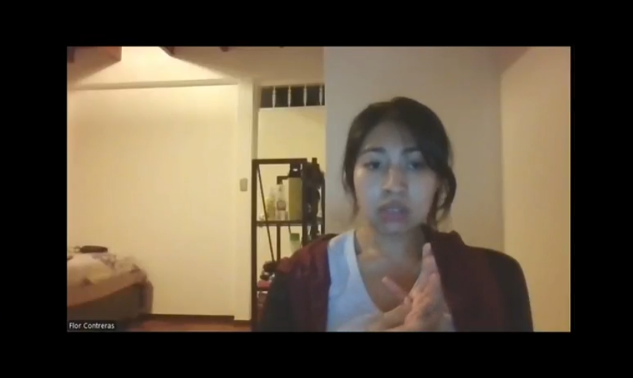

# Conclusiones y Recomendaciones

## Conclusiones

- El proyecto **PlantaE** permitió identificar la necesidad de soluciones tecnológicas accesibles para optimizar el cuidado de plantas y áreas verdes, especialmente en contextos urbanos donde el riego suele ser ineficiente.  
- La propuesta basada en IoT demostró ser viable y con alto potencial de impacto social y ambiental, contribuyendo al uso responsable del agua y fomentando prácticas sostenibles.  
- Las entrevistas y validaciones realizadas confirmaron el interés de los usuarios en una herramienta intuitiva, simple y confiable, tanto para hogares como para viveros.  
- El trabajo grupal fortaleció la capacidad de análisis, diseño y desarrollo, además de potenciar las habilidades de comunicación, coordinación y aprendizaje colaborativo de los integrantes.  
 
## Recomendaciones

- Mantener una adecuada **organización de los tiempos** en cada fase del proyecto, estableciendo cronogramas realistas y priorizando tareas clave.  
- Reforzar el proceso de validación con más usuarios, lo que permitirá obtener retroalimentación continua y mejorar la experiencia de uso.  
- Explorar la posibilidad de alianzas con municipalidades, viveros u organizaciones ambientales para ampliar el alcance e impacto del proyecto.  
- Seguir perfeccionando la interfaz y funcionalidades del sistema, priorizando siempre la usabilidad, la accesibilidad y la sostenibilidad como ejes centrales.  

# Video About-the-Team

Cada miembro relata su vivencia personal, detallando las tareas que realizó, los obstáculos que surgieron y cómo lograron resolverlos. Además, se mencionan los logros más importantes, como el desarrollo de una interfaz amigable, el trabajo conjunto con refugios y la integración de funcionalidades clave para promover una adopción responsable.

El video finaliza con una reflexión colectiva sobre todo lo aprendido, resaltando tanto el crecimiento técnico como el desarrollo de habilidades interpersonales. El equipo agradece la oportunidad y comenta brevemente su aporte individual al proyecto.

**Imagen representativa del video**

        

**URLs de la Versión Publicada**

- Link en OneDrive: https://upcedupe-my.sharepoint.com/:v:/g/personal/u202323243_upc_edu_pe/IQD4nteYlwb4QLtbNPunG4RaAQNoGpxI8P9MT7FV8jVEdzQ?e=3jLdem&nav=eyJyZWZlcnJhbEluZm8iOnsicmVmZXJyYWxBcHAiOiJTdHJlYW1XZWJBcHAiLCJyZWZlcnJhbFZpZXciOiJTaGFyZURpYWxvZy1MaW5rIiwicmVmZXJyYWxBcHBQbGF0Zm9ybSI6IldlYiIsInJlZmVycmFsTW9kZSI6InZpZXcifX0%3D